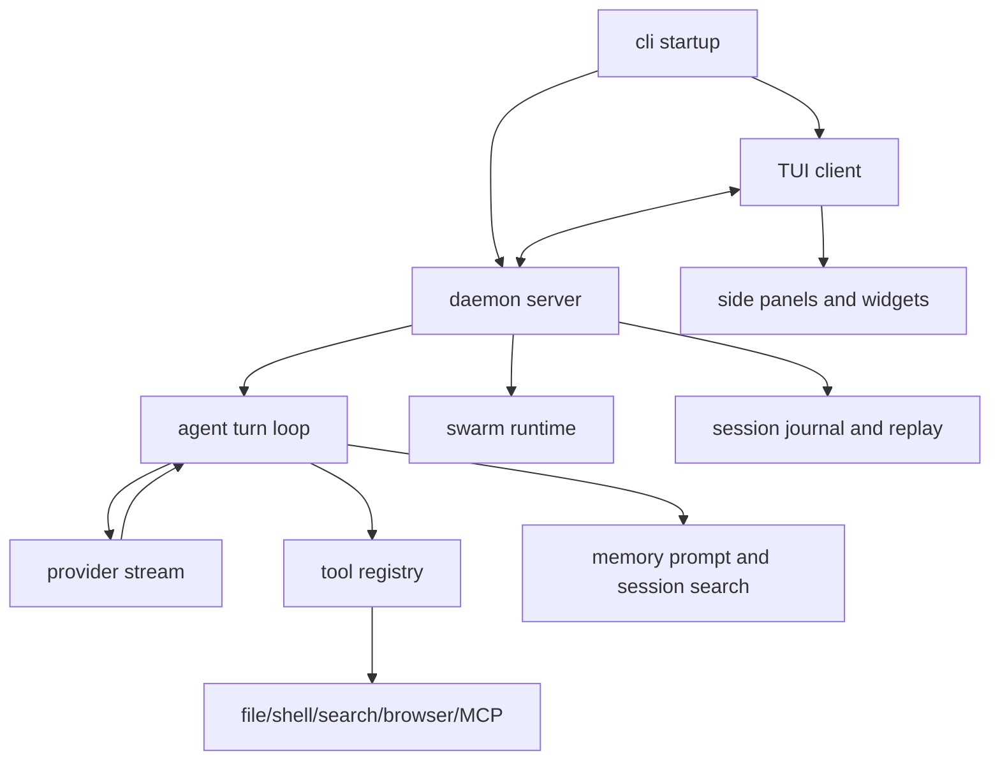

# Learn JCode 5.5

[中文](./README.md) | [English](./README-en.md)

This is a practical guide to JCode. The goal is not to teach you how to build another chatbot. The goal is to understand a real coding-agent harness: how it combines models, tools, filesystems, terminals, permissions, memory, multi-session runtime, and multi-agent coordination into an engineering system that can work for long-running software tasks.

This guide borrows the harness-engineering lens from `learn-claude-code` and the beginner/project-oriented pacing from `Learn-OpenClaw`. The output is not a clone of either project. It is a JCode learning path that treats JCode as a readable, modifiable, comparable agent engineering specimen.

## One Sentence

JCode = model + tool system + provider layer + resident server + TUI client + session storage + memory graph + swarm coordination + self-dev.

The model thinks. JCode turns that thinking into reliable, observable, recoverable, parallelizable action.

```text
User input
  -> JCode TUI / client
  -> JCode server
  -> Agent turn loop
  -> Provider stream
  -> Tool calls
  -> Tool results / session journal / UI events
  -> Next model turn
```

## What You Will Learn

A one-day learning plan:

| Stage | Time | Goal |
| --- | ---: | --- |
| Quick start | 30 min | Install, authenticate a provider, run one JCode session |
| Harness mindset | 45 min | Understand the boundary between model and harness |
| Core loop | 1 hour | Understand agent turns, streaming, and tool-result feedback |
| Tool system | 1 hour | Understand how `read/write/edit/bash/grep/mcp/subagent/swarm` tools are registered and executed |
| Server/TUI | 1 hour | Understand why JCode uses a resident server with multiple clients |
| Memory/Swarm/Self-dev | 2 hours | Understand where JCode is more ambitious than pi, OpenCode, and Claude Code |
| Project modification | 2+ hours | Add a tool, provider, documentation improvement, or learning-oriented change |

If your goal is interviews or a portfolio project, at minimum read these sections: Quick Start, Architecture Map, Differences From Other Projects, and Practice Tasks.

## Scope

This guide is based on local reading of:

- JCode: `/Users/shizi/Documents/workspace/jcode`
- learn-claude-code: `/tmp/learn-claude-code`
- Learn-OpenClaw: `/tmp/Learn-OpenClaw`
- pi-mono: `/Users/shizi/Documents/workspace/pi-mono`
- OpenCode: `/Users/shizi/Documents/workspace/opencode`

For Claude Code, this guide compares public product behavior and harness design concepts only. It does not reproduce, summarize, or depend on non-public or leaked source code.

## First Mental Model: You Are Not "Writing the Agent"

Agency comes from the model. Engineers build the harness.

```text
Harness = Tools + Context + Memory + UI + Storage + Permissions + Runtime
```

For a coding agent:

- Tools are the hands: read files, write files, edit files, run shell commands, search, browse, use MCP.
- Context is the eyes: current messages, file snippets, command output, tool results.
- Memory is long-term experience: past sessions, user preferences, project facts, retrievable knowledge.
- UI is the cockpit: streaming output, tool status, diffs, side panels, diagrams, usage.
- Storage is recovery: session journals, server registry, provider config.
- Permissions are boundaries: which commands can run, which paths can be written, when user approval is needed.
- Runtime is life support: resident server, client reconnection, background tasks, reload.

JCode is special because it is not a minimal agent-loop example. It pushes the harness toward product-grade complexity, while putting unusual emphasis on performance and multi-session scaling.

## Quick Start

### 1. Install

The default install path from the JCode README:

```bash
curl -fsSL https://raw.githubusercontent.com/1jehuang/jcode/master/scripts/install.sh | bash
```

To run from source inside the JCode repository:

```bash
cargo run --bin jcode
```

If compilation is slow, start by checking the CLI/code paths without default heavy features:

```bash
cargo check --no-default-features
```

### 2. Authenticate a Provider

JCode supports many login flows. Common paths:

```bash
jcode login --provider claude
jcode login --provider openai
jcode login --provider gemini
jcode login --provider copilot
```

You can also configure an OpenAI-compatible endpoint:

```bash
jcode provider add local-vllm \
  --base-url http://localhost:8000/v1 \
  --model Qwen/Qwen3-Coder-30B-A3B-Instruct \
  --no-api-key \
  --set-default
```

JCode's provider layer is not just an API-key wrapper. It handles OAuth, subscription accounts, model catalogs, pricing/usage, failover, stream-format differences, and provider-specific session behavior.

### 3. Start a Session

```bash
jcode
```

Try a low-risk prompt first:

```text
Read this repository and summarize its architecture. Do not edit files.
```

Then try a tool-oriented prompt:

```text
Find where tools are registered and explain how a new tool should be added.
```

## Architecture Map

From the entry point:

```text
src/main.rs
  -> jcode::run()
  -> src/lib.rs
  -> cli::startup::run()
  -> server/client/agent/provider/tool/tui
```

Core directories:

| Path | Role |
| --- | --- |
| `src/agent/` | Agent turn loop, stream handling, tool calls, context compaction, memory injection |
| `src/tool/` | Built-in tools: files, shell, web, MCP, subagent, swarm, memory |
| `src/provider/` | Provider adapters for Claude, OpenAI, Gemini, Copilot, OpenRouter, OpenAI-compatible endpoints |
| `src/server/` | Resident server, multi-client lifecycle, session management, swarm runtime, reload/reconnect |
| `src/tui/` | Ratatui UI, side panels, diffs, info widgets, markdown/mermaid rendering |
| `src/memory*` | Memory graph, session search, memory agent, embedding and retrieval |
| `src/mcp/` | MCP client, manager, tool bridge, shared pool |
| `src/ambient/` | Background ambient runner, scheduling, memory maintenance, proactive work |
| `src/auth/` | OAuth, account store, provider login diagnostics |
| `crates/` | Types, provider core, TUI subcrates, mobile/desktop layering, workspace modules |

Use this diagram as the reading order:



## Core Loop: JCode Is Still an Agent Loop

The minimal agent loop is:

```text
messages -> model -> tool_use? -> execute tool -> append tool_result -> model ...
```

JCode's complexity comes from engineering around that loop, not from changing the loop itself.

Read first:

- `src/agent/turn_loops.rs`
- `src/agent/tools.rs`
- `src/tool/mod.rs`

In each turn, JCode does roughly this:

1. Repairs missing tool outputs to avoid malformed provider conversations.
2. Checks whether context compaction is required.
3. Builds tool definitions.
4. Builds memory prompts non-blockingly and injects the pending result from the previous turn.
5. Builds split static/dynamic system prompts to improve provider cache behavior.
6. Opens the provider stream and handles thinking, text, tool input, and tool result events.
7. Executes tools and converts results back into content blocks.
8. Continues if there are more tool calls; otherwise returns the final assistant text.

Think of it as:

```text
JCode Agent Loop
  = provider stream parser
  + tool executor
  + context compactor
  + memory injector
  + cache tracker
  + event publisher
```

## Tool System: JCode's Hands

JCode tools are not random functions. They implement a shared trait:

```text
Tool
  - name()
  - description()
  - parameters_schema()
  - execute(input, context)
```

Tool registration is centralized in `src/tool/mod.rs`. Base capabilities include:

| Category | Tools |
| --- | --- |
| Files | `read`, `write`, `edit`, `multiedit`, `patch`, `apply_patch`, `open` |
| Search | `glob`, `grep`, `agentgrep`, `codesearch`, `session_search`, `conversation_search` |
| Execution | `bash`, `bg`, `batch` |
| Web/browser | `webfetch`, `websearch`, `browser` |
| Coordination | `subagent`, `swarm`, `goal`, `todo` |
| Extension | `mcp`, `skill_manage`, `gmail`, `side_panel` |
| Advanced modes | `memory`, `schedule`, `selfdev` |

Compared with a minimal agent, JCode's key difference is that it does not just give the model four tools. It gives the model a governed tool ecosystem. More tools require:

- Deterministic ordering for better prompt-cache hits.
- Alias mapping for provider-specific tool names.
- Output truncation to prevent one tool result from overflowing context.
- Session/context binding so tools know working directory, message ID, and tool-call ID.
- Dynamic MCP registration so external tools can join the registry.

To add a tool:

1. Add a tool implementation under `src/tool/`.
2. Implement the `Tool` trait.
3. Register it in `Registry::base_tools` or the session-specific registration path.
4. Write the JSON schema and a minimal test.
5. Make sure output is bounded; return summaries or metadata when necessary.

## Server/TUI: Why JCode Is Not "One CLI Process Per Launch"

JCode uses a single-server, multi-client architecture.

```text
jcode
  -> if no server exists, start daemon server
  -> client connects over socket
  -> server owns sessions/provider/swarm/MCP/shared state
  -> client exit does not kill the server
  -> clients can reconnect after server reload
```

This is very different from ordinary CLIs:

- Multiple TUI clients can connect to one server.
- Session state lives in the server and on disk; clients are views/input endpoints.
- Providers, MCP pools, and swarm state can be reused across clients.
- `/reload` can exec the server into a new binary while clients reconnect.
- With many sessions, per-session memory growth is more controllable.

This is central to JCode's performance story. If you often run many coding-agent sessions at the same time, a resident server has more scaling headroom than a full independent process per terminal.

## TUI and Side Panels: Observability Is Part of the Harness

Many agent projects focus on tool calls and neglect UI. JCode's TUI is a major capability:

- Streaming text/thinking/tool status.
- Compact tool-call summaries.
- Diff and file views.
- Side panels for file viewing, diffs, or agent-written content.
- Markdown and mermaid rendering.
- Info widgets for model, usage, git, memory, todos, swarm, and more.

A practical coding agent needs more than "the model can write code." The user needs to know:

- What is it doing now?
- Which tools did it call?
- What changed?
- Is it stuck?
- What is the context, cost, cache, and memory state?

JCode treats all of this as harness work.

## Memory: Not Manual Notes, But Automatic Recall

JCode's memory goal is not "make the user manually call a memory tool." It behaves more like human memory: current context triggers relevant memories, which then appear in the next model turn.

Core design:

- Each turn/session can be embedded.
- Memory retrieval is non-blocking and does not stall the main agent.
- Memory computed during turn N is usually available in turn N+1.
- Memories can form a graph: tags, clusters, semantic relations.
- Session search provides traditional historical-session retrieval.
- Ambient mode can maintain, merge, prune, and verify memories.

Simplified flow:

```text
current messages
  -> async memory query
  -> embedding hits
  -> graph/cascade retrieval
  -> optional sidecar verification
  -> memory prompt
  -> injected as system reminder on next turn
```

This is different from many "RAG = VectorDB" demos. JCode is moving toward memory as an organic capability that grows through long-term use of the same harness.

## Swarm: Multi-Session Coordination Is Not Just Subagents

JCode swarm is not merely "main agent calls a subagent and gets a summary." It is closer to a multi-session coordination runtime:

- A coordinator creates the plan and assigns scopes.
- Agents execute in parallel.
- Agents can DM, broadcast, and join channels.
- The server records file touches and can warn agents when code shifts under them.
- Lifecycle, status, and plan updates are server-level state.
- Worktrees are optional isolation tools, not a mandatory default.

For complex code work, the hard questions are not "can I spawn multiple agents?" The hard questions are:

- Who owns the plan?
- Who can change the plan?
- Who integrates the work?
- How do agents communicate?
- How are file conflicts discovered?
- How do completed, failed, and blocked states recover?

JCode answers these around `src/server/swarm*`, `src/server/comm*`, and `src/tool/communicate.rs`.

## Ambient and Self-Dev

JCode has two especially ambitious directions.

### Ambient

Ambient mode is a background autonomous loop:

- Maintains the memory graph.
- Checks recent sessions and git activity.
- Performs low-risk proactive work.
- Schedules its own next wake-up based on resources and rate limits.

It moves the agent from "do one thing when the user asks" toward "carefully maintain the environment in the background."

### Self-Dev

Self-dev lets JCode modify JCode from inside a JCode session:

- Detects when the current repository is JCode.
- Adds self-dev prompt/tooling to that session.
- Edits, builds, tests, and reloads itself.

This is powerful and risky. Practical rules:

- Use a clean branch.
- Ask for a plan before editing core runtime.
- Every self-dev change needs tests or at least `cargo check`.
- Core areas include `agent`, `tool`, `server`, `provider`, and `tui`; read dependency boundaries before modifying them.

## Differences From Other Projects

| Project | Positioning | Strength | Cost |
| --- | --- | --- | --- |
| pi-mono | Minimal TypeScript coding harness | Easy to read, four-tool mental model, SDK/extension friendly, good base for your own OpenClaw | Skips complex mechanisms like subagents/plan mode by default; you assemble what you need |
| OpenCode | Open-source, provider-agnostic coding agent | Client/server, LSP, permissions, plugins, desktop/web ecosystem direction | Large TypeScript/Bun codebase, heavier runtime stack |
| Claude Code | Mature commercial coding-agent harness | Strong product polish, good tool UX, tight model/harness fit | Closed source and Anthropic-centered; do not rely on leaked source for learning |
| JCode | Performance-first Rust multi-session harness with memory and coordination | Low-latency/low-incremental-memory story, resident server, memory graph, swarm, ambient/self-dev | Large code surface, Rust workspace and runtime complexity |

### JCode vs pi

pi's educational value is "less is more": read/write/edit/bash can already form an effective coding agent. JCode's direction is "more, but governed": more tools, more providers, more server state, which means it must handle cache behavior, truncation, aliases, permissions, sessions, and UI state.

If you want to learn the agent loop, start with pi.
If you want to learn product-grade harness engineering, study systems like JCode.

### JCode vs OpenCode

OpenCode and JCode both use client/server and provider-agnostic designs. The difference is the engineering stack:

- OpenCode is TypeScript/Bun/Effect/Hono, with strong plugin, LSP, web, and desktop direction.
- JCode is Rust/Ratatui/Tokio, with strong performance, memory, multi-session, terminal-rendering, and native-runtime direction.

OpenCode feels more like an open platform. JCode feels more like a high-performance local agent runtime.

### JCode vs Claude Code

Claude Code is an important reference for understanding coding harnesses: tools, context compaction, permissions, subagents, skills, and session recovery have all been validated in the market.

JCode differs in that:

- It tries to support many providers instead of one model ecosystem.
- It makes memory and session search core capabilities.
- It moves swarm coordination into the server runtime.
- It emphasizes Rust performance and multi-session resource efficiency.
- It includes experimental long-term directions such as self-dev and ambient mode.

Learn Claude Code's harness ideas. Do not copy or distribute non-public implementations.

## Recommended Reading Order

### First Pass: Run It

1. `README.md`
2. `OAUTH.md`
3. `docs/SERVER_ARCHITECTURE.md`
4. `docs/TERMINAL_BENCH.md`

Goal: know why JCode exists, how to install it, how to authenticate, and how to start it.

### Second Pass: Core Loop

1. `src/main.rs`
2. `src/lib.rs`
3. `src/cli/startup.rs`
4. `src/agent/turn_loops.rs`
5. `src/tool/mod.rs`
6. `src/provider/mod.rs`

Goal: explain how user input becomes provider streams and tool results.

### Third Pass: Product Mechanisms

1. `docs/MEMORY_ARCHITECTURE.md`
2. `docs/SWARM_ARCHITECTURE.md`
3. `docs/AMBIENT_MODE.md`
4. `docs/MULTI_SESSION_CLIENT_ARCHITECTURE.md`
5. `src/server/`
6. `src/tui/`

Goal: understand why JCode is not a simple CLI.

### Fourth Pass: Modify One Thing

Pick a small task:

- Add a read-only tool, such as `repo_stats`.
- Improve the output summary of an existing tool.
- Add a provider-profile documentation example.
- Add a status field to a TUI info widget.
- Add a concrete example to the memory docs.

Do not start by changing swarm, reload, provider OAuth, or compaction. Those are core paths with high test cost.

## Practice Tasks

### Task 1: Draw the Tool Registration Graph

Read `src/tool/mod.rs` and answer:

- Which tools are base tools?
- Which tools are session-specific?
- When are MCP tools registered?
- When are self-dev and ambient tools registered?

Output a mermaid diagram.

### Task 2: Implement a Read-Only Tool

Goal: add a `repo_summary` tool that returns:

- git branch
- latest commit
- file count
- top-level directories

Requirements:

- Do not write files.
- Keep output short.
- Add a test or at least a manual validation note.

This task walks through the full tool path: schema, execute, registry, tool result.

### Task 3: Understand One Memory Injection

Read:

- `src/agent/turn_loops.rs`
- `src/memory_agent.rs`
- `src/memory_graph.rs`
- `docs/MEMORY_ARCHITECTURE.md`

Answer:

- Why does memory retrieval not block the main agent?
- In what form is the memory prompt injected?
- Why must memory injection avoid breaking the provider cache prefix?

### Task 4: Compare JCode and OpenCode Tool Registries

Read:

- JCode: `src/tool/mod.rs`
- OpenCode: `packages/opencode/src/tool/registry.ts`

Answer:

- How does each project represent a tool definition?
- How does each project handle permissions/filtering?
- How does each project handle custom/plugin/MCP tools?

### Task 5: Write Your Own JCode Modification Plan

Use this format:

```text
Goal:
Why JCode is suitable:
Modules to change:
Minimum viable implementation:
Risks:
Validation command:
Rollback plan:
```

This is better than jumping straight into vibe coding. JCode has a large code surface; plan quality directly affects modification quality.

## Interview and Portfolio Framing

If you turn this into a project, describe it like this:

```text
I studied a Rust coding-agent harness. It is not a simple LLM API wrapper.
It implements provider adapters, a tool registry, a streaming turn loop,
session persistence, TUI rendering, semantic memory, an MCP bridge, and
multi-agent swarm coordination.
I made a focused modification: a read-only tool / provider-profile example /
memory documentation improvement / info-widget change, then validated it with
cargo check and a manual session.
```

Likely interview follow-ups:

- What stops the agent loop?
- How does a tool result get back into model context?
- Why is context compaction necessary?
- How are provider stream formats abstracted?
- Why is a resident server better than a one-shot CLI?
- Why does multi-agent work need communication protocols and file-touch tracking?
- Why is memory retrieval non-blocking?
- Why must tool output be truncated?
- Where are permission boundaries enforced?

If you can answer these, you are already past the level of a LangChain/RAG demo.

## Learning Advice

Do not start by scanning all of `crates/`. Follow the main path first:

```text
input -> server -> agent -> provider -> tool -> session/TUI
```

Do not try to "fully understand JCode" on day one. The correct path is:

1. Run it.
2. Trace one request lifecycle.
3. Read tool registration.
4. Read server/client lifecycle.
5. Read the differentiating designs: memory, swarm, self-dev.
6. Make one small change.

The most valuable thing in JCode is not a single function. It is the product judgment behind the harness: performance, long-running sessions, tool governance, observable UI, memory, and multi-agent coordination are product capabilities, not prompt tricks.
