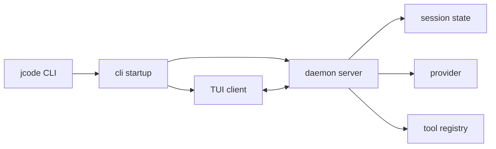

[中文](./README.md) | [English](./README-en.md)

# Learn JCode 5.5

## What This Tutorial Is For

This is not a "learn agents from zero in one day" tutorial. JCode is also not the best first project if you have never read an agent loop before.

If you only want to understand what an agent loop is, start with the `Node / Workflow / Agent` parts in `Learn-OpenClaw`, or read pi-mono's `pi-agent-core`. Those projects are smaller and better for first contact.

JCode is useful for a different reason: **it shows what a coding-agent harness starts to look like once it becomes a real product system.**

It contains many things that do not look like "agent code" at first: a resident server, multiple clients, terminal rendering, OAuth login, provider catalogs, session journals, memory graphs, MCP pools, swarm communication, ambient background cycles, self-dev reloads. The codebase feels scattered until you realize these pieces are exactly what makes a long-running coding agent usable.

This tutorial has four goals:

- Help you read JCode as a serious harness engineering project.
- Help you compare JCode with pi, OpenCode, and Claude Code without turning it into marketing.
- Help you make one small but real modification to JCode instead of stopping at an architecture summary.
- Help you explain agent loop, tool registry, provider layer, server runtime, memory, and swarm coordination in an interview or project review.

## First: Agents Are Not Written With If-Else Chains

This tutorial follows the same core stance as `learn-claude-code`.

The model is the agent. It perceives, reasons, and chooses the next action. The surrounding code is not intelligence. The surrounding code is the harness.

```text
Agent product = Model + Harness

Harness = Tools
        + Context
        + Memory
        + Runtime
        + UI
        + Storage
        + Permissions
        + Provider integration
```

JCode puts the model inside an environment that is better suited for software work.

- If the model wants to read a file, JCode provides `read`.
- If the model wants to modify a file, JCode provides `edit`, `write`, and `apply_patch`.
- If the model wants to run tests, JCode provides `bash`.
- If the context gets too large, JCode compacts it.
- If old project knowledge matters, JCode searches memory.
- If the user opens multiple terminals, JCode keeps sessions under one server.
- If many agents work at the same time, JCode has a swarm runtime for communication and state.

So do not read JCode as "a Rust chat wrapper." It is closer to a local operating environment for coding agents.

## Learning Path

I would read it over 6 days. Spend 2-4 hours per day. Do not try to brute-force the whole repository in one sitting. JCode is too large for that, and the result is usually confusion, not understanding.

### Day 0: Prepare the Environment

Goal: start JCode, authenticate one provider, and know where configuration lives.

Read:

- `/Users/shizi/Documents/workspace/jcode/README.md`
- `/Users/shizi/Documents/workspace/jcode/OAUTH.md`
- `/Users/shizi/Documents/workspace/jcode/Cargo.toml`

Commands:

```bash
cd /Users/shizi/Documents/workspace/jcode
cargo check --no-default-features
cargo run --bin jcode
```

Common login commands:

```bash
jcode login --provider openai
jcode login --provider claude
jcode login --provider gemini
jcode login --provider copilot
```

For an OpenAI-compatible endpoint:

```bash
jcode provider add local-vllm \
  --base-url http://localhost:8000/v1 \
  --model Qwen/Qwen3-Coder-30B-A3B-Instruct \
  --no-api-key \
  --set-default
```

Do not rush into source code yet. Day 0 has one job: confirm the harness actually runs.

### Day 1: Trace Startup

Goal: know what happens after the `jcode` command starts.

Read:

```text
src/main.rs
src/lib.rs
src/cli/startup.rs
src/cli/dispatch.rs
src/server.rs
src/server/runtime.rs
docs/SERVER_ARCHITECTURE.md
```

JCode startup is not "start one CLI process, talk to the model, exit." It is closer to this:

```text
jcode
  -> cli startup
  -> check whether a local JCode server exists
  -> start daemon server if needed
  -> TUI client connects to server socket
  -> server owns sessions, provider, MCP, swarm, events
  -> client owns display and input
```

This is the first major difference between JCode and many ordinary CLI agents.

pi is a lightweight coding harness. OpenCode also has a client/server design. JCode's emphasis here is a Rust resident runtime with session reuse, reload/reconnect, multi-client behavior, and better multi-session resource control.

After this day, you should be able to answer:

- Why does JCode need a server?
- Why can a session survive a client disconnect?
- Why is `/reload` more than just quit and restart?
- Why does the server runtime contain `sessions`, `event_tx`, `mcp_pool`, and `swarm_state`?

Exercise: draw the startup path.



### Day 2: Read the Agent Loop

Goal: understand that JCode is still built around a normal agent loop. The surrounding engineering is large, but the core loop is not magical.

The minimal loop:

```text
messages
  -> LLM
  -> assistant text or tool_use
  -> execute tool
  -> append tool_result
  -> LLM
  -> ...
```

In JCode, start here:

```text
src/agent/turn_loops.rs
src/agent/tools.rs
src/agent/messages.rs
src/agent/compaction.rs
src/message.rs
```

`turn_loops.rs` is one of the most important files in the project. Read it slowly. It roughly does this:

1. Repairs missing tool outputs so the provider does not reject the message history.
2. Calls `messages_for_provider()` and triggers compaction when needed.
3. Builds `tool_definitions()`.
4. Takes the pending memory prompt from the previous turn and injects it.
5. Builds a static/dynamic split system prompt to preserve provider cache behavior.
6. Calls provider `complete_split()` and opens the stream.
7. Parses stream events: thinking, text delta, tool start, tool input, tool end.
8. Executes tools and converts outputs into tool result content blocks.
9. Continues if the model calls more tools.

Do not only stare at code. Read it with one question in mind:

```text
How does one user input become:
model output -> tool execution -> tool result -> next model input?
```

Exercise: trace one tool call from `StreamEvent::ToolUseStart` to `tool_output_to_content_blocks()`.

Once you understand this day, the point from `learn-claude-code` becomes concrete: the loop is simple; the product-grade mechanisms around the loop are the hard part.

### Day 3: Read the Tool System

Goal: understand how JCode gives the model hands.

Core files:

```text
src/tool/mod.rs
src/tool/read.rs
src/tool/write.rs
src/tool/edit.rs
src/tool/bash.rs
src/tool/grep.rs
src/tool/task.rs
src/tool/communicate.rs
src/tool/mcp.rs
src/tool/memory.rs
src/tool/side_panel.rs
```

Every tool implements the same `Tool` trait:

```text
name()
description()
parameters_schema()
execute(input, ctx)
```

This matters. A tool is not just a name in the prompt. It is a validated, executable, observable protocol between the model and the environment.

JCode tools fall into three rough groups.

Basic coding tools:

```text
read, write, edit, multiedit, patch, apply_patch,
glob, grep, ls, bash, open
```

Enhanced tools:

```text
agentgrep, browser, webfetch, websearch, codesearch,
lsp, side_panel, session_search, conversation_search
```

Harness-level tools:

```text
subagent, batch, swarm, memory, goal, todo,
mcp, skill_manage, schedule, selfdev
```

The important functions are `Registry::base_tools()` and `Registry::new()`.

Look for these details:

- Base tools are cached with `OnceLock` so each session does not deep-copy the same tools.
- Session-specific tools can bind a provider or registry.
- Tool definitions are sorted by name to reduce prompt-cache churn.
- Tool output goes through a context guard to avoid blowing up the context window.
- MCP tools can be registered dynamically later.
- self-dev and ambient tools have separate registration paths.

Exercise: design a read-only `repo_summary` tool.

It should return:

```text
branch:
latest commit:
top-level dirs:
tracked file count:
```

Rules:

- Do not write files.
- Keep output short.
- Do not call the network.
- Register it in the tool registry.
- Run at least one manual validation.

This is a better exercise than a weather tool because it walks through the real coding-harness path.

### Day 4: Read Provider, Auth, and Session

Goal: understand how JCode turns different model platforms into one agent stream.

Directories:

```text
src/provider/
src/auth/
src/usage/
src/session/
src/storage.rs
OAUTH.md
```

Many agent demos treat the provider layer as one line:

```text
client.chat.completions.create(...)
```

In a real product, provider integration becomes a large piece of engineering:

- API keys and OAuth both matter.
- Claude, OpenAI, Gemini, and Copilot stream differently.
- Some providers expose thinking, some do not.
- Some support prompt caching, some do not.
- Some need provider session IDs.
- Model catalogs, context windows, pricing, and usage must be tracked.
- Failures need diagnostics and sometimes fallback.

That is why JCode has a serious provider layer.

Start with:

```text
src/provider/mod.rs
src/provider/openai.rs
src/provider/claude.rs
src/provider/gemini.rs
src/provider/copilot.rs
src/provider/dispatch.rs
src/provider/selection.rs
src/auth/commands.rs
src/auth/login_flows.rs
```

You do not need to finish every provider. Understand three things:

- What the internal `Provider` trait looks like.
- How provider-specific streams become shared `StreamEvent`s.
- How login state, account switching, and model selection reach the provider.

Then read session code:

```text
src/session/model.rs
src/session/journal.rs
src/session/render.rs
src/replay.rs
src/import.rs
```

A JCode session is not just a chat transcript. It needs resume, replay, import, crash recovery, and multi-client rendering. This layer separates a long-running agent product from a one-shot script.

Exercise:

```text
If a Claude Code / Codex / OpenCode session has to be imported into JCode,
what data-shape differences does JCode need to handle?
```

JCode's README mentions resuming sessions from Codex, Claude Code, OpenCode, and pi. The import/session/render path is where that kind of feature lives.

### Day 5: Read TUI and Observability

Goal: understand that UI is not decoration. UI is part of the harness.

Directories:

```text
src/tui/
src/side_panel.rs
src/tool/side_panel.rs
crates/jcode-tui-core/
crates/jcode-tui-render/
crates/jcode-tui-markdown/
crates/jcode-tui-mermaid/
```

JCode's TUI does more than print markdown:

- tool call summaries
- stream buffers
- diff views
- side panels
- inline markdown
- mermaid rendering
- usage overlays
- git info widgets
- memory info widgets
- todo info widgets
- swarm/background info widgets
- account/model pickers

This is one of JCode's most opinionated areas. A coding agent can be capable but still unpleasant if the user cannot see what it is doing. JCode treats observability as terminal UI work.

Do not start by diving into all of `ui.rs`. Pick smaller files first:

```text
src/tui/info_widget.rs
src/tui/info_widget_git.rs
src/tui/info_widget_memory_render.rs
src/tui/ui_tools.rs
src/tui/ui_diff.rs
side panel related files
```

Exercise: pick one info widget and write down its data path:

```text
Where does the data come from?
Which event updates it?
Where is it rendered?
```

This helps you understand JCode's event-driven UI instead of only reading rendering code.

### Day 6: Read Memory, Swarm, Ambient, and Self-Dev

Goal: understand where JCode differs most from ordinary coding agents.

#### Memory

Files:

```text
docs/MEMORY_ARCHITECTURE.md
docs/MEMORY_BUDGET.md
src/memory.rs
src/memory_agent.rs
src/memory_graph.rs
src/memory_prompt.rs
src/tool/memory.rs
src/tool/session_search.rs
```

JCode memory is not just "manually save a note." It is closer to background recall:

```text
current context
  -> embedding
  -> similar memory hits
  -> graph/cascade retrieval
  -> optional sidecar verification
  -> memory prompt in the next turn
```

The important design choice is non-blocking retrieval. The main agent does not wait for memory. A memory query triggered in turn N is usually used in turn N+1. That keeps interaction responsive.

This is different from many RAG demos. A typical demo runs retrieval before answering. JCode is aiming for something closer to long-term experience that surfaces when relevant.

#### Swarm

Files:

```text
docs/SWARM_ARCHITECTURE.md
src/server/swarm.rs
src/server/swarm_channels.rs
src/server/comm_*.rs
src/tool/communicate.rs
src/tool/task.rs
```

JCode swarm is not just a simple subagent tool. It cares about runtime coordination:

- how a coordinator divides work
- how workers report back
- how agents DM, broadcast, or use channels
- which files were read or modified by whom
- how plans are updated
- how blocked or crashed agents recover
- when worktrees help and when they are unnecessary

This is much more complex than pi, and it is easy to get lost. Read the docs first, draw the state machine, then touch code.

#### Ambient

Files:

```text
docs/AMBIENT_MODE.md
src/ambient/
src/ambient_runner.rs
src/tool/ambient.rs
```

Ambient is a background agent. Instead of only responding to a user prompt, it can maintain memory, inspect recent work, and run low-risk proactive tasks when resources allow.

This is experimental, but worth reading because it shows a path from "interactive tool" to "long-running environment maintainer."

#### Self-Dev

Files:

```text
src/cli/selfdev.rs
src/tool/selfdev.rs
src/prompt/selfdev_mode.txt
src/prompt/selfdev_hint.txt
docs/UNIFIED_SELFDEV_SERVER_PLAN.md
```

Self-dev lets JCode modify JCode. It is powerful and easy to break.

If you try it:

- Create a branch.
- Keep the worktree clean.
- Commit each step.
- Start with small changes.
- Run `cargo check`.
- Do not begin with provider, server reload, compaction, or swarm changes.

## Differences From Other Projects

### JCode vs pi-mono

pi-mono is valuable because it is small. It teaches a useful lesson: a coding agent does not need 50 tools. `read/write/edit/bash` can already do a lot.

JCode is not trying to be small. It is trying to support long-term use:

- multiple sessions
- resident server
- richer TUI
- memory graph
- session import/search
- swarm
- ambient
- self-dev

Practical advice:

```text
Learn the agent loop from pi.
Learn product-grade harness engineering from JCode.
```

### JCode vs Learn-OpenClaw

`Learn-OpenClaw` is closer to "quickly build agent intuition and turn pi-mono into your own OpenClaw."

This tutorial is closer to "understand a complex harness like JCode and make one credible modification."

For internships or projects, both paths work:

- OpenClaw path: faster demo, often an IM/Slack/Feishu coding agent.
- JCode path: deeper discussion of provider, tool registry, server, memory, and swarm mechanisms.

The first is easier to demo. The second shows more engineering depth.

### JCode vs OpenCode

OpenCode and JCode are both open-source coding agents with client/server thinking and provider-agnostic goals.

Roughly:

| Project | Stack | Stronger Direction |
| --- | --- | --- |
| OpenCode | TypeScript / Bun / Effect / Hono | Plugins, LSP, Web/Desktop, open platform |
| JCode | Rust / Tokio / Ratatui | Performance, multi-session runtime, terminal rendering, memory, swarm |

OpenCode feels more like an open agent platform. JCode feels more like a high-performance local agent runtime.

### JCode vs Claude Code

Claude Code is a useful harness reference. Tools, permissions, context compaction, skills, subagents, and session behavior are all worth studying from the outside.

But keep the boundary clean: study public behavior and design ideas only. Do not use, distribute, or summarize non-public or leaked source code.

JCode differs in that it:

- emphasizes multiple providers
- emphasizes Rust performance
- makes memory and session search more central
- moves swarm coordination into the server runtime
- experiments with ambient and self-dev modes

## Turning JCode Study Into a Project

Do not say "I read the JCode source." That says very little.

Pick one small direction and make it real.

### Direction 1: Add a Read-Only Tool

Examples:

```text
repo_summary
dependency_scan_summary
workspace_health
recent_session_digest
```

Value: you touch the tool trait, schema, registry, tool output, and possibly UI display.

### Direction 2: Improve Provider Profile Documentation and Validation

Example:

```text
Write a JCode provider setup guide for an internal OpenAI-compatible gateway.
Add auth-test / smoke-test examples.
Document common failure diagnostics.
```

Value: it shows you understand provider integration, not only API calls.

### Direction 3: Build a Side Panel Workflow

Examples:

```text
Ask the agent to keep a review checklist in the side panel.
Show diff and plan side by side.
Visualize memory hits.
```

Value: it shows you understand UI as harness, not decoration.

### Direction 4: Write an Engineering Comparison of JCode, OpenCode, and pi

Compare source-level mechanisms:

```text
tool registry
provider abstraction
session storage
permission model
TUI event flow
subagent/swarm
```

Value: good interview material. Tradeoffs matter more than memorized buzzwords.

### Direction 5: Write a Real Memory Use Case

Examples:

```text
How user preferences enter memory.
How project conventions are recalled.
How old sessions are searched.
How memory prompts avoid breaking the cache prefix.
```

Value: memory is one of JCode's differentiators, and explaining it clearly is useful.

## How to Talk About This in Interviews

A better project description:

```text
I studied JCode, a Rust coding-agent harness.
It is not a simple LLM API wrapper. It includes provider adapters,
a tool registry, a streaming turn loop, session journals, TUI rendering,
an MCP bridge, semantic memory, and a multi-agent swarm runtime.

I made a focused modification: xxx.
The change touched xxx files.
I validated it with cargo check / a manual session / unit tests.
The main thing I learned was how tool results return to the next model turn,
and why a resident server helps support multiple sessions.
```

Questions you may be asked:

- What stops the agent loop?
- How is a tool call executed?
- How does a tool result return to `messages`?
- How are provider stream differences normalized?
- Why split the system prompt into static and dynamic parts?
- When does context compaction happen?
- Why is memory retrieval non-blocking?
- What does the server/client split solve?
- What does swarm add beyond subagents?
- Why must tool output be truncated?
- Where should permission boundaries live?

If you can answer these, you are beyond the level of a LangChain RAG customer-service demo.

## How Not to Learn It

Do not start from `crates/`. Workspace boundaries are not the learning entry point.

Do not modify swarm on day one. Communication, state, and lifecycle logic will waste your time if you do not understand the core loop first.

Do not read JCode as a Claude Code replacement. Some concepts overlap, but the engineering direction is different.

Do not stare only at the README performance table. Performance is the result. The interesting part is how server residency, tool caching, rendering, memory strategy, and multi-session design support that result.

Do not over-talk ambient or self-dev before you can explain agent loop, tool registry, provider, and session. Those basics matter more.

## Closing

The best thing to learn from JCode is not one clever function. It is the decision to treat a coding agent as a long-running engineering system.

A toy agent needs:

```text
LLM + tools + loop
```

A serious coding-agent harness also needs:

```text
server
session
provider
auth
cache
compaction
memory
UI
permissions
coordination
recovery
```

That is why JCode is worth studying.
