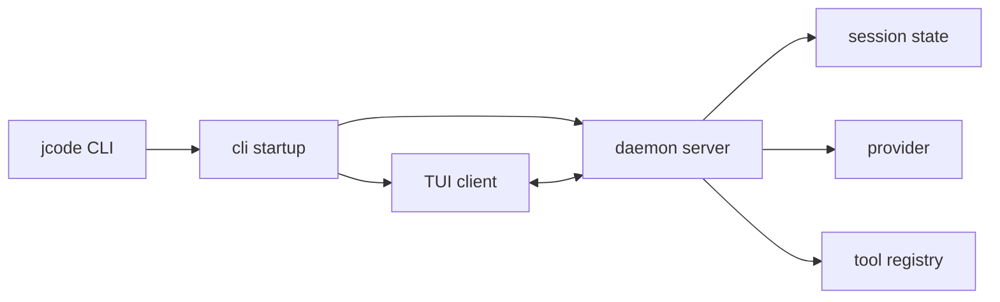

[中文](./README.md) | [English](./README-en.md)

# Learn JCode 5.5

## 这个教程想干什么

这不是“零基础一天学会 Agent”的教程。JCode 也不适合当第一个 agent 入门项目。

如果你只是想知道 agent loop 是什么，先看 `Learn-OpenClaw` 里面的 `Node / Workflow / Agent`，或者直接看 pi-mono 的 `pi-agent-core`。那些项目更小，更适合第一次建立概念。

JCode 适合学另一件事：**一个 coding-agent harness 真正产品化以后会长成什么样。**

它里面有很多看起来“不像 agent”的东西：常驻 server、多 client、TUI 渲染、OAuth 登录、provider catalog、session journal、memory graph、MCP pool、swarm 通信、ambient 后台循环、self-dev reload。刚开始读会觉得散，但这些东西合起来才是一个能长期用的 coding agent。

本教程的目标很明确：

- 让你能把 JCode 当作一个 harness 工程样本读懂。
- 让你知道 JCode 和 pi、OpenCode、Claude Code 的设计差异。
- 让你能基于 JCode 做一个小而真实的改造，而不是只写一篇“架构分析”。
- 让你面试时能讲清楚 agent loop、tool registry、provider、server、memory、swarm 这些东西到底怎么接起来。

## 先把话说清楚：Agent 不是你用 if-else 写出来的

这里沿用 `learn-claude-code` 的核心立场。

模型才是 agent。它负责感知、推理、决定下一步。外面的代码不是 intelligence，外面的代码是 harness。

```text
Agent product = Model + Harness

Harness = Tools
        + Context
        + Memory
        + Runtime
        + UI
        + Storage
        + Permissions
        + Provider integration
```

JCode 做的事情就是把模型放进一个更适合写代码的环境里。

- 模型说要读文件，JCode 提供 `read`。
- 模型说要改文件，JCode 提供 `edit`、`write`、`apply_patch`。
- 模型说要跑测试，JCode 提供 `bash`。
- 模型上下文快满了，JCode 负责 compact。
- 模型需要旧会话经验，JCode 负责 memory search。
- 用户开了很多终端，JCode 用 server 管住多个 session。
- 多个 agent 同时干活，JCode 用 swarm runtime 管通信和状态。

所以不要把 JCode 理解成“一个 Rust 写的聊天壳”。它更像一个本地 agent 操作系统。

## 学习路线

我建议按 6 天读。每天 2-4 小时，别硬啃一整天。JCode 代码面很大，硬扫目录只会让人烦。

### 第 0 天：准备环境，确认能跑

目标：能启动 JCode，能登录一个 provider，知道配置文件在哪里。

阅读：

- `/Users/shizi/Documents/workspace/jcode/README.md`
- `/Users/shizi/Documents/workspace/jcode/OAUTH.md`
- `/Users/shizi/Documents/workspace/jcode/Cargo.toml`

命令：

```bash
cd /Users/shizi/Documents/workspace/jcode
cargo check --no-default-features
cargo run --bin jcode
```

常见登录：

```bash
jcode login --provider openai
jcode login --provider claude
jcode login --provider gemini
jcode login --provider copilot
```

如果你用 OpenAI-compatible endpoint：

```bash
jcode provider add local-vllm \
  --base-url http://localhost:8000/v1 \
  --model Qwen/Qwen3-Coder-30B-A3B-Instruct \
  --no-api-key \
  --set-default
```

先别急着读源码。第一天只确认一件事：这个 harness 真能跑起来。

### 第 1 天：把启动链路走通

目标：知道 `jcode` 这个命令启动以后发生了什么。

读这些文件：

```text
src/main.rs
src/lib.rs
src/cli/startup.rs
src/cli/dispatch.rs
src/server.rs
src/server/runtime.rs
docs/SERVER_ARCHITECTURE.md
```

JCode 的启动不是“起一个 CLI 进程然后结束”。大致是：

```text
jcode
  -> cli startup
  -> 检查本机有没有 JCode server
  -> 没有就启动 daemon server
  -> TUI client 连接 server socket
  -> server 管 session、provider、MCP、swarm、event
  -> client 负责显示和输入
```

这个设计是 JCode 和很多普通 CLI agent 的第一处区别。

pi 更像一个轻量 coding harness。OpenCode 也有 client/server。JCode 这里的重点是 Rust 常驻 runtime、session 复用、reload/reconnect、多 client、多 session 资源控制。

读完后你应该能回答：

- 为什么 JCode 要有 server？
- client 断了以后 session 为什么还能恢复？
- `/reload` 为什么不是简单退出重启？
- server 里为什么会有 `sessions`、`event_tx`、`mcp_pool`、`swarm_state`？

练习：写一张启动链路图。



### 第 2 天：读 Agent Loop

目标：理解 JCode 的核心仍然是普通 agent loop，不要被外围工程吓住。

最小 agent loop 长这样：

```text
messages
  -> LLM
  -> assistant text or tool_use
  -> execute tool
  -> append tool_result
  -> LLM
  -> ...
```

JCode 的 loop 在：

```text
src/agent/turn_loops.rs
src/agent/tools.rs
src/agent/messages.rs
src/agent/compaction.rs
src/message.rs
```

`turn_loops.rs` 是最值得慢慢读的文件之一。它做的事情可以拆成几段：

1. 修复缺失的 tool output，避免 provider 拒绝消息。
2. 调 `messages_for_provider()`，必要时触发 compaction。
3. 构建 `tool_definitions()`。
4. 非阻塞取 memory prompt，把上一轮算好的 memory 注入进来。
5. 构建 static/dynamic split system prompt，尽量保住 provider cache。
6. 调 provider 的 `complete_split()` 打开 stream。
7. 解析 stream：thinking、text delta、tool start、tool input、tool end。
8. 执行工具，把结果变成 tool result content block。
9. 如果模型继续调工具，就继续下一轮。

这部分不要只看代码。你要带着一个问题看：

```text
一次用户输入，是怎么变成“模型输出 -> 工具执行 -> 工具结果 -> 下一次模型输入”的？
```

练习：找一个 tool call，从 `StreamEvent::ToolUseStart` 追到 `tool_output_to_content_blocks()`。

你读完这天，就能理解 `learn-claude-code` 一直强调的东西：agent 产品的核心 loop 不复杂，真正复杂的是 loop 旁边的工程机制。

### 第 3 天：读工具系统

目标：知道 JCode 怎样给模型一双手。

JCode 工具系统的核心文件：

```text
src/tool/mod.rs
src/tool/read.rs
src/tool/write.rs
src/tool/edit.rs
src/tool/bash.rs
src/tool/grep.rs
src/tool/task.rs
src/tool/communicate.rs
src/tool/mcp.rs
src/tool/memory.rs
src/tool/side_panel.rs
```

工具统一实现 `Tool` trait：

```text
name()
description()
parameters_schema()
execute(input, ctx)
```

这点很重要。工具不是 prompt 里的一个名字，而是一套可验证、可执行、可观测的协议。

JCode 的工具大致分三类。

第一类是基础工具：

```text
read, write, edit, multiedit, patch, apply_patch,
glob, grep, ls, bash, open
```

这类工具对应 coding agent 最基本的读、搜、改、跑。

第二类是增强工具：

```text
agentgrep, browser, webfetch, websearch, codesearch,
lsp, side_panel, session_search, conversation_search
```

这些工具不是必须，但能显著改善效率和 UI。

第三类是 harness 级工具：

```text
subagent, batch, swarm, memory, goal, todo,
mcp, skill_manage, schedule, selfdev
```

这些已经不是“简单函数调用”了，而是在操作 JCode 的运行时能力。

这一天重点看 `Registry::base_tools()` 和 `Registry::new()`。你会看到：

- base tools 被 `OnceLock` 缓存，避免每个 session 深拷贝。
- session-specific tools 会绑定 provider 或 registry。
- tool definitions 会按名字排序，减少 prompt cache 抖动。
- tool output 会经过 context guard，防止一次输出撑爆上下文。
- MCP 工具可以后续动态注册。
- self-dev 和 ambient 工具有自己的注册路径。

练习：设计一个只读工具 `repo_summary`。

它应该返回：

```text
branch:
latest commit:
top-level dirs:
tracked file count:
```

要求很简单：

- 不写文件。
- 输出必须短。
- 不要调用网络。
- 加到 registry。
- 至少手动跑一次。

这个练习比“写一个天气工具”更有意义，因为它走的是 coding harness 的真实路径。

### 第 4 天：读 Provider、Auth、Session

目标：知道 JCode 怎样把不同模型平台变成统一的 agent stream。

相关目录：

```text
src/provider/
src/auth/
src/usage/
src/session/
src/storage.rs
OAUTH.md
```

很多人写 agent demo 时会把 provider 当成一行代码：

```text
client.chat.completions.create(...)
```

真正做产品时，provider 层会变成一大块工程：

- API key 和 OAuth 都要支持。
- Claude、OpenAI、Gemini、Copilot 的 stream 格式不同。
- 有的 provider 有 thinking，有的没有。
- 有的支持 prompt cache，有的不支持。
- 有的 provider 需要 session id。
- 模型列表、context window、价格、usage 都要管理。
- 失败后要有诊断和 fallback。

JCode 的 provider 层就是为这些麻烦服务的。

建议先读：

```text
src/provider/mod.rs
src/provider/openai.rs
src/provider/claude.rs
src/provider/gemini.rs
src/provider/copilot.rs
src/provider/dispatch.rs
src/provider/selection.rs
src/auth/commands.rs
src/auth/login_flows.rs
```

这一天不用每个 provider 都读完。你只要弄清楚三件事：

- JCode 内部的 `Provider` trait 长什么样。
- provider stream 怎样被转换成统一的 `StreamEvent`。
- 登录态、账号切换、模型选择是怎么进 provider 的。

再看 session：

```text
src/session/model.rs
src/session/journal.rs
src/session/render.rs
src/replay.rs
src/import.rs
```

JCode 的 session 不是一坨聊天记录。它要支持 resume、replay、import、crash recovery、multi-client UI render。session 这层是长期 agent 产品和一次性脚本的分界线。

练习：回答这个问题：

```text
如果 Claude Code / Codex / OpenCode 的一次历史会话要迁移进 JCode，
JCode 需要解决哪些数据结构差异？
```

JCode README 里提到支持恢复 codex、claude code、opencode、pi 的 session，这个功能背后就是 import/session/render 这条线。

### 第 5 天：读 TUI 和可观察性

目标：理解 UI 不是装饰，UI 是 harness 的一部分。

相关目录：

```text
src/tui/
src/side_panel.rs
src/tool/side_panel.rs
crates/jcode-tui-core/
crates/jcode-tui-render/
crates/jcode-tui-markdown/
crates/jcode-tui-mermaid/
```

JCode 的 TUI 做了很多不只是“打印 markdown”的事：

- tool call 摘要。
- stream buffer。
- diff view。
- side panel。
- inline markdown。
- mermaid rendering。
- usage overlay。
- git info widget。
- memory info widget。
- todo info widget。
- swarm/background info widget。
- account/model picker。

这部分是 JCode 很有个性的地方。很多 coding agent 明明能做事，但用户看不到它在干什么，于是体验很差。JCode 把“可观察性”做进了终端 UI。

读源码时不要从 `ui.rs` 一头扎进去。先找小块：

```text
src/tui/info_widget.rs
src/tui/info_widget_git.rs
src/tui/info_widget_memory_render.rs
src/tui/ui_tools.rs
src/tui/ui_diff.rs
src/tui/side_panel 相关文件
```

练习：选一个 info widget，写清楚它的数据来源：

```text
数据从哪里来？
通过什么 event 更新？
最后在哪里 render？
```

这个练习能帮你理解 JCode 的 event-driven UI，而不是只看样式。

### 第 6 天：读 Memory、Swarm、Ambient、Self-Dev

目标：理解 JCode 和普通 coding agent 最大的差异。

#### Memory

相关文件：

```text
docs/MEMORY_ARCHITECTURE.md
docs/MEMORY_BUDGET.md
src/memory.rs
src/memory_agent.rs
src/memory_graph.rs
src/memory_prompt.rs
src/tool/memory.rs
src/tool/session_search.rs
```

JCode 的 memory 不是“手动记一条笔记”。它更像后台召回：

```text
当前上下文
  -> embedding
  -> 找相似 memory
  -> graph/cascade retrieval
  -> 可选 sidecar 验证
  -> 下一轮注入 memory prompt
```

关键点是非阻塞。主 agent 不等 memory。第 N 轮触发的 memory 查询，结果通常在第 N+1 轮用上。这样不会拖慢交互。

这和很多 RAG demo 不一样。RAG demo 往往是“问之前先查库”。JCode 更像“长期使用以后，相关经验会自己冒出来”。

#### Swarm

相关文件：

```text
docs/SWARM_ARCHITECTURE.md
src/server/swarm.rs
src/server/swarm_channels.rs
src/server/comm_*.rs
src/tool/communicate.rs
src/tool/task.rs
```

JCode 的 swarm 不是简单 subagent。它关心的是多 agent 协作的运行时问题：

- coordinator 怎么分工。
- worker 怎么汇报。
- agent 之间怎么 DM / broadcast / channel。
- 文件被谁读过、谁改过。
- 计划怎么更新。
- agent crash 或 blocked 怎么处理。
- worktree 什么时候需要，什么时候不需要。

这部分是 JCode 比 pi 更复杂、也更难读的地方。不要一上来改。先读文档，画图，再动手。

#### Ambient

相关文件：

```text
docs/AMBIENT_MODE.md
src/ambient/
src/ambient_runner.rs
src/tool/ambient.rs
```

Ambient 是后台 agent。它不是用户发一句做一句，而是在资源允许时维护 memory、检查近期工作、做一些低风险主动任务。

这是一个实验性方向，但值得看，因为它代表 coding agent 从“交互工具”往“长期环境维护者”走。

#### Self-Dev

相关文件：

```text
src/cli/selfdev.rs
src/tool/selfdev.rs
src/prompt/selfdev_mode.txt
src/prompt/selfdev_hint.txt
docs/UNIFIED_SELFDEV_SERVER_PLAN.md
```

Self-dev 是让 JCode 改自己。这个能力很吸引人，也很容易翻车。

如果你真要玩 self-dev：

- 新建分支。
- 保持工作区干净。
- 每一步都 commit。
- 小改动开始。
- 跑 `cargo check`。
- 不要一上来改 provider、server reload、compaction、swarm。

## JCode 和几个项目的差异

### JCode vs pi-mono

pi-mono 的好处是小。它的教育价值非常高：一个 coding agent 并不需要 50 个工具，`read/write/edit/bash` 就能做很多事。

JCode 的问题不是“小而美”，它追求的是长期使用体验：

- 多 session。
- 常驻 server。
- 更丰富的 TUI。
- memory graph。
- session import/search。
- swarm。
- ambient。
- self-dev。

所以建议是：

```text
学 agent loop：看 pi
学产品级 harness：看 JCode
```

### JCode vs Learn-OpenClaw

`Learn-OpenClaw` 更像“怎么快速建立 agent 概念，并把 pi-mono 改成自己的 OpenClaw”。

这个教程更像“读懂 JCode 这种复杂 harness，并做一个可信的小改造”。

如果你要找实习，两个路线都能用：

- OpenClaw 路线：快速做出一个 IM/Slack/飞书里的 coding agent。
- JCode 路线：讲清楚 provider、tool registry、server、memory、swarm 这些产品级机制。

前者更容易做出 demo。后者更容易体现工程深度。

### JCode vs OpenCode

OpenCode 和 JCode 都是开源 coding agent，都有 client/server 思路，也都强调 provider-agnostic。

差异大概是：

| 项目 | 技术栈 | 更突出的方向 |
| --- | --- | --- |
| OpenCode | TypeScript / Bun / Effect / Hono | 插件、LSP、Web/Desktop、开放平台 |
| JCode | Rust / Tokio / Ratatui | 性能、多会话、终端渲染、memory、swarm、本地 runtime |

OpenCode 更像一个开放 agent 平台。JCode 更像一个高性能本地 agent runtime。

### JCode vs Claude Code

Claude Code 是很好的 harness 参考物。工具、权限、上下文压缩、skills、subagent、session 这些设计都值得学。

但学习边界要清楚：只学公开行为和设计思想，不使用、不传播、不复述任何非公开或泄露源码。

JCode 的差异是：

- 更强调多 provider。
- 更强调 Rust 性能。
- 把 memory 和 session search 做得更核心。
- 把 swarm 协作放进 server runtime。
- 提供 ambient/self-dev 这些更激进的实验方向。

## 把 JCode 学成一个项目

不要说“我读了 JCode 源码”。这句话没信息量。

你可以选一个小方向，把它做成项目：

### 方向 1：新增一个只读工具

例子：

```text
repo_summary
dependency_scan_summary
workspace_health
recent_session_digest
```

价值：走通 tool trait、schema、registry、tool output、TUI display。

### 方向 2：新增 provider profile 文档和验证工具

例子：

```text
为公司内部 OpenAI-compatible gateway 写一套 jcode provider add 指南
加一个 auth-test / smoke-test 示例
记录常见失败诊断
```

价值：体现你理解 provider 层，不只是会调 API。

### 方向 3：做一个 side panel 工作流

例子：

```text
让 agent 把当前 review checklist 写到 side panel
让 diff 和计划并排展示
让 memory 命中结果可视化
```

价值：体现你理解 UI 是 harness，不是装饰。

### 方向 4：写一份 JCode vs OpenCode vs pi 的工程比较

不是营销比较，而是按源码比较：

```text
tool registry
provider abstraction
session storage
permission model
TUI event flow
subagent/swarm
```

价值：适合面试。能讲权衡比能背概念强。

### 方向 5：给 memory 写一个实际用例

例子：

```text
用户偏好如何进入 memory
项目约定如何召回
历史 session 如何搜索
memory prompt 如何避免破坏 cache prefix
```

价值：memory 是 JCode 的差异点之一，讲清楚很加分。

## 面试怎么讲

比较好的项目表述：

```text
我研究了 JCode，一个 Rust 写的 coding-agent harness。
它不是简单的 LLM API wrapper，而是包含 provider adapter、
tool registry、streaming turn loop、session journal、TUI render、
MCP bridge、semantic memory 和 multi-agent swarm runtime。

我基于它做了一个小改造：xxx。
改动涉及 xxx 文件。
验证方式是 cargo check / 手动会话 / 单元测试。
我重点理解了 tool result 如何回到下一轮模型上下文，
以及 server 为什么要常驻来支撑多 session。
```

可能被问：

- agent loop 的停止条件是什么？
- tool call 是怎么执行的？
- tool result 怎么回到 messages？
- provider stream 差异怎么统一？
- 为什么要 split system prompt？
- context compaction 什么时候触发？
- memory 为什么非阻塞？
- server/client 架构解决了什么问题？
- swarm 比 subagent 多了什么？
- 为什么 tool output 要截断？
- permissions 应该放在哪一层？

这些问题能讲清楚，就比“我做了一个 LangChain RAG 客服”强得多。

## 不建议怎么学

不要从 `crates/` 开始扫。那是 workspace 拆分，不是学习入口。

不要第一天就改 swarm。你会被通信、状态、生命周期绕晕。

不要把 JCode 当 Claude Code 平替来读。它有相似概念，但工程取向不一样。

不要只看 README 里的性能表。性能是结果，真正值得学的是为什么它能用 server、tool cache、rendering、memory 策略支撑多会话。

不要为了“显得高级”硬讲 ambient/self-dev。先把 agent loop、tool registry、provider、session 讲清楚。

## 最后

JCode 最值得学的不是某个函数写得多漂亮，而是它把 coding agent 当成长期工程系统来做。

一个玩具 agent 只需要：

```text
LLM + tools + loop
```

一个能长期用的 coding-agent harness 还需要：

```text
server
session
provider
auth
cache
compaction
memory
UI
permissions
coordination
recovery
```

这就是 JCode 的学习价值。
