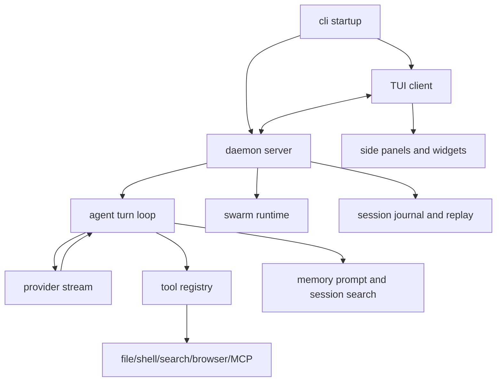

# Learn JCode 5.5

[中文](./README.md) | [English](./README-en.md)

这是一份面向 JCode 的实战教程。目标不是教你“再造一个聊天机器人”，而是教你理解一个真正的 coding-agent harness：它怎样把模型、工具、文件系统、终端、权限、记忆、多会话和多 agent 协作组合成一个能长期工作的工程系统。

本教程参考了 `learn-claude-code` 的 harness 工程视角，也吸收了 `Learn-OpenClaw` 的上手路线和项目化表达方式。最终产物不是复刻任何一个项目，而是帮助你把 JCode 当作一个可阅读、可改造、可对比的 agent 工程样本。

## 一句话

JCode = 模型 + 工具系统 + provider 层 + 常驻 server + TUI client + session 存储 + memory graph + swarm 协作 + self-dev。

模型负责思考。JCode 负责把思考变成可靠、可观察、可恢复、可并行的行动。

```text
User input
  -> JCode TUI / client
  -> JCode server
  -> Agent turn loop
  -> Provider stream
  -> Tool calls
  -> Tool results / session journal / UI events
  -> Next model turn
```

## 你能学到什么

按 1 天学习计划估算：

| 阶段 | 时间 | 目标 |
| --- | ---: | --- |
| 快速上手 | 30 分钟 | 安装、登录 provider、跑一次 JCode |
| Harness 心智 | 45 分钟 | 理解模型和 harness 的边界 |
| 核心循环 | 1 小时 | 看懂 agent turn、stream、tool result 的闭环 |
| 工具系统 | 1 小时 | 理解 `read/write/edit/bash/grep/mcp/subagent/swarm` 等工具怎样注册和执行 |
| Server/TUI | 1 小时 | 理解为什么 JCode 选择常驻 server + 多 client |
| Memory/Swarm/Self-dev | 2 小时 | 理解 JCode 相比 pi、OpenCode、Claude Code 更激进的地方 |
| 项目化改造 | 2 小时以上 | 增加一个工具、一个 provider 或一个学习型改造任务 |

如果你只想面试或做项目，至少看完“上手路径”“架构地图”“和其他项目的区别”“实践任务”四部分。

## 范围说明

本教程基于本地读取：

- JCode: `/Users/shizi/Documents/workspace/jcode`
- learn-claude-code: `/tmp/learn-claude-code`
- Learn-OpenClaw: `/tmp/Learn-OpenClaw`
- pi-mono: `/Users/shizi/Documents/workspace/pi-mono`
- OpenCode: `/Users/shizi/Documents/workspace/opencode`

关于 Claude Code，本教程只比较公开可观察的产品行为和 harness 设计概念，不复述、复制或依赖任何非公开/泄露源码实现。

## 先建立心智：你不是在“写 Agent”

真正的 agency 来自模型。工程师能做的是 harness。

```text
Harness = Tools + Context + Memory + UI + Storage + Permissions + Runtime
```

对 coding agent 来说：

- Tools 是手：读文件、写文件、改文件、跑 shell、搜索、浏览器、MCP。
- Context 是眼睛：当前消息、文件片段、命令输出、工具结果。
- Memory 是长期经验：历史会话、用户偏好、项目事实、可召回知识。
- UI 是驾驶舱：流式输出、工具状态、diff、side panel、图表、usage。
- Storage 是恢复能力：session journal、server registry、provider config。
- Permissions 是边界：哪些命令能跑，哪些目录能写，何时需要用户确认。
- Runtime 是生命支持：server 常驻、client 重连、后台任务、reload。

JCode 的特别之处在于：它不是一个“最小 agent loop”示例，而是把 harness 做到了产品级复杂度，并且非常重视性能和多会话扩展。

## 快速上手

### 1. 安装

JCode README 中的默认安装方式：

```bash
curl -fsSL https://raw.githubusercontent.com/1jehuang/jcode/master/scripts/install.sh | bash
```

从源码运行时，在 JCode 仓库里：

```bash
cargo run --bin jcode
```

如果编译太慢，可以先关闭默认重特性来理解 CLI 和代码路径：

```bash
cargo check --no-default-features
```

### 2. 登录 provider

JCode 支持多种登录方式。常见路径：

```bash
jcode login --provider claude
jcode login --provider openai
jcode login --provider gemini
jcode login --provider copilot
```

也可以配置 OpenAI-compatible endpoint：

```bash
jcode provider add local-vllm \
  --base-url http://localhost:8000/v1 \
  --model Qwen/Qwen3-Coder-30B-A3B-Instruct \
  --no-api-key \
  --set-default
```

JCode 的 provider 层不只是 API key wrapper。它还处理 OAuth、订阅账号、模型目录、价格/usage、fallback、stream 格式差异和 provider-specific session 行为。

### 3. 开始一次会话

```bash
jcode
```

你可以先让它做一个低风险任务：

```text
Read this repository and summarize its architecture. Do not edit files.
```

再尝试工具任务：

```text
Find where tools are registered and explain how a new tool should be added.
```

## 架构地图

从入口看：

```text
src/main.rs
  -> jcode::run()
  -> src/lib.rs
  -> cli::startup::run()
  -> server/client/agent/provider/tool/tui
```

核心目录：

| 路径 | 作用 |
| --- | --- |
| `src/agent/` | agent turn loop、stream 处理、工具调用、context compaction、memory 注入 |
| `src/tool/` | 内置工具注册和执行，包括文件、shell、web、MCP、subagent、swarm、memory |
| `src/provider/` | Claude/OpenAI/Gemini/Copilot/OpenRouter/OpenAI-compatible 等 provider 适配 |
| `src/server/` | 常驻 server、多 client、session 管理、swarm runtime、reload/reconnect |
| `src/tui/` | Ratatui UI、side panel、diff、info widget、markdown/mermaid/rendering |
| `src/memory*` | memory graph、session search、memory agent、embedding 和召回 |
| `src/mcp/` | MCP client、manager、tool bridge、shared pool |
| `src/ambient/` | 后台 ambient runner、调度、记忆维护和主动任务 |
| `src/auth/` | OAuth、账号存储、provider 登录诊断 |
| `crates/` | 类型、provider core、TUI 子库、mobile/desktop 分层等 workspace 模块 |

这张图可以作为阅读顺序：



## 核心循环：JCode 仍然是一个 Agent Loop

最小 agent loop 是：

```text
messages -> model -> tool_use? -> execute tool -> append tool_result -> model ...
```

JCode 的复杂度来自“围绕这个 loop 的工程化”，不是来自改变这个 loop。

重点阅读：

- `src/agent/turn_loops.rs`
- `src/agent/tools.rs`
- `src/tool/mod.rs`

JCode turn loop 里做了这些事：

1. 修复缺失 tool output，避免 provider 消息格式错误。
2. 根据 context window 决定是否 compact。
3. 构建 tool definitions。
4. 非阻塞构建 memory prompt，把上一轮算好的 memory 注入当前消息尾部。
5. 构建 static/dynamic split system prompt，优化 provider cache。
6. 打开 provider stream，逐块处理 thinking、text、tool input、tool result。
7. 执行工具，把结果转回 content blocks。
8. 如果还有 tool call，继续下一轮；否则结束。

可以把它理解成：

```text
JCode Agent Loop
  = provider stream parser
  + tool executor
  + context compactor
  + memory injector
  + cache tracker
  + event publisher
```

## 工具系统：JCode 的“手”

JCode 的工具不是散落的函数，而是统一 trait：

```text
Tool
  - name()
  - description()
  - parameters_schema()
  - execute(input, context)
```

工具注册集中在 `src/tool/mod.rs`。基础工具包括：

| 类别 | 工具 |
| --- | --- |
| 文件 | `read`, `write`, `edit`, `multiedit`, `patch`, `apply_patch`, `open` |
| 搜索 | `glob`, `grep`, `agentgrep`, `codesearch`, `session_search`, `conversation_search` |
| 执行 | `bash`, `bg`, `batch` |
| Web/浏览器 | `webfetch`, `websearch`, `browser` |
| 协作 | `subagent`, `swarm`, `goal`, `todo` |
| 扩展 | `mcp`, `skill_manage`, `gmail`, `side_panel` |
| 高级模式 | `memory`, `schedule`, `selfdev` |

JCode 相比极简 agent 的关键差异是：它不是只给模型四个工具，而是给模型一个可治理的工具生态。工具越多，越需要：

- 确定性排序，提升 prompt cache 命中。
- alias 映射，兼容不同 provider 的工具名。
- 输出截断，避免单次 tool result 撑爆上下文。
- session/context 绑定，让工具知道工作目录、消息 ID、tool call ID。
- MCP 动态注册，允许外部工具加入。

如果你要加一个工具，基本路径是：

1. 在 `src/tool/` 下新增工具实现。
2. 实现 `Tool` trait。
3. 在 `Registry::base_tools` 或 session-specific 工具注册处插入。
4. 写参数 schema 和最小测试。
5. 确认输出不会无限膨胀，必要时返回摘要或 metadata。

## Server/TUI：为什么 JCode 不是“每次启动一个 CLI”

JCode 采用 single-server, multi-client 架构。

```text
jcode
  -> 如果 server 不存在，启动 daemon server
  -> client 连接 socket
  -> server 管理 sessions/provider/swarm/MCP/shared state
  -> client 断开不影响 server
  -> server reload 后 client 可重连
```

这和普通 CLI 的差别很大：

- 多个 TUI client 可以连接同一个 server。
- session 状态存在 server 和磁盘里，client 只是视图和输入端。
- provider、MCP pool、swarm state 可以跨 client 复用。
- `/reload` 可以让 server exec 新 binary，client 自动重连。
- 多会话并发时，额外 session 的内存增长更可控。

这是 JCode 性能叙事的核心：如果你经常同时开多个 coding-agent 会话，常驻 server 比“每个终端一个完整进程”更有扩展空间。

## TUI 和 Side Panel：Harness 的可观察性

很多 agent 工程只关注工具调用，忽略 UI。JCode 的 TUI 是它的重要能力：

- 流式显示 text/thinking/tool 状态。
- 工具调用摘要显示。
- diff/file view。
- side panel 可作为文件查看、diff、agent 写入面板。
- markdown 和 mermaid 渲染。
- info widgets 显示模型、usage、git、memory、todos、swarm 等状态。

这说明一个实际 coding agent 不是“模型能写代码”就够了。用户还需要知道：

- 它现在在干什么。
- 它调用了什么工具。
- 它改了什么。
- 它是不是卡住了。
- 它的上下文、成本、缓存和 memory 状态如何。

JCode 把这些都当作 harness 的一部分。

## Memory：不是手动记笔记，而是自动召回

JCode 的 memory 目标不是“让用户手动调用 memory tool”。它更像人脑：当前上下文触发相关记忆，然后自动出现在下一轮对话里。

核心设计：

- 每轮会话可以被 embedding。
- 非阻塞 memory 查询不阻塞主 agent。
- 第 N 轮计算出的 memory，通常在第 N+1 轮可用。
- 记忆可以形成 graph：tag、cluster、semantic relation。
- session search 提供传统历史会话检索。
- ambient mode 可以维护、合并、修剪、校验记忆。

简化流程：

```text
current messages
  -> async memory query
  -> embedding hits
  -> graph/cascade retrieval
  -> optional sidecar verification
  -> memory prompt
  -> injected as system reminder on next turn
```

这和很多“RAG = VectorDB”项目不一样。JCode 的方向是把 memory 变成长期使用同一个 harness 后自然增长的能力。

## Swarm：多会话协作不是简单 subagent

JCode 的 swarm 不是“主 agent 调一个 subagent 然后拿摘要”。它更接近多 session 协作 runtime：

- coordinator 创建计划并分配 scope。
- agents 并行执行任务。
- agent 可以 DM、broadcast、加入 channel。
- server 记录 file touches，发现代码在脚下变化时可以提醒。
- lifecycle/status/plan update 都是 server-level 状态。
- worktree 是可选隔离手段，不是默认必须。

对复杂代码任务来说，关键问题不是“能不能 spawn 多个 agent”，而是：

- 谁负责计划？
- 谁能改计划？
- 谁负责集成？
- agent 之间怎么通信？
- 文件冲突如何发现？
- 已完成/失败/阻塞状态怎么恢复？

JCode 在 `src/server/swarm*`、`src/server/comm*`、`src/tool/communicate.rs` 一带回答这些问题。

## Ambient 和 Self-Dev

JCode 的两个激进方向：

### Ambient

Ambient mode 是后台自主循环：

- 维护 memory graph。
- 检查最近 session 和 git 活动。
- 做低风险的主动任务。
- 根据资源和 rate limit 自调度下一次运行。

它把 agent 从“用户发一句做一句”推进到“有节制地后台维护环境”。

### Self-Dev

Self-dev 是让 JCode 在 JCode 仓库中改造自己：

- 识别当前在 JCode repo 内。
- 给当前 session 加 self-dev prompt/tooling。
- 编辑、构建、测试、reload 自身。

这很强，但也很危险。实践建议：

- 只在干净分支上做。
- 先让 agent 写计划，不要直接改核心 runtime。
- 所有 self-dev 修改都必须跑测试或至少 `cargo check`。
- 关键路径包括 `agent`, `tool`, `server`, `provider`, `tui`，改动前必须看依赖边界。

## 和其他项目的区别

| 项目 | 主要定位 | 强项 | 代价 |
| --- | --- | --- | --- |
| pi-mono | 极简 TypeScript coding harness | 易读、四工具心智、SDK/扩展友好、适合改造成自己的 OpenClaw | 默认跳过 subagent/plan 等复杂机制，需要自己装配 |
| OpenCode | 开源、provider-agnostic coding agent | 客户端/服务端、LSP、权限、插件、桌面/网页生态方向强 | TypeScript/Bun 工程较大，运行时栈更重 |
| Claude Code | 成熟商业 coding-agent harness | 产品完成度高、工具体验好、模型/harness 配合强 | 闭源且强绑定 Anthropic 生态；不要依赖泄露源码学习 |
| JCode | 性能优先、Rust、多会话、多 memory、多协作 harness | 低启动/低增量内存叙事、常驻 server、memory graph、swarm、ambient/self-dev | 代码面大，Rust workspace 和 runtime 复杂度高 |

### JCode vs pi

pi 的核心教育价值是“少就是多”：read/write/edit/bash 足够构成有效 coding agent。JCode 的方向是“多但要可治理”：工具更多，provider 更多，server 状态更多，所以必须处理 cache、截断、alias、权限、session、UI 状态。

如果你想学 agent loop，先看 pi。
如果你想学产品级 harness，必须看 JCode 这类系统。

### JCode vs OpenCode

OpenCode 和 JCode 都走 client/server 和 provider-agnostic 路线。差异在技术取向：

- OpenCode 是 TypeScript/Bun/Effect/Hono 生态，插件、LSP、Web/Desktop 方向强。
- JCode 是 Rust/Ratatui/Tokio 生态，性能、内存、多会话、terminal rendering 和 native runtime 方向强。

OpenCode 更像开放平台。JCode 更像高性能本地 agent runtime。

### JCode vs Claude Code

Claude Code 是理解 coding harness 的重要参考：工具、上下文压缩、权限、subagent、skills、会话恢复这些概念都已经被市场验证。

JCode 的不同点在于：

- 它尝试兼容多个 provider，而不是只围绕一个模型生态。
- 它把 memory 和 session search 做成核心能力。
- 它把 swarm 多会话协作做进 server runtime。
- 它强调 Rust 性能和多 session 资源效率。
- 它提供 self-dev/ambient 这样的实验性长期方向。

学习时应该学 Claude Code 的 harness 思想，不应该复制或传播任何非公开实现。

## 推荐阅读顺序

### 第一轮：跑起来

1. `README.md`
2. `OAUTH.md`
3. `docs/SERVER_ARCHITECTURE.md`
4. `docs/TERMINAL_BENCH.md`

目标：知道 JCode 为什么存在，怎么安装，怎么登录，怎么启动。

### 第二轮：看核心 loop

1. `src/main.rs`
2. `src/lib.rs`
3. `src/cli/startup.rs`
4. `src/agent/turn_loops.rs`
5. `src/tool/mod.rs`
6. `src/provider/mod.rs`

目标：能说清楚用户输入如何变成 provider stream 和 tool results。

### 第三轮：看产品级机制

1. `docs/MEMORY_ARCHITECTURE.md`
2. `docs/SWARM_ARCHITECTURE.md`
3. `docs/AMBIENT_MODE.md`
4. `docs/MULTI_SESSION_CLIENT_ARCHITECTURE.md`
5. `src/server/`
6. `src/tui/`

目标：理解 JCode 为什么不是一个简单 CLI。

### 第四轮：改一个东西

选择一个小任务：

- 加一个只读工具，比如 `repo_stats`。
- 给某个工具加更好的输出摘要。
- 给 `provider add` 文档补一个示例。
- 给 TUI 某个 info widget 增加一个状态字段。
- 给 memory docs 补一个实际使用案例。

不要第一天就改 swarm、reload、provider OAuth、compaction。那些是核心路径，测试成本高。

## 实践任务

### 任务 1：画出工具注册图

阅读 `src/tool/mod.rs`，回答：

- 哪些工具是 base tools？
- 哪些工具是 session-specific？
- MCP 工具什么时候注册？
- self-dev/ambient 工具什么时候注册？

输出一张 mermaid 图。

### 任务 2：实现一个只读工具

目标：新增 `repo_summary` 工具，返回当前工作目录的：

- git branch
- 最近 commit
- 文件数量
- top-level 目录

要求：

- 不写文件。
- 输出必须短。
- 有测试或至少手动运行记录。

这个任务能让你走完整个工具链：schema、execute、registry、tool result。

### 任务 3：读懂一次 memory 注入

阅读：

- `src/agent/turn_loops.rs`
- `src/memory_agent.rs`
- `src/memory_graph.rs`
- `docs/MEMORY_ARCHITECTURE.md`

回答：

- memory 查询为什么不阻塞主 agent？
- memory prompt 以什么形式注入？
- 为什么 memory 不能破坏 provider cache prefix？

### 任务 4：比较 JCode 和 OpenCode 的 tool registry

阅读：

- JCode: `src/tool/mod.rs`
- OpenCode: `packages/opencode/src/tool/registry.ts`

回答：

- 两者如何表示工具定义？
- 两者如何做权限/过滤？
- 两者如何处理 custom/plugin/MCP 工具？

### 任务 5：写一份自己的 JCode 改造计划

格式：

```text
目标：
为什么 JCode 适合做：
需要改的模块：
最小可行实现：
风险：
验证命令：
回滚方式：
```

这比“直接 vibe coding”更适合复杂 harness。JCode 的代码面很大，计划质量直接决定修改质量。

## 面试和项目表达

如果你把 JCode 学成一个项目，可以这样表述：

```text
我研究了一个 Rust coding-agent harness。它不是简单调用 LLM API，
而是实现了 provider adapter、tool registry、streaming turn loop、
session persistence、TUI rendering、semantic memory、MCP bridge 和
multi-agent swarm coordination。
我基于它做了一个小改造：新增只读工具/新增 provider profile/
改进 memory 文档/实现某个 info widget，并用 cargo check 和手动会话验证。
```

面试官可能追问：

- agent loop 的停止条件是什么？
- tool result 如何回到模型上下文？
- 为什么要做 context compaction？
- provider stream 格式不同怎么抽象？
- 常驻 server 比一次性 CLI 好在哪里？
- 多 agent 为什么需要通信协议和文件触达追踪？
- memory 为什么要非阻塞？
- 工具输出为什么要截断？
- 权限边界在哪里做？

你能把这些问题讲清楚，就已经不是“只会 LangChain/RAG demo”的水平。

## 学习建议

不要从 `crates/` 全量扫起。先抓主线：

```text
input -> server -> agent -> provider -> tool -> session/TUI
```

也不要一开始就试图“完全理解 JCode”。正确路径是：

1. 跑起来。
2. 看一次请求生命周期。
3. 看工具注册。
4. 看 server/client 生命周期。
5. 看 memory/swarm/self-dev 这些差异化设计。
6. 做一个小改造。

JCode 最值得学的不是某个函数，而是它对 coding-agent harness 的判断：性能、长期会话、工具治理、可观察 UI、记忆、多 agent 协作，都是产品能力，不是 prompt 技巧。
