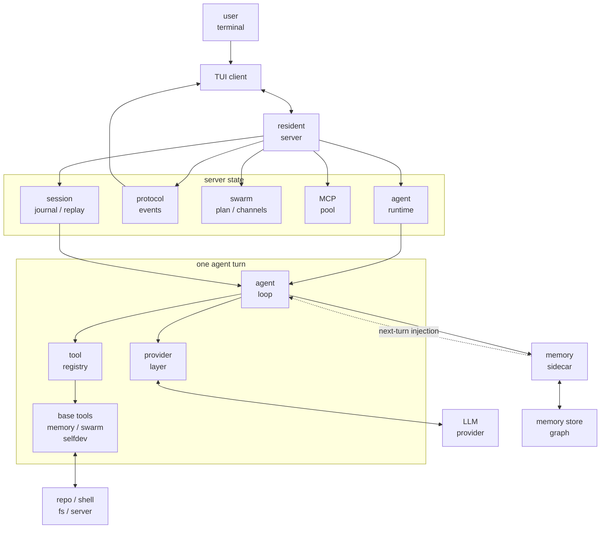

# 00 - Global Map

## What This Course Is About

JCode is best read as a local coding-agent runtime. The model decides what to do next; JCode connects tools, context, permissions, state, and UI around that model.

This course should not force you to jump into the source tree first. Each lesson excerpts the important code and explains where it sits in the runtime.

## Architecture Map

Keep three boundaries from this diagram:

- `TUI client` can exit and reconnect; long-lived state belongs to the `resident server`.
- `agent loop` does not understand each model platform directly; it receives normalized events through the `provider layer`.
- `tool registry` is not only basic coding tools. Memory, swarm, and self-dev also enter the model-operable surface through tools.

## How The Ten Lessons Connect

| Lesson | Topic | Where It Sits |
| --- | --- | --- |
| [s01](./s01-harness-mindset.md) | Boundary between model and harness | How to read the whole diagram |
| [s02](./s02-startup-server.md) | How `jcode` starts server/client | `TUI client`, `resident server` |
| [s03](./s03-agent-loop.md) | Model output, tool call, tool result loop | `agent loop` |
| [s04](./s04-tool-system.md) | Tool schema and execution entrypoint | `tool registry` |
| [s05](./s05-provider-session.md) | Why provider/auth/session are complex | `provider layer`, `session` |
| [s06](./s06-tui-observability.md) | How TUI turns runtime state into user judgment | `protocol events`, `TUI client` |
| [s07](./s07-memory.md) | Why memory is a non-blocking sidecar | `memory sidecar` |
| [s08](./s08-swarm.md) | Why swarm is server-level coordination | `swarm state / channels` |
| [s09](./s09-ambient-selfdev.md) | Ambient and self-dev background boundaries | `scheduler`, `selfdev tool`, `reload` |
| [s10](./s10-comparison.md) | JCode boundaries among coding-agent runtimes | Return to the full diagram |

## Four Lines To Track

The first line is control flow. After the `jcode` command starts, control moves from the binary entrypoint to CLI startup, then to server/client. Understand this first, and the server-owned state starts making sense.

The second line is model request flow. Session history is shaped by the agent loop, paired with tools and split prompts, then sent to the provider. Provider streams return as internal events: text, tool call, usage, error.

The third line is tool execution. The model sees tool definitions; runtime execution goes through the registry. The registry decides availability, alias resolution, truncation, and how results return to the next model turn.

The fourth line is long-running behavior. Session, memory, swarm, ambient, and self-dev are not normal chat-demo features. They handle state, recovery, coordination, and self-update for a local agent that keeps working over time.

## At This Point, You Can Say

- Why JCode is not a thin CLI wrapper.
- Why server, provider, session, and tool registry need separate boundaries.
- Why memory and swarm both belong in the server/runtime view.
- Why later lessons keep asking where state lives and when it enters model context.
