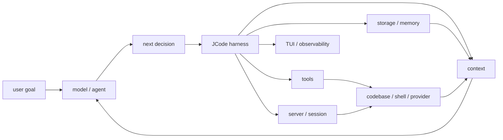

# s01 - Harness Mindset

## The Point

JCode is not a "chat wrapper written in Rust." It is a coding-agent harness.

This has to be clear before you read the source. Otherwise, a lot of the repository will look unrelated to LLMs: server, socket, TUI, OAuth, provider catalog, session journal, memory, MCP, swarm, reload. These are not side quests. They are the harness.

This lesson does not read implementation yet. It sets the reading angle. If the angle is wrong, you will misread server, TUI, and session code as "extra features."

## Agent vs Harness

This follows the core stance from `learn-claude-code`: the model is the agent. The model decides what to do next. The surrounding code provides the environment.

```text
Agent product = Model + Harness

Harness = Tools
        + Context
        + Runtime
        + UI
        + Storage
        + Permissions
        + Provider integration
        + Memory
```



This diagram shows the course stance: the model decides; JCode provides the action environment, context, state, and observability.

For a coding agent:

- Tools are the hands: read files, write files, edit files, run commands.
- Context is the eyes: messages, file snippets, logs, diffs, tool results.
- Runtime is the body: processes, server, sessions, background tasks.
- UI is the cockpit: streaming output, tool status, diffs, side panels.
- Storage is recovery: session history, journals, config, accounts.
- Permissions are boundaries: which commands can run and which files can be written.
- Provider integration is the engine adapter: Claude, OpenAI, Gemini, Copilot, OpenRouter, OpenAI-compatible endpoints.
- Memory is long-term experience: preferences, project facts, old session clues.

## Why JCode Is Worth Studying

If you only want the minimal agent loop, JCode is too large. Start with pi-mono or `Learn-OpenClaw`.

JCode is worth studying because it shows product-grade complexity:

```text
Toy agent:
LLM + tools + loop

Long-running coding-agent harness:
LLM + tools + loop
  + server
  + session
  + provider
  + auth
  + cache
  + compaction
  + memory
  + UI
  + permissions
  + coordination
  + recovery
```

That is the learning value.

## Relationship to Reference Projects

### Learn-OpenClaw

`Learn-OpenClaw` is better for quickly building agent intuition. It explains Node, Workflow, Agent, Tool, MCP, and Skill very directly.

This JCode course does not copy the one-day pacing, but it keeps the practical style: each lesson tells you which files to read, which questions to ask, and what conclusion to keep.

### learn-claude-code

`learn-claude-code` is valuable because its stance is clear: do not confuse prompt plumbing with agents; learn harness engineering.

This course keeps that stance. JCode is not code that makes a model intelligent. It is an environment that lets an already capable model act safely and persistently in a codebase.

### pi-mono

pi is valuable because it is small. It shows that `read/write/edit/bash` is enough to build a useful coding agent.

JCode is valuable because it is large. It shows what happens when the harness needs multi-provider support, sessions, memory, swarm, UI, and self-dev.

### OpenCode

OpenCode and JCode are both open-source coding agents with client/server thinking. OpenCode feels more like an open platform. JCode feels more like a high-performance local runtime.

## What to Keep From This Lesson

Use this sentence to calibrate the rest of the course:

```text
The model is the agent. JCode is the harness that lets the model act inside a codebase.
```

That sentence changes how you read the source:

- `src/tool/` is not a plugin pile. It is the model's hands.
- `src/server/` is not an extra service. It is the runtime for long-running sessions and multiple clients.
- `src/provider/` is not a thin API wrapper. It adapts different model platforms.
- `src/tui/` is not a skin. It is the cockpit where the user judges agent state.
- `src/memory*` is not a normal RAG demo. It is recall built from long-term use.

A good reading also tracks cost. A resident server reuses state, but it also brings reload, socket, and lifecycle management. Most major JCode designs have this shape: benefit and cost together.

## What You Should Be Able To Explain

- Why this course says "the model is the agent; JCode is the harness."
- Why server, TUI, session, and memory are not side features.
- Why JCode is not the best first project for learning a minimal agent loop.
- Why this course primarily follows `learn-claude-code`'s harness stance instead of copying `Learn-OpenClaw`'s one-day pacing.

## How to Read This Course

The rest of the course will not stop at file lists. Each lesson follows a source path: which file to open first, which function or struct to inspect, what signal to take from it, and why the next file follows.

On the first pass, do not read too much. For startup, only trace `main()`, `jcode::run()`, `cli::startup::run()`, `dispatch::run_main()`, `spawn_server()`, and `Server::run()`. First understand how control moves. Then come back for swarm, ambient, debug sockets, and reload.

The agent loop works the same way. First trace the normal path inside `run_turn()`: prepare messages and tools, call the provider stream, collect a tool call, execute the tool, and write the tool result into the next turn. Once that path is clear, read compaction, memory, native tools, and soft interrupts.

There is no separate task area in this course. The important judgments are written directly into the lessons because the value of a source walkthrough is knowing why a function sits where it sits.
