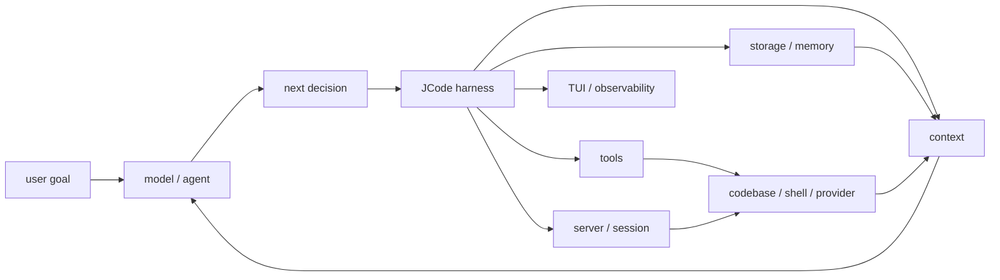

# s01 - Harness Mindset

## The Point

JCode is not a "chat wrapper written in Rust." It is a coding-agent harness.

This has to be clear before you read the source. Otherwise, a lot of the repository will look unrelated to LLMs: server, socket, TUI, OAuth, provider catalog, session journal, memory, MCP, swarm, reload. These are not side quests. They are the harness.

This lesson does not read implementation yet. It sets the reading angle. If the angle is wrong, you will misread server, TUI, and session code as "extra features."

## Agent vs Harness

This course starts from one judgment: the model is the agent. The model decides what to do next. The surrounding code provides the environment.

```text
Agent product = Model + Harness

Harness = Tools
        + Context
        + Runtime
        + UI
        + Storage
        + Permissions
        + Provider integration
        + Memory
```



This diagram shows the course stance: the model decides; JCode provides the action environment, context, state, and observability.

For a coding agent:

- Tools are the hands: read files, write files, edit files, run commands.
- Context is the eyes: messages, file snippets, logs, diffs, tool results.
- Runtime is the body: processes, server, sessions, background tasks.
- UI is the cockpit: streaming output, tool status, diffs, side panels.
- Storage is recovery: session history, journals, config, accounts.
- Permissions are boundaries: which commands can run and which files can be written.
- Provider integration is the engine adapter: Claude, OpenAI, Gemini, Copilot, OpenRouter, OpenAI-compatible endpoints.
- Memory is long-term experience: preferences, project facts, old session clues.

## Why JCode Is Worth Studying

If you only want the minimal agent loop, JCode is too large. It is a second-stage project: you already know what a loop and tool call are, and now you want to see how a long-running runtime handles real complexity.

JCode is worth studying because it shows product-grade complexity:

```text
Toy agent:
LLM + tools + loop

Long-running coding-agent harness:
LLM + tools + loop
  + server
  + session
  + provider
  + auth
  + cache
  + compaction
  + memory
  + UI
  + permissions
  + coordination
  + recovery
```

That is the learning value.

## Where JCode Sits

### Distance From A Minimal Harness

pi is valuable because it is small. It shows that `read/write/edit/bash` is enough to build a useful coding agent.

JCode is valuable because it is large. It shows what happens when the harness needs multi-provider support, sessions, memory, swarm, UI, and self-dev.

### Distance From Platform-Style Coding Agents

OpenCode and JCode are both open-source coding agents with client/server thinking. OpenCode feels more like an open platform. JCode feels more like a high-performance local runtime.

### Distance From Closed Products

Products such as Claude Code provide public behavioral reference points: tools, permissions, subagents, skills, and long-running work. This course does not discuss or depend on non-public source code. We read JCode.

## What to Keep From This Lesson

Use this sentence to calibrate the rest of the course:

```text
The model is the agent. JCode is the harness that lets the model act inside a codebase.
```

That sentence changes how you read the source:

- `src/tool/` is not a plugin pile. It is the model's hands.
- `src/server/` is not an extra service. It is the runtime for long-running sessions and multiple clients.
- `src/provider/` is not a thin API wrapper. It adapts different model platforms.
- `src/tui/` is not a skin. It is the cockpit where the user judges agent state.
- `src/memory*` is not a normal RAG demo. It is recall built from long-term use.

A good reading also tracks cost. A resident server reuses state, but it also brings reload, socket, and lifecycle management. Most major JCode designs have this shape: benefit and cost together.

## What You Should Be Able To Explain

- Why this course says "the model is the agent; JCode is the harness."
- Why server, TUI, session, and memory are not side features.
- Why JCode is not the best first project for learning a minimal agent loop.
- Why JCode is better read as a long-running runtime than as a one-day demo.

## How to Read This Course

The rest of the course should not make you jump between the IDE and the lesson. Each lesson excerpts the important source directly and explains function boundaries, state flow, and tradeoffs. Paths mark source provenance; they are not homework.

For startup, the first pass only needs the control path: `main()` hands off to `jcode::run()`, CLI startup prepares the process, the default command ensures a server exists, and the client connects to the long-running runtime. The lesson excerpts that path instead of asking you to browse all of `src/server/` first.

The agent loop uses the same approach. You first see the normal path in the lesson: prepare messages and tools, call the provider stream, collect a tool call, execute the tool, and write the tool result into the next turn. Compaction, memory, native tools, and soft interrupts are explained in their own lessons instead of being left as file names.

There is no separate task area in this course. The important judgments are written directly into the lessons because the value of a source walkthrough is knowing why a function sits where it sits.
