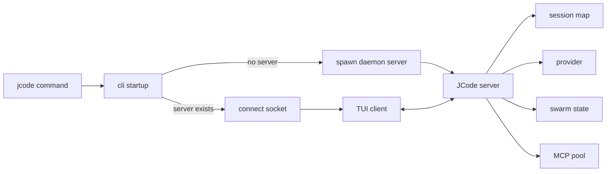

# s02 - Startup and Resident Server

## Goal

Understand what happens after the `jcode` command starts.

The startup path is the first key to the project. JCode does not create one isolated CLI process per run. It connects to or starts a local server.

## Startup Diagram

Compress the lesson into this diagram first:



JCode does not keep all state inside the TUI client because clients can disconnect, restart, and reconnect. Sessions, providers, MCP pools, and swarm state live in the server so long-running work and multiple clients can survive. The cost is that the server must handle lifecycle, sockets, reload, and state recovery.

## Read First

```text
src/main.rs
src/lib.rs
src/cli/startup.rs
src/cli/dispatch.rs
src/server.rs
src/server/runtime.rs
docs/SERVER_ARCHITECTURE.md
docs/MULTI_SESSION_CLIENT_ARCHITECTURE.md
```

Do not start by reading all of `src/server/`. Trace the startup path first. Otherwise client lifecycle, swarm, comms, debug sockets, and reload all arrive at once.

## How to Read These Files

Start with `src/main.rs` and only read `main()`. Do not look for product logic here. It configures the allocator, builds a tokio multi-thread runtime, and `block_on(jcode::run())`. Stop there. The entrypoint has already handed control away.

Then open `src/lib.rs` and read `run()`. It is a single handoff to `cli::startup::run().await`. That tells you the crate root is not the real startup logic. The CLI layer is.

Next read `src/cli/startup.rs::run()`. Follow the order: startup profile, panic hook, logging, permission hardening, perf, telemetry, `parse_and_prepare_args()`, then `dispatch::run_main(args)`. The point is that startup prepares the process. It does not decide how the agent runs.

Now move to `src/cli/dispatch.rs`. Start with `run_main()` and its `match args.command`. If the command is `serve`, it initializes the provider, builds `server::Server::new(provider)`, and calls `server.run().await`. If there is no explicit command, keep reading into `run_default_command()`.

`run_default_command()` is the important default `jcode` path. First read how it detects the JCode repo and marks a self-dev session. Then read the `server_is_running()`, `wait_for_existing_reload_server()`, and `spawn_server()` sequence. The conclusion should be concrete: normal startup does not immediately create an agent. It first ensures a local server exists.

Then read `spawn_server()` in the same file. Focus on socket path, spawn lock, and the `ProcessCommand` arguments. It starts the same binary with the `serve` subcommand and detaches stdout while keeping stderr. This explains why the first run starts a daemon and the second run mostly connects to a socket.

Finally read `src/server.rs::Server::run()` and `src/server/runtime.rs::ServerRuntime`. `Server::run()` binds main/debug sockets, sets owner-only permissions, clears stale reload markers, starts background tasks, and enters accept loops. `ServerRuntime` carries `sessions`, `provider`, `event_tx`, `swarm_state`, `mcp_pool`, and related state into `handle_client()`. At this point the server is no longer "a background process"; it is the long-running runtime.

Read `docs/SERVER_ARCHITECTURE.md` and `docs/MULTI_SESSION_CLIENT_ARCHITECTURE.md` after the source. Use them to check the diagram you drew from code. Reading docs first can leave you with nouns that you cannot place on functions.

## Core Source Excerpts

The excerpts below come from the current local JCode revision. Some are simplified for explanation. Use them for concepts; use the source tree for exact edits.

Compress the entrypoint into three code fragments. The reader can see how control moves from the binary into CLI startup without opening an IDE.

```rust
// src/main.rs, excerpt
fn main() -> Result<()> {
    configure_system_allocator();

    let runtime = tokio::runtime::Builder::new_multi_thread()
        .enable_all()
        .build()?;

    runtime.block_on(async { jcode::run().await })
}
```

This proves `main()` does not run agent logic. It prepares the Rust process and tokio runtime, then hands off to `jcode::run()`.

```rust
// src/lib.rs, excerpt
pub async fn run() -> Result<()> {
    cli::startup::run().await
}
```

This is even more direct: the crate root is a handoff. Real startup behavior lives in `src/cli/startup.rs`.

```rust
// src/cli/startup.rs, simplified
pub async fn run() -> Result<()> {
    startup_profile::init();
    terminal::install_panic_hook();
    logging::init();
    storage::harden_user_config_permissions();
    perf::init_background();
    telemetry::record_install_if_first_run();

    let args = parse_and_prepare_args()?;
    spawn_background_update_check(&args);
    dispatch::run_main(args).await?;
    Ok(())
}
```

This shows the boundary of `startup`: process setup and argument preparation. It does not create agents, execute tools, or render TUI. It hands `Args` to `dispatch`.

The default startup branch is in `src/cli/dispatch.rs`:

```rust
// src/cli/dispatch.rs, excerpt
if !server_running {
    maybe_prompt_server_bootstrap_login(&args.provider).await?;
    spawn_server(
        &args.provider,
        args.model.as_deref(),
        args.provider_profile.as_deref(),
    )
    .await?;
}

tui_launch::run_tui_client(
    args.resume,
    startup_hints,
    !server_running,
    args.fresh_spawn,
)
.await?;
```

This code explains JCode's startup model: the default command does not create a local agent and start chatting. It first ensures a server exists, then starts a TUI client that connects to it.

The server-side state is visible from the runtime struct:

```rust
// src/server/runtime.rs, field excerpt
struct ServerRuntime {
    sessions: Arc<RwLock<HashMap<String, Arc<Mutex<Agent>>>>>,
    event_tx: broadcast::Sender<ServerEvent>,
    provider: Arc<dyn Provider>,
    client_connections: Arc<RwLock<HashMap<String, ClientConnectionInfo>>>,
    swarm_state: SwarmState,
    shared_context: Arc<RwLock<HashMap<String, HashMap<String, SharedContext>>>>,
    mcp_pool: Arc<OnceCell<Arc<SharedMcpPool>>>,
    shutdown_signals: Arc<RwLock<HashMap<String, InterruptSignal>>>,
}
```

This is not a thin proxy. `sessions`, `provider`, `swarm_state`, and `mcp_pool` live in the server runtime, so long-running sessions, multiple clients, MCP, and swarm depend on the resident process.

## Startup Path

Simplified:

```text
jcode
  -> src/main.rs
  -> jcode::run()
  -> cli::startup::run()
  -> check for local JCode server
  -> start daemon server if none exists
  -> TUI client connects to server socket
  -> server owns sessions/provider/MCP/swarm/events
```

This is the difference between JCode and many one-shot CLI agents.

## Why Have a Server

Without a server, each terminal starts a full agent process. That is simple, but multi-session usage becomes heavy and state reuse is poor.

The JCode server handles:

- multiple sessions
- provider state
- MCP shared pool
- swarm runtime
- UI event broadcast
- client reconnect
- `/reload` continuation

Think of the client as display and keyboard. The server is where the agent runtime lives.

Remember the cost: the server must handle disconnects, reconnects, idle timeout, reload, and state persistence. JCode does not add a server because it sounds nicer. It trades complexity for long-running session behavior.

## Fields Worth Reading in `ServerRuntime`

In `src/server/runtime.rs`, look at:

```text
sessions
event_tx
provider
client_connections
swarm_state
shared_context
file_touches
channel_subscriptions
mcp_pool
shutdown_signals
soft_interrupt_queues
```

These fields show that the server is not just a message proxy. It is the center of sessions, coordination, tools, and UI events.

## What You Should Be Able To Explain

- What is different between the first and second `jcode` run.
- Does the server die immediately when a client exits?
- Why JCode can support multiple clients.
- Why `/reload` needs server participation.
- Why sessions, providers, MCP pools, and swarm state live in the server instead of the TUI client.
