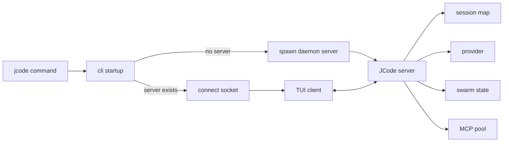

# s02 - Startup and Resident Server

## Goal

Understand what happens after the `jcode` command starts.

The startup path is the first key to the project. JCode does not create one isolated CLI process per run. It connects to or starts a local server.

## Read First

```text
src/main.rs
src/lib.rs
src/cli/startup.rs
src/cli/dispatch.rs
src/server.rs
src/server/runtime.rs
docs/SERVER_ARCHITECTURE.md
docs/MULTI_SESSION_CLIENT_ARCHITECTURE.md
```

## Startup Path

Simplified:

```text
jcode
  -> src/main.rs
  -> jcode::run()
  -> cli::startup::run()
  -> check for local JCode server
  -> start daemon server if none exists
  -> TUI client connects to server socket
  -> server owns sessions/provider/MCP/swarm/events
```

This is the difference between JCode and many one-shot CLI agents.

## Why Have a Server

Without a server, each terminal starts a full agent process. That is simple, but multi-session usage becomes heavy and state reuse is poor.

The JCode server handles:

- multiple sessions
- provider state
- MCP shared pool
- swarm runtime
- UI event broadcast
- client reconnect
- `/reload` continuation

Think of the client as display and keyboard. The server is where the agent runtime lives.

## Fields Worth Reading in `ServerRuntime`

In `src/server/runtime.rs`, look at:

```text
sessions
event_tx
provider
client_connections
swarm_state
shared_context
file_touches
channel_subscriptions
mcp_pool
shutdown_signals
soft_interrupt_queues
```

These fields show that the server is not just a message proxy. It is the center of sessions, coordination, tools, and UI events.

## Questions You Should Answer

After this lesson:

- What is different between the first and second `jcode` run?
- Does the server die immediately when a client exits?
- Why can JCode support multiple clients?
- Why does `/reload` need server participation?
- Why does swarm state live in the server instead of one agent's messages?

## Exercise

Draw the startup path:



Then explain why JCode does not keep all state inside the TUI client.
