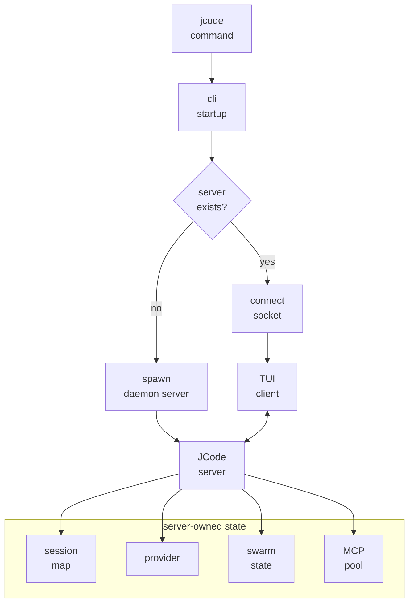

# s02 - Startup and Resident Server

## Start Here

**Short version: `jcode` is not a throwaway CLI process; it connects you to a local server that keeps long-lived state.**

Understand what happens after the `jcode` command starts.

The startup path is the first key to the project. JCode does not create one isolated CLI process per run. It connects to or starts a local server.

## Startup Diagram

Compress the lesson into this diagram first:



JCode does not keep all state inside the TUI client because clients can disconnect, restart, and reconnect. Sessions, providers, MCP pools, and swarm state live in the server so long-running work and multiple clients can survive. The cost is that the server must handle lifecycle, sockets, reload, and state recovery.

## The Line To Follow

The startup control path is short: the binary entrypoint only creates the tokio runtime, the crate root hands off to CLI startup, startup prepares the process, and dispatch chooses either `serve` or the default client path.

The default `jcode` command does not create an agent directly. It first checks whether a server exists. If not, it starts the same binary with the `serve` subcommand; if yes, it connects to the local socket. That is why the first run starts a resident server and later clients can disconnect and reconnect while sessions, providers, MCP pools, and swarm state stay in the server.

The source excerpts below compress this into four pieces: entrypoint handoff, startup preparation, dispatch selection, and server runtime state. After those pieces, the resident-server architecture is visible without browsing the full server tree.

## Core Source Excerpts

The excerpts below come from the current local JCode revision. Some are simplified for explanation. Use them for concepts; use the source tree for exact edits.

Compress the entrypoint into three code fragments. The reader can see how control moves from the binary into CLI startup without opening an IDE.

```rust
// src/main.rs, excerpt
fn main() -> Result<()> {
    configure_system_allocator();

    let runtime = tokio::runtime::Builder::new_multi_thread()
        .enable_all()
        .build()?;

    runtime.block_on(async { jcode::run().await })
}
```

This proves `main()` does not run agent logic. It prepares the Rust process and tokio runtime, then hands off to `jcode::run()`.

```rust
// src/lib.rs, excerpt
pub async fn run() -> Result<()> {
    cli::startup::run().await
}
```

This is even more direct: the crate root is a handoff. Real startup behavior lives in `src/cli/startup.rs`.

```rust
// src/cli/startup.rs, simplified
pub async fn run() -> Result<()> {
    startup_profile::init();
    terminal::install_panic_hook();
    logging::init();
    storage::harden_user_config_permissions();
    perf::init_background();
    telemetry::record_install_if_first_run();

    let args = parse_and_prepare_args()?;
    spawn_background_update_check(&args);
    dispatch::run_main(args).await?;
    Ok(())
}
```

This shows the boundary of `startup`: process setup and argument preparation. It does not create agents, execute tools, or render TUI. It hands `Args` to `dispatch`.

The default startup branch is in `src/cli/dispatch.rs`:

```rust
// src/cli/dispatch.rs, excerpt
if !server_running {
    maybe_prompt_server_bootstrap_login(&args.provider).await?;
    spawn_server(
        &args.provider,
        args.model.as_deref(),
        args.provider_profile.as_deref(),
    )
    .await?;
}

tui_launch::run_tui_client(
    args.resume,
    startup_hints,
    !server_running,
    args.fresh_spawn,
)
.await?;
```

This code explains JCode's startup model: the default command does not create a local agent and start chatting. It first ensures a server exists, then starts a TUI client that connects to it.

The server-side state is visible from the runtime struct:

```rust
// src/server/runtime.rs, field excerpt
struct ServerRuntime {
    sessions: Arc<RwLock<HashMap<String, Arc<Mutex<Agent>>>>>,
    event_tx: broadcast::Sender<ServerEvent>,
    provider: Arc<dyn Provider>,
    client_connections: Arc<RwLock<HashMap<String, ClientConnectionInfo>>>,
    swarm_state: SwarmState,
    shared_context: Arc<RwLock<HashMap<String, HashMap<String, SharedContext>>>>,
    mcp_pool: Arc<OnceCell<Arc<SharedMcpPool>>>,
    shutdown_signals: Arc<RwLock<HashMap<String, InterruptSignal>>>,
}
```

This is not a thin proxy. `sessions`, `provider`, `swarm_state`, and `mcp_pool` live in the server runtime, so long-running sessions, multiple clients, MCP, and swarm depend on the resident process.

## Startup Path

Simplified:

```text
jcode
  -> src/main.rs
  -> jcode::run()
  -> cli::startup::run()
  -> check for local JCode server
  -> start daemon server if none exists
  -> TUI client connects to server socket
  -> server owns sessions/provider/MCP/swarm/events
```

This is the difference between JCode and many one-shot CLI agents.

## Why Have a Server

Without a server, each terminal starts a full agent process. That is simple, but multi-session usage becomes heavy and state reuse is poor.

The JCode server handles:

- multiple sessions
- provider state
- MCP shared pool
- swarm runtime
- UI event broadcast
- client reconnect
- `/reload` continuation

Think of the client as display and keyboard. The server is where the agent runtime lives.

Remember the cost: the server must handle disconnects, reconnects, idle timeout, reload, and state persistence. JCode does not add a server because it sounds nicer. It trades complexity for long-running session behavior.

## Fields Worth Reading in `ServerRuntime`

In `src/server/runtime.rs`, look at:

```text
sessions
event_tx
provider
client_connections
swarm_state
shared_context
file_touches
channel_subscriptions
mcp_pool
shutdown_signals
soft_interrupt_queues
```

These fields show that the server is not just a message proxy. It is the center of sessions, coordination, tools, and UI events.

## Minimal Reproduction

If the resident server/client boundary still feels abstract, read [mini/01_server_client.py](../../mini/01_server_client.py). It keeps one idea: the server owns sessions, and clients can disconnect and reconnect.

This minimal reproduction does not reproduce sockets, TUI, or providers. It uses a few lines to show why session state should not be tied to the client process. After that, the `ServerRuntime` fields in this lesson should have a clearer place.

## At This Point, You Can Say

- What is different between the first and second `jcode` run.
- Does the server die immediately when a client exits?
- Why JCode can support multiple clients.
- Why `/reload` needs server participation.
- Why sessions, providers, MCP pools, and swarm state live in the server instead of the TUI client.
