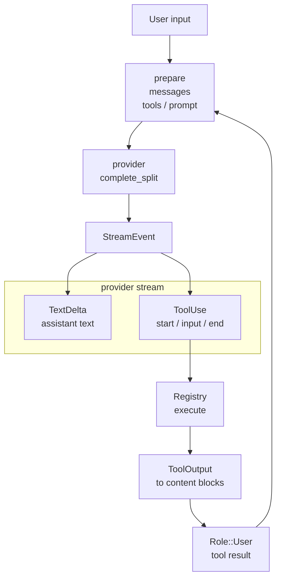

# s03 - Agent Loop

## Start Here

**Short version: however large JCode gets, the main loop is still model asks for a tool, runtime executes it, result returns to context.**

Trace one user input as it becomes:

```text
model output -> tool call -> tool result -> next model input
```

JCode has a lot of surrounding engineering, but the core remains a normal agent loop.

## Minimal Agent Loop

```text
messages
  -> LLM
  -> assistant text or tool_use
  -> execute tool
  -> append tool_result
  -> LLM
  -> ...
```

Do not overcomplicate the loop. The complexity lives around it: cache, compaction, streaming, memory, UI events, and error recovery.



This diagram shows the normal path only: the model streams output, JCode collects a tool call, executes it, and writes the tool result back into the next messages. Compaction, memory, and UI events are engineering around this path.

## The Line To Follow

The normal agent loop has three sections. First, request preparation: repair missing tool results, shape provider messages, build tool definitions, take the previous memory result, and build the split prompt. JCode does not send raw chat history directly to the model.

Second, provider streaming: the model streams text while `ToolUseStart`, `ToolInputDelta`, and `ToolUseEnd` reconstruct a tool call. The important part is not the event names themselves; it is that JCode turns incremental JSON fragments into an executable `ToolCall`.

Third, tool-result feedback: the registry executes the tool, converts the output into provider-compatible `ToolResult` content blocks, and appends that result as the next `Role::User` message. The saved session contains this closed loop, not just assistant text.

## Core Source Excerpts

The excerpts below come from the current local JCode revision. Some are simplified for explanation. Use them for concepts; use the source tree for exact edits.

The first part of `run_turn()` is request preparation, not a model call:

```rust
// src/agent/turn_loops.rs, simplified
loop {
    let repaired = self.repair_missing_tool_outputs();
    let (messages, compaction_event) = self.messages_for_provider();
    let tools = self.tool_definitions().await;

    let memory_pending =
        self.build_memory_prompt_nonblocking_shared(messages.clone(), None);

    let split_prompt = self.build_system_prompt_split(None);

    let mut stream = self.provider.complete_split(
        &messages_with_memory,
        &tools,
        &split_prompt.static_part,
        &split_prompt.dynamic_part,
        self.provider_session_id.as_deref(),
    ).await?;
}
```

This shows that JCode does not simply send chat history to the model. It repairs history, may compact, builds tool definitions, takes the previous memory result, and uses split prompts before calling the provider.

For stream events, first read only the four tool-call branches:

```rust
// src/agent/turn_loops.rs, simplified
match event {
    StreamEvent::TextDelta(text) => {
        text_content.push_str(&text);
    }
    StreamEvent::ToolUseStart { id, name } => {
        current_tool = Some(ToolCall { id, name, input: Value::Null, intent: None });
        current_tool_input.clear();
    }
    StreamEvent::ToolInputDelta(delta) => {
        current_tool_input.push_str(&delta);
    }
    StreamEvent::ToolUseEnd => {
        let tool_input = serde_json::from_str(&current_tool_input)
            .unwrap_or(Value::Null);
        tool.input = tool_input;
        tool_calls.push(tool);
    }
    _ => {}
}
```

This is the relationship between provider streaming and tool calls. The model does not always emit one complete JSON object at once. JCode accumulates input deltas and parses the tool call at `ToolUseEnd`.

Tool execution and result insertion come next:

```rust
// src/agent/turn_loops.rs, excerpt
let result = self.registry.execute(&tc.name, tc.input.clone(), ctx).await;

match result {
    Ok(output) => {
        let blocks = tool_output_to_content_blocks(tc.id, output);
        self.add_message_with_duration(Role::User, blocks, Some(duration_ms));
    }
    Err(e) => {
        self.add_message_with_duration(
            Role::User,
            vec![ContentBlock::ToolResult {
                tool_use_id: tc.id,
                content: format!("Error: {}", e),
                is_error: Some(true),
            }],
            Some(duration_ms),
        );
    }
}
```

This code reconnects the loop: the model emits a tool call, the registry executes it, and the tool result is written back as a `Role::User` message for the next provider call.

Then inspect the conversion helper:

```rust
// src/agent/tools.rs, excerpt
pub(super) fn tool_output_to_content_blocks(
    tool_use_id: String,
    output: ToolOutput,
) -> Vec<ContentBlock> {
    let mut blocks = vec![ContentBlock::ToolResult {
        tool_use_id,
        content: output.output,
        is_error: None,
    }];

    for img in output.images {
        blocks.push(ContentBlock::Image {
            media_type: img.media_type,
            data: img.data,
        });
    }

    blocks
}
```

This shows that tool results are not text-only. Tools can return images, and JCode turns all of it into provider-readable content blocks.

## What One JCode Turn Does

Inside `run_turn()`, roughly:

1. Repairs missing tool outputs so the provider accepts the history.
2. Builds provider messages and compacts when needed.
3. Builds tool definitions.
4. Takes the memory prompt computed from the previous turn.
5. Builds a split system prompt.
6. Calls provider `complete_split()`.
7. Parses stream events.
8. Collects tool calls.
9. Executes tools.
10. Converts tool output into content blocks.
11. Continues the loop if more tool calls exist.

This is the core path.

## Why Split the System Prompt

JCode splits the prompt into static and dynamic parts because some providers have prompt caching. Stable static content gives better cache hits.

Memory, time, and dynamic state should not be mixed into the static prefix. They would break cache stability.

This is a good example of harness engineering. A demo only cares whether the model answers. A harness cares about long-term latency and cost.

## Why Memory Appears Here

You will see memory injection in the turn loop. JCode memory is not a blocking query before every model call. It is closer to:

```text
turn N context -> background memory query
query result -> injected into turn N+1
```

This keeps the main agent responsive.

This is a tradeoff. Memory is not always maximally fresh in the same turn, but interaction latency stays stable.

## How Tool Result Returns to the Model

Tools return `ToolOutput`. Then `tool_output_to_content_blocks()` turns it into provider-compatible content blocks.

Trace:

```text
StreamEvent::ToolUseStart
  -> ToolCall
  -> Registry::execute()
  -> ToolOutput
  -> tool_output_to_content_blocks()
  -> Message
  -> next provider call
```

## One Tool Call Path

When reading `ls` or `read`, follow this path:

```text
How does the model see this tool definition?
How does the model issue the tool call?
How does JCode parse tool input?
Where does the tool execute?
How does the tool result enter the next messages?
```

Mapped to source, it is roughly:

```text
Registry::definitions()
  -> provider complete_split()
  -> StreamEvent::ToolUseStart / ToolInputDelta / ToolUseEnd
  -> Registry::execute()
  -> Tool::execute()
  -> ToolOutput
  -> tool_output_to_content_blocks()
  -> next provider messages
```

Remembering "JCode supports tool calling" is too vague. The point is how functions and data structures connect.

## Minimal Reproduction

For the provider-stream part of the agent loop, compare [mini/03_provider_stream.py](../../mini/03_provider_stream.py). It keeps only text delta, tool use start, tool input delta, and tool use end.

This minimal reproduction isolates the part where the model streams JSON tool input over time. Real JCode handles more events, errors, usage, native tool calls, and session persistence, but the core is still: assemble stream fragments into an executable tool call, then feed the tool result into the next messages.

## At This Point, You Can Say

- Why `run_turn()` prepares messages, tools, memory, and split prompts before calling the provider.
- How `ToolUseStart`, `ToolInputDelta`, and `ToolUseEnd` become one `ToolCall`.
- Why `Registry::execute()` output must become `ContentBlock::ToolResult`.
- Why memory uses a pending result from the previous turn instead of synchronous retrieval every turn.
