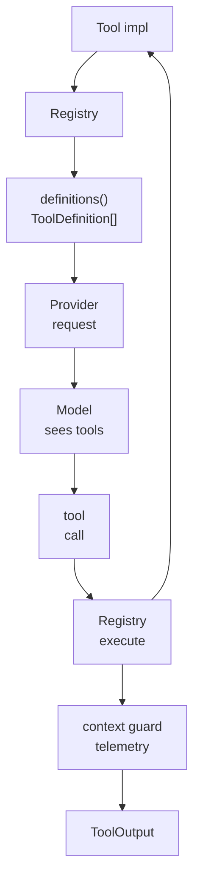

# s04 - Tool System

## Start Here

**Short version: tool complexity is not the number of tools; it is keeping schema, execution, permission, truncation, and events behind one registry boundary.**

Understand how JCode gives tools to the model.

The tool system is the core of a coding-agent harness. Without tools, the model can only chat. With tools, it can read code, edit code, run tests, search history, and coordinate with other agents.



This diagram puts the two tool paths together: `definitions()` exposes schemas to the model, while `execute()` is the runtime entrypoint. Both start from the `Tool` trait and `Registry`.

## The Line To Follow

Start from the contract: every tool exposes model-visible schema and runtime execution. That is the point of the `Tool` trait. The model sees `ToolDefinition`; execution goes through the registry.

The registry is not a plain map. It owns base tools, session-specific tools, the skill registry, compaction-related state, allowed-tool filtering, alias resolution, telemetry, errors, and output truncation. The excerpts below show those layers directly so the reader does not have to assemble them from many tool files.

JCode puts basic coding tools and harness tools in the same system. `read/write/edit/bash/grep/ls` are the hands; `memory/selfdev/swarm/side_panel/mcp` are environment capabilities. This unified registry is what lets the agent loop turn a model tool call into real behavior.

## Core Source Excerpts

The excerpts below come from the current local JCode revision. Some are simplified for explanation. Use them for concepts; use the source tree for exact edits.

The contract matters before any concrete tool:

```rust
// src/tool/mod.rs, excerpt
pub trait Tool: Send + Sync {
    fn name(&self) -> &str;
    fn description(&self) -> &str;
    fn parameters_schema(&self) -> Value;
    async fn execute(&self, input: Value, ctx: ToolContext) -> Result<ToolOutput>;

    fn to_definition(&self) -> ToolDefinition {
        ToolDefinition {
            name: self.name().to_string(),
            description: self.description().to_string(),
            input_schema: self.parameters_schema(),
        }
    }
}
```

This puts both sides of a tool in one place: `to_definition()` is for the model, `execute()` is for the runtime. Many demos blur these together; JCode separates provider schema from execution.

`Registry::base_tools()` shows the model's default hands:

```rust
// src/tool/mod.rs, simplified
fn base_tools(skills: &Arc<RwLock<SkillRegistry>>) -> HashMap<String, Arc<dyn Tool>> {
    static BASE: OnceLock<HashMap<String, Arc<dyn Tool>>> = OnceLock::new();
    let base = BASE.get_or_init(|| {
        let mut m = HashMap::new();
        insert(&mut m, "read", ReadTool::new());
        insert(&mut m, "write", WriteTool::new());
        insert(&mut m, "edit", EditTool::new());
        insert(&mut m, "bash", BashTool::new());
        insert(&mut m, "memory", MemoryTool::new());
        insert(&mut m, "swarm", CommunicateTool::new());
        insert(&mut m, "selfdev", SelfDevTool::new());
        m
    });
    let mut tools = base.clone();
    insert(&mut tools, "skill_manage", SkillTool::new(skills.clone()));
    tools
}
```

This is simplified, but it shows the structure: basic coding tools and harness-level tools live in the same registry. `OnceLock` means the stateless base tool set is cached instead of rebuilt for every session.

Session-specific tools are inserted separately:

```rust
// src/tool/mod.rs, excerpt
let mut tools_map = Self::base_tools(&skills);

Self::insert_tool(
    &mut tools_map,
    "subagent",
    task::SubagentTool::new(provider, registry.clone()),
);
Self::insert_tool(
    &mut tools_map,
    "batch",
    batch::BatchTool::new(registry.clone()),
);
Self::insert_tool(
    &mut tools_map,
    "conversation_search",
    conversation_search::ConversationSearchTool::new(compaction),
);
```

`subagent` needs the provider, `batch` needs the registry, and `conversation_search` needs compaction state. They cannot be globally cached like `read`. This is the boundary between base capabilities and session capabilities.

The execution entrypoint closes the loop:

```rust
// src/tool/mod.rs, excerpt
pub async fn execute(&self, name: &str, input: Value, ctx: ToolContext)
    -> Result<ToolOutput>
{
    let resolved_name = Self::resolve_tool_name(name);
    let tool = tools.get(resolved_name)
        .ok_or_else(|| anyhow!("Unknown tool: {}", name))?
        .clone();

    let result = tool.execute(input.clone(), ctx).await;
    telemetry::record_tool_execution(resolved_name, &input, result.is_ok(), latency_ms);

    let output = result?;
    Ok(self.guard_context_overflow(name, output).await)
}
```

The registry is not just a lookup table. It handles aliases, telemetry, errors, and context truncation. The more tools you have, the more this layer matters.

## Tool Trait

JCode tools implement a shared `Tool` trait:

```text
name()
description()
parameters_schema()
execute(input, ctx)
```

This interface solves four problems:

- The model can see tool names and descriptions.
- The provider can see JSON schemas.
- The runtime can execute tools.
- UI and telemetry can observe calls.

## Tool Groups

### Basic Coding Tools

```text
read
write
edit
multiedit
patch
apply_patch
glob
grep
ls
bash
open
```

These are the basic actions a coding agent needs.

### Enhanced Tools

```text
agentgrep
browser
webfetch
websearch
codesearch
lsp
side_panel
session_search
conversation_search
```

These are not mandatory for a minimal agent, but they reduce context-hunting and make the runtime easier to observe.

Do not judge this section by tool count. More tools can pollute prompts, overflow context, or make the model choose the wrong action. JCode's real topic here is tool governance.

### Harness-Level Tools

```text
subagent
batch
swarm
memory
goal
todo
mcp
skill_manage
schedule
selfdev
```

These are no longer simple function calls. They operate on JCode runtime capabilities.

## What the Registry Does

`Registry::base_tools()` registers base tools. Notice:

- `OnceLock` caches base tools to reduce per-session initialization cost.
- `skill_manage` needs the skills registry, so it is inserted separately.
- `subagent`, `batch`, and `conversation_search` are session-specific because they need provider or registry references.
- Tool definitions are sorted by name to reduce prompt-cache churn.
- Tool outputs go through a context guard to avoid context overflow.
- MCP tools can be dynamically registered after background connection.

This is where JCode differs from toy demos. With many tools, the problem is no longer "how do I call a function?" The problem becomes "how do I govern a tool ecosystem?"

## Difference From pi-mono

pi is more restrained by default: `read/write/edit/bash` can already do a lot.

JCode is more expansive: it keeps strong base tools, but also exposes memory, MCP, subagent, swarm, and side-panel capabilities as tools.

This is a target difference:

```text
pi: minimal effective coding harness
JCode: long-running multi-session local agent runtime
```

You should be able to name the cost: pi is small and easy to modify; JCode is larger and has to handle caching, truncation, dynamic registration, permissions, and UI state.

## Minimal Reproduction

For the tool registry, compare [mini/02_tool_registry.py](../../mini/02_tool_registry.py). It keeps one registry that produces model-visible definitions and runtime execution.

This minimal reproduction fixes two boundaries: the model sees name, description, and schema; runtime calls the handler. JCode's `Registry` is more complex, but most of that complexity is added around allowed tools, aliases, telemetry, context guards, and session-specific tools.

## What a Small Modification Looks Like

If you add a beginner-friendly JCode tool, `repo_summary` is a good example. It is read-only and returns:

```text
branch:
latest commit:
top-level dirs:
tracked file count:
```

This example shows the boundaries of tool design:

- Do not write files.
- Do not access the network.
- Keep output short.
- Register it in the tool registry.
- Make it callable by the model before touching TUI.

It fits this tutorial better than a weather API tool because it walks the real coding-harness path: schema, registry, execute, tool result, context truncation. Starting with a widget turns a tool task into a UI task too early.

## At This Point, You Can Say

- Which `Tool` trait methods are for the model and which are for runtime execution.
- Why `base_tools()` can be cached while tools such as `subagent` need session-specific registration.
- Why `definitions()` sorts tool definitions by name.
- Why tool output must pass through a context guard before returning to the model.
