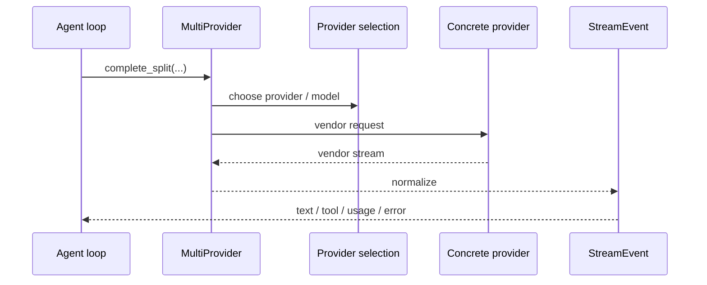

# s05 - Provider, Auth, Session

## Start Here

**Short version: providers flatten different model platforms into one stream, while sessions make separate turns recoverable as one long record.**

Understand how JCode connects different model platforms and long-running sessions.

Many agent demos reduce the provider layer to one API call. In a real product, provider integration becomes a large piece of engineering.



This diagram shows the provider layer's job: the agent loop should not understand every private provider stream format. `MultiProvider` and concrete providers normalize those formats into `StreamEvent`.

## The Line To Follow

The provider narrow waist is the `Provider` trait: inside JCode, requests have one shape, with messages, tools, system prompt, and a normalized `StreamEvent` output. OpenAI, Claude, Gemini, and Copilot-specific request bodies and streaming formats are absorbed behind that boundary.

`MultiProvider` centralizes provider selection and failover. The agent loop should not scatter `if Claude / if OpenAI` branches. `complete_split()` also separates the stable system prefix from dynamic context to reduce prompt-cache churn.

Auth and session are part of provider engineering. Auth is not just storing an API key; it handles local commands, path discovery, WSL, external login, and terminal handoff. Session is not a chat log; it persists messages, replay events, compaction state, journal entries, and enough renderable state for the TUI and agent to continue.

## Core Source Excerpts

The excerpts below come from the current local JCode revision. Some are simplified for explanation. Use them for concepts; use the source tree for exact edits.

The narrow waist of provider integration is the `Provider` trait:

```rust
// src/provider/mod.rs, excerpt
pub type EventStream =
    Pin<Box<dyn Stream<Item = Result<StreamEvent>> + Send>>;

pub trait Provider: Send + Sync {
    async fn complete(
        &self,
        messages: &[Message],
        tools: &[ToolDefinition],
        system: &str,
        resume_session_id: Option<&str>,
    ) -> Result<EventStream>;

    async fn complete_split(
        &self,
        messages: &[Message],
        tools: &[ToolDefinition],
        system_static: &str,
        system_dynamic: &str,
        resume_session_id: Option<&str>,
    ) -> Result<EventStream> {
        let dynamic_messages =
            messages_with_dynamic_system_context(messages, system_dynamic);
        self.complete(&dynamic_messages, tools, system_static, resume_session_id).await
    }
}
```

This shows the internal shape JCode wants from every provider: `Message`, `ToolDefinition`, system prompt in; `StreamEvent` out. OpenAI, Claude, and Gemini-specific formats should be absorbed behind this trait.

The default `complete_split()` also matters. It moves dynamic system context into a later synthetic message instead of mixing it into the stable system prefix. That protects provider prompt-cache stability.

Provider choice is centralized in `MultiProvider`, not scattered through the agent loop:

```rust
// src/provider/selection.rs, simplified
enum ActiveProvider {
    Claude,
    OpenAi,
    Gemini,
    Copilot,
    OpenRouter,
    OpenAiCompatible,
}

impl MultiProvider {
    fn auto_default_provider(availability: ProviderAvailability) -> ActiveProvider {
        if availability.is_configured(ActiveProvider::Claude) {
            ActiveProvider::Claude
        } else if availability.is_configured(ActiveProvider::OpenAi) {
            ActiveProvider::OpenAi
        } else {
            ActiveProvider::OpenAiCompatible
        }
    }
}
```

This is simplified, but the design is clear: provider selection belongs to the provider layer. The agent loop should not know whether Claude or OpenAI is the current default.

Auth complexity is visible in code too. When JCode runs an external login command, it can hand the terminal out of raw mode and restore it afterward:

```rust
// src/auth/login_flows.rs, excerpt
fn run_external_login_command_inner(
    program: &str,
    args: &[String],
    suspend_raw_mode: bool,
) -> Result<()> {
    let raw_was_enabled =
        suspend_raw_mode && crossterm::terminal::is_raw_mode_enabled().unwrap_or(false);
    if raw_was_enabled {
        let _ = crossterm::terminal::disable_raw_mode();
    }

    let status_result = std::process::Command::new(program).args(args).status();

    if raw_was_enabled {
        let _ = crossterm::terminal::enable_raw_mode();
    }

    let status = status_result
        .with_context(|| format!("Failed to start command: {} {}", program, args.join(" ")))?;
    if !status.success() {
        anyhow::bail!("Command exited with non-zero status: {}", status);
    }
    Ok(())
}
```

This is why auth is not a small config feature. JCode runs inside TUI, SSH, headless, and external CLI login environments. Login flow has to handle real terminal state, not just read one environment variable.

The session storage shape is also worth seeing directly:

```rust
// src/session/model.rs, field excerpt
pub struct StoredMessage {
    pub id: String,
    pub role: Role,
    pub content: Vec<ContentBlock>,
    pub display_role: Option<StoredDisplayRole>,
    pub timestamp: Option<DateTime<Utc>>,
    pub tool_duration_ms: Option<u64>,
    pub token_usage: Option<StoredTokenUsage>,
}

pub struct StoredCompactionState {
    pub summary_text: String,
    pub openai_encrypted_content: Option<String>,
    pub covers_up_to_turn: usize,
    pub original_turn_count: usize,
    pub compacted_count: usize,
}
```

This shows that a session is not a text transcript array. Messages carry structured `ContentBlock`s, display roles, timestamps, tool duration, and usage; compaction has its own summary and coverage state. Resume, replay, and import all depend on these details.

## What the Provider Layer Solves

Providers differ in many ways:

- Authentication: API keys, OAuth, device flow, local callback.
- Stream format.
- Thinking support.
- Tool calling format.
- Prompt cache behavior.
- Provider session ID support.
- Model catalog, context window, pricing.
- Error types and rate limits.

JCode's provider layer normalizes these differences into interfaces and events the runtime can consume.

## Auth Is Not a Side Issue

JCode supports many login targets:

```text
claude
openai
gemini
copilot
azure
openai-compatible
openrouter
lmstudio
ollama
...
```

This is not a one-API-key CLI.

OAuth, account switching, headless login, callback URLs, and pending login state are all practical product problems for coding agents.

If your previous demos only read `OPENAI_API_KEY`, this section may feel verbose. JCode is a long-running local tool: users switch accounts, switch providers, log in over SSH, and resume pending login flows. Prompts do not solve those problems.

## Why Session Matters

A JCode session is not just a chat transcript. It needs:

- resume
- replay
- crash recovery
- import
- render
- multi-client support
- memory profile
- active process tracking

The `StoredMessage` and `StoredCompactionState` excerpts above are only the model layer. Journals append events, rendering turns structured state back into displayable content, and replay/import turn history back into something the agent can continue. This layer determines whether JCode is a long-running tool or a one-shot script.

## Why Session Import Matters

JCode's README mentions resuming sessions from Codex, Claude Code, OpenCode, and pi. That is not just copying text.

Different harnesses have different session shapes:

- message role representation
- tool call ID format
- tool result representation
- attachments/image representation
- provider metadata
- thinking/reasoning preservation

That is why import/session/render is worth reading.

## Two Judgments to Keep

First, session import is not "move the text over." OpenCode, Codex, Claude Code, and pi can represent sessions differently. JCode needs to align at least:

```text
message role
tool call id
tool result
attachments / images
provider metadata
thinking / reasoning
```

Second, provider streams must be normalized into JCode's internal `StreamEvent`. Otherwise the agent loop, TUI, and tool executor would all need provider-specific branches.

```text
Claude/OpenAI/Gemini/Copilot stream events differ.
JCode cannot let turn loop code know every private provider format.
After normalization into StreamEvent, the rest of the agent loop can handle text, thinking, tool input, and tool result consistently.
```

## Minimal Reproduction

The provider-stream path also maps to [mini/03_provider_stream.py](../../mini/03_provider_stream.py). In `s03`, it explains the agent loop. In this lesson, it explains the provider's job: normalize provider-specific streams into events JCode can process.

Real providers also handle auth, model IDs, request bodies, tool schemas, usage, errors, and retry. This minimal reproduction keeps only the normalized stream shape so provider code does not get misread as a thin HTTP wrapper.

The session path maps to [mini/05_session_journal.py](../../mini/05_session_journal.py). It reduces a session to append-only journal events, a rendered view, and replay messages. Real JCode adds compaction, usage, import, active processes, and memory profiles, but the judgment is the same: a session is recoverable structured runtime state, not a chat transcript.

## At This Point, You Can Say

- Why the `Provider` trait normalizes output into `StreamEvent`.
- Why `complete_split()` separates static and dynamic system prompts.
- Why `MultiProvider` should own provider selection and failover.
- Why a session is structured state with content blocks, usage, and compaction, not a plain transcript.
