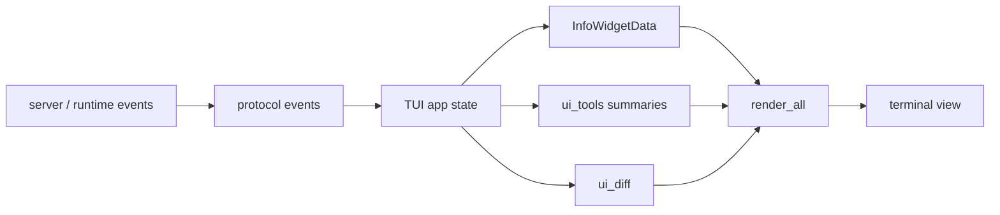
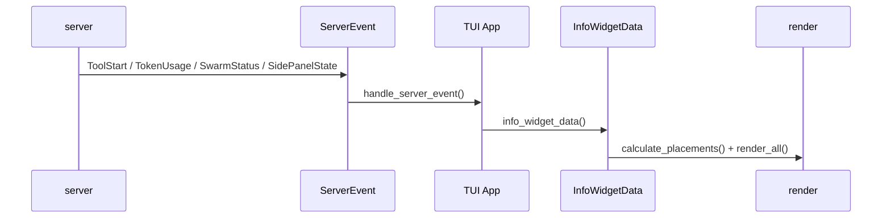

# s06 - TUI and Observability

## Goal

**The One-Line Takeaway: JCode's TUI is a runtime dashboard: server events are written into state before they become signals the user can use to continue, interrupt, or trust the agent.**

Understand why UI is part of the harness.

Many agent projects only care whether the model can finish a task. In real use, the user also needs to know what the agent is doing, what changed, where it is stuck, and how much context or money it is spending.

JCode invests heavily in TUI for this reason.

A UI module belongs to the harness if it changes how the user judges agent state. Tool status, diffs, usage, and memory hits all affect that judgment.



This diagram shows that the TUI is not stdout wrapping. Server/runtime events enter TUI state, become widgets, tool summaries, and diffs, then render into the interface the user uses to judge agent state.



This diagram matters more than a widget inventory. The first TUI question is not how drawing works; it is who translates runtime events into observable state.

## Main Line Covered Here

The TUI path is event to judgment. Server/runtime events enter app state, then become info widgets, tool summaries, diffs, side panels, and streamed text. Users do not see raw protocol; they see state compressed into "can I still trust what this agent is doing?"

Info widgets solve layout and information density. `InfoWidgetData` gathers state, `calculate_placements()` decides where it goes, and `render_all()` renders it consistently. Git, todo, memory, and swarm widgets differ less by drawing code and more by the question they answer for the user.

Tool summaries and diffs are another compression layer. Model tool calls are usually JSON, so the TUI turns them into one-line action summaries. File edits can also infer diff lines from tool input before the final tool result arrives. Side panel goes further: it is a persistent page the model can write, append, focus, and delete, not just a temporary display area.

## Core Source Excerpts

The excerpts below come from the current local JCode revision. Some are simplified for explanation. Use them for concepts; use the source tree for exact edits.

The real TUI boundary is `handle_server_event()`. It rewrites server events into `App` state instead of leaving render code to infer state at the last moment:

```rust
// src/tui/app/remote/server_events.rs, excerpt
pub fn handle_server_event(app: &mut App, event: ServerEvent, remote: &mut impl RemoteEventState)
    -> bool
{
    match event {
        ServerEvent::ToolStart { id, name } => {
            app.pause_streaming_tps(false);
            remote.handle_tool_start(&id, &name);
            app.commit_pending_streaming_assistant_message();
            app.status = ProcessingStatus::RunningTool(name.clone());
            app.streaming_tool_calls.push(ToolCall {
                id,
                name,
                input: serde_json::Value::Null,
                intent: None,
            });
            eager_stream_redraw
        }
        ServerEvent::ToolExec { id, name } => {
            let parsed_input = remote.get_current_tool_input();
            let tool_call = ToolCall {
                id: id.clone(),
                name: name.clone(),
                input: parsed_input.clone(),
                intent: ToolCall::intent_from_input(&parsed_input),
            };
            app.observe_tool_call(&tool_call);
            eager_stream_redraw
        }
        ServerEvent::TokenUsage { input, output, cache_read_input, cache_creation_input } => {
            app.streaming_input_tokens = input;
            app.streaming_output_tokens = output;
            app.streaming_cache_read_tokens = cache_read_input;
            app.streaming_cache_creation_tokens = cache_creation_input;
            eager_stream_redraw
        }
        ServerEvent::SidePanelState { snapshot } => {
            app.set_side_panel_snapshot(snapshot);
            false
        }
        ServerEvent::SwarmStatus { members } => {
            app.remote_swarm_members = members;
            false
        }
        ServerEvent::McpStatus { servers } => {
            app.mcp_server_names = servers
                .iter()
                .filter_map(|s| {
                    let (name, count_str) = s.split_once(':')?;
                    Some((name.to_string(), count_str.parse::<usize>().unwrap_or(0)))
                })
                .collect();
            false
        }
        _ => false,
    }
}
```

This is the hard boundary: the TUI is not passively consuming text. `ToolStart` commits pending assistant text, pauses TPS, updates status, and records the streaming tool call. `ToolExec` turns accumulated JSON input into a `ToolCall` and passes it to `observe_tool_call()`. Usage, side panels, swarm, and MCP all land in app state here.

Render is only the last step. The event handler decides which runtime state can become visible.

`InfoWidgetData` is the second convergence point. It compresses state from session, provider, memory, swarm, ambient, and usage into one renderable snapshot:

```rust
// src/tui/app/tui_state.rs, excerpt
fn info_widget_data(&self) -> crate::tui::info_widget::InfoWidgetData {
    let todos = if self.swarm_enabled && !self.swarm_plan_items.is_empty() {
        self.swarm_plan_items
            .iter()
            .map(|item| crate::todo::TodoItem {
                content: item.content.clone(),
                status: item.status.clone(),
                priority: item.priority.clone(),
                id: item.id.clone(),
                blocked_by: item.blocked_by.clone(),
                assigned_to: item.assigned_to.clone(),
            })
            .collect()
    } else {
        gather_todos_for_session(session_id)
    };

    let memory_info = gather_memory_info(self.memory_enabled);
    let swarm_info = if self.swarm_enabled {
        // remote_swarm_members / local ProcessingStatus become SwarmInfo here
        Some(crate::tui::info_widget::SwarmInfo { /* fields omitted */ })
    } else {
        None
    };
    let usage_info = self.widget_usage_info(self.widget_route_info(model.as_deref()));

    crate::tui::info_widget::InfoWidgetData {
        todos,
        context_info,
        model,
        reasoning_effort,
        service_tier,
        memory_info,
        swarm_info,
        background_info,
        usage_info,
        tokens_per_second,
        provider_name: Some(self.provider.name().to_string()),
        connection_type: self.connection_type.clone(),
        ambient_info: gather_ambient_info(crate::config::config().ambient.enabled),
        cache_hit_info,
        is_compacting,
        git_info,
    }
}
```

This is not the full source, but the shape is enough: widgets should not each rummage through runtime state. JCode prepares `InfoWidgetData`, then layout and render consume it. That keeps a dense TUI coherent.

The info widget entrypoint is layout and unified rendering, not one specific widget:

```rust
// src/tui/info_widget.rs, excerpt
pub fn calculate_placements(
    messages_area: Rect,
    margins: &Margins,
    data: &InfoWidgetData,
) -> Vec<WidgetPlacement> {
    let placements = info_widget_layout::calculate_placements(
        messages_area,
        margins,
        data,
        state.enabled,
        &state.placements,
    );
    state.placements = placements.clone();
    placements
}

pub fn render_all(frame: &mut Frame, placements: &[WidgetPlacement], data: &InfoWidgetData) {
    for placement in placements {
        render_single_widget(frame, placement, data);
    }
}
```

This shows that widgets are not just painted on the right side. JCode computes placement from the message area, margins, and current data, then renders everything through one path. Observability first becomes a layout problem.

Tool summaries have their own compression layer:

```rust
// src/tui/ui_tools.rs, simplified
pub(crate) fn get_tool_summary(tool: &ToolCall) -> String {
    get_tool_summary_with_budget(tool, 50, None)
}

fn get_tool_summary_with_budget(tool: &ToolCall, bash_max_chars: usize, max_width: Option<usize>)
    -> String
{
    match canonical_tool_name(&tool.name) {
        "bash" => format!("$ {}", truncate_command_display(cmd, cmd_budget)),
        "read" => path_summary(tool),
        "grep" => query_summary(tool),
        _ => String::new(),
    }
}
```

This is simplified, but the responsibility is clear: when the model calls a tool, the user should not read raw JSON. The TUI compresses tool name and input into a scannable line.

Diff rendering does not only wait for final tool output:

```rust
// src/tui/ui_diff.rs, excerpt
pub(super) fn generate_diff_lines_from_tool_input(tool: &ToolCall)
    -> Vec<ParsedDiffLine>
{
    match canonical_tool_name(&tool.name) {
        "edit" => {
            let old = tool.input.get("old_string").and_then(|v| v.as_str()).unwrap_or("");
            let new = tool.input.get("new_string").and_then(|v| v.as_str()).unwrap_or("");
            generate_diff_lines_from_strings(old, new)
        }
        "multiedit" => { /* generate diff lines for each edit */ }
        _ => Vec::new(),
    }
}
```

JCode can infer diff lines from tool input before the final file output exists. The user can get early signal about what is being changed.

The side panel is model-operable state, not just a UI component:

```rust
// src/tool/side_panel.rs, excerpt
impl Tool for SidePanelTool {
    fn name(&self) -> &str { "side_panel" }

    fn parameters_schema(&self) -> Value {
        json!({
            "properties": {
                "action": {
                    "enum": ["status", "write", "append", "load", "focus", "delete"]
                }
            },
            "required": ["action"]
        })
    }
}
```

This shows that the side panel is registered as a tool. The model can write, append, load, focus, and delete pages, so it is harness state, not just a frontend surface.

## What the JCode TUI Shows

JCode does not only print assistant text. It also handles:

- tool call summaries
- streaming state
- reasoning/thinking display
- diffs
- side panels
- markdown
- mermaid
- usage
- model/account pickers
- git status
- memory status
- todo status
- swarm/background status

This is harness observability.

## Why Side Panel Matters

The side panel can hold:

- current file
- diff
- plan
- review checklist
- memory hits
- agent-generated auxiliary content

This keeps the user from digging through the main chat stream.

The point is not "one more panel." Chat is good for timeline. Side panels are good for stable current state.

## Why Info Widgets Matter

Info widgets solve the problem of showing state without stealing the main response area. Examples:

- current model
- usage
- git branch
- memory hits
- todos
- swarm status

These details matter, but should not crowd out the main conversation.

## Comparison With OpenCode

OpenCode also cares about UI, but its direction is different. OpenCode also targets Web/Desktop/open-platform surfaces. JCode is more terminal-native, with Ratatui rendering, high terminal information density, and local runtime emphasis.

Both projects show the same lesson: stdout is not enough for a serious coding agent.

## Widget Judgment Standard

To judge whether a widget such as `info_widget_git` or `info_widget_todos` earns its place, use this data path:

```text
Where does the data come from?
Where does it enter state?
Which event updates it?
Where is it rendered?
Why does the user need this information?
```

To judge whether a widget matters, ask: if this were removed, what would the user stop knowing? If you cannot answer, the widget's purpose is not clear enough.

## What You Should Be Able To Explain

- Why TUI is part of the harness rather than a skin.
- Why `handle_server_event()` is the real TUI state boundary.
- What problem `InfoWidgetData` and `calculate_placements()` solve.
- Why tool summaries should not show raw JSON.
- Why the side panel is model-operable state rather than temporary display space.
