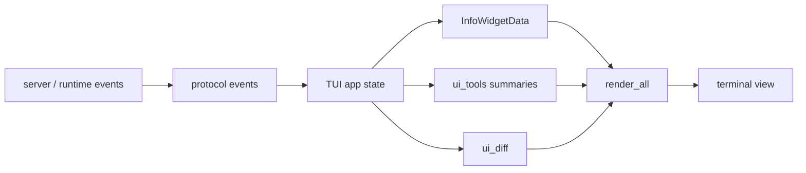

# s06 - TUI and Observability

## Goal

Understand why UI is part of the harness.

Many agent projects only care whether the model can finish a task. In real use, the user also needs to know what the agent is doing, what changed, where it is stuck, and how much context or money it is spending.

JCode invests heavily in TUI for this reason.

A UI module belongs to the harness if it changes how the user judges agent state. Tool status, diffs, usage, and memory hits all affect that judgment.



This diagram shows that the TUI is not stdout wrapping. Server/runtime events enter TUI state, become widgets, tool summaries, and diffs, then render into the interface the user uses to judge agent state.

## Read First

```text
src/tui/
src/side_panel.rs
src/tool/side_panel.rs
crates/jcode-tui-core/
crates/jcode-tui-render/
crates/jcode-tui-markdown/
crates/jcode-tui-mermaid/
```

Do not start by reading all of `src/tui/ui.rs`. Start smaller:

```text
src/tui/info_widget.rs
src/tui/info_widget_git.rs
src/tui/info_widget_memory_render.rs
src/tui/info_widget_todos.rs
src/tui/info_widget_swarm_background.rs
src/tui/ui_tools.rs
src/tui/ui_diff.rs
src/tui/stream_buffer.rs
```

## How to Read These Files

Start with `src/tui/info_widget.rs`, but do not jump into render details. First inspect `WidgetKind`, `InfoWidgetData`, `calculate_placements()`, and `render_all()`. These tell you how JCode decides which state is worth showing, where it goes, and when widgets merge into an overview.

Then pick one small widget and trace the whole path. Start with `src/tui/info_widget_git.rs`, especially `render_git_widget()` and `render_git_compact()`. Git is a good first widget because it does not involve a complicated async protocol. Ask only: what is inside `InfoWidgetData.git`, and what gets removed between compact and expanded views?

Read `src/tui/info_widget_todos.rs` next. Look at `render_todos_widget()`, `render_todos_expanded()`, and `render_todos_compact()`. This shows how a state module makes choices in narrow terminal space: not every todo can be shown fully, so the UI must summarize, truncate, and offer an expanded page.

Then read `src/tui/info_widget_memory_render.rs`. Start with `render_memory_widget()`, then inspect `memory_status_badge()` and `render_memory_pipeline_lines()`. This connects to `s07`: the TUI does not merely show "memory exists"; it shows whether memory is retrieving, extracting, maintaining, or idle.

Read tool display after widgets. Open `src/tui/ui_tools.rs` and inspect `resolve_display_tool_name()`, `canonical_tool_name()`, `get_tool_summary()`, then `summarize_apply_patch_input()` and `summarize_unified_patch_input()`. This explains how JCode compresses many tool calls into summaries the user can scan.

Read diff handling separately in `src/tui/ui_diff.rs`. Start with `diff_change_counts_for_tool()`, then read `generate_diff_lines_from_tool_input()` and `collect_diff_lines()`. You will see that the UI does not always wait for a full diff output; it can infer added/deleted lines from tool input.

Read side panel last. Start with `src/tool/side_panel.rs::SidePanelTool`, especially the action set: `status/write/append/load/focus/delete`. Then jump to `src/side_panel.rs` and read `write_markdown_page()`, `append_markdown_page()`, `focus_page()`, and `snapshot_for_session()`. This path shows that the side panel is a model-operable persistent page, not just a temporary TUI region.

If you want the event path, go back to `src/protocol.rs` and `src/server/runtime.rs`. First know what the UI renders, then inspect how state moves from server/client into that rendering. Reading protocol first makes it hard to judge which events matter to the user.

## Core Source Excerpts

The info widget entrypoint is layout and unified rendering, not one specific widget:

```rust
// src/tui/info_widget.rs, excerpt
pub fn calculate_placements(
    messages_area: Rect,
    margins: &Margins,
    data: &InfoWidgetData,
) -> Vec<WidgetPlacement> {
    let placements = info_widget_layout::calculate_placements(
        messages_area,
        margins,
        data,
        state.enabled,
        &state.placements,
    );
    state.placements = placements.clone();
    placements
}

pub fn render_all(frame: &mut Frame, placements: &[WidgetPlacement], data: &InfoWidgetData) {
    for placement in placements {
        render_single_widget(frame, placement, data);
    }
}
```

This shows that widgets are not just painted on the right side. JCode computes placement from the message area, margins, and current data, then renders everything through one path. Observability first becomes a layout problem.

Tool summaries have their own compression layer:

```rust
// src/tui/ui_tools.rs, simplified
pub(crate) fn get_tool_summary(tool: &ToolCall) -> String {
    get_tool_summary_with_budget(tool, 50, None)
}

fn get_tool_summary_with_budget(tool: &ToolCall, bash_max_chars: usize, max_width: Option<usize>)
    -> String
{
    match canonical_tool_name(&tool.name) {
        "bash" => format!("$ {}", truncate_command_display(cmd, cmd_budget)),
        "read" => path_summary(tool),
        "grep" => query_summary(tool),
        _ => String::new(),
    }
}
```

This is simplified, but the responsibility is clear: when the model calls a tool, the user should not read raw JSON. The TUI compresses tool name and input into a scannable line.

Diff rendering does not only wait for final tool output:

```rust
// src/tui/ui_diff.rs, excerpt
pub(super) fn generate_diff_lines_from_tool_input(tool: &ToolCall)
    -> Vec<ParsedDiffLine>
{
    match canonical_tool_name(&tool.name) {
        "edit" => {
            let old = tool.input.get("old_string").and_then(|v| v.as_str()).unwrap_or("");
            let new = tool.input.get("new_string").and_then(|v| v.as_str()).unwrap_or("");
            generate_diff_lines_from_strings(old, new)
        }
        "multiedit" => { /* generate diff lines for each edit */ }
        _ => Vec::new(),
    }
}
```

JCode can infer diff lines from tool input before the final file output exists. The user can get early signal about what is being changed.

The side panel is model-operable state, not just a UI component:

```rust
// src/tool/side_panel.rs, excerpt
impl Tool for SidePanelTool {
    fn name(&self) -> &str { "side_panel" }

    fn parameters_schema(&self) -> Value {
        json!({
            "properties": {
                "action": {
                    "enum": ["status", "write", "append", "load", "focus", "delete"]
                }
            },
            "required": ["action"]
        })
    }
}
```

This shows that the side panel is registered as a tool. The model can write, append, load, focus, and delete pages, so it is harness state, not just a frontend surface.

## What the JCode TUI Shows

JCode does not only print assistant text. It also handles:

- tool call summaries
- streaming state
- reasoning/thinking display
- diffs
- side panels
- markdown
- mermaid
- usage
- model/account pickers
- git status
- memory status
- todo status
- swarm/background status

This is harness observability.

## Why Side Panel Matters

The side panel can hold:

- current file
- diff
- plan
- review checklist
- memory hits
- agent-generated auxiliary content

This keeps the user from digging through the main chat stream.

The point is not "one more panel." Chat is good for timeline. Side panels are good for stable current state.

## Why Info Widgets Matter

Info widgets solve the problem of showing state without stealing the main response area. Examples:

- current model
- usage
- git branch
- memory hits
- todos
- swarm status

These details matter, but should not crowd out the main conversation.

## Comparison With OpenCode

OpenCode also cares about UI, but its direction is different. OpenCode also targets Web/Desktop/open-platform surfaces. JCode is more terminal-native, with Ratatui rendering, high terminal information density, and local runtime emphasis.

Both projects show the same lesson: stdout is not enough for a serious coding agent.

## How to Read a Widget

When reading `info_widget_git` or `info_widget_todos`, follow this data path:

```text
Where does the data come from?
Where does it enter state?
Which event updates it?
Where is it rendered?
Why does the user need this information?
```

Do not start with the more complex swarm widget. Git and todo widgets have clearer data sources. To judge whether a widget matters, ask: if this were removed, what would the user stop knowing? If you cannot answer, you have not understood the widget.
