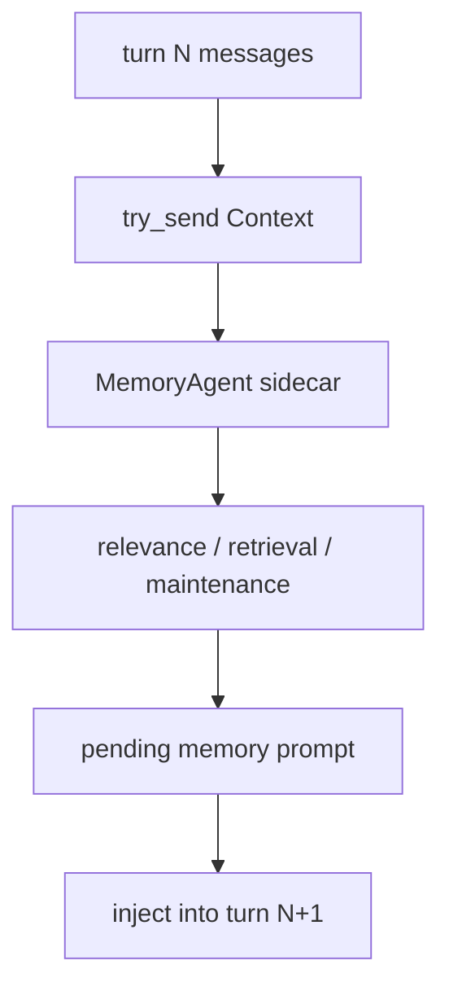
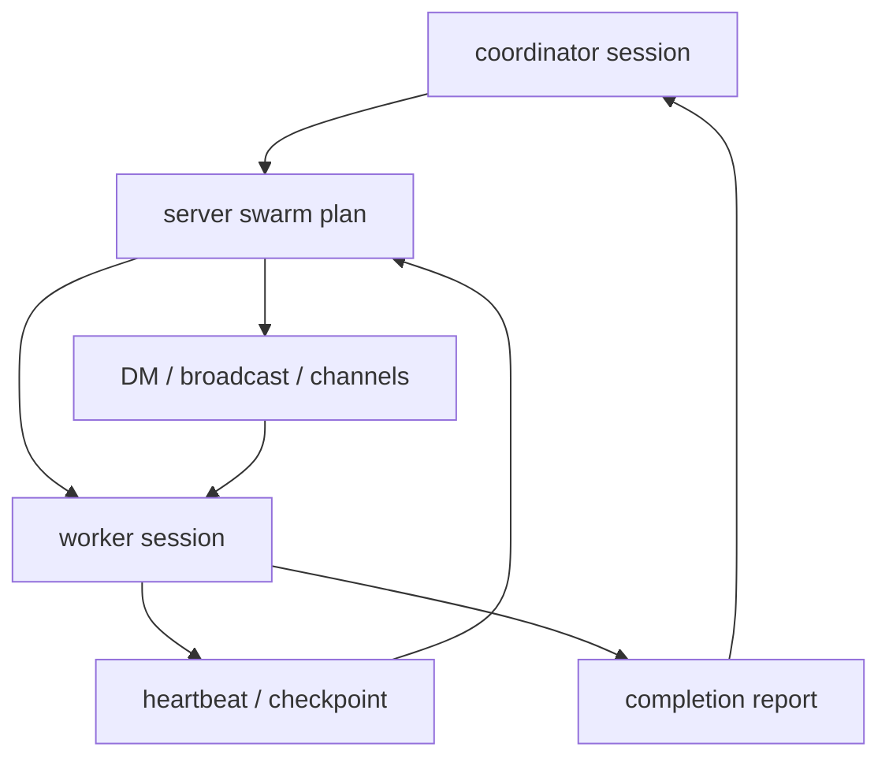
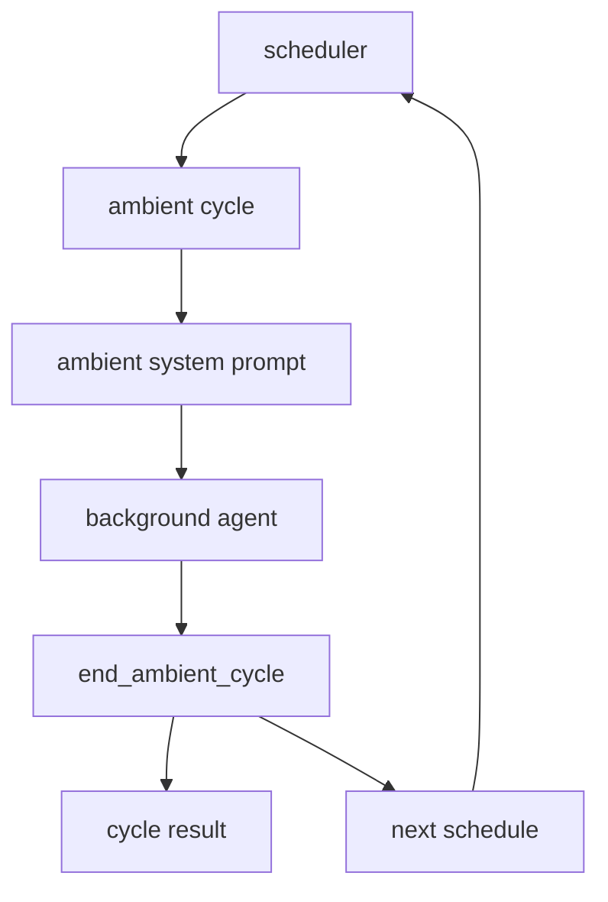
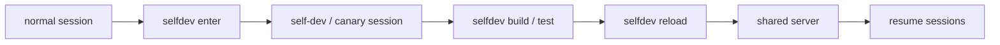

# s07 - Memory, Swarm, Ambient, Self-Dev

## Goal

Read the most distinctive and easiest-to-get-lost parts of JCode.

Do not start by changing code here. Read docs, draw diagrams, and confirm runtime boundaries first.

These modules are easy to turn into a pile of nouns. Read each one with one question: which concrete weakness of a single-agent loop does it address?

## Memory



This is the key memory path: the main agent only submits context, retrieval and maintenance run in the sidecar, and the result enters the main context on the next turn.

Read:

```text
docs/MEMORY_ARCHITECTURE.md
docs/MEMORY_BUDGET.md
src/memory.rs
src/memory_agent.rs
src/memory_graph.rs
src/memory_prompt.rs
src/tool/memory.rs
src/tool/session_search.rs
```

Open `docs/MEMORY_ARCHITECTURE.md` first and only read the main path: context enters the memory agent, candidate memories are retrieved and filtered, and a result is injected into the next turn. Do not begin with `memory_agent.rs`; it is long.

Then read `src/memory_agent.rs`. On the first pass, only trace `MemoryAgentHandle::update_context_sync_with_dir()`, `MemoryAgent::run()`, and `process_context()`. This answers how a completed agent turn schedules memory work in the background. Stop at `process_context()` before digging into cluster refinement.

Next read `src/memory_prompt.rs`. Inspect `format_context_for_relevance()`, `format_context_for_extraction()`, and `format_relevant_prompt()`. These functions decide what context the memory agent sees and what text is eventually injected into the main model.

Then read `src/memory.rs`. Start with `MemoryManager::remember_project()`, `find_similar_scoped()`, `get_relevant_parallel()`, and `find_similar_with_cascade_scoped()`. These functions show how memory moves from simple storage into parallel recall and cascade retrieval.

Read `src/tool/memory.rs` and `src/tool/session_search.rs` last. The first is the model's explicit memory tool; the second searches across sessions. They are entrypoints. The main tradeoffs live in the background agent and manager.

Start with this handle:

```rust
// src/memory_agent.rs, excerpt
pub struct MemoryAgentHandle {
    tx: mpsc::Sender<AgentMessage>,
}

impl MemoryAgentHandle {
    pub fn update_context_sync_with_dir(
        &self,
        session_id: &str,
        messages: Arc<[Message]>,
        working_dir: Option<String>,
    ) {
        let msg = AgentMessage::Context {
            session_id: session_id.to_string(),
            messages,
            working_dir,
            timestamp: Instant::now(),
        };
        let _ = self.tx.try_send(msg);
    }
}
```

`try_send` is the key. Memory updates are pushed into a background channel and do not block the main agent turn. That is the code basis for "turn N triggers retrieval, turn N+1 uses the result."

The background agent processes those messages later:

```rust
// src/memory_agent.rs, excerpt
async fn run(mut self) {
    while let Some(msg) = self.rx.recv().await {
        match msg {
            AgentMessage::Reset => self.reset(),
            AgentMessage::Context { session_id, messages, working_dir, timestamp } => {
                self.session_state(&session_id).turn_count += 1;

                if let Err(e) =
                    self.process_context(&session_id, messages, timestamp).await
                {
                    logging::error(&format!("Memory agent error: {}", e));
                }
            }
        }
    }
}
```

This shows memory is a sidecar agent, not a synchronous function inside `run_turn()`. The main agent submits context; the background agent manages session state, turn count, and retrieval cadence.

JCode memory is not "manually save a note." It is closer to automatic recall:

```text
current context
  -> embedding
  -> similar memories
  -> graph / cascade retrieval
  -> optional sidecar verification
  -> inject memory prompt in next turn
```

The key design is non-blocking:

```text
turn N triggers retrieval
turn N+1 uses the result
```

This keeps the main agent responsive.

The cost is a one-turn delay. That delay is intentional, not a missing synchronous retrieval step.

## Swarm



This diagram shows that swarm state is centered on the server plan, not inside one worker's messages. Workers return to the coordinator and plan through heartbeat, checkpoint, and reports.

Read:

```text
docs/SWARM_ARCHITECTURE.md
src/server/swarm.rs
src/server/swarm_channels.rs
src/server/comm_*.rs
src/tool/communicate.rs
src/tool/task.rs
```

Read `docs/SWARM_ARCHITECTURE.md` first, but only for boundaries: coordinator, worker, channel, plan, and file touches. Then go to source.

Start source reading in `src/server/swarm.rs`. On the first pass, inspect `broadcast_swarm_status()`, `broadcast_swarm_plan_with_previous()`, `update_member_status()`, and `run_swarm_task()`. These cover status broadcast, plan broadcast, member status updates, and actual task dispatch.

Then read `src/server/swarm_channels.rs`. Focus on `subscribe_session_to_channel()`, `unsubscribe_session_from_channel()`, and `list_channels_for_swarm()`. This pulls swarm back from "many agents" into a communication system: agents need channel subscriptions before messages have somewhere to go.

Next read `src/tool/communicate.rs`. Do not treat it as a chat tool. It is the model-facing entrypoint into swarm runtime: DM, broadcast, plan updates, waiting for members, and worker spawn. While reading it, keep jumping back to server state and ask which state each action mutates.

Finally read `src/tool/task.rs::SubagentTool`. This is the single-subagent entrypoint and it is not the same thing as swarm. Comparing these two files clarifies the boundary: `subagent` is mostly one-off delegation; `swarm` is long-running coordination.

For task dispatch, start with `run_swarm_task()`:

```rust
// src/server/swarm.rs, excerpt
pub(super) async fn run_swarm_task(
    agent: Arc<Mutex<Agent>>,
    description: &str,
    subagent_type: &str,
    prompt: &str,
) -> Result<String> {
    let (provider, registry, session_id, working_dir, coordinator_model) = {
        let agent = agent.lock().await;
        (
            agent.provider_fork(),
            agent.registry(),
            agent.session_id().to_string(),
            agent.working_dir().map(PathBuf::from),
            agent.provider_model(),
        )
    };

    let mut session = Session::create(
        Some(session_id),
        Some(format!("{} (@{} swarm)", description, subagent_type)),
    );
    session.model = Some(coordinator_model);
    session.save()?;

    let mut allowed: HashSet<String> = registry.tool_names().await.into_iter().collect();
    for blocked in ["subagent", "task", "todo", "todowrite", "todoread"] {
        allowed.remove(blocked);
    }

    let mut worker = Agent::new_with_session(provider, registry, session, Some(allowed));
    worker.run_once_capture(prompt).await
}
```

This explains why swarm is not a normal function call. It forks the provider, reuses the registry, creates a worker session, and blocks some tools so the worker does not recursively spawn subagents or mutate todo state. Swarm is runtime coordination, not just several prompts in parallel.

Progress also lives in server state:

```rust
// src/server/swarm.rs, excerpt
let progress = plan.task_progress.entry(task_id.to_string()).or_default();
progress.assigned_session_id = assigned_session_id.map(str::to_string);
progress.last_heartbeat_unix_ms = Some(now_ms);
progress.heartbeat_count = Some(progress.heartbeat_count.unwrap_or(0) + 1);

if let Some(summary) = checkpoint_summary {
    progress.last_checkpoint_unix_ms = Some(now_ms);
    progress.checkpoint_summary = Some(truncate_detail(&summary, 120));
}
```

This shows swarm tracks heartbeat, checkpoint, and assigned session. Without that state, multi-agent work becomes several black boxes running at once.

JCode swarm is not a normal subagent. It is concerned with multi-agent runtime coordination:

- how a coordinator assigns work
- how workers report back
- how agents DM / broadcast / use channels
- which files were read or modified by whom
- how plans update
- how blocked / failed / crashed agents recover
- when worktrees help and when they do not

This is where JCode differs strongly from pi. pi is restrained; JCode is more aggressive.

Do not read swarm as "open several subagents." The hard parts are plan ownership, communication, file touches, state recovery, and integration boundaries.

## Ambient



This diagram shows why ambient needs an ending and scheduling mechanism. The background agent does not run forever; it reports the cycle result through `end_ambient_cycle` and schedules the next wake-up.

Read:

```text
docs/AMBIENT_MODE.md
src/ambient.rs
src/ambient/
src/ambient_runner.rs
src/tool/ambient.rs
```

Read `docs/AMBIENT_MODE.md` first for startup conditions, budgets, and safety boundaries. A background agent without boundaries is not assistance; it is noise.

Then read `src/ambient.rs` to see how `directives`, `manager`, `runner`, `scheduler`, and `persistence` fit together. It is a better map than starting inside a child module.

Next read `src/ambient/runner.rs` and `src/ambient_runner.rs`. Look for how one ambient cycle starts, how results are recorded, and how the next wake-up is decided. Keep one judgment in mind: background work must not interrupt the user's main line of work.

Then read `src/ambient/scheduler.rs`. Inspect how schedule items are ordered and woken. The hard part of ambient is not just prompting; it is time, priority, and resources.

Read `src/tool/ambient.rs` last. Start with `EndAmbientCycleTool`, `ScheduleAmbientTool`, `RequestPermissionTool`, and `ScheduleTool`. These tools show that an ambient agent cannot just act freely. It must end cycles, schedule future work, and request permission when needed.

The module map lives in `src/ambient.rs`:

```rust
// src/ambient.rs, excerpt
mod directives;
mod manager;
mod paths;
mod persistence;
mod prompt;
pub mod runner;
pub mod scheduler;

pub use directives::{add_directive, has_pending_directives, take_pending_directives};
pub use manager::AmbientManager;
pub use persistence::{AmbientLock, ScheduledQueue};
pub use prompt::{
    ResourceBudget,
    build_ambient_system_prompt,
    gather_recent_sessions,
    gather_memory_graph_health,
};
```

This shows ambient is not a single tool file. It has directives, manager, persistence, prompt, runner, and scheduler. The real topic is the background loop and budgets.

An ambient cycle must explicitly report how it ends:

```rust
// src/tool/ambient.rs, excerpt
struct EndCycleInput {
    summary: String,
    memories_modified: u32,
    compactions: u32,
    proactive_work: Option<String>,
    next_schedule: Option<NextScheduleInput>,
}

impl Tool for EndAmbientCycleTool {
    fn name(&self) -> &str { "end_ambient_cycle" }

    fn parameters_schema(&self) -> Value {
        json!({
            "required": ["summary", "memories_modified", "compactions"]
        })
    }
}
```

This shows the ambient agent does not just run and vanish. It must report what happened, how many memories changed, whether compaction happened, and when to wake next.

Ambient is a background agent. Instead of responding only to user prompts, it can do maintenance when resources allow:

- clean up memory
- inspect recent sessions
- check git activity
- perform low-risk proactive tasks
- decide when to wake next

This is experimental, but important because it points toward long-running agent environment maintenance.

When reading ambient, watch resource limits. A background agent without budget and priority rules becomes another source of interference.

## Self-Dev



This diagram shows the self-dev boundary: enter a self-dev session first, then build/test, then reload the shared server and resume sessions. Dangerous actions should not run directly from a normal session.

Read:

```text
src/cli/selfdev.rs
src/tool/selfdev/mod.rs
src/tool/selfdev/launch.rs
src/tool/selfdev/build_queue.rs
src/tool/selfdev/reload.rs
src/tool/selfdev/status.rs
src/prompt/selfdev_mode.txt
src/prompt/selfdev_hint.txt
docs/UNIFIED_SELFDEV_SERVER_PLAN.md
```

Start with `src/cli/selfdev.rs::run_self_dev()`. This explains how explicit `jcode self-dev` creates or resumes a self-dev session, marks it canary, decides whether a build is required, and launches the TUI.

Then read `src/tool/selfdev/mod.rs`. Start with the `SelfDevTool` action schema, then inspect how `execute()` dispatches `enter/build/cancel-build/reload/status/socket-info`. Notice that `reload`, `socket-info`, and `socket-help` check whether the current session is self-dev. That is the risk boundary.

Next read `src/tool/selfdev/launch.rs`. Inspect `enter_selfdev_session()` and `schedule_selfdev_prompt_delivery()`. This answers how a normal session moves into a self-dev session and why a new terminal may be spawned.

Then read `src/tool/selfdev/build_queue.rs` and `src/tool/selfdev/reload.rs`. The first manages build requests, dedupe, locks, and background status. The second manages how a new binary takes over the old server. Do not edit here early. First draw the build -> publish -> reload -> resume path.

Read `src/prompt/selfdev_mode.txt` and `src/prompt/selfdev_hint.txt` last. Use prompts to check the tool and CLI boundaries, not to reduce self-dev to "a different system prompt."

Start with the self-dev tool action schema:

```rust
// src/tool/selfdev/mod.rs, excerpt
impl Tool for SelfDevTool {
    fn name(&self) -> &str {
        "selfdev"
    }

    fn parameters_schema(&self) -> Value {
        json!({
            "properties": {
                "action": {
                    "enum": [
                        "enter",
                        "build",
                        "test",
                        "cancel-build",
                        "reload",
                        "status",
                        "socket-info",
                        "socket-help"
                    ]
                }
            },
            "required": ["action"]
        })
    }
}
```

This shows self-dev is not only a hidden command. It is a model-callable tool exposing a controlled action set: enter self-dev, build, test, reload, and inspect status.

Then read the risk boundary:

```rust
// src/tool/selfdev/mod.rs, excerpt
match action.as_str() {
    "enter" => self.do_enter(params.prompt, &ctx).await,
    "build" => self.do_build(params.reason, params.target, params.notify, params.wake, &ctx).await,
    "test" => self.do_test(params.command, params.reason, params.notify, params.wake, &ctx).await,
    "reload" => {
        if !SelfDevTool::session_is_selfdev(&ctx.session_id) {
            Ok(ToolOutput::new(
                "`selfdev reload` is only available inside a self-dev session. Use `selfdev enter` first.",
            ))
        } else {
            self.do_reload(params.context, &ctx.session_id, ctx.execution_mode).await
        }
    }
    "status" => self.do_status().await,
    _ => Ok(ToolOutput::new(format!("Unknown action: {}", action))),
}
```

This shows dangerous self-dev actions are not available in every session. `reload` must run inside a self-dev session. That is one of JCode's guardrails for letting the agent modify itself.

Self-dev lets JCode modify itself.

Be conservative:

- Create a branch.
- Keep the worktree clean.
- Commit each step.
- Start with small changes.
- Run `cargo check`.
- Do not start with provider, server reload, compaction, or swarm.

## Judgments to Keep

These modules cover weaknesses of a single-agent loop:

```text
Memory: one context cannot remember long-term preferences and project facts, so JCode uses non-blocking recall.
Swarm: one agent is slow on large tasks and pollutes context, so JCode adds server-level coordination.
Ambient: users will not explicitly ask for every memory cleanup or recent-work check, so JCode has a background cycle.
Self-dev: JCode itself can be modified, but branch, commit, and cargo check are the guardrails.
```

Keep the risks with the benefits: memory has one-turn delay; swarm adds planning and communication complexity; ambient without resource limits becomes interference; self-dev changing reload or server state can lose running-session state.
