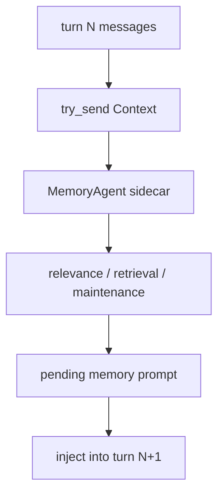

# s07 - Memory

## Goal

Understand why JCode runs memory as a sidecar instead of doing synchronous retrieval inside every `run_turn()`.

Memory is easy to misread as normal RAG. The important part is not merely whether embeddings exist. The important part is how JCode brings long-term preferences, project facts, and previous-session clues back into context without slowing the main agent turn.



This is the key memory path: the main agent only submits context, retrieval and maintenance run in the sidecar, and the result enters the main context on the next turn.

## Main Line Covered Here

The memory path fits in one sentence: the main agent submits context to a sidecar after a turn, the sidecar retrieves, maintains, and builds a pending prompt in the background, and the next turn injects that result into the main context.

Three pieces of code carry that design. `MemoryAgentHandle` uses `try_send`, so the main turn does not wait for memory. The background `MemoryAgent::run()` consumes the channel, maintains session state, and delegates retrieval to `process_context()`. The prompt layer then separates relevance context, extraction context, and the final relevant prompt injected into the main model.

The `memory` and `session_search` tools are model-facing entrypoints for explicit memory/history operations, but they are not the center of this lesson. JCode's tradeoff is in the sidecar: accept one-turn delay so retrieval does not slow down the main interaction.

## Core Source Excerpts

The excerpts below come from the current local JCode revision. Some are simplified for explanation. Use them for concepts; use the source tree for exact edits.

The handle is the first boundary:

```rust
// src/memory_agent.rs, excerpt
pub struct MemoryAgentHandle {
    tx: mpsc::Sender<AgentMessage>,
}

impl MemoryAgentHandle {
    pub fn update_context_sync_with_dir(
        &self,
        session_id: &str,
        messages: Arc<[Message]>,
        working_dir: Option<String>,
    ) {
        let msg = AgentMessage::Context {
            session_id: session_id.to_string(),
            messages,
            working_dir,
            timestamp: Instant::now(),
        };
        let _ = self.tx.try_send(msg);
    }
}
```

`try_send` is the key. Memory updates are pushed into a background channel and do not block the main agent turn. That is the code basis for "turn N triggers retrieval, turn N+1 uses the result."

The background agent processes those messages later:

```rust
// src/memory_agent.rs, excerpt
async fn run(mut self) {
    while let Some(msg) = self.rx.recv().await {
        match msg {
            AgentMessage::Reset => self.reset(),
            AgentMessage::Context { session_id, messages, working_dir, timestamp } => {
                self.session_state(&session_id).turn_count += 1;

                if let Err(e) =
                    self.process_context(&session_id, messages, timestamp).await
                {
                    logging::error(&format!("Memory agent error: {}", e));
                }
            }
        }
    }
}
```

This shows memory is a sidecar agent, not a synchronous function inside `run_turn()`. The main agent submits context; the background agent manages session state, turn count, and retrieval cadence.

`process_context()` turns messages into retrieval material, then stores relevant results as a pending prompt:

```rust
// src/memory_agent.rs, excerpt
async fn process_context(
    &mut self,
    session_id: &str,
    messages: Arc<[Message]>,
    _timestamp: Instant,
) -> Result<()> {
    let memory_manager = self.manager_for_session(session_id);
    let context = memory::format_context_for_relevance(&messages);
    if context.is_empty() {
        return Ok(());
    }

    // embedding / retrieval / validation omitted

    if let Some(prompt) =
        memory::format_relevant_prompt(&relevant, MAX_MEMORIES_PER_TURN)
    {
        memory::set_pending_memory_with_ids_and_display(
            session_id,
            prompt,
            count,
            ids,
            display_prompt,
        );
    }
}
```

That explains "inject on the next turn": the sidecar does not mutate the current provider request. It writes pending memory for the main agent to pick up later.

Prompt assembly is also split. JCode separates relevance context, extraction context, and the final injected text:

```rust
// src/memory_prompt.rs, excerpt
pub fn format_context_for_relevance(messages: &[Message]) -> String {
    for message in messages.iter().rev().take(MEMORY_CONTEXT_MAX_MESSAGES) {
        // keep only the context used to judge relevance, truncate on budget
    }
}

pub(crate) fn format_context_for_extraction(messages: &[Message]) -> String {
    for message in messages.iter().rev().take(EXTRACTION_CONTEXT_MAX_MESSAGES) {
        // extraction uses a wider window
    }
}

pub(crate) fn format_relevant_prompt(entries: &[MemoryEntry], limit: usize) -> Option<String> {
    format_entries_for_prompt(entries, limit)
        .map(|formatted| format!("# Memory\n\n{}", formatted))
}
```

Those are the three prompt roles from the main line: relevance finds candidates, extraction saves new memory, and relevant prompt injects recall.

JCode memory is not "manually save a note." It is closer to automatic recall:

```text
current context
  -> embedding
  -> similar memories
  -> graph / cascade retrieval
  -> optional sidecar verification
  -> inject memory prompt in next turn
```

The key design is non-blocking:

```text
turn N triggers retrieval
turn N+1 uses the result
```

This keeps the main agent responsive.

## Judgment To Keep

Memory covers a weakness of single-turn context: it cannot remember long-term preferences, project facts, and previous-session experience. JCode uses non-blocking sidecar recall to bring that material back.

Keep the cost with the benefit: memory has one-turn delay. That delay is intentional, not a missing synchronous retrieval step.

## What You Should Be Able To Explain

- Why `MemoryAgentHandle::update_context_sync_with_dir()` uses `try_send`.
- Where the boundary sits between the memory sidecar and `run_turn()`.
- Why `memory_prompt.rs` cares about both relevance context and extraction context.
- Why one-turn delay is a tradeoff between interaction latency and recall completeness.
