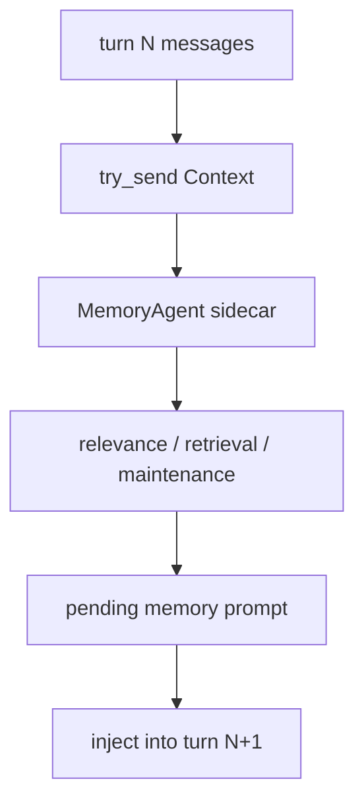

# s07 - Memory

## Goal

Understand why JCode runs memory as a sidecar instead of doing synchronous retrieval inside every `run_turn()`.

Memory is easy to misread as normal RAG. The important part is not merely whether embeddings exist. The important part is how JCode brings long-term preferences, project facts, and previous-session clues back into context without slowing the main agent turn.



This is the key memory path: the main agent only submits context, retrieval and maintenance run in the sidecar, and the result enters the main context on the next turn.

## Read First

```text
docs/MEMORY_ARCHITECTURE.md
docs/MEMORY_BUDGET.md
src/memory.rs
src/memory_agent.rs
src/memory_graph.rs
src/memory_prompt.rs
src/tool/memory.rs
src/tool/session_search.rs
```

Open `docs/MEMORY_ARCHITECTURE.md` first and only read the main path: context enters the memory agent, candidate memories are retrieved and filtered, and a result is injected into the next turn. Do not begin with `memory_agent.rs`; it is long.

Then read `src/memory_agent.rs`. On the first pass, only trace `MemoryAgentHandle::update_context_sync_with_dir()`, `MemoryAgent::run()`, and `process_context()`. This answers how a completed agent turn schedules memory work in the background. Stop at `process_context()` before digging into cluster refinement.

Next read `src/memory_prompt.rs`. Inspect `format_context_for_relevance()`, `format_context_for_extraction()`, and `format_relevant_prompt()`. These functions decide what context the memory agent sees and what text is eventually injected into the main model.

Then read `src/memory.rs`. Start with `MemoryManager::remember_project()`, `find_similar_scoped()`, `get_relevant_parallel()`, and `find_similar_with_cascade_scoped()`. These functions show how memory moves from simple storage into parallel recall and cascade retrieval.

Read `src/tool/memory.rs` and `src/tool/session_search.rs` last. The first is the model's explicit memory tool; the second searches across sessions. They are entrypoints. The main tradeoffs live in the background agent and manager.

## Core Source Excerpts

Start with this handle:

```rust
// src/memory_agent.rs, excerpt
pub struct MemoryAgentHandle {
    tx: mpsc::Sender<AgentMessage>,
}

impl MemoryAgentHandle {
    pub fn update_context_sync_with_dir(
        &self,
        session_id: &str,
        messages: Arc<[Message]>,
        working_dir: Option<String>,
    ) {
        let msg = AgentMessage::Context {
            session_id: session_id.to_string(),
            messages,
            working_dir,
            timestamp: Instant::now(),
        };
        let _ = self.tx.try_send(msg);
    }
}
```

`try_send` is the key. Memory updates are pushed into a background channel and do not block the main agent turn. That is the code basis for "turn N triggers retrieval, turn N+1 uses the result."

The background agent processes those messages later:

```rust
// src/memory_agent.rs, excerpt
async fn run(mut self) {
    while let Some(msg) = self.rx.recv().await {
        match msg {
            AgentMessage::Reset => self.reset(),
            AgentMessage::Context { session_id, messages, working_dir, timestamp } => {
                self.session_state(&session_id).turn_count += 1;

                if let Err(e) =
                    self.process_context(&session_id, messages, timestamp).await
                {
                    logging::error(&format!("Memory agent error: {}", e));
                }
            }
        }
    }
}
```

This shows memory is a sidecar agent, not a synchronous function inside `run_turn()`. The main agent submits context; the background agent manages session state, turn count, and retrieval cadence.

JCode memory is not "manually save a note." It is closer to automatic recall:

```text
current context
  -> embedding
  -> similar memories
  -> graph / cascade retrieval
  -> optional sidecar verification
  -> inject memory prompt in next turn
```

The key design is non-blocking:

```text
turn N triggers retrieval
turn N+1 uses the result
```

This keeps the main agent responsive.

## Judgment To Keep

Memory covers a weakness of single-turn context: it cannot remember long-term preferences, project facts, and previous-session experience. JCode uses non-blocking sidecar recall to bring that material back.

Keep the cost with the benefit: memory has one-turn delay. That delay is intentional, not a missing synchronous retrieval step.
