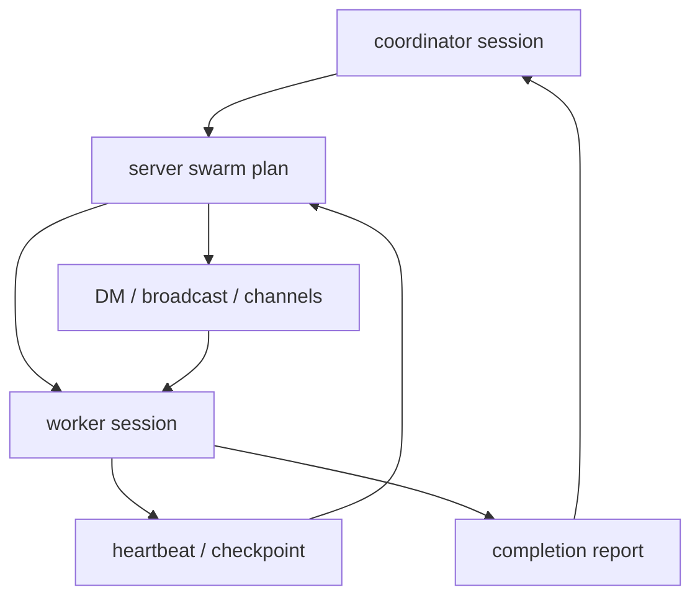

# s08 - Swarm

## Goal

Understand why JCode swarm is not just "open several subagents."

The important part is server-level coordination: plans, communication, recovery, file touches, worker progress, and completion reports. If you read swarm as a normal subagent wrapper, you miss its runtime boundary.



This diagram shows that swarm state is centered on the server plan, not inside one worker's messages. Workers return to the coordinator and plan through heartbeat, checkpoint, and reports.

## Main Line Covered Here

Swarm is not "start several models." The server owns a coordination plan. The coordinator updates the plan, workers write heartbeat, checkpoint, and reports back into progress, channels route DM/broadcast messages, and completion reports return to the coordinator.

The source excerpts below focus on two boundaries. `run_swarm_task()` shows how a worker session is created, inherits provider/registry state, and has recursive tools blocked. Task progress updates show why heartbeat, checkpoint, and assigned session belong in server state.

The `communicate` tool is the model-facing entrypoint into swarm runtime. `SubagentTool` is one-off delegation. Keeping them separate is the design point: subagent means "send one worker to do one thing"; swarm means "maintain a long-running coordination scene."

## Core Source Excerpts

The excerpts below come from the current local JCode revision. Some are simplified for explanation. Use them for concepts; use the source tree for exact edits.

For task dispatch, start with `run_swarm_task()`:

```rust
// src/server/swarm.rs, excerpt
pub(super) async fn run_swarm_task(
    agent: Arc<Mutex<Agent>>,
    description: &str,
    subagent_type: &str,
    prompt: &str,
) -> Result<String> {
    let (provider, registry, session_id, working_dir, coordinator_model) = {
        let agent = agent.lock().await;
        (
            agent.provider_fork(),
            agent.registry(),
            agent.session_id().to_string(),
            agent.working_dir().map(PathBuf::from),
            agent.provider_model(),
        )
    };

    let mut session = Session::create(
        Some(session_id),
        Some(format!("{} (@{} swarm)", description, subagent_type)),
    );
    session.model = Some(coordinator_model);
    session.save()?;

    let mut allowed: HashSet<String> = registry.tool_names().await.into_iter().collect();
    for blocked in ["subagent", "task", "todo", "todowrite", "todoread"] {
        allowed.remove(blocked);
    }

    let mut worker = Agent::new_with_session(provider, registry, session, Some(allowed));
    worker.run_once_capture(prompt).await
}
```

This explains why swarm is not a normal function call. It forks the provider, reuses the registry, creates a worker session, and blocks some tools so the worker does not recursively spawn subagents or mutate todo state. Swarm is runtime coordination, not just several prompts in parallel.

Progress also lives in server state:

```rust
// src/server/swarm.rs, excerpt
let progress = plan.task_progress.entry(task_id.to_string()).or_default();
progress.assigned_session_id = assigned_session_id.map(str::to_string);
progress.last_heartbeat_unix_ms = Some(now_ms);
progress.heartbeat_count = Some(progress.heartbeat_count.unwrap_or(0) + 1);

if let Some(summary) = checkpoint_summary {
    progress.last_checkpoint_unix_ms = Some(now_ms);
    progress.checkpoint_summary = Some(truncate_detail(&summary, 120));
}
```

This shows swarm tracks heartbeat, checkpoint, and assigned session. Without that state, multi-agent work becomes several black boxes running at once.

## What JCode Swarm Cares About

JCode swarm is concerned with multi-agent runtime coordination:

- how a coordinator assigns work
- how workers report back
- how agents DM / broadcast / use channels
- which files were read or modified by whom
- how plans update
- how blocked / failed / crashed agents recover
- when worktrees help and when they do not

This is where JCode differs strongly from pi. pi is restrained; JCode is more aggressive.

Do not read swarm as "open several subagents." The hard parts are plan ownership, communication, file touches, state recovery, and integration boundaries.

## Judgment To Keep

Swarm covers a weakness of one agent doing a large task: it is slow, it pollutes context, and it is bad at independent parallel work.

Keep the cost with the benefit: swarm adds planning, communication, file-touch tracking, progress recovery, and final integration complexity. Without that state management, multi-agent work only creates more uncertainty.

## What You Should Be Able To Explain

- Why `run_swarm_task()` creates a worker session.
- Why workers block some recursive and todo-related tools.
- What heartbeat, checkpoint, and assigned session state solve.
- Where the boundary sits between `subagent` and `swarm`.
