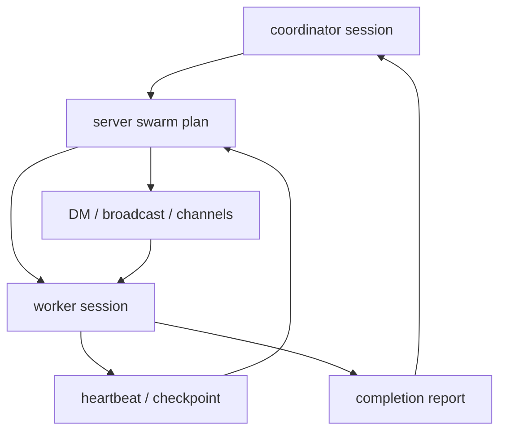
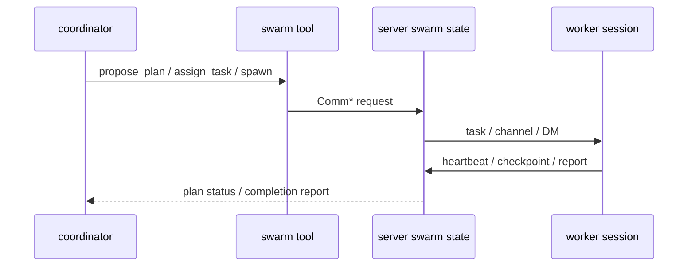

# s08 - Swarm

## Goal

**The One-Line Takeaway: swarm is not opening more subagents; it is the server remembering plans, members, communication, and recovery state for a group of agents.**

Understand why JCode swarm is not just "open several subagents."

The boundary is server-level coordination: plans, communication, recovery, file touches, worker progress, and completion reports. If you read swarm as a normal subagent wrapper, you miss its runtime boundary.



This diagram shows that swarm state is centered on the server plan, not inside one worker's messages. Workers return to the coordinator and plan through heartbeat, checkpoint, and reports.

## Main Line Covered Here

Swarm is not "start several models." The server owns a coordination plan. The coordinator updates the plan, workers write heartbeat, checkpoint, and reports back into progress, channels route DM/broadcast messages, and completion reports return to the coordinator.

The code has four boundaries to watch: what state the server owns, how worker sessions are created, where communication indexes live, and how file touches become visible to peer workers.

The `communicate` tool is the model-facing entrypoint into swarm runtime. `SubagentTool` is one-off delegation. Keeping them separate is the design point: subagent means "send one worker to do one thing"; swarm means "maintain a long-running coordination scene."

## Core Source Excerpts

The excerpts below come from the current local JCode revision. Some are simplified for explanation. Use them for concepts; use the source tree for exact edits.

First look at the swarm state owned by the server:

```rust
// src/server/state.rs, excerpt
pub struct SwarmState {
    pub members: Arc<RwLock<HashMap<String, SwarmMember>>>,
    pub swarms_by_id: Arc<RwLock<HashMap<String, HashSet<String>>>>,
    pub plans: Arc<RwLock<HashMap<String, VersionedPlan>>>,
    pub coordinators: Arc<RwLock<HashMap<String, String>>>,
}
```

This struct already shows that swarm is not a chat-history trick. Members, swarm groups, plans, and coordinators are server state. If the coordinator changes, a worker reconnects, or a plan updates, JCode cannot infer that reliably from one message list.

When a client subscribes, the server registers it as a swarm member:

```rust
// src/server/client_session.rs, excerpt
members.insert(
    client_session_id.to_string(),
    SwarmMember {
        session_id: client_session_id.to_string(),
        event_tx: client_event_tx.clone(),
        event_txs: HashMap::from([(client_connection_id.to_string(), client_event_tx)]),
        working_dir: working_dir.clone(),
        swarm_id: derived_swarm_id.clone(),
        swarm_enabled,
        status: "ready".to_string(),
        role: "agent".to_string(),
        is_headless: false,
        // other fields omitted
    },
);
```

This separates member identity from client connection. A session can connect, disconnect, and reconnect; the swarm member remains a server-side runtime object.

Task dispatch comes next in `run_swarm_task()`:

```rust
// src/server/swarm.rs, excerpt
pub(super) async fn run_swarm_task(
    agent: Arc<Mutex<Agent>>,
    description: &str,
    subagent_type: &str,
    prompt: &str,
) -> Result<String> {
    let (provider, registry, session_id, working_dir, coordinator_model) = {
        let agent = agent.lock().await;
        (
            agent.provider_fork(),
            agent.registry(),
            agent.session_id().to_string(),
            agent.working_dir().map(PathBuf::from),
            agent.provider_model(),
        )
    };

    let mut session = Session::create(
        Some(session_id),
        Some(format!("{} (@{} swarm)", description, subagent_type)),
    );
    session.model = Some(coordinator_model);
    session.save()?;

    let mut allowed: HashSet<String> = registry.tool_names().await.into_iter().collect();
    for blocked in ["subagent", "task", "todo", "todowrite", "todoread"] {
        allowed.remove(blocked);
    }

    let mut worker = Agent::new_with_session(provider, registry, session, Some(allowed));
    worker.run_once_capture(prompt).await
}
```

This explains why swarm is not a normal function call. It forks the provider, reuses the registry, creates a worker session, and blocks some tools so the worker does not recursively spawn subagents or mutate todo state. Swarm is runtime coordination, not just several prompts in parallel.

Progress also lives in server state:

```rust
// src/server/swarm.rs, excerpt
let progress = plan.task_progress.entry(task_id.to_string()).or_default();
progress.assigned_session_id = assigned_session_id.map(str::to_string);
progress.last_heartbeat_unix_ms = Some(now_ms);
progress.heartbeat_count = Some(progress.heartbeat_count.unwrap_or(0) + 1);

if let Some(summary) = checkpoint_summary {
    progress.last_checkpoint_unix_ms = Some(now_ms);
    progress.checkpoint_summary = Some(truncate_detail(&summary, 120));
}
```

This shows swarm tracks heartbeat, checkpoint, and assigned session. Without that state, multi-agent work becomes several black boxes running at once.

The `communicate` tool exposes those server capabilities to the model. It is not a normal chat tool; its action set covers spawn, planning, channels, and member waits:

```rust
// src/tool/communicate.rs, excerpt
impl Tool for CommunicateTool {
    fn name(&self) -> &str {
        "swarm"
    }

    fn parameters_schema(&self) -> Value {
        json!({
            "required": ["action"],
            "properties": {
                "action": {
                    "enum": [
                        "message", "broadcast", "dm", "channel",
                        "propose_plan", "approve_plan", "spawn",
                        "assign_task", "run_plan", "subscribe_channel",
                        "unsubscribe_channel", "await_members"
                    ]
                }
            }
        })
    }
}
```

Channels also have server-side indexes. They are not just `#name` strings agreed in a prompt:

```rust
// src/server/swarm_channels.rs, excerpt
pub(super) async fn subscribe_session_to_channel(
    session_id: &str,
    swarm_id: &str,
    channel: &str,
    channel_subscriptions: &ChannelSubscriptions,
    channel_subscriptions_by_session: &ChannelSubscriptions,
) {
    with_channel_index_mut(
        channel_subscriptions,
        channel_subscriptions_by_session,
        |index| index.subscribe(session_id, swarm_id, channel),
    )
    .await;
}
```

These excerpts close the communication boundary: the model calls a tool, the tool sends a server request, and the server maintains channel/session indexes. Coordination state is not improvised inside prompt text.

File touches also enter the swarm view. Normal tools such as `read`, `write`, and `edit` publish `FileTouch` events:

```rust
// src/tool/write.rs, excerpt
Bus::global().publish(BusEvent::FileTouch(FileTouch {
    session_id: ctx.session_id.clone(),
    path: path.to_path_buf(),
    op: FileOp::Write,
    summary: Some(format!("overwrote file ({} lines)", line_count)),
    detail,
}));
```

The server looks for peer modifications, not the current session or read-only access:

```rust
// src/server/state.rs, excerpt
pub(super) fn latest_peer_touches(
    accesses: &[FileAccess],
    current_session_id: &str,
    swarm_session_ids: &HashSet<String>,
) -> Vec<FileAccess> {
    for access in accesses.iter().filter(|access| {
        access.session_id != current_session_id
            && swarm_session_ids.contains(&access.session_id)
            && access.op.is_modification()
    }) {
        // keep the most recent modification per peer
    }
}
```

That is why swarm is not only a chat protocol. When several workers touch files at once, JCode needs to know who touched which file; otherwise the final integration step becomes manual diff archaeology.

## State Flow



This line shows the core of swarm: cooperation facts live in the server. Who owns a task, who is still alive, who is in which channel, and who reported completion are runtime state, not guesses from chat history.

## Mechanism Specimen

Server-owned swarm state maps to [mini/06_swarm_channel.py](../../mini/06_swarm_channel.py). It keeps only four structures: members, channels, task_progress, and inbox.

Real JCode adds session connections, headless workers, plan versions, file touches, completion reports, worktrees, and reload recovery. The specimen fixes the boundary first: channel membership and task progress belong to the server, not to one worker's prompt.

## What JCode Swarm Cares About

JCode swarm is concerned with multi-agent runtime coordination:

- how a coordinator assigns work
- how workers report back
- how agents DM / broadcast / use channels
- which files were read or modified by whom
- how plans update
- how blocked / failed / crashed agents recover
- when worktrees help and when they do not

This is where JCode differs strongly from pi. pi is restrained; JCode is more aggressive.

Do not read swarm as "open several subagents." The hard parts are plan ownership, communication, file touches, state recovery, and integration boundaries.

## Judgment To Keep

Swarm covers a weakness of one agent doing a large task: it is slow, it pollutes context, and it is bad at independent parallel work.

Keep the cost with the benefit: swarm adds planning, communication, file-touch tracking, progress recovery, and final integration complexity. Without that state management, multi-agent work only creates more uncertainty.

## What You Should Be Able To Explain

- Why `run_swarm_task()` creates a worker session.
- Why workers block some recursive and todo-related tools.
- What heartbeat, checkpoint, and assigned session state solve.
- Where the boundary sits between `subagent` and `swarm`.
