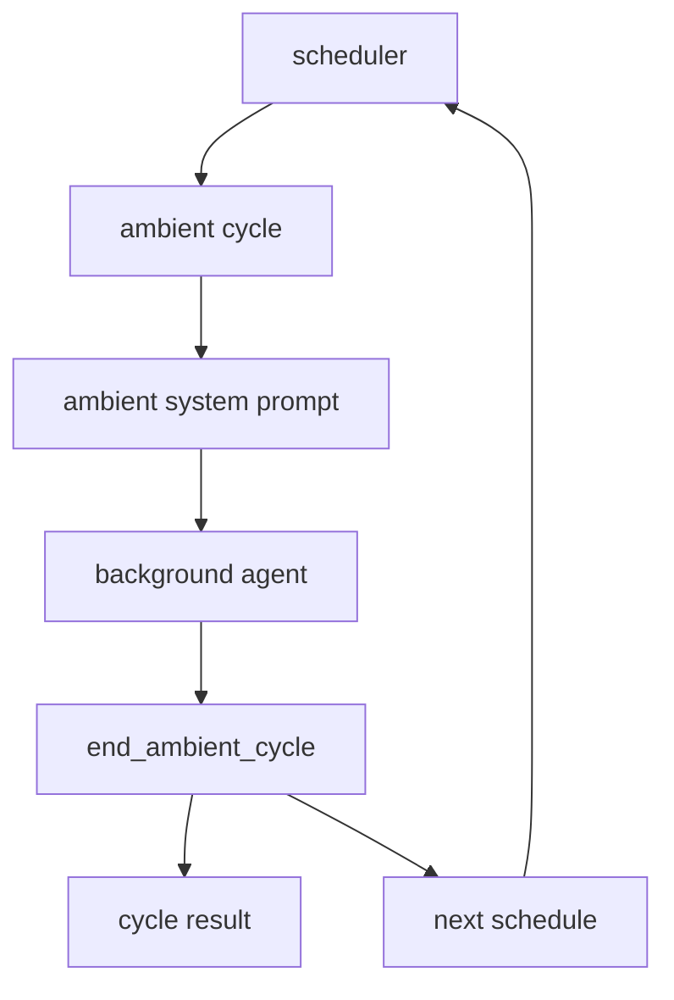

# s09 - Ambient and Self-Dev

## Goal

Understand two later-stage JCode capabilities: the ambient background loop and self-dev.

Neither module is just a prompt. Ambient is about scheduling, budgets, and cycle endings. Self-dev is about session boundaries, build/reload, and recovery.

## Ambient



This diagram shows why ambient needs an ending and scheduling mechanism. The background agent does not run forever; it reports the cycle result through `end_ambient_cycle` and schedules the next wake-up.

The ambient line is that background loops need boundaries. Ambient needs startup conditions, resource budget, safety boundaries, runner, scheduler, and a persistent queue. Without those, a background agent is not assistance; it is noise.

The module relationship is straightforward: `directives` supplies pending work, `manager` owns runtime state, `runner` starts one ambient cycle, `scheduler` decides the next wake-up, `persistence` stores queues and locks, and `tool/ambient` lets the background agent end a cycle, schedule future work, or request permission.

The source excerpts below show two things directly: ambient is not a single tool file, and an ambient cycle must report summary, resource usage, and next schedule through `end_ambient_cycle`.

The module map lives in `src/ambient.rs`:

The excerpts below come from the current local JCode revision. Some are simplified for explanation. Use them for concepts; use the source tree for exact edits.

```rust
// src/ambient.rs, excerpt
mod directives;
mod manager;
mod paths;
mod persistence;
mod prompt;
pub mod runner;
pub mod scheduler;

pub use directives::{add_directive, has_pending_directives, take_pending_directives};
pub use manager::AmbientManager;
pub use persistence::{AmbientLock, ScheduledQueue};
pub use prompt::{
    ResourceBudget,
    build_ambient_system_prompt,
    gather_recent_sessions,
    gather_memory_graph_health,
};
```

This shows ambient is not a single tool file. It has directives, manager, persistence, prompt, runner, and scheduler. The real topic is the background loop and budgets.

An ambient cycle must explicitly report how it ends:

```rust
// src/tool/ambient.rs, excerpt
struct EndCycleInput {
    summary: String,
    memories_modified: u32,
    compactions: u32,
    proactive_work: Option<String>,
    next_schedule: Option<NextScheduleInput>,
}

impl Tool for EndAmbientCycleTool {
    fn name(&self) -> &str { "end_ambient_cycle" }

    fn parameters_schema(&self) -> Value {
        json!({
            "required": ["summary", "memories_modified", "compactions"]
        })
    }
}
```

This shows the ambient agent does not just run and vanish. It must report what happened, how many memories changed, whether compaction happened, and when to wake next.

Ambient is a background agent. Instead of responding only to user prompts, it can do maintenance when resources allow:

- clean up memory
- inspect recent sessions
- check git activity
- perform low-risk proactive tasks
- decide when to wake next

This is experimental, but important because it points toward long-running agent environment maintenance.

When reading ambient, watch resource limits. A background agent without budget and priority rules becomes another source of interference.

## Self-Dev


This diagram shows the self-dev boundary: enter a self-dev session first, then build/test, then reload the shared server and resume sessions. Dangerous actions should not run directly from a normal session.

The self-dev line is that "let JCode modify itself" must pass through a controlled session. Explicit `jcode self-dev` creates or resumes a self-dev session, marks it canary, requires build when needed, and launches the TUI. A normal session should not run dangerous reload actions directly.

`SelfDevTool` exposes a controlled action set: `enter/build/test/cancel-build/reload/status/socket-info`. `reload`, `socket-info`, and `socket-help` check whether the current session is self-dev; that is the risk boundary. Launch moves a normal session into self-dev, build queue handles dedupe, locks, and background state, and reload lets a new binary take over the old server and resume sessions.

Prompts are not the core of self-dev. They tell the model the rules; the real boundary is CLI, tool actions, build/test, session gates, and reload recovery.

The excerpts below come from the current local JCode revision. Some are simplified for explanation. Use them for concepts; use the source tree for exact edits.

```rust
// src/tool/selfdev/mod.rs, excerpt
impl Tool for SelfDevTool {
    fn name(&self) -> &str {
        "selfdev"
    }

    fn parameters_schema(&self) -> Value {
        json!({
            "properties": {
                "action": {
                    "enum": [
                        "enter",
                        "build",
                        "test",
                        "cancel-build",
                        "reload",
                        "status",
                        "socket-info",
                        "socket-help"
                    ]
                }
            },
            "required": ["action"]
        })
    }
}
```

This shows self-dev is not only a hidden command. It is a model-callable tool exposing a controlled action set: enter self-dev, build, test, reload, and inspect status.

The risk boundary is enforced in dispatch:

```rust
// src/tool/selfdev/mod.rs, excerpt
match action.as_str() {
    "enter" => self.do_enter(params.prompt, &ctx).await,
    "build" => self.do_build(params.reason, params.target, params.notify, params.wake, &ctx).await,
    "test" => self.do_test(params.command, params.reason, params.notify, params.wake, &ctx).await,
    "reload" => {
        if !SelfDevTool::session_is_selfdev(&ctx.session_id) {
            Ok(ToolOutput::new(
                "`selfdev reload` is only available inside a self-dev session. Use `selfdev enter` first.",
            ))
        } else {
            self.do_reload(params.context, &ctx.session_id, ctx.execution_mode).await
        }
    }
    "status" => self.do_status().await,
    _ => Ok(ToolOutput::new(format!("Unknown action: {}", action))),
}
```

This shows dangerous self-dev actions are not available in every session. `reload` must run inside a self-dev session. That is one of JCode's guardrails for letting the agent modify itself.

Self-dev lets JCode modify itself.

Be conservative:

- Create a branch.
- Keep the worktree clean.
- Commit each step.
- Start with small changes.
- Run `cargo check`.
- Do not start with provider, server reload, compaction, or swarm.

## Judgments To Keep

Ambient covers the fact that users will not explicitly ask for every bit of environment maintenance. It moves recent-session, memory, and git-activity maintenance into a background loop.

Self-dev covers the need to modify JCode itself quickly. The boundaries are branch, commit, build/test, self-dev session, and reload recovery.

Keep the risks with the benefits: ambient without resource limits becomes interference; self-dev changing reload or server state can lose running-session state.

## What You Should Be Able To Explain

- Why ambient needs a scheduler, budget, and `end_ambient_cycle`.
- Why an ambient agent cannot run forever in the background.
- Why self-dev must first enter a self-dev session.
- Why `selfdev reload` needs a session gate and recovery logic.
