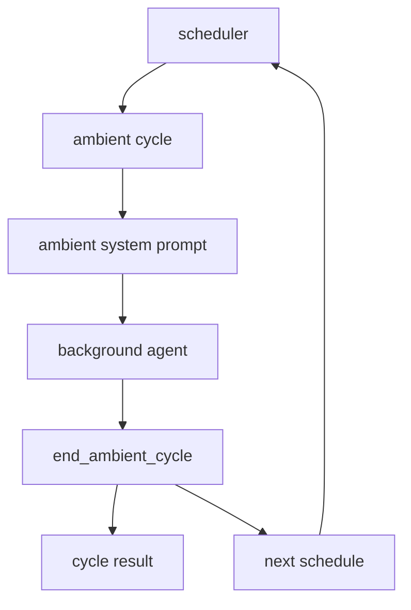
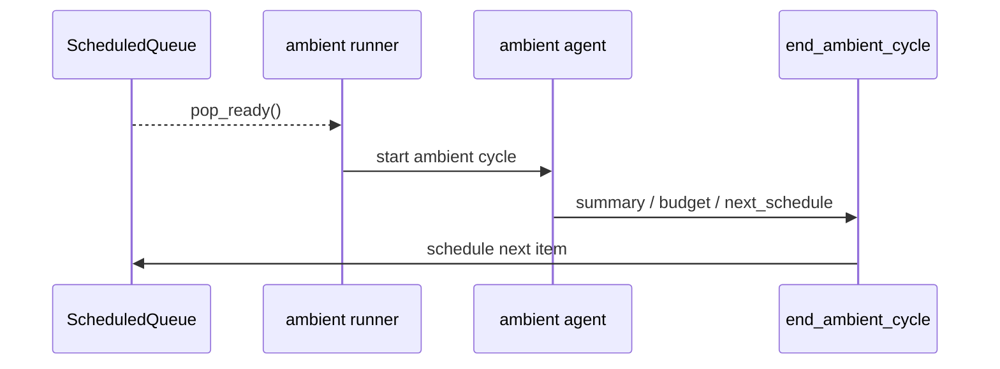
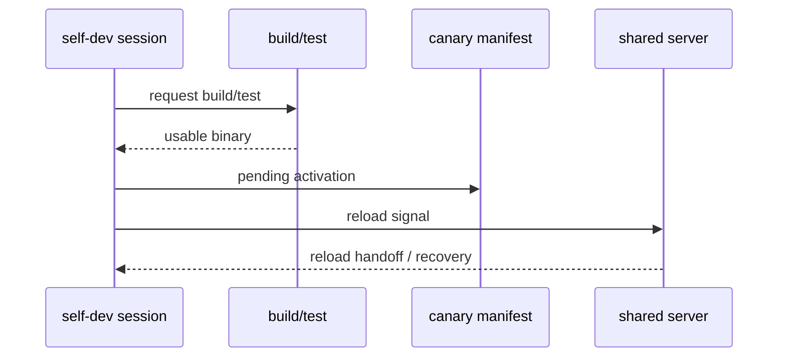

# s09 - Ambient and Self-Dev

## Goal

**The One-Line Takeaway: ambient and self-dev both keep changing state when nobody is staring at the terminal, so they need budgets, gates, and recovery paths first.**

Understand two later-stage JCode capabilities: the ambient background loop and self-dev.

Neither module is just a prompt. Ambient is about scheduling, budgets, and cycle endings. Self-dev is about session boundaries, build/reload, and recovery.

## Ambient



This diagram shows why ambient needs an ending and scheduling mechanism. The background agent does not run forever; it reports the cycle result through `end_ambient_cycle` and schedules the next wake-up.

The ambient line is that background loops need boundaries. Ambient needs startup conditions, resource budget, safety boundaries, runner, scheduler, and a persistent queue. Without those, a background agent is not assistance; it is noise.

The module relationship is straightforward: `directives` supplies pending work, `manager` owns runtime state, `runner` starts one ambient cycle, `scheduler` decides the next wake-up, `persistence` stores queues and locks, and `tool/ambient` lets the background agent end a cycle, schedule future work, or request permission.

The code has three things to show: ambient is not a single tool file; ready items come from a persistent queue; the background agent must report the cycle result through `end_ambient_cycle`.

### Ambient Core Source Excerpts

The module map lives in `src/ambient.rs`:

The excerpts below come from the current local JCode revision. Some are simplified for explanation. Use them for concepts; use the source tree for exact edits.

```rust
// src/ambient.rs, excerpt
mod directives;
mod manager;
mod paths;
mod persistence;
mod prompt;
pub mod runner;
pub mod scheduler;

pub use directives::{add_directive, has_pending_directives, take_pending_directives};
pub use manager::AmbientManager;
pub use persistence::{AmbientLock, ScheduledQueue};
pub use prompt::{
    ResourceBudget,
    build_ambient_system_prompt,
    gather_recent_sessions,
    gather_memory_graph_health,
};
```

This shows ambient is not a single tool file. It has directives, manager, persistence, prompt, runner, and scheduler. The real topic is the background loop and budgets.

An ambient cycle must explicitly report how it ends:

```rust
// src/tool/ambient.rs, excerpt
struct EndCycleInput {
    summary: String,
    memories_modified: u32,
    compactions: u32,
    proactive_work: Option<String>,
    next_schedule: Option<NextScheduleInput>,
}

impl Tool for EndAmbientCycleTool {
    fn name(&self) -> &str { "end_ambient_cycle" }

    fn parameters_schema(&self) -> Value {
        json!({
            "required": ["summary", "memories_modified", "compactions"]
        })
    }
}
```

This shows the ambient agent does not just run and vanish. It must report what happened, how many memories changed, whether compaction happened, and when to wake next.

The schedule queue shows that "wake next" is a persisted item, not just a promise in text:

```rust
// src/ambient/persistence.rs, excerpt
pub struct ScheduledQueue {
    items: Vec<ScheduledItem>,
    path: PathBuf,
}

impl ScheduledQueue {
    pub fn push(&mut self, item: ScheduledItem) {
        self.items.push(item);
        let _ = self.save();
    }

    pub fn pop_ready(&mut self) -> Vec<ScheduledItem> {
        let now = Utc::now();
        let (ready, remaining): (Vec<_>, Vec<_>) =
            self.items.drain(..).partition(|i| i.scheduled_for <= now);

        self.items = remaining;
        let mut ready = ready;
        ready.sort_by(|a, b| {
            b.priority
                .cmp(&a.priority)
                .then_with(|| a.scheduled_for.cmp(&b.scheduled_for))
        });
        ready
    }
}
```

This makes ambient scheduling concrete: only due items are popped, higher priority runs first, and equal priority falls back to scheduled time. The background agent is constrained by queue and scheduler, not an infinite loop.

The runner connects queue, lock, and agent cycle:

```rust
// src/ambient/runner.rs, excerpt
pub async fn run_loop(self, provider: Arc<dyn Provider>) {
    let mut scheduler = AdaptiveScheduler::new(scheduler_config);

    loop {
        let (should_run, ready_direct_items) =
            match AmbientManager::new() {
                Ok(mut mgr) => {
                    let ready_direct_items = mgr.take_ready_direct_items();
                    let should_run =
                        ambient_allowed && (mgr.should_run() || ambient::has_pending_directives());
                    (should_run, ready_direct_items)
                }
                Err(_) => (false, Vec::new()),
            };

        self.deliver_ready_direct_items(&provider, ready_direct_items).await;

        if !should_run {
            self.inner.wake_notify.notified().await;
            continue;
        }

        let Some(lock) = AmbientLock::try_acquire()? else {
            continue;
        };
        let _result = self.run_cycle(&provider).await;
        drop(lock);
    }
}
```

The loop itself is not the point. The boundaries are: direct items can be delivered to specific sessions, ambient items enter the background agent, and `AmbientLock` prevents several runners from grabbing the same maintenance work.

When JCode runs a headless ambient cycle, it registers only ambient-specific tools:

```rust
// src/ambient/runner.rs, excerpt
let cycle_provider = provider.fork();
let registry = tool::Registry::new(cycle_provider.clone()).await;
registry.register_ambient_tools().await;

let mut agent = Agent::new(cycle_provider.clone(), registry);
agent.set_system_prompt(&system_prompt);

ambient_tools::take_cycle_result();
let run_result = agent.run_once_capture(&initial_message).await;

if let Some(result) = ambient_tools::take_cycle_result() {
    return Ok(AmbientCycleResult { ..result });
}
```

This is the tool boundary. The ambient agent is not running with a normal session's full toolbox. It has its own prompt, session, tools, and result handoff.

If the agent does not call `end_ambient_cycle`, the runner does not trust that the cycle completed:

```rust
// src/ambient/runner.rs, excerpt
let continuation = "You stopped unexpectedly without calling end_ambient_cycle. \
    If you are done with your work, call end_ambient_cycle with a summary...";

let _ = agent.run_once_capture(continuation).await;

if ambient_tools::take_cycle_result().is_none() {
    return Ok(AmbientCycleResult {
        summary: "Cycle ended without calling end_ambient_cycle".to_string(),
        status: CycleStatus::Incomplete,
        // other fields omitted
    });
}
```

This is not just prompt nudging. It is a fallback for a background loop: without the ending tool call, JCode cannot record the cycle as complete maintenance work.

Ambient is a background agent. Instead of responding only to user prompts, it can do maintenance when resources allow:

- clean up memory
- inspect recent sessions
- check git activity
- perform low-risk proactive tasks
- decide when to wake next

This is experimental, but important because it points toward long-running agent environment maintenance.

When reading ambient, watch resource limits. A background agent without budget and priority rules becomes another source of interference.

### Ambient Mechanism Specimen

Ambient scheduling maps to [mini/07_ambient_scheduler.py](../../mini/07_ambient_scheduler.py). It keeps the queue, pop_ready, run cycle, end cycle, and reschedule path.

Real JCode adds active-session pause, permission requests, visible mode, notifications, transcripts, and direct session delivery. The specimen answers one question first: why ambient is not a `while true` background thread.

## Self-Dev


This diagram shows the self-dev boundary: enter a self-dev session first, then build/test, then reload the shared server and resume sessions. Dangerous actions should not run directly from a normal session.

The self-dev line is that "let JCode modify itself" must pass through a controlled session. Explicit `jcode self-dev` creates or resumes a self-dev session, marks it canary, requires build when needed, and launches the TUI. A normal session should not run dangerous reload actions directly.

`SelfDevTool` exposes a controlled action set: `enter/build/test/cancel-build/reload/status/socket-info`. `reload`, `socket-info`, and `socket-help` check whether the current session is self-dev; that is the risk boundary. Launch moves a normal session into self-dev, build queue handles dedupe, locks, and background state, and reload lets a new binary take over the old server and resume sessions.

Prompts are not the core of self-dev. They tell the model the rules; the real boundary is CLI, tool actions, build/test, session gates, and reload recovery.

### Self-Dev Core Source Excerpts

The excerpts below come from the current local JCode revision. Some are simplified for explanation. Use them for concepts; use the source tree for exact edits.

Entering self-dev is not adding one prompt to the current session. JCode creates a canary session and carries over selected parent-session context:

```rust
// src/tool/selfdev/launch.rs, excerpt
pub fn enter_selfdev_session(
    parent_session_id: Option<&str>,
    working_dir: Option<&Path>,
) -> Result<SelfDevLaunchResult> {
    let repo_dir = SelfDevTool::resolve_repo_dir(working_dir)
        .ok_or_else(|| anyhow::anyhow!("Could not find jcode repo"))?;

    let mut session = if let Some(parent_session_id) = parent_session_id {
        let parent = session::Session::load(parent_session_id)?;
        let mut child = session::Session::create(
            Some(parent_session_id.to_string()),
            Some("Self-development session".to_string()),
        );
        child.replace_messages(parent.messages.clone());
        child.compaction = parent.compaction.clone();
        child.provider_key = parent.provider_key.clone();
        child
    } else {
        session::Session::create(None, Some("Self-development session".to_string()))
    };

    session.set_canary("self-dev");
    session.working_dir = Some(repo_dir.display().to_string());
    session.save()?;
}
```

This puts the boundary in session state, not prompt text. The canary session inherits useful context, but it has its own session id, working directory, and self-dev marker.

```rust
// src/tool/selfdev/mod.rs, excerpt
impl Tool for SelfDevTool {
    fn name(&self) -> &str {
        "selfdev"
    }

    fn parameters_schema(&self) -> Value {
        json!({
            "properties": {
                "action": {
                    "enum": [
                        "enter",
                        "build",
                        "test",
                        "cancel-build",
                        "reload",
                        "status",
                        "socket-info",
                        "socket-help"
                    ]
                }
            },
            "required": ["action"]
        })
    }
}
```

This shows self-dev is not only a hidden command. It is a model-callable tool exposing a controlled action set: enter self-dev, build, test, reload, and inspect status.

The risk boundary is enforced in dispatch:

```rust
// src/tool/selfdev/mod.rs, excerpt
match action.as_str() {
    "enter" => self.do_enter(params.prompt, &ctx).await,
    "build" => self.do_build(params.reason, params.target, params.notify, params.wake, &ctx).await,
    "test" => self.do_test(params.command, params.reason, params.notify, params.wake, &ctx).await,
    "reload" => {
        if !SelfDevTool::session_is_selfdev(&ctx.session_id) {
            Ok(ToolOutput::new(
                "`selfdev reload` is only available inside a self-dev session. Use `selfdev enter` first.",
            ))
        } else {
            self.do_reload(params.context, &ctx.session_id, ctx.execution_mode).await
        }
    }
    "status" => self.do_status().await,
    _ => Ok(ToolOutput::new(format!("Unknown action: {}", action))),
}
```

This shows dangerous self-dev actions are not available in every session. `reload` must run inside a self-dev session. That is one of JCode's guardrails for letting the agent modify itself.

Before reload, JCode also saves recovery context, updates the canary manifest, and signals the server:

```rust
// src/tool/selfdev/reload.rs, excerpt
pub(super) async fn do_reload(
    &self,
    context: Option<String>,
    session_id: &str,
    execution_mode: ToolExecutionMode,
) -> Result<ToolOutput> {
    let source = build::current_source_state(&repo_dir)?;
    let hash = source.version_label.clone();

    let mut manifest = build::BuildManifest::load()?;
    manifest.canary = Some(hash.clone());
    manifest.canary_status = Some(build::CanaryStatus::Testing);
    manifest.set_pending_activation(build::PendingActivation {
        session_id: session_id.to_string(),
        new_version: hash.clone(),
        source_fingerprint: Some(source.fingerprint.clone()),
        requested_at: chrono::Utc::now(),
        // other version fields omitted
    })?;
    manifest.save()?;

    let reload_ctx = ReloadContext {
        task_context: context,
        version_after: hash.clone(),
        session_id: session_id.to_string(),
        timestamp: chrono::Utc::now().to_rfc3339(),
        // other fields omitted
    };
    reload_ctx.save()?;

    let request_id =
        server::send_reload_signal(hash.clone(), Some(session_id.to_string()), true);
    let timeout = std::time::Duration::from_secs(SelfDevTool::reload_timeout_secs());
    server::wait_for_reload_ack(&request_id, timeout).await?;
}
```

This shows self-dev reload is not just "restart." It records the version to activate, saves continuation context, and asks the server to enter reload handoff. Without that, an agent modifying itself would easily lose the current task.

The server also has reload recovery records. Sessions interrupted during reload are not expected to remember themselves:

```rust
// src/server/reload_recovery.rs, excerpt
pub(super) struct ReloadRecoveryRecord {
    pub reload_id: String,
    pub session_id: String,
    pub role: ReloadRecoveryRole,
    pub status: ReloadRecoveryStatus,
    pub directive: ReloadRecoveryDirective,
    pub reason: String,
    pub created_at: String,
    pub delivered_at: Option<String>,
}

pub(super) fn persist_intent(
    reload_id: &str,
    session_id: &str,
    role: ReloadRecoveryRole,
    directive: ReloadRecoveryDirective,
    reason: impl Into<String>,
) -> Result<()> {
    let record = ReloadRecoveryRecord {
        reload_id: reload_id.to_string(),
        session_id: session_id.to_string(),
        role,
        status: ReloadRecoveryStatus::Pending,
        directive,
        reason: reason.into(),
        created_at: chrono::Utc::now().to_rfc3339(),
        delivered_at: None,
    };
    storage::write_json(&path_for_session(session_id)?, &record)?;
}
```

This part is easy to miss: reload is not one session's problem. The shared server may have normal sessions, headless workers, and swarm members. Recovery directives must be durable, or a successful reload can still lose the working scene.

## State Flow

Ambient state flow:



Self-dev state flow:



Both lines point to the same rule: background capabilities must be recoverable. Ambient uses a queue to recover the next wake-up. Self-dev uses manifest and reload context to recover the active modification.

## Self-Dev Mechanism Specimen

Self-dev reload gates map to [mini/08_selfdev_reload_gate.py](../../mini/08_selfdev_reload_gate.py).

The specimen keeps only the state boundary: enter a canary session, build before reload, and leave pending activation plus recovery context before restart.

Self-dev lets JCode modify itself.

Be conservative:

- Create a branch.
- Keep the worktree clean.
- Commit each step.
- Start with small changes.
- Run `cargo check`.
- Do not start with provider, server reload, compaction, or swarm.

## Judgments To Keep

Ambient covers the fact that users will not explicitly ask for every bit of environment maintenance. It moves recent-session, memory, and git-activity maintenance into a background loop.

Self-dev covers the need to modify JCode itself quickly. The boundaries are branch, commit, build/test, self-dev session, and reload recovery.

Keep the risks with the benefits: ambient without resource limits becomes interference; self-dev changing reload or server state can lose running-session state.

## What You Should Be Able To Explain

- Why ambient needs a scheduler, budget, and `end_ambient_cycle`.
- Why an ambient agent cannot run forever in the background.
- Why self-dev must first enter a self-dev session.
- Why `selfdev reload` needs a session gate and recovery logic.
