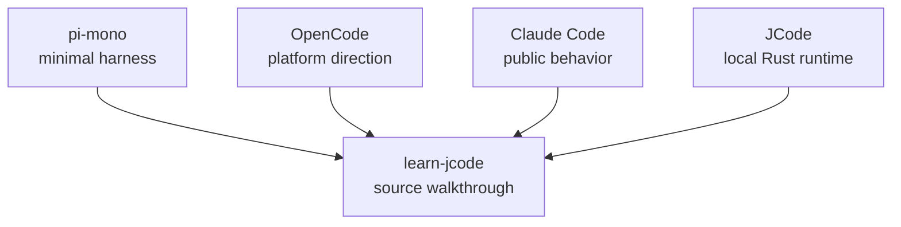

# s10 - Boundaries: JCode, pi, OpenCode, Claude Code

## Goal

**The One-Line Takeaway: JCode is not most useful as a minimal loop; it is useful because a local long-running runtime shows the cost of state, recovery, and coordination.**

Place the previous lessons back into the coding-agent runtime landscape: what JCode is good for learning, and where it differs from pi, OpenCode, and Claude Code public behavior.

This lesson only discusses public behavior, public documentation, and open-source code. It does not discuss non-public or leaked Claude Code source.



This diagram sets the boundary: the course reads JCode. pi, OpenCode, and Claude Code public behavior are only used to calibrate tradeoffs.

## Where JCode Sits

| Dimension | pi-mono | OpenCode | Claude Code | JCode |
| --- | --- | --- | --- | --- |
| Learning value | Minimal coding harness | Open platform and multi-surface product | Mature product behavior | Local multi-provider long-running runtime |
| Tool philosophy | Few tools, centered on `read/write/edit/bash` | Platform tools and extensions | Public behavior shows tools, permissions, subagents, skills | Base tools plus memory/MCP/swarm/self-dev in the registry |
| Runtime | Smaller and easier to read first | Client/server and platform integration | Product abstraction is complete, source is closed | Resident server owns sessions, providers, MCP, swarm, events |
| Session | Lighter | Platform experience matters more | Public behavior supports long-running work | Journal, render, import, replay, multi-client |
| Memory | Not the main point | Implementation-dependent | Public product behavior is not source detail | Sidecar non-blocking recall with one-turn delay |
| Multi-agent | More restrained | Platform collaboration direction | Public concepts include subagents / teams | Server-level swarm state, channels, heartbeat, plan |
| UI | Enough for use | Multi-surface experience matters | Product UI is complete | Terminal-native; TUI is harness observability |
| Self-dev | Not core | Not the main line | Not discussed as source | Build/reload is tool and session capability |

Default advice:

- Use pi to understand the minimal path.
- Use OpenCode to understand open-platform and multi-surface direction.
- Use Claude Code docs and public behavior to understand mature product capability shape.
- Use JCode to read a complex local runtime.

## Source Anchors

Do not stop at "JCode is more complex." Complexity has to land in source structure.

| Question | pi-mono anchor | OpenCode anchor | JCode anchor |
| --- | --- | --- | --- |
| Where is the minimal loop | `packages/agent/src/agent-loop.ts` | Session/message flow spread through `packages/opencode/src/session` | `src/agent/turn_loops.rs`, `src/agent/turn_execution.rs` |
| How base tools enter runtime | `packages/mom/src/tools/index.ts` returns read/bash/edit/write/attach | Tools, permissions, and session APIs spread across server/app packages | `src/tool/mod.rs` `Registry` owns schema and execution |
| How providers are isolated | `packages/ai/src/providers/*` | `packages/opencode/src/provider` and AI SDK provider shape | `src/provider/*` + `MultiProvider` + `StreamEvent` |
| What sessions own | Lighter agent context | `packages/opencode/src/session/index.ts` owns session, message, diff, permission, share | `src/session/*` owns journal, render, import, replay, multi-client |
| What UI means | TUI is a use surface, not the center of a large runtime | `packages/app`, `packages/ui`, desktop/Slack/docs surfaces | Ratatui TUI consumes server events, tool status, diffs, side panel |
| Where multi-agent state lives | More restrained, still centered on minimal effective tools | Platform collaboration and session/fork direction | `SwarmState`, `VersionedPlan`, channels, heartbeat, file touch |
| Whether self-modification is core | Not the main line | Not the main line | `selfdev` is tool, session capability, build/reload recovery chain |

This is the sharper boundary: JCode is not "pi with more tools." It puts more state into one local runtime, so the complexity comes from ownership and recovery, not from decorative features.

## Five Source Snippets

pi's tool entrypoint is thin:

```ts
// pi-mono: packages/mom/src/tools/index.ts, excerpt
export function createMomTools(executor: Executor): AgentTool<any>[] {
  return [
    createReadTool(executor),
    createBashTool(executor),
    createEditTool(executor),
    createWriteTool(executor),
    attachTool,
  ];
}
```

The value here is restraint. When reading pi, study how a small tool set carries a coding agent, not a full product runtime.

OpenCode treats session more like a platform object:

```ts
// OpenCode: packages/opencode/src/session/index.ts, excerpt
readonly create: (input: {
  parentID?: SessionID
  title?: string
  permission?: Permission.Ruleset
}) => Effect.Effect<Info>

readonly diff: (sessionID: SessionID) => Effect.Effect<Snapshot.FileDiff[]>
readonly messages: (input: { sessionID: SessionID; limit?: number }) => Effect.Effect<MessageV2.WithParts[]>
readonly setPermission: (input: { sessionID: SessionID; permission: Permission.Ruleset }) => Effect.Effect<void>
```

This shows OpenCode's direction: session is a platform API serving app, UI, permissions, sharing, diffs, and message pagination.

JCode pushes more of this back into a local resident server:

```rust
// JCode: src/server/state.rs, excerpt
pub struct SwarmState {
    pub members: Arc<RwLock<HashMap<String, SwarmMember>>>,
    pub swarms_by_id: Arc<RwLock<HashMap<String, HashSet<String>>>>,
    pub plans: Arc<RwLock<HashMap<String, VersionedPlan>>>,
    pub coordinators: Arc<RwLock<HashMap<String, String>>>,
}
```

This is the JCode cost: server-owned coordination. Swarm is not a set of prompts; it is members, plans, coordinators, and recovery state held by the server.

JCode's provider boundary is also more specific than "supports multiple models." The agent loop does not speak every vendor API directly; it consumes one stream dialect:

```rust
// JCode: src/provider/mod.rs + src/message.rs, excerpt
pub trait Provider: Send + Sync {
    async fn complete_split(
        &self,
        messages: &[Message],
        tools: &[ToolDefinition],
        system_static: &str,
        system_dynamic: &str,
        resume_session_id: Option<&str>,
    ) -> Result<EventStream>;
}

pub enum StreamEvent {
    TextDelta(String),
    ToolUseStart { id: String, name: String },
    ToolInputDelta(String),
    ToolUseEnd,
    ToolResult { tool_use_id: String, content: String, is_error: bool },
    TokenUsage {
        input_tokens: Option<u64>,
        output_tokens: Option<u64>,
        cache_read_input_tokens: Option<u64>,
        cache_creation_input_tokens: Option<u64>,
    },
    SessionId(String),
    NativeToolCall { request_id: String, tool_name: String, input: serde_json::Value },
}
```

This is where JCode stops being a simple wrapper. Providers can use SSE, WebSocket, CLI, or compatible HTTP APIs, but once events enter the agent loop they must become `StreamEvent`. The provider layer is not mainly "how many model vendors exist"; it is the normalization layer for transport, caching, session IDs, and native tool calls.

The tool-system boundary is `Registry::execute()`, not just a HashMap lookup:

```rust
// JCode: src/tool/mod.rs, excerpt
pub async fn execute(&self, name: &str, input: Value, ctx: ToolContext) -> Result<ToolOutput> {
    let tools = self.tools.read().await;
    let resolved_name = Self::resolve_tool_name(name);
    let tool = tools
        .get(resolved_name)
        .ok_or_else(|| anyhow::anyhow!("Unknown tool: {}", name))?
        .clone();
    drop(tools);

    let started_at = std::time::Instant::now();
    let result = tool.execute(input.clone(), ctx).await;
    let latency_ms = started_at.elapsed().as_millis().min(u128::from(u64::MAX)) as u64;
    crate::telemetry::record_tool_execution(resolved_name, &input, result.is_ok(), latency_ms);

    let mut output = result?;
    output = self.guard_context_overflow(name, output).await;
    Ok(output)
}
```

This turns the registry into a runtime boundary: aliases, async execution, telemetry, and context guarding converge here. Scatter that logic and the agent loop gets polluted by provider quirks, oversized tool output, UI state, and recovery behavior.

## Harder Reading Rubric

Do not rank these projects by feature count. Rank them by four questions:

| Question | Weak answer | JCode's answer |
| --- | --- | --- |
| Who owns state | Put everything in chat history | Server, session, registry, and sidecars own different state |
| When does it happen | Finish everything inside the current turn | Memory injects next turn, TUI streams state, swarm keeps syncing |
| How does failure recover | Error out and ask the user to retry | Session replay, tool-result repair, reload recovery, rate-limit retry |
| How does UI know | Print a few stdout lines | Server events enter TUI state, then become widgets, diffs, usage, side panel |

This is more useful than "JCode has more features." When reading a module, first ask whether it solves state ownership, timing, recovery, or observability. If it solves none of those, it is probably surface area.

## JCode's Cost

JCode complexity mostly comes from long-running runtime behavior, not from the agent loop itself. The minimal loop is short:

```text
messages -> model -> tool call -> tool result -> messages
```

JCode adds these layers around that line:

```text
resident server
multi-client session
provider selection / auth
tool registry / context guard
TUI observability
memory sidecar
swarm coordination
ambient scheduler
self-dev reload
```

None of those layers are free. Each one adds state ownership questions:

- Does the state live in the client or server?
- Should the current turn do it synchronously, or should the next turn consume a pending result?
- Does tool output return directly, or pass through truncation and content-block conversion?
- Does worker state live in chat history, or in the server plan?
- How does reload preserve sessions and active work?

That is the main reason to study JCode: it shows what a local long-running agent must pay for state and recovery.

## Difference From pi

pi is better for the minimal effective path. It emphasizes fewer tools, fewer abstractions, and less runtime. It is faster to read and easier to modify.

JCode is better for product-grade boundaries. It connects provider, auth, session, TUI, memory, swarm, and self-dev into one runtime. Do not expect it to be tiny. Watch how it prevents long-running work from turning into state confusion.

Hard rule: if you cannot write a `messages -> tools -> tool_result` loop yet, do not start with JCode. Read pi first and make the minimal loop natural. JCode is the second-stage read: what happens when that loop becomes a long-running local product?

## Difference From OpenCode

OpenCode leans more toward open platform shape: multi-surface, configuration, extension, and platform experience. JCode leans more toward local high-performance runtime: terminal-native, resident server, Rust implementation, built-in memory/swarm/self-dev.

Both show the same lesson: serious coding agents are not stdout wrappers. UI, server, permissions, providers, and sessions enter core architecture.

Hard rule: use OpenCode to study platformization, multiple surfaces, configuration, and product surface area. Use JCode to study how a terminal-native Rust runtime ties server, TUI, memory, swarm, and reload into one local system.

## Difference From Claude Code Public Behavior

Claude Code is closed source, so this course does not discuss it as source. The only useful comparison is public capability shape: tools, permissions, subagents, skills, long-running tasks, and team-style workflows.

JCode's value is source readability. You can see where those capabilities land: `Registry`, `ServerRuntime`, `Session`, `MemoryAgent`, `swarm_state`, `SelfDevTool`. That is why this course stays centered on JCode source.

## What You Should Be Able To Explain

- Why JCode complexity mainly comes from product-grade runtime, not the agent loop itself.
- Why pi is good for minimal path learning and JCode is good for long-running runtime learning.
- Why OpenCode and JCode both use client/server ideas but have different product directions.
- Why Claude Code can only be compared through public behavior here.
- Why the course reads JCode directly and only uses other projects to calibrate boundaries.
- Why "complexity" should be traced to source-level state ownership, not feature lists.
