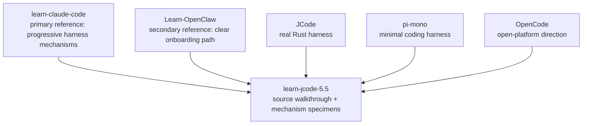

# s10 - Comparison: JCode, learn-claude-code, Learn-OpenClaw, pi, OpenCode

## Goal

Place the previous lessons back against the reference projects: why this course primarily follows `learn-claude-code`, secondarily borrows from `Learn-OpenClaw`, and how JCode differs from pi, OpenCode, and Claude Code.

This lesson does not discuss non-public or leaked source code. Claude Code is compared only through public behavior, public docs, and harness ideas abstracted by `learn-claude-code`.



This diagram shows the course tradeoff: structure and stance come mostly from `learn-claude-code`, onboarding clarity borrows from `Learn-OpenClaw`, and the main subject remains JCode source.

## Differences Between the Tutorial Projects

| Project | What it teaches | Main method | How this course uses it |
| --- | --- | --- | --- |
| `learn-claude-code` | Harness engineering mechanisms | One runnable mini-agent per lesson, mechanisms layered over time | Primary reference: progression, strong stance, code specimens |
| `Learn-OpenClaw` | Agent basics and a practical path | Node / Workflow / Agent / Tool first, then examples | Secondary reference: direct explanations and clear next steps |
| `learn-jcode-5.5` | Product-grade coding-agent harness source | Mermaid + source excerpts + explanation + comparisons | Reads JCode runtime directly instead of building a toy-agent mainline |

`learn-claude-code` is strongest when it shows mechanisms growing step by step: agent loop, tool use, todo, subagent, skill, context compact, task system, background tasks, and agent teams.

`Learn-OpenClaw` is strongest when it keeps the next step obvious. It does not start with a large system. It first explains Node, Workflow, Agent, Tool, MCP, and Skill.

`learn-jcode-5.5` should take a third path: keep the harness stance from `learn-claude-code`, avoid copying its toy implementation, borrow the clarity of `Learn-OpenClaw`, and avoid promising that JCode can be learned in one day.

## Differences Between Coding-Agent Projects

| Dimension | pi-mono | OpenCode | Claude Code | JCode |
| --- | --- | --- | --- | --- |
| Learning value | Minimal coding harness | Open platform and multi-surface product | Mature harness product shape | Local multi-provider long-running runtime |
| Tool philosophy | Few tools, centered on `read/write/edit/bash` | Platform tools and extension surface | Public behavior shows tools, permissions, subagents, skills | Base tools plus memory/MCP/swarm/self-dev in one registry |
| Runtime | Smaller, easier first read | Client/server and platform integration are prominent | Product abstraction is mature, source is not public | Resident server owns sessions, provider, MCP, swarm, events |
| Session | Lighter | Platform experience matters more | Public behavior supports long-running workflows | Journal, render, import, replay, multi-client |
| Memory | Not the main point | Depends on implementation | Public product behavior is not source detail | Sidecar non-blocking recall with one-turn delay |
| Multi-agent | More restrained | Open-platform collaboration direction | Public concepts include subagents / teams | Server-level swarm state, channels, heartbeat, plan |
| UI | Enough for the job | Multi-surface UX matters | Product UI is complete | Terminal-native; TUI is harness observability |
| Self-dev | Not core | Not the mainline | Not compared by source | Build/reload exposed as tool and session capability |

Default recommendations:

- Read pi if you want the minimal coding-agent path.
- Read `Learn-OpenClaw` if you want to go from concepts to a running OpenClaw-style project.
- Read `learn-claude-code` if you want to learn how harness mechanisms layer up.
- Read JCode if you want to study a complex local runtime.

## Why This Course Primarily Follows `learn-claude-code`

Because it gets the important stance right:

```text
The model is the agent.
The harness gives the model tools, context, permissions, runtime, and observability.
```

JCode source is complex, but most of that complexity fits this frame:

| `learn-claude-code` mechanism | JCode source counterpart |
| --- | --- |
| agent loop | `src/agent/turn_loops.rs` |
| tool use | `src/tool/mod.rs` and concrete tools |
| todo / task | `src/tool/todo.rs`, `src/tool/task.rs` |
| context compact | `src/agent/compaction.rs`, provider compaction |
| background tasks | ambient, bg tool, server runtime |
| agent teams | `src/server/swarm.rs`, `src/tool/communicate.rs` |
| worktree / isolation | swarm/self-dev runtime boundaries |
| skills | `skill_manage`, skills registry |

In short: `learn-claude-code` gives us mechanism order. JCode shows the product-grade cost of implementing those mechanisms.

## Why `Learn-OpenClaw` Is Secondary

`Learn-OpenClaw` reads more like an onboarding map, which is useful for readers new to agents. It says the basic relationships plainly:

```text
workflow = node + node
agent = chatbot + tools
Tool / MCP / Skill all orbit tool calling
```

That helps `learn-jcode-5.5` because JCode can drown readers in server, provider, session, memory, and swarm details. We should borrow the directness, not the one-day pacing.

JCode is not a one-day project. Absorb it over several days:

```text
Day 1: harness stance.
Day 2: startup and server.
Day 3: agent loop and tool registry.
Day 4: provider/session/TUI.
Day 5 and later: memory, swarm, ambient, self-dev.
```

## What You Should Be Able To Explain

- Why this course primarily follows `learn-claude-code` instead of `Learn-OpenClaw`.
- Why JCode's complexity mostly comes from product-grade harness work, not the agent loop itself.
- Why pi is best for the minimal path while JCode is better for studying a long-running runtime.
- Why OpenCode and JCode both use client/server thinking but point at different product directions.
- Why Claude Code can only be compared through public behavior and harness ideas here, not non-public source.
