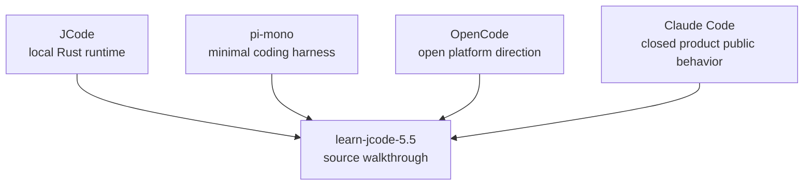

# s10 - Boundaries: JCode, pi, OpenCode, Claude Code

## Goal

Place the previous lessons back into the coding-agent runtime landscape: what JCode is good for learning, and where it differs from pi, OpenCode, and Claude Code public behavior.

This lesson only discusses public behavior, public documentation, and open-source code. It does not discuss non-public or leaked Claude Code source.



This diagram sets the boundary: the course reads JCode. pi, OpenCode, and Claude Code public behavior are only used to calibrate tradeoffs.

## Where JCode Sits

| Dimension | pi-mono | OpenCode | Claude Code | JCode |
| --- | --- | --- | --- | --- |
| Learning value | Minimal coding harness | Open platform and multi-surface product | Mature product behavior | Local multi-provider long-running runtime |
| Tool philosophy | Few tools, centered on `read/write/edit/bash` | Platform tools and extensions | Public behavior shows tools, permissions, subagents, skills | Base tools plus memory/MCP/swarm/self-dev in the registry |
| Runtime | Smaller and easier to read first | Client/server and platform integration | Product abstraction is complete, source is closed | Resident server owns sessions, providers, MCP, swarm, events |
| Session | Lighter | Platform experience matters more | Public behavior supports long-running work | Journal, render, import, replay, multi-client |
| Memory | Not the main point | Implementation-dependent | Public product behavior is not source detail | Sidecar non-blocking recall with one-turn delay |
| Multi-agent | More restrained | Platform collaboration direction | Public concepts include subagents / teams | Server-level swarm state, channels, heartbeat, plan |
| UI | Enough for use | Multi-surface experience matters | Product UI is complete | Terminal-native; TUI is harness observability |
| Self-dev | Not core | Not the main line | Not discussed as source | Build/reload is tool and session capability |

Default advice:

- Use pi to understand the minimal path.
- Use OpenCode to understand open-platform and multi-surface direction.
- Use Claude Code docs and public behavior to understand mature product capability shape.
- Use JCode to read a complex local runtime.

## JCode's Cost

JCode complexity mostly comes from long-running runtime behavior, not from the agent loop itself. The minimal loop is short:

```text
messages -> model -> tool call -> tool result -> messages
```

JCode adds these layers around that line:

```text
resident server
multi-client session
provider selection / auth
tool registry / context guard
TUI observability
memory sidecar
swarm coordination
ambient scheduler
self-dev reload
```

None of those layers are free. Each one adds state ownership questions:

- Does the state live in the client or server?
- Should the current turn do it synchronously, or should the next turn consume a pending result?
- Does tool output return directly, or pass through truncation and content-block conversion?
- Does worker state live in chat history, or in the server plan?
- How does reload preserve sessions and active work?

That is the main reason to study JCode: it shows what a local long-running agent must pay for state and recovery.

## Difference From pi

pi is better for the minimal effective path. It emphasizes fewer tools, fewer abstractions, and less runtime. It is faster to read and easier to modify.

JCode is better for product-grade boundaries. It connects provider, auth, session, TUI, memory, swarm, and self-dev into one runtime. Do not expect it to be tiny. Watch how it prevents long-running work from turning into state confusion.

## Difference From OpenCode

OpenCode leans more toward open platform shape: multi-surface, configuration, extension, and platform experience. JCode leans more toward local high-performance runtime: terminal-native, resident server, Rust implementation, built-in memory/swarm/self-dev.

Both show the same lesson: serious coding agents are not stdout wrappers. UI, server, permissions, providers, and sessions enter core architecture.

## Difference From Claude Code Public Behavior

Claude Code is closed source, so this course does not discuss it as source. The only useful comparison is public capability shape: tools, permissions, subagents, skills, long-running tasks, and team-style workflows.

JCode's value is source readability. You can see where those capabilities land: `Registry`, `ServerRuntime`, `Session`, `MemoryAgent`, `swarm_state`, `SelfDevTool`. That is why this course stays centered on JCode source.

## What You Should Be Able To Explain

- Why JCode complexity mainly comes from product-grade runtime, not the agent loop itself.
- Why pi is good for minimal path learning and JCode is good for long-running runtime learning.
- Why OpenCode and JCode both use client/server ideas but have different product directions.
- Why Claude Code can only be compared through public behavior here.
- Why the course reads JCode directly and only uses other projects to calibrate boundaries.
