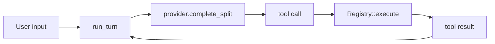

# 写作规范

这份规范用来约束 `learn-jcode-5.5` 的写法。目标不是“正式”，而是让教程像一个懂工程的人在带读源码。

## 1. 角色与读者

作者身份：我是一个读过 JCode 源码的工程同事，写这份教程给想读懂 coding-agent harness 的开发者看。语气像代码走查和学习笔记，不像发布会文案，也不像咨询报告。

读者画像：读者有技术背景，知道一点 LLM/agent，但时间有限，不想听空话；他们想直接在教程里看懂核心代码、设计边界和后续能做的小改造，不想在 IDE 和文档之间来回跳。

## 2. 风格要点

### 说人话，不堆概念

正面示例：

```text
JCode 不是每次启动一个独立 CLI。它先找本地 server，没有就拉起一个 daemon，然后 TUI client 连上去。
```

反面示例：

```text
JCode 通过先进的多端协同架构实现了高效的智能体运行时闭环。
```

### 有判断，不装中立

正面示例：

```text
如果你只想学最小 agent loop，先看 pi。JCode 太大，不适合当第一个项目。
```

反面示例：

```text
不同项目各有优劣，读者可以根据自己的需求选择合适方案。
```

### 每段都落到源码或结论

正面示例：

```text
`Registry::base_tools()` 同时决定“模型能看到什么工具”和“运行时能执行什么工具”。这就是 JCode 工具系统不把 schema 和执行器拆成两套注册表的原因。
```

反面示例：

```text
工具系统是 agent 能力的重要组成部分，对整体体验有显著提升。
```

### 引用文件时必须带读

正面示例：

```text
先打开 `src/main.rs`，只看 `main()`：它基本不处理业务，只配置 allocator 和 tokio runtime，然后把控制权交给 `jcode::run()`。下一步再跳到 `src/lib.rs`，看 `run()` 如何进入 `cli::startup::run()`。
```

反面示例：

```text
先读 `src/main.rs`、`src/lib.rs`、`src/cli/startup.rs`。
```

规则：文件路径只能作为源码出处，不要把教程写成“阅读顺序清单”。关键流程要直接摘核心代码，并说清楚“这个函数/结构体在链路里承担什么角色”。

### 带读要把核心代码放进教程

正面示例：

```rust
pub async fn run() -> Result<()> {
    cli::startup::run().await
}
```

这段代码说明 `src/lib.rs` 只是入口转发，真正启动逻辑在 `src/cli/startup.rs`。读者不需要打开 IDE 才知道这一步发生了什么。

反面示例：

```text
接着读 `src/lib.rs`，它会进入启动逻辑。
```

规则：关键流程必须给源码节选、精简版源码或结构体字段摘录。每个代码块后面必须解释“这段代码证明了什么”。不要整段搬大文件，只摘最能说明问题的 5-25 行。

### 复杂流程优先画 Mermaid

正面示例：



这张图说明 agent loop 的闭合路径。代码节选解释函数细节，Mermaid 负责让读者先看到结构。

反面示例：

```text
JCode 的 agent loop 会经过 provider、tool registry、tool result、message。
```

规则：启动链路、agent loop、tool registry、provider stream、server/client event、memory sidecar、swarm coordination 这类内容应优先配 Mermaid。图要解释状态归属或数据流，不画纯装饰图。每张图后面必须有一句解释图里最重要的边界。

### 解释设计取舍，不写功能清单

正面示例：

```text
Memory 不阻塞当前 turn。第 N 轮触发查询，第 N+1 轮用结果。这样牺牲一点即时性，换交互延迟稳定。
```

反面示例：

```text
JCode 支持 memory、session search、embedding、graph retrieval 等能力。
```

### 口吻克制，但可以直接

正面示例：

```text
不要第一天改 swarm。你还没看懂 server state，进去只会被生命周期和通信逻辑绕晕。
```

反面示例：

```text
强烈建议读者谨慎探索高级功能模块，以免产生不必要的学习成本。
```

## 3. 禁止清单

这些表达一律删掉或改写。

| 禁止类型 | 不要写 | 替换方式 |
| --- | --- | --- |
| 废话开场 | `众所周知`、`在当今 AI 时代`、`随着大模型的发展` | 直接进入问题 |
| 语气拐棍 | `说实话`、`不得不说`、`有一说一`、`值得一提的是` | 删除 |
| 商业黑话 | `赋能`、`闭环`、`抓手`、`落地`、`体系化能力` | 换成具体动作 |
| AI 味总结 | `总之`、`综上所述`、`通过以上分析可以看出` | 用一句具体判断收尾 |
| 空泛形容 | `强大`、`高效`、`灵活`、`完善`、`先进` | 写清楚强在哪里、代价是什么 |
| 模板句 | `本文将深入探讨`、`接下来我们将` | 改成“这一课读...” |
| 假客观 | `各有优劣`、`因人而异` | 给出默认建议，再说明例外 |
| 过度拟人 | `JCode 帮你轻松搞定` | 写 JCode 具体做了什么 |

例子：

```text
不要写：JCode 通过完善的工具生态赋能开发者实现高效编码闭环。
改成：JCode 把文件、shell、MCP、memory、swarm 都注册成工具。代价是 tool registry 必须处理排序、截断、alias 和动态注册。
```

## 4. 参考资料与术语

### 本地参考

- JCode: `/Users/shizi/Documents/workspace/jcode`
- pi-mono: `/Users/shizi/Documents/workspace/pi-mono`
- OpenCode: `/Users/shizi/Documents/workspace/opencode`

### 术语写法

| 术语 | 中文写法 | 说明 |
| --- | --- | --- |
| harness | harness | 不强翻成“框架”或“载具”，首次可解释为运行环境 |
| agent loop | agent loop | 保持英文，避免翻译成“智能体循环” |
| tool call | tool call | 保持英文，必要时解释为模型请求工具执行 |
| tool result | tool result | 保持英文，表示工具输出回到模型上下文 |
| provider | provider | 指模型平台适配层 |
| session | session | 指长期会话状态，不只是聊天记录 |
| TUI | TUI | 终端 UI |
| swarm | swarm | 指 JCode 的多 agent 协作 runtime |
| ambient | ambient | 指后台自主循环，不翻译成“环境模式” |
| self-dev | self-dev | 指 JCode 修改自身的模式 |

### 常见错误

- 不要把 JCode 写成“Claude Code 开源替代品”。它有相似 harness 概念，但工程取向不同。
- 不要把 memory 写成普通 RAG。JCode 重点是非阻塞召回和长期会话经验。
- 不要把 swarm 写成 subagent。swarm 关心 server-level coordination、通信、状态和文件触达。
- 不要只罗列功能。每个功能都要说明它解决什么问题、代价是什么、源码从哪里读。

### 英文版补充

英文版也保持同样语气：plain engineering notes, not marketing copy. Prefer "read this file and answer this question" over "this section explores".
