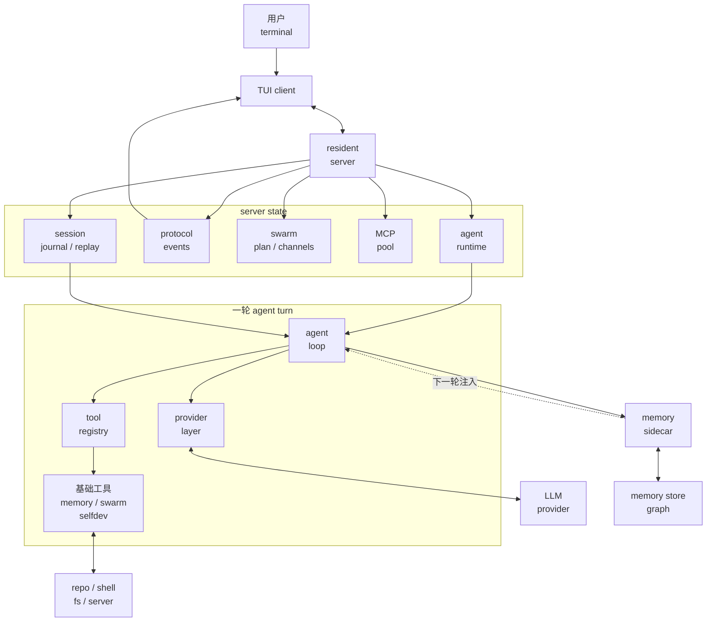

# 00 - 全局地图

## 这份教程在讲什么

先把 JCode 当成一个本地 coding agent 的运行框架看。模型决定下一步；JCode 负责把工具、上下文、权限、状态和 UI 接起来。

这份教程不要求你先跳到源码里找文件。每一课会摘出关键代码，直接解释这段代码接在哪里、为什么要这样接。

## 总架构图

这张图先看三件事：

- `TUI client` 会退出和重连，长期状态在 `resident server`。
- `agent loop` 不直接理解每家模型平台，它通过 `provider layer` 拿统一事件。
- `tool registry` 不只是基础工具集合，memory、swarm、self-dev 这些 runtime 能力也从这里进入模型可操作范围。

## 十课怎么连起来

| 课次 | 讲什么 | 在总图里的位置 |
| --- | --- | --- |
| [s01](./s01-harness-mindset.md) | 先区分模型和 harness | 整张图的读法 |
| [s02](./s02-startup-server.md) | `jcode` 启动后怎么连上 server | `TUI client`、`resident server` |
| [s03](./s03-agent-loop.md) | 一轮模型输出、工具调用、工具结果怎么循环 | `agent loop` |
| [s04](./s04-tool-system.md) | 工具 schema 和执行入口怎么统一 | `tool registry` |
| [s05](./s05-provider-session.md) | 多模型平台和长期会话怎么接 | `provider layer`、`session` |
| [s06](./s06-tui-observability.md) | TUI 怎样把 runtime 状态变成用户判断 | `protocol events`、`TUI client` |
| [s07](./s07-memory.md) | memory 为什么不阻塞主回合 | `memory sidecar` |
| [s08](./s08-swarm.md) | swarm 怎样把协作状态放进 server | `swarm state / channels` |
| [s09](./s09-ambient-selfdev.md) | ambient 和 self-dev 怎样限制风险 | `scheduler`、`selfdev tool`、`reload` |
| [s10](./s10-comparison.md) | JCode 和其他项目怎么对照 | 回到整张图做对照 |

## 读的时候先盯住四条线

第一条线是控制权：`jcode` 命令启动后，控制权从 binary 入口交到 CLI startup，再到 server/client。先理解这条线，后面才知道状态为什么要放在 server。

第二条线是模型请求：session history 经过 agent loop 整理，带上 tools 和 split prompt，交给 provider。provider stream 回来以后，JCode 把文本、tool call、usage、error 都变成内部事件。

第三条线是工具执行：模型只看到 tool definition，执行时走 registry。registry 决定工具是否可用、别名怎么解析、输出怎么截断、结果怎么回到下一轮上下文。

第四条线是长期状态：session、memory、swarm、ambient、self-dev 都不是聊天 demo 里常见的小功能。它们处理的是本地 agent 长时间工作时的状态保存、恢复、协作和自我更新。

## 读完后检查一下

- 为什么 JCode 不是一个简单 CLI wrapper。
- 为什么 server、provider、session、tool registry 必须分开看。
- 为什么 memory 和 swarm 都要进入 server/runtime 视角。
- 为什么后面每课都围绕“状态放在哪里、什么时候进入模型上下文”来讲。
