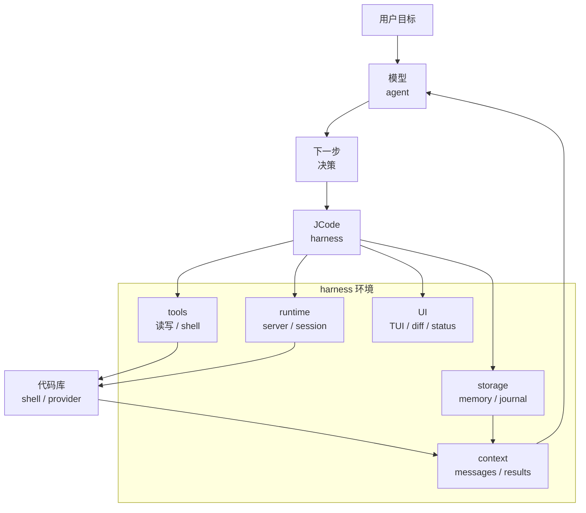

# s01 - Harness 心智

## 先定阅读角度

模型负责做决定。JCode 负责把文件、终端、状态、权限和 UI 接起来，让模型真的能在代码库里行动。

JCode 不是一个“Rust 写的聊天壳”。它是一个 coding-agent harness。

如果把它当聊天壳，后面很多代码会显得多余：server、socket、TUI、OAuth、provider catalog、session journal、memory、MCP、swarm、reload。其实这些都属于 harness，不是额外装饰。

这一节先不碰具体实现，只先说明应该从哪里看这个项目。否则后面很容易把 server、TUI、session 都误读成“额外功能”。

## Agent 和 Harness 的边界

这份教程会一直按这个判断读：模型才是 agent。模型负责判断下一步该做什么；外部工程负责给模型提供环境。

```text
Agent product = Model + Harness

Harness = Tools
        + Context
        + Runtime
        + UI
        + Storage
        + Permissions
        + Provider integration
        + Memory
```



图里最重要的关系很简单：模型负责决策，JCode 负责提供行动环境、上下文、状态和可观察性。

对 coding agent 来说，这些部分各自负责一件事：

- Tools 负责实际动作：读文件、写文件、改文件、跑命令。
- Context 负责给模型材料：当前消息、文件片段、错误日志、diff、工具结果。
- Runtime 负责长期运行：进程、server、session、后台任务。
- UI 负责让用户判断状态：流式输出、工具状态、diff、side panel。
- Storage 负责恢复：历史会话、journal、配置、账号。
- Permissions 负责限制边界：哪些命令能跑，哪些文件能写。
- Provider integration 负责接模型平台：Claude、OpenAI、Gemini、Copilot、OpenRouter、OpenAI-compatible。
- Memory 负责长期召回：用户偏好、项目事实、旧会话线索。

## 为什么要读 JCode

如果只想理解最小 agent loop，JCode 太大了。它更适合作为第二阶段项目：你已经知道 loop 和 tool call 是什么，现在想看真实项目里还要处理哪些问题。

读 JCode，主要看的是最小 loop 之外多出来的工程：

```text
玩具 agent:
LLM + tools + loop

长期运行的 coding-agent harness:
LLM + tools + loop
  + server
  + session
  + provider
  + auth
  + cache
  + compaction
  + memory
  + UI
  + permissions
  + coordination
  + recovery
```

后面的章节基本都在拆这些工程问题。

## 什么时候该读 JCode

### 和最小 harness 的距离

pi 的好处是小。它告诉你 `read/write/edit/bash` 就能撑起一个有效的 coding agent。

JCode 包得更全。它把多 provider、多 session、memory、swarm、UI、self-dev 都放进同一个本地 runtime，适合用来看这些东西接在一起之后会发生什么。

### 和平台型 coding agent 的距离

OpenCode 和 JCode 都是开源 coding agent，都有 client/server 思路。OpenCode 更偏开放平台，JCode 更偏本地运行。

### 和闭源产品的距离

Claude Code 这类产品能给我们公开行为上的参照，比如工具、权限、subagent、skills、长期任务等功能边界。但本教程不讨论、也不依赖任何非公开源码。我们只读 JCode。

## 先记住这句话

读 JCode 时先用这句话定阅读角度：

```text
模型是 agent。JCode 是让模型能在代码库里行动的 harness。
```

它不是口号，会影响你怎么看源码：

- `src/tool/` 不是“插件集合”，它定义模型能调用哪些动作。
- `src/server/` 不是“额外服务”，是长期会话和多 client 的 runtime。
- `src/provider/` 不是“一层 API wrapper”，是不同模型平台的适配层。
- `src/tui/` 不是皮肤，它决定用户怎么看 agent 当前状态。
- `src/memory*` 不是普通 RAG demo，是长期使用后的召回系统。

同时也要看代价：常驻 server 能复用状态，但会带来 reload、socket、生命周期管理这些复杂度。后面读到的大部分设计，基本都是这种好处和代价一起出现。

## 读完后检查一下

- 为什么本教程说“模型是 agent，JCode 是 harness”。
- 为什么 server、TUI、session、memory 不是可有可无的功能。
- 为什么 JCode 不适合当第一个最小 agent loop 项目。
- 为什么 JCode 更适合用长期 runtime 的角度读，而不是当作一天上手 demo。

## 这份教程怎么读

后面的章节不会要求你在 IDE 和教程之间来回切。每一课会把关键源码摘出来，直接讲函数负责什么、状态往哪里走、为什么要这样设计。路径只用于标明来源，不是让你自己去补课。

第一遍看启动过程时，只需要抓住控制权怎么移动：`main()` 交给 `jcode::run()`，再到 CLI startup，默认命令确保 server 存在，client 连接长期 runtime。教程会把这条路拆成代码节选，不要求你先翻完整 `src/server/`。

Agent loop 也是一样。你先在教程里看到正常路径：准备 messages 和 tools，调用 provider stream，收集 tool call，执行工具，把 tool result 写回下一轮。compaction、memory、native tool、soft interrupt 会在相关课程里补，不会只丢文件名。

这份教程不另开题目区。需要你知道的判断会直接放在课里；源码节选不是为了做题，而是为了让你看到某个函数时知道它为什么放在这里。
