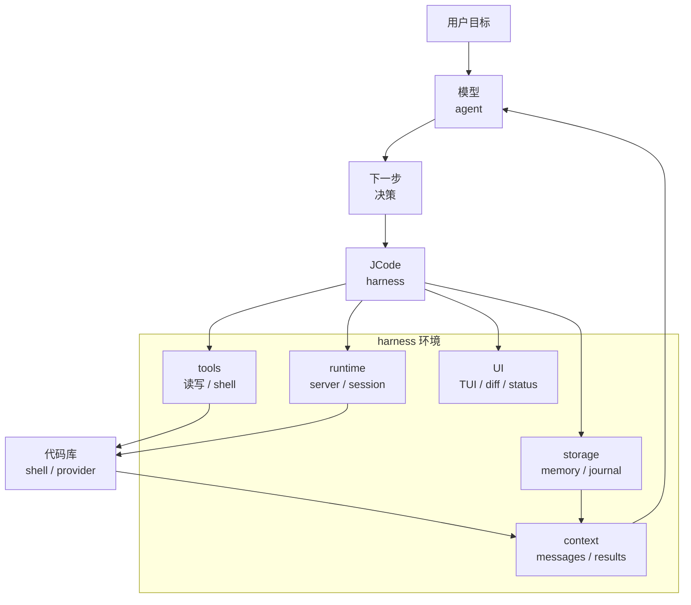

# s01 - Harness 心智

## 先说结论

**本课一句话：模型负责做决定，JCode 负责把文件、终端、状态、权限和 UI 变成模型能行动的环境。**

JCode 不是一个“Rust 写的聊天壳”。它是一个 coding-agent harness。

这句话要先理解，不然后面读源码会很痛苦。因为你会看到大量看起来和 LLM 无关的代码：server、socket、TUI、OAuth、provider catalog、session journal、memory、MCP、swarm、reload。这些不是旁枝，它们就是 harness。

本课不读具体实现，只定学习视角。视角错了，后面会把 server、TUI、session 都误读成“额外功能”。

## Agent 和 Harness 的边界

本教程的基本判断是：模型才是 agent。模型负责判断下一步该做什么。外部工程负责给模型提供环境。

```text
Agent product = Model + Harness

Harness = Tools
        + Context
        + Runtime
        + UI
        + Storage
        + Permissions
        + Provider integration
        + Memory
```



这张图说明本教程的基本立场：模型负责决策，JCode 负责提供行动环境、上下文、状态和可观察性。

对 coding agent 来说：

- Tools 是手：读文件、写文件、改文件、跑命令。
- Context 是眼睛：当前消息、文件片段、错误日志、diff、工具结果。
- Runtime 是身体：进程、server、session、后台任务。
- UI 是驾驶舱：流式输出、工具状态、diff、side panel。
- Storage 是恢复能力：历史会话、journal、配置、账号。
- Permissions 是边界：哪些命令能跑，哪些文件能写。
- Provider integration 是发动机适配层：Claude、OpenAI、Gemini、Copilot、OpenRouter、OpenAI-compatible。
- Memory 是长期经验：用户偏好、项目事实、旧会话线索。

## 为什么 JCode 值得学

如果只想理解最小 agent loop，JCode 太大了。它更适合作为第二阶段项目：你已经知道 loop 和 tool call 是什么，现在想看长期 runtime 怎么处理真实复杂度。

JCode 值得学的是产品化之后的复杂性：

```text
玩具 agent:
LLM + tools + loop

长期可用的 coding-agent harness:
LLM + tools + loop
  + server
  + session
  + provider
  + auth
  + cache
  + compaction
  + memory
  + UI
  + permissions
  + coordination
  + recovery
```

这就是 JCode 的学习价值。

## JCode 的学习位置

### 和最小 harness 的距离

pi 的价值是小。它告诉你 `read/write/edit/bash` 就能构成一个有效 coding agent。

JCode 的价值是大。它告诉你当这个 agent 要支持多 provider、多 session、memory、swarm、UI、self-dev 时，工程会长成什么样。

### 和平台型 coding agent 的距离

OpenCode 和 JCode 都是开源 coding agent，都有 client/server 思路。OpenCode 更像开放平台，JCode 更像本地高性能 runtime。

### 和闭源产品的距离

Claude Code 这类产品能给我们公开行为上的参照，比如工具、权限、subagent、skills、长期任务等能力形态。但本教程不讨论、也不依赖任何非公开源码。我们只读 JCode。

## 这课应该带走的结论

读 JCode 时先用这句话校准视角：

```text
模型是 agent。JCode 是让模型能在代码库里行动的 harness。
```

这句话不是口号。它会影响你怎么看源码：

- `src/tool/` 不是“插件集合”，是模型的手。
- `src/server/` 不是“额外服务”，是长期会话和多 client 的 runtime。
- `src/provider/` 不是“一层 API wrapper”，是不同模型平台的适配层。
- `src/tui/` 不是皮肤，是用户判断 agent 状态的驾驶舱。
- `src/memory*` 不是普通 RAG demo，是长期使用后的召回系统。

也要记住代价：常驻 server 能复用状态，但带来 reload、socket、生命周期管理这些复杂度。JCode 的每个大设计都类似，收益和代价一起出现。

## 读完你应该能解释什么

- 为什么本教程说“模型是 agent，JCode 是 harness”。
- 为什么 server、TUI、session、memory 不是旁枝功能。
- 为什么 JCode 不适合当第一个最小 agent loop 项目。
- 为什么 JCode 更适合用长期 runtime 的角度读，而不是当作一天上手 demo。

## 这份教程怎么读

后面的章节不会要求你在 IDE 和教程之间来回切。每一课会把关键源码摘出来，直接讲函数边界、状态流向和设计取舍。路径只用于标明来源，不是让你自己去补课。

第一遍理解启动链路时，只需要抓住控制权怎么移动：`main()` 交给 `jcode::run()`，再到 CLI startup，默认命令确保 server 存在，client 连接长期 runtime。教程会把这条链路拆成代码节选，不要求你先翻完整 `src/server/`。

Agent loop 也是一样。你先在教程里看到正常路径：准备 messages 和 tools，调用 provider stream，收集 tool call，执行工具，把 tool result 写回下一轮。compaction、memory、native tool、soft interrupt 会在相关课程里补，不会只丢文件名。

这份教程不另开题目区。需要你知道的判断会直接放在课里，因为源码导读的价值不在“做题”，而在你读到某个函数时知道它为什么在这里。
