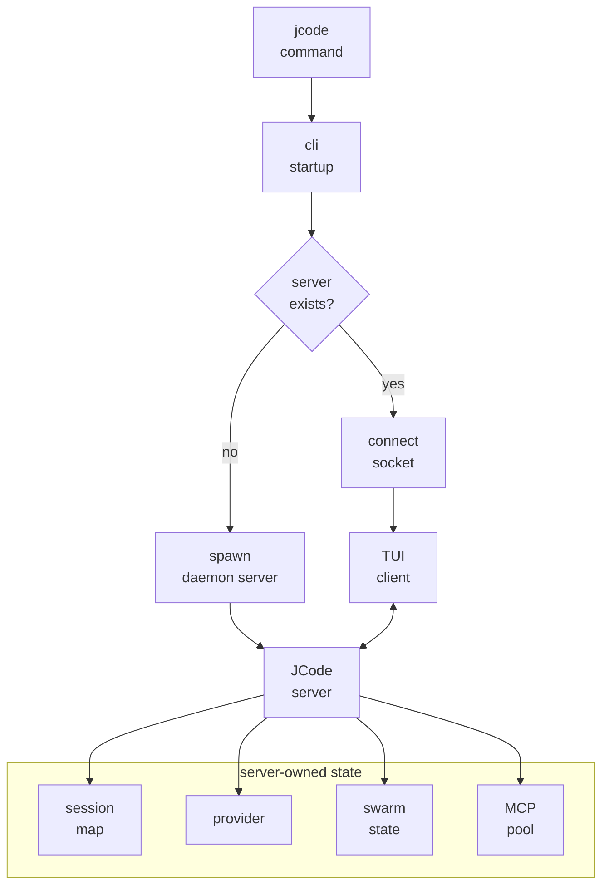

# s02 - 启动链路和常驻 Server

## 本课目标

**本课一句话：`jcode` 命令不是一次性 CLI，它先把你接到一个会长期持有状态的本地 server。**

读懂 `jcode` 命令启动以后发生什么。

JCode 的启动链路是理解整个项目的第一把钥匙。它不是每次运行都创建一个孤立 CLI 进程，而是会连接或启动一个本地 server。

## 启动链路图

把本课内容先压成一张图：



JCode 不把所有状态放在 TUI client 里，因为 client 会断开、重启、重连。session、provider、MCP pool、swarm state 这些状态放在 server，才能支撑长期会话和多 client。代价是 server 必须承担生命周期、socket、reload 和状态恢复。

## 本课直接讲清楚的主线

启动链路的控制权移动很短：binary 入口只创建 tokio runtime，crate root 只转发到 CLI startup，startup 做进程级准备，dispatch 决定是进入 `serve` 还是默认 client 路径。

默认 `jcode` 命令不会直接创建 agent。它先判断 server 是否存在：没有就启动同一个 binary 的 `serve` 子命令，有就连接本地 socket。这样第一次运行会拉起常驻 server，后面的 client 可以断开、重连，而 session、provider、MCP pool、swarm state 仍留在 server。

下面的代码节选会把这条线压成四段：入口交权、startup 准备、dispatch 选择、server runtime 承载状态。读完这四段，就能解释为什么 JCode 是 resident-server 架构，不是普通 CLI wrapper。

## 核心代码节选

下面代码摘自本地 JCode 当前 revision，部分为了讲解做了精简。读概念看这里，改代码以源码为准。

先把入口压成三段代码。读者不需要打开 IDE，也能看到控制权怎么从 binary 交到 CLI。

```rust
// src/main.rs，节选
fn main() -> Result<()> {
    configure_system_allocator();

    let runtime = tokio::runtime::Builder::new_multi_thread()
        .enable_all()
        .build()?;

    runtime.block_on(async { jcode::run().await })
}
```

这段代码证明 `main()` 不处理 agent 逻辑。它只准备 Rust 进程环境和 tokio runtime，然后把事情交给 `jcode::run()`。

```rust
// src/lib.rs，节选
pub async fn run() -> Result<()> {
    cli::startup::run().await
}
```

这段更直接：crate root 只是转发。真正的启动逻辑不在 `lib.rs`，而在 `src/cli/startup.rs`。

```rust
// src/cli/startup.rs，精简版
pub async fn run() -> Result<()> {
    startup_profile::init();
    terminal::install_panic_hook();
    logging::init();
    storage::harden_user_config_permissions();
    perf::init_background();
    telemetry::record_install_if_first_run();

    let args = parse_and_prepare_args()?;
    spawn_background_update_check(&args);
    dispatch::run_main(args).await?;
    Ok(())
}
```

这里能看出 `startup` 的边界：它做进程级准备和参数预处理，不创建 agent，不执行工具，也不直接渲染 TUI。它最后只做一件事：把 `Args` 交给 `dispatch`。

默认启动路径的关键分支在 `src/cli/dispatch.rs`：

```rust
// src/cli/dispatch.rs，节选
if !server_running {
    maybe_prompt_server_bootstrap_login(&args.provider).await?;
    spawn_server(
        &args.provider,
        args.model.as_deref(),
        args.provider_profile.as_deref(),
    )
    .await?;
}

tui_launch::run_tui_client(
    args.resume,
    startup_hints,
    !server_running,
    args.fresh_spawn,
)
.await?;
```

这段代码把 JCode 的启动模型讲清楚了：默认命令不是“新建一个本地 agent 然后开始聊天”，而是先保证 server 存在，再启动 TUI client 去连接它。

server 侧的状态也可以直接从结构体看出来：

```rust
// src/server/runtime.rs，字段节选
struct ServerRuntime {
    sessions: Arc<RwLock<HashMap<String, Arc<Mutex<Agent>>>>>,
    event_tx: broadcast::Sender<ServerEvent>,
    provider: Arc<dyn Provider>,
    client_connections: Arc<RwLock<HashMap<String, ClientConnectionInfo>>>,
    swarm_state: SwarmState,
    shared_context: Arc<RwLock<HashMap<String, HashMap<String, SharedContext>>>>,
    mcp_pool: Arc<OnceCell<Arc<SharedMcpPool>>>,
    shutdown_signals: Arc<RwLock<HashMap<String, InterruptSignal>>>,
}
```

这不是一个薄代理。`sessions`、`provider`、`swarm_state`、`mcp_pool` 都在 server runtime 里，说明长期会话、多 client、MCP、swarm 都依赖这个常驻进程。

## 启动链路

简化以后是：

```text
jcode
  -> src/main.rs
  -> jcode::run()
  -> cli::startup::run()
  -> 检查本机有没有 JCode server
  -> 没有就启动 daemon server
  -> TUI client 连接 server socket
  -> server 管 sessions/provider/MCP/swarm/events
```

这就是 JCode 和普通“一次性 CLI agent”的差别。

## 为什么要有 server

如果没有 server，每开一个终端就是一个完整 agent 进程。这样简单，但多会话会很重，状态复用也差。

JCode 的 server 负责：

- 保存多个 session。
- 管理 provider。
- 管理 MCP shared pool。
- 管理 swarm runtime。
- 广播 UI events。
- 支持 client 断开后重连。
- 支持 `/reload` 后继续工作。

你可以把 client 理解成显示器和键盘，把 server 理解成真正运行 agent 的地方。

这个设计的代价也要记住：server 需要处理断连、重连、idle timeout、reload、状态持久化。JCode 不是“多一个 server 更高级”，而是用复杂度换长期会话体验。

## `ServerRuntime` 里值得看的字段

在 `src/server/runtime.rs` 里能看到很多核心状态：

```text
sessions
event_tx
provider
client_connections
swarm_state
shared_context
file_touches
channel_subscriptions
mcp_pool
shutdown_signals
soft_interrupt_queues
```

这些字段说明 JCode 的 server 不只是“转发消息”。它是会话、协作、工具、UI 事件的中心。

## 机制标本

如果常驻 server/client 的边界还不清楚，可以看 [mini/01_server_client.py](../../mini/01_server_client.py)。它只保留一个点：server 拥有 session，client 可以断开再连回来。

这个标本不复刻 socket、TUI 或 provider，只用几十行代码说明为什么 session 不应该绑死在 client 进程上。看完再回到本课，`ServerRuntime` 里那些字段会更容易放回位置。

## 读完你应该能解释什么

- 第一次运行 `jcode` 和第二次运行有什么区别。
- client 退出以后 server 会不会马上死？
- 为什么 JCode 可以支持多个 client。
- `/reload` 为什么需要 server 参与。
- 为什么 session、provider、MCP pool、swarm state 要放在 server，而不是 TUI client。
