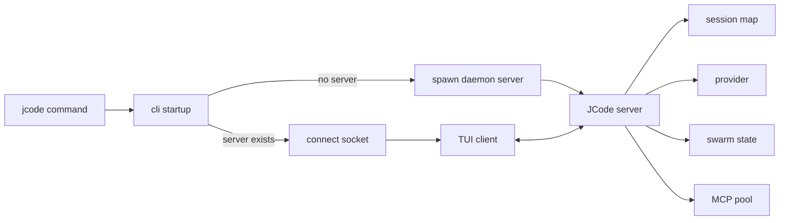

# s02 - 启动链路和常驻 Server

## 本课目标

读懂 `jcode` 命令启动以后发生什么。

JCode 的启动链路是理解整个项目的第一把钥匙。它不是每次运行都创建一个孤立 CLI 进程，而是会连接或启动一个本地 server。

## 先读这些文件

```text
src/main.rs
src/lib.rs
src/cli/startup.rs
src/cli/dispatch.rs
src/server.rs
src/server/runtime.rs
docs/SERVER_ARCHITECTURE.md
docs/MULTI_SESSION_CLIENT_ARCHITECTURE.md
```

不要先读整个 `src/server/`。先把启动链路追通，再回来看 server 子模块。不然你会同时遇到 client lifecycle、swarm、comm、debug socket、reload，信息量太大。

## 这组文件怎么读

先打开 `src/main.rs`，只看 `main()`。这里不要找业务逻辑，它只做两件事：配置 allocator，创建 tokio multi-thread runtime，然后 `block_on(jcode::run())`。读到这里就停，入口已经交出去了。

接着跳到 `src/lib.rs`，看 `run()`。它只有一层转发：`cli::startup::run().await`。这说明 crate root 不是业务入口，真正启动逻辑在 CLI 层。

第三步读 `src/cli/startup.rs` 的 `run()`。按顺序看它做了什么：初始化 startup profile、panic hook、logging、权限修复、perf、telemetry，然后调用 `parse_and_prepare_args()`，最后把 `Args` 交给 `dispatch::run_main(args)`。这里的判断是：startup 负责进程级准备，不负责决定 agent 怎么跑。

第四步到 `src/cli/dispatch.rs`，先看 `run_main()` 的 `match args.command`。如果命令是 `serve`，它初始化 provider，创建 `server::Server::new(provider)`，然后 `server.run().await`。如果没有显式命令，就继续看 `run_default_command()`。

`run_default_command()` 是默认 `jcode` 命令的关键。先看它怎么判断当前目录是不是 JCode repo，并设置 self-dev session 标记；再看 `server_is_running()`、`wait_for_existing_reload_server()`、`spawn_server()` 这一段。你要读到的结论是：普通启动路径不是直接创建 agent，而是先保证本地 server 存在。

然后读同一个文件里的 `spawn_server()`。重点看 socket path、spawn lock、`ProcessCommand` 参数。它启动的是同一个 binary，但追加 `serve` 子命令，并把 stdout 丢掉、stderr 接起来。这个函数解释了为什么第一次运行会拉 daemon，第二次运行只需要连 socket。

最后再看 `src/server.rs` 的 `Server::run()` 和 `src/server/runtime.rs` 的 `ServerRuntime`。`Server::run()` 负责绑定 main/debug socket、设置 owner-only 权限、清理 stale reload marker、启动后台任务和 accept loop。`ServerRuntime` 负责把 `sessions`、`provider`、`event_tx`、`swarm_state`、`mcp_pool` 等状态传给 `handle_client()`。读到这里，server 才从“后台进程”变成“长期 runtime”。

文档 `docs/SERVER_ARCHITECTURE.md` 和 `docs/MULTI_SESSION_CLIENT_ARCHITECTURE.md` 放在最后读。先看源码，再用文档校准你画出来的流程图。反过来读容易记住概念，但不知道概念落在哪个函数上。

## 核心代码节选

先把入口压成三段代码。读者不需要打开 IDE，也能看到控制权怎么从 binary 交到 CLI。

```rust
// src/main.rs，节选
fn main() -> Result<()> {
    configure_system_allocator();

    let runtime = tokio::runtime::Builder::new_multi_thread()
        .enable_all()
        .build()?;

    runtime.block_on(async { jcode::run().await })
}
```

这段代码证明 `main()` 不处理 agent 逻辑。它只准备 Rust 进程环境和 tokio runtime，然后把事情交给 `jcode::run()`。

```rust
// src/lib.rs，节选
pub async fn run() -> Result<()> {
    cli::startup::run().await
}
```

这段更直接：crate root 只是转发。真正的启动逻辑不在 `lib.rs`，而在 `src/cli/startup.rs`。

```rust
// src/cli/startup.rs，精简版
pub async fn run() -> Result<()> {
    startup_profile::init();
    terminal::install_panic_hook();
    logging::init();
    storage::harden_user_config_permissions();
    perf::init_background();
    telemetry::record_install_if_first_run();

    let args = parse_and_prepare_args()?;
    spawn_background_update_check(&args);
    dispatch::run_main(args).await?;
    Ok(())
}
```

这里能看出 `startup` 的边界：它做进程级准备和参数预处理，不创建 agent，不执行工具，也不直接渲染 TUI。它最后只做一件事：把 `Args` 交给 `dispatch`。

默认启动路径的关键分支在 `src/cli/dispatch.rs`：

```rust
// src/cli/dispatch.rs，节选
if !server_running {
    maybe_prompt_server_bootstrap_login(&args.provider).await?;
    spawn_server(
        &args.provider,
        args.model.as_deref(),
        args.provider_profile.as_deref(),
    )
    .await?;
}

tui_launch::run_tui_client(
    args.resume,
    startup_hints,
    !server_running,
    args.fresh_spawn,
)
.await?;
```

这段代码把 JCode 的启动模型讲清楚了：默认命令不是“新建一个本地 agent 然后开始聊天”，而是先保证 server 存在，再启动 TUI client 去连接它。

server 侧的状态也可以直接从结构体看出来：

```rust
// src/server/runtime.rs，字段节选
struct ServerRuntime {
    sessions: Arc<RwLock<HashMap<String, Arc<Mutex<Agent>>>>>,
    event_tx: broadcast::Sender<ServerEvent>,
    provider: Arc<dyn Provider>,
    client_connections: Arc<RwLock<HashMap<String, ClientConnectionInfo>>>,
    swarm_state: SwarmState,
    shared_context: Arc<RwLock<HashMap<String, HashMap<String, SharedContext>>>>,
    mcp_pool: Arc<OnceCell<Arc<SharedMcpPool>>>,
    shutdown_signals: Arc<RwLock<HashMap<String, InterruptSignal>>>,
}
```

这不是一个薄代理。`sessions`、`provider`、`swarm_state`、`mcp_pool` 都在 server runtime 里，说明长期会话、多 client、MCP、swarm 都依赖这个常驻进程。

## 启动链路

简化以后是：

```text
jcode
  -> src/main.rs
  -> jcode::run()
  -> cli::startup::run()
  -> 检查本机有没有 JCode server
  -> 没有就启动 daemon server
  -> TUI client 连接 server socket
  -> server 管 sessions/provider/MCP/swarm/events
```

这就是 JCode 和普通“一次性 CLI agent”的差别。

## 为什么要有 server

如果没有 server，每开一个终端就是一个完整 agent 进程。这样简单，但多会话会很重，状态复用也差。

JCode 的 server 负责：

- 保存多个 session。
- 管理 provider。
- 管理 MCP shared pool。
- 管理 swarm runtime。
- 广播 UI events。
- 支持 client 断开后重连。
- 支持 `/reload` 后继续工作。

你可以把 client 理解成显示器和键盘，把 server 理解成真正运行 agent 的地方。

这个设计的代价也要记住：server 需要处理断连、重连、idle timeout、reload、状态持久化。JCode 不是“多一个 server 更高级”，而是用复杂度换长期会话体验。

## `ServerRuntime` 里值得看的字段

在 `src/server/runtime.rs` 里能看到很多核心状态：

```text
sessions
event_tx
provider
client_connections
swarm_state
shared_context
file_touches
channel_subscriptions
mcp_pool
shutdown_signals
soft_interrupt_queues
```

这些字段说明 JCode 的 server 不只是“转发消息”。它是会话、协作、工具、UI 事件的中心。

## 你应该能回答的问题

读完本课后，回答这些问题：

- 第一次运行 `jcode` 和第二次运行有什么区别？
- client 退出以后 server 会不会马上死？
- 为什么 JCode 可以多 client？
- `/reload` 为什么需要 server 参与？
- swarm state 为什么放在 server，而不是某个 agent 自己的 messages 里？

## 启动链路图

把本课内容压成一张图就是：



JCode 不把所有状态放在 TUI client 里，因为 client 会断开、重启、重连。session、provider、MCP pool、swarm state 这些状态放在 server，才能支撑长期会话和多 client。代价是 server 必须承担生命周期、socket、reload 和状态恢复。
