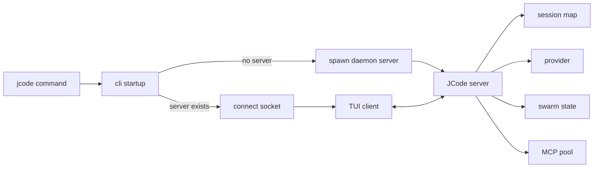

# s02 - 启动链路和常驻 Server

## 本课目标

读懂 `jcode` 命令启动以后发生什么。

JCode 的启动链路是理解整个项目的第一把钥匙。它不是每次运行都创建一个孤立 CLI 进程，而是会连接或启动一个本地 server。

## 先读这些文件

```text
src/main.rs
src/lib.rs
src/cli/startup.rs
src/cli/dispatch.rs
src/server.rs
src/server/runtime.rs
docs/SERVER_ARCHITECTURE.md
docs/MULTI_SESSION_CLIENT_ARCHITECTURE.md
```

## 启动链路

简化以后是：

```text
jcode
  -> src/main.rs
  -> jcode::run()
  -> cli::startup::run()
  -> 检查本机有没有 JCode server
  -> 没有就启动 daemon server
  -> TUI client 连接 server socket
  -> server 管 sessions/provider/MCP/swarm/events
```

这就是 JCode 和普通“一次性 CLI agent”的差别。

## 为什么要有 server

如果没有 server，每开一个终端就是一个完整 agent 进程。这样简单，但多会话会很重，状态复用也差。

JCode 的 server 负责：

- 保存多个 session。
- 管理 provider。
- 管理 MCP shared pool。
- 管理 swarm runtime。
- 广播 UI events。
- 支持 client 断开后重连。
- 支持 `/reload` 后继续工作。

你可以把 client 理解成显示器和键盘，把 server 理解成真正运行 agent 的地方。

## `ServerRuntime` 里值得看的字段

在 `src/server/runtime.rs` 里能看到很多核心状态：

```text
sessions
event_tx
provider
client_connections
swarm_state
shared_context
file_touches
channel_subscriptions
mcp_pool
shutdown_signals
soft_interrupt_queues
```

这些字段说明 JCode 的 server 不只是“转发消息”。它是会话、协作、工具、UI 事件的中心。

## 你应该能回答的问题

读完本课后，回答这些问题：

- 第一次运行 `jcode` 和第二次运行有什么区别？
- client 退出以后 server 会不会马上死？
- 为什么 JCode 可以多 client？
- `/reload` 为什么需要 server 参与？
- swarm state 为什么放在 server，而不是某个 agent 自己的 messages 里？

## 练习

画一张启动链路图：



然后用自己的话解释：为什么 JCode 不直接把所有状态放在 TUI client 里。
