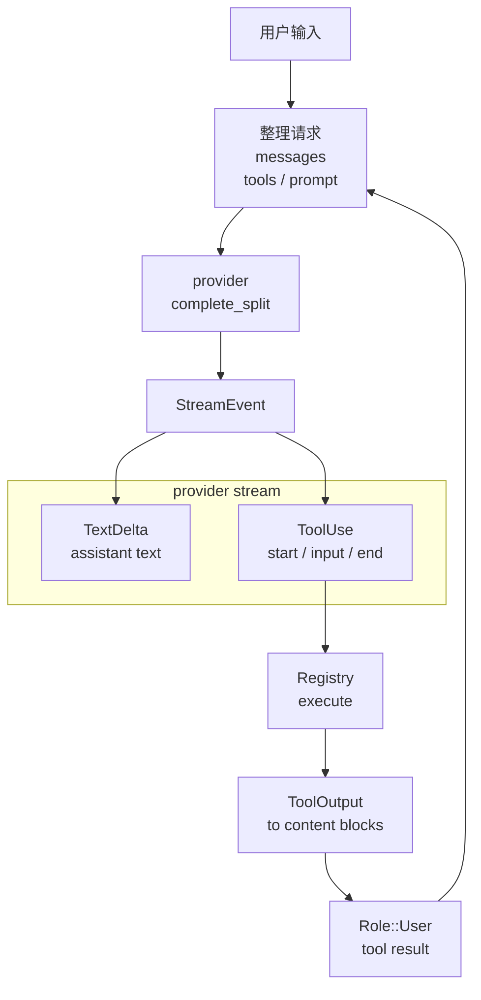

# s03 - Agent Loop

## 先看一轮对话怎么跑

JCode 外围工程很多，但最里面那圈并不复杂：模型提出 tool call，runtime 执行工具，结果再回到下一轮上下文。

追踪一次用户输入如何变成：

```text
模型输出 -> 工具调用 -> 工具结果 -> 下一轮模型输入
```

后面多数细节，都是为了让这条 loop 在真实项目里跑稳。

## 最小 Agent Loop

最小 loop 长这样：

```text
messages
  -> LLM
  -> assistant text or tool_use
  -> execute tool
  -> append tool_result
  -> LLM
  -> ...
```

不要把 agent loop 想复杂。复杂的是 loop 旁边的缓存、压缩、stream、memory、UI event 和错误恢复。



图里只保留正常路径：模型流式输出，JCode 收集 tool call，执行工具，再把 tool result 写回下一轮 messages。compaction、memory、UI event 都是在这条路径旁边补上的工程。

## 先看正常路径

Agent loop 的正常路径分三段。第一段是请求前准备：修复缺失的 tool result、整理 provider messages、生成工具定义、取上一轮 memory pending result、构造 split prompt。JCode 不是把聊天记录原样丢给模型。

第二段是 provider stream：模型流式输出文本，同时用 `ToolUseStart`、`ToolInputDelta`、`ToolUseEnd` 拼出工具调用。这里的关键不是 event 名字，而是 JCode 要把“模型一边说话一边组 JSON 参数”的过程恢复成可执行的 `ToolCall`。

第三段是工具结果写回：registry 执行工具，工具输出被转成 provider 能理解的 `ToolResult` content block，再作为下一轮 `Role::User` message 进入 history。session 保存的是这条完整循环后的历史，不只是 assistant 文本。

## 核心代码节选

下面代码摘自本地 JCode 当前 revision，部分为了讲解做了精简。读概念看这里，改代码以源码为准。

`run_turn()` 的第一段不是模型调用，而是整理请求材料：

```rust
// src/agent/turn_loops.rs，精简版
loop {
    let repaired = self.repair_missing_tool_outputs();
    let (messages, compaction_event) = self.messages_for_provider();
    let tools = self.tool_definitions().await;

    let memory_pending =
        self.build_memory_prompt_nonblocking_shared(messages.clone(), None);

    let split_prompt = self.build_system_prompt_split(None);

    let mut stream = self.provider.complete_split(
        &messages_with_memory,
        &tools,
        &split_prompt.static_part,
        &split_prompt.dynamic_part,
        self.provider_session_id.as_deref(),
    ).await?;
}
```

这里可以看出，JCode 的 agent loop 不是直接把聊天记录丢给模型。它先修 history，必要时 compact，再生成 tools、取上一轮 memory 结果，最后用 split prompt 调 provider。

stream 事件里，先只看 tool call 相关的四个分支：

```rust
// src/agent/turn_loops.rs，精简版
match event {
    StreamEvent::TextDelta(text) => {
        text_content.push_str(&text);
    }
    StreamEvent::ToolUseStart { id, name } => {
        current_tool = Some(ToolCall { id, name, input: Value::Null, intent: None });
        current_tool_input.clear();
    }
    StreamEvent::ToolInputDelta(delta) => {
        current_tool_input.push_str(&delta);
    }
    StreamEvent::ToolUseEnd => {
        let tool_input = serde_json::from_str(&current_tool_input)
            .unwrap_or(Value::Null);
        tool.input = tool_input;
        tool_calls.push(tool);
    }
    _ => {}
}
```

这里能看到 provider stream 和 tool call 的关系：模型不是一次性给出完整 JSON，JCode 会把 input delta 拼起来，等 `ToolUseEnd` 再解析成 `ToolCall`。

工具执行和结果回填是下一段：

```rust
// src/agent/turn_loops.rs，节选
let result = self.registry.execute(&tc.name, tc.input.clone(), ctx).await;

match result {
    Ok(output) => {
        let blocks = tool_output_to_content_blocks(tc.id, output);
        self.add_message_with_duration(Role::User, blocks, Some(duration_ms));
    }
    Err(e) => {
        self.add_message_with_duration(
            Role::User,
            vec![ContentBlock::ToolResult {
                tool_use_id: tc.id,
                content: format!("Error: {}", e),
                is_error: Some(true),
            }],
            Some(duration_ms),
        );
    }
}
```

这一步把 agent loop 接回下一轮：模型发 tool call，registry 执行工具，工具结果被写回成下一轮 `Role::User` message。少了这一步，模型就看不到工具结果。

再看转换函数：

```rust
// src/agent/tools.rs，节选
pub(super) fn tool_output_to_content_blocks(
    tool_use_id: String,
    output: ToolOutput,
) -> Vec<ContentBlock> {
    let mut blocks = vec![ContentBlock::ToolResult {
        tool_use_id,
        content: output.output,
        is_error: None,
    }];

    for img in output.images {
        blocks.push(ContentBlock::Image {
            media_type: img.media_type,
            data: img.data,
        });
    }

    blocks
}
```

这说明 JCode 的工具结果不只是文本。工具可以返回图片，最终都被转成 provider 能继续消费的 content blocks。

## JCode 一轮 turn 做什么

在 `run_turn()` 里，大致会发生：

1. 修复缺失 tool output，避免 provider 拒绝消息。
2. 生成 provider messages，必要时 compact。
3. 构建 tool definitions。
4. 获取上一轮算好的 memory prompt。
5. 构建 split system prompt。
6. 调 provider 的 `complete_split()`。
7. 解析 stream event。
8. 收集 tool calls。
9. 执行工具。
10. 把 tool output 转成 content blocks。
11. 如果还有工具调用，继续 loop。

后面讲 tool、provider、memory，都会回到这条路径上。

## 为什么要 split system prompt

JCode 会把 prompt 分成 static 和 dynamic 部分。原因很直接：有些 provider 有 prompt cache，静态部分稳定，缓存命中更好。

Memory、时间、动态状态这类内容如果混进静态 prefix，会破坏 cache。

这类细节就是 harness 和 demo 的区别。demo 只关心能不能答；harness 还要关心长期成本和延迟。

## Memory 为什么在这里出现

在 turn loop 里你会看到 memory 注入。JCode 的 memory 不是同步阻塞查询，而是：

```text
第 N 轮上下文 -> 后台 memory 查询
查询结果 -> 第 N+1 轮注入
```

这样主 agent 不会因为 memory search 变慢。

这是一种取舍：memory 不是每次都立刻最完整，但交互不会被检索拖住。后面讲 memory 时，也会沿着这个取舍看。

## Tool Result 怎么回到模型

工具执行后会返回 `ToolOutput`。然后 `tool_output_to_content_blocks()` 把它转成 provider 能理解的 content block。

可以按这条路追：

```text
StreamEvent::ToolUseStart
  -> ToolCall
  -> Registry::execute()
  -> ToolOutput
  -> tool_output_to_content_blocks()
  -> Message
  -> 下一轮 provider call
```

## 一条工具调用路径

读 `ls` 或 `read` 时，把路径按下面这条线看：

```text
模型如何看到这个工具定义？
模型如何发起 tool call？
JCode 如何解析 tool input？
工具在哪里 execute？
工具结果如何进入下一轮 messages？
```

对应到源码，大致是：

```text
Registry::definitions()
  -> provider complete_split()
  -> StreamEvent::ToolUseStart / ToolInputDelta / ToolUseEnd
  -> Registry::execute()
  -> Tool::execute()
  -> ToolOutput
  -> tool_output_to_content_blocks()
  -> next provider messages
```

只记“JCode 支持工具调用”没有意义。更重要的是看清函数和数据结构怎么接起来。

## 最小复现

Agent loop 的 provider stream 部分可以对照 [mini/03_provider_stream.py](../../mini/03_provider_stream.py)。它只保留 text delta、tool use start、tool input delta、tool use end 这条线。

这个最小复现只把“模型流式拼 JSON tool input”单独拎出来。真实 JCode 要处理更多事件、错误、usage、native tool call 和 session 保存，但这条路不变：把 stream 组装成可执行工具调用，再把 tool result 放回下一轮 messages。

## 读完后检查一下

- `run_turn()` 为什么先整理 messages、tools、memory 和 split prompt。
- `ToolUseStart`、`ToolInputDelta`、`ToolUseEnd` 怎么拼成一个 `ToolCall`。
- `Registry::execute()` 的结果为什么要转成 `ContentBlock::ToolResult`。
- memory 为什么用上一轮 pending result，而不是每轮同步检索。
