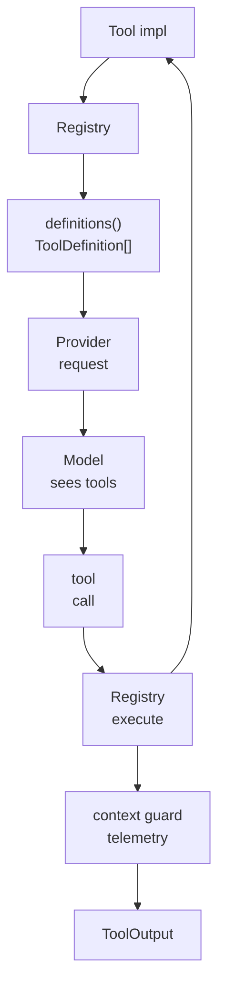

# s04 - 工具系统

## 本课目标

**本课一句话：工具系统的难点不是工具数量，而是 schema、执行器、权限、截断和事件要走同一条 registry 边界。**

看懂 JCode 怎样把工具交给模型。

工具系统是 coding-agent harness 的核心。没有工具，模型只能聊天。有了工具，模型才能读代码、改代码、跑测试、查历史、和其他 agent 协作。



这张图把工具系统的两条线放在一起：`definitions()` 是给模型看的 schema，`execute()` 是 runtime 真正执行工具的入口。两条线都从 `Tool` trait 和 `Registry` 出发。

## 本课直接讲清楚的主线

工具系统先看合同：每个工具都要同时给出模型可见的 schema 和 runtime 可调用的 `execute()`。这就是 `Tool` trait 的意义。模型看到的是 `ToolDefinition`，真正执行时走 registry。

Registry 不是一个普通 map。它同时管理 base tools、session-specific tools、skill registry、compaction 相关状态、allowed tool 过滤、别名解析、telemetry、错误和输出截断。下面的代码节选会直接展示这几层，不需要读者自己从一堆工具文件里拼。

JCode 把基础 coding 工具和 harness 工具放在同一个系统里：`read/write/edit/bash/grep/ls` 是手，`memory/selfdev/swarm/side_panel/mcp` 是环境能力。这个统一 registry 是 agent loop 能把模型 tool call 变成真实行为的关键。

## 核心代码节选

下面代码摘自本地 JCode 当前 revision，部分为了讲解做了精简。读概念看这里，改代码以源码为准。

工具系统先看合同，不看具体工具：

```rust
// src/tool/mod.rs，节选
pub trait Tool: Send + Sync {
    fn name(&self) -> &str;
    fn description(&self) -> &str;
    fn parameters_schema(&self) -> Value;
    async fn execute(&self, input: Value, ctx: ToolContext) -> Result<ToolOutput>;

    fn to_definition(&self) -> ToolDefinition {
        ToolDefinition {
            name: self.name().to_string(),
            description: self.description().to_string(),
            input_schema: self.parameters_schema(),
        }
    }
}
```

这段代码把工具的两面都放在一起：`to_definition()` 给模型看，`execute()` 给 runtime 调。很多 demo 只写 function call，JCode 这里已经把 provider schema 和执行入口分开了。

`Registry::base_tools()` 能看出 JCode 默认给模型哪些手：

```rust
// src/tool/mod.rs，精简版
fn base_tools(skills: &Arc<RwLock<SkillRegistry>>) -> HashMap<String, Arc<dyn Tool>> {
    static BASE: OnceLock<HashMap<String, Arc<dyn Tool>>> = OnceLock::new();
    let base = BASE.get_or_init(|| {
        let mut m = HashMap::new();
        insert(&mut m, "read", ReadTool::new());
        insert(&mut m, "write", WriteTool::new());
        insert(&mut m, "edit", EditTool::new());
        insert(&mut m, "bash", BashTool::new());
        insert(&mut m, "memory", MemoryTool::new());
        insert(&mut m, "swarm", CommunicateTool::new());
        insert(&mut m, "selfdev", SelfDevTool::new());
        m
    });
    let mut tools = base.clone();
    insert(&mut tools, "skill_manage", SkillTool::new(skills.clone()));
    tools
}
```

这是精简版，但足够说明结构：基础 coding 工具和 harness 级工具注册在同一个 registry 里。`OnceLock` 说明这些 base tools 被缓存，不会每个 session 都重新构造一遍。

session-specific tools 单独插入：

```rust
// src/tool/mod.rs，节选
let mut tools_map = Self::base_tools(&skills);

Self::insert_tool(
    &mut tools_map,
    "subagent",
    task::SubagentTool::new(provider, registry.clone()),
);
Self::insert_tool(
    &mut tools_map,
    "batch",
    batch::BatchTool::new(registry.clone()),
);
Self::insert_tool(
    &mut tools_map,
    "conversation_search",
    conversation_search::ConversationSearchTool::new(compaction),
);
```

`subagent` 需要 provider，`batch` 需要 registry，`conversation_search` 需要 compaction。它们不能像 `read` 那样全局缓存，这就是工具注册里“基础能力”和“会话能力”的边界。

最后看执行入口：

```rust
// src/tool/mod.rs，节选
pub async fn execute(&self, name: &str, input: Value, ctx: ToolContext)
    -> Result<ToolOutput>
{
    let resolved_name = Self::resolve_tool_name(name);
    let tool = tools.get(resolved_name)
        .ok_or_else(|| anyhow!("Unknown tool: {}", name))?
        .clone();

    let result = tool.execute(input.clone(), ctx).await;
    telemetry::record_tool_execution(resolved_name, &input, result.is_ok(), latency_ms);

    let output = result?;
    Ok(self.guard_context_overflow(name, output).await)
}
```

这段代码说明 registry 不只是查表。它还处理 alias、telemetry、错误和上下文截断。工具越多，这一层越重要。

## Tool trait

JCode 的工具统一实现 `Tool` trait：

```text
name()
description()
parameters_schema()
execute(input, ctx)
```

这套接口解决四个问题：

- 模型能看到工具名和说明。
- provider 能看到 JSON schema。
- runtime 能执行工具。
- UI/telemetry 能观察工具调用。

## 工具分类

### 基础 coding 工具

```text
read
write
edit
multiedit
patch
apply_patch
glob
grep
ls
bash
open
```

这些对应 coding agent 最基础的行动能力。

### 增强工具

```text
agentgrep
browser
webfetch
websearch
codesearch
lsp
side_panel
session_search
conversation_search
```

这些不是最小 agent 必需，但能显著改善效率和可观察性。

这里不要只数工具数量。工具越多，越容易污染 prompt、撑爆上下文、让模型误选工具。JCode 的重点是工具治理，不是“工具越多越好”。

### Harness 级工具

```text
subagent
batch
swarm
memory
goal
todo
mcp
skill_manage
schedule
selfdev
```

这些工具已经不是普通函数调用，而是在操作 JCode 的运行时能力。

## Registry 做了什么

`Registry::base_tools()` 负责注册基础工具。注意几个实现细节：

- 用 `OnceLock` 缓存 base tools，减少每个 session 的初始化成本。
- `skill_manage` 需要 skills registry，所以单独插入。
- `subagent`、`batch`、`conversation_search` 是 session-specific，因为需要 provider 或 registry。
- tool definitions 会按名字排序，减少 prompt cache 抖动。
- tool output 会被 context guard 截断，防止撑爆上下文。
- MCP 工具可以在后台连接后动态注册。

这就是 JCode 和玩具 demo 的差距。工具多了以后，问题不再是“怎么 call function”，而是“怎么治理工具生态”。

## 和 pi-mono 的差异

pi 的默认哲学更克制：`read/write/edit/bash` 就够强。

JCode 的哲学更像：基础工具要强，同时把 memory、MCP、subagent、swarm、side panel 这类 harness 能力也变成工具。

这不是谁对谁错。差异在目标：

```text
pi: 最小有效 coding harness
JCode: 长期多会话本地 agent runtime
```

读到这里要能说出代价：pi 小，所以容易改；JCode 大，所以必须处理缓存、截断、动态注册、权限和 UI 状态。

## 最小复现

工具 registry 可以对照 [mini/02_tool_registry.py](../../mini/02_tool_registry.py)。它只保留一个工具注册表，同时产出 model-visible definition 和 runtime execution。

这个最小复现能帮助你固定两层边界：模型看见的是 name、description、schema；runtime 调用的是 handler。JCode 的 `Registry` 更复杂，但复杂度主要加在 allowed tools、alias、telemetry、context guard 和 session-specific tools 上。

## 一个小改造应该长什么样

如果要给 JCode 加一个入门级工具，`repo_summary` 是合适例子。它是只读工具，输出：

```text
branch:
latest commit:
top-level dirs:
tracked file count:
```

这个例子说明工具设计的边界：

- 不写文件。
- 不访问网络。
- 输出简短。
- 注册到 tool registry。
- 先能被模型调用，再考虑要不要接入 TUI。

它比天气 API 工具更适合 JCode 教程，因为它走的是 coding harness 的真实路径：schema、registry、execute、tool result、上下文截断。顺序反了，比如先做 widget，会把一个工具入门任务变成 UI 任务。

## 读完你应该能解释什么

- `Tool` trait 里哪些方法给模型看，哪些方法给 runtime 调。
- 为什么 `base_tools()` 可以缓存，而 `subagent` 这类工具需要 session-specific 注册。
- 为什么 `definitions()` 要按名字排序。
- 为什么 tool output 不能直接塞回上下文，必须经过 context guard。
