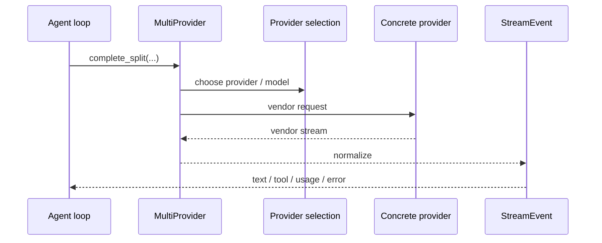

# s05 - Provider、Auth、Session

## 本课目标

**本课一句话：provider 层把多家模型平台磨平成一种 stream，session 层把一次次 turn 固定成可恢复的长期记录。**

理解 JCode 怎么把不同模型平台和长期会话接起来。

很多 agent demo 把 provider 层写成一行 API 调用。但真正做产品时，provider 是一大块工程。



这张图说明 provider 层的职责：agent loop 不应该理解每个平台的私有 stream 格式，`MultiProvider` 和具体 provider 负责把它们统一成 `StreamEvent`。

## 本课直接讲清楚的主线

Provider 层的窄腰是 `Provider` trait：JCode 内部只想面对一种形状，输入是 messages、tools、system prompt，输出是统一的 `StreamEvent`。OpenAI、Claude、Gemini、Copilot 的私有请求体和流式协议，都应该在 provider 后面被消化掉。

`MultiProvider` 把 provider 选择和 failover 收口。Agent loop 不应该散落 `if Claude / if OpenAI`，而是把请求交给 provider 层。`complete_split()` 还把 stable system prefix 和 dynamic context 拆开，目的是减少 prompt cache 抖动。

Auth 和 session 是 provider 工程的一部分。Auth 不是保存 API key，它要处理本地命令、路径、WSL、外部登录和 terminal handoff。Session 也不是简单聊天记录，它要保存 messages、replay events、compaction state、journal entries，并能恢复成 TUI/agent 可继续消费的状态。

## 核心代码节选

下面代码摘自本地 JCode 当前 revision，部分为了讲解做了精简。读概念看这里，改代码以源码为准。

Provider 层的窄腰是 `Provider` trait：

```rust
// src/provider/mod.rs，节选
pub type EventStream =
    Pin<Box<dyn Stream<Item = Result<StreamEvent>> + Send>>;

pub trait Provider: Send + Sync {
    async fn complete(
        &self,
        messages: &[Message],
        tools: &[ToolDefinition],
        system: &str,
        resume_session_id: Option<&str>,
    ) -> Result<EventStream>;

    async fn complete_split(
        &self,
        messages: &[Message],
        tools: &[ToolDefinition],
        system_static: &str,
        system_dynamic: &str,
        resume_session_id: Option<&str>,
    ) -> Result<EventStream> {
        let dynamic_messages =
            messages_with_dynamic_system_context(messages, system_dynamic);
        self.complete(&dynamic_messages, tools, system_static, resume_session_id).await
    }
}
```

这段代码说明 JCode 内部只想面对一种 provider 形状：输入是 `Message`、`ToolDefinition`、system prompt，输出是 `StreamEvent`。OpenAI、Claude、Gemini 的私有格式都应该在 trait 后面被消化掉。

`complete_split()` 的默认实现也很关键。它把动态系统上下文变成靠后的 synthetic message，而不是混进稳定 system prefix。这样做是为了保住 provider prompt cache 的稳定前缀。

Provider 选择不是 agent loop 自己判断，而是 `MultiProvider` 收口：

```rust
// src/provider/selection.rs，精简版
enum ActiveProvider {
    Claude,
    OpenAi,
    Gemini,
    Copilot,
    OpenRouter,
    OpenAiCompatible,
}

impl MultiProvider {
    fn auto_default_provider(availability: ProviderAvailability) -> ActiveProvider {
        if availability.is_configured(ActiveProvider::Claude) {
            ActiveProvider::Claude
        } else if availability.is_configured(ActiveProvider::OpenAi) {
            ActiveProvider::OpenAi
        } else {
            ActiveProvider::OpenAiCompatible
        }
    }
}
```

这段是精简版，但能看清设计：provider 选择被集中在 provider 层。agent loop 不应该知道“当前默认用 Claude 还是 OpenAI”。

Auth 的复杂度也能在代码里看到。外部登录命令运行时，JCode 会临时把终端 raw mode 交出去，命令结束后再恢复：

```rust
// src/auth/login_flows.rs，节选
fn run_external_login_command_inner(
    program: &str,
    args: &[String],
    suspend_raw_mode: bool,
) -> Result<()> {
    let raw_was_enabled =
        suspend_raw_mode && crossterm::terminal::is_raw_mode_enabled().unwrap_or(false);
    if raw_was_enabled {
        let _ = crossterm::terminal::disable_raw_mode();
    }

    let status_result = std::process::Command::new(program).args(args).status();

    if raw_was_enabled {
        let _ = crossterm::terminal::enable_raw_mode();
    }

    let status = status_result
        .with_context(|| format!("Failed to start command: {} {}", program, args.join(" ")))?;
    if !status.success() {
        anyhow::bail!("Command exited with non-zero status: {}", status);
    }
    Ok(())
}
```

这段代码解释了为什么 auth 不是配置项小功能。JCode 运行在 TUI、SSH、headless、外部 CLI 登录这些环境里，登录流程要处理真实终端状态，不是读取一个环境变量就结束。

Session 的存储形状也值得直接看：

```rust
// src/session/model.rs，字段节选
pub struct StoredMessage {
    pub id: String,
    pub role: Role,
    pub content: Vec<ContentBlock>,
    pub display_role: Option<StoredDisplayRole>,
    pub timestamp: Option<DateTime<Utc>>,
    pub tool_duration_ms: Option<u64>,
    pub token_usage: Option<StoredTokenUsage>,
}

pub struct StoredCompactionState {
    pub summary_text: String,
    pub openai_encrypted_content: Option<String>,
    pub covers_up_to_turn: usize,
    pub original_turn_count: usize,
    pub compacted_count: usize,
}
```

这段代码说明 session 不是“聊天文本数组”。message 里有结构化 `ContentBlock`、显示角色、时间、工具耗时和 usage；compaction 也有自己的覆盖范围和摘要状态。后面做 resume、replay、import 时，这些字段都会参与恢复。

## Provider 层解决什么问题

不同 provider 的差异很多：

- 认证方式不同：API key、OAuth、device flow、本地 callback。
- stream 格式不同。
- thinking 支持不同。
- tool calling 格式不同。
- prompt cache 行为不同。
- session id 支持不同。
- 模型目录、context window、价格不同。
- 错误类型和 rate limit 不同。

JCode 的 provider 层就是把这些差异统一成内部 runtime 能消费的接口和事件。

## Auth 不是边角料

JCode 支持很多登录方式：

```text
claude
openai
gemini
copilot
azure
openai-compatible
openrouter
lmstudio
ollama
...
```

这说明它不是简单面向一个 API key 的 CLI。

OAuth、账号切换、headless login、callback URL、pending login state，这些都是 coding-agent 产品会遇到的实际问题。

如果你做过只读 `OPENAI_API_KEY` 的 demo，这部分会显得啰嗦。但 JCode 面向的是长期本地工具，用户会换账号、换 provider、在 SSH 环境登录、恢复 pending login。这些都不是 prompt 能解决的问题。

## Session 为什么重要

JCode session 不是纯聊天记录。它要支持：

- resume
- replay
- crash recovery
- import
- render
- multi-client
- memory profile
- active process tracking

上面的 `StoredMessage` 和 `StoredCompactionState` 只是 session 的模型层。journal 负责追加事件，render 负责把结构化状态变成可展示内容，replay/import 负责把历史重新变成可继续运行的状态。这层决定了 JCode 能不能成为长期工作的工具，而不是一次性脚本。

## Session import 的意义

JCode README 提到可以从 Codex、Claude Code、OpenCode、pi 恢复会话。这个能力背后不是“复制文本”这么简单。

不同 harness 的会话结构可能不同：

- message role 表示不同。
- tool call id 格式不同。
- tool result 表示不同。
- attachments/image 表示不同。
- provider metadata 不同。
- thinking/reasoning 是否保留不同。

所以 import/session/render 是很值得读的部分。

## 这里要记住的两个判断

第一，session import 难点不是“把文本搬过去”。OpenCode、Codex、Claude Code、pi 的会话结构不同，JCode 至少要对齐这些东西：

```text
message role
tool call id
tool result
attachments / images
provider metadata
thinking / reasoning
```

第二，provider stream 必须统一成 JCode 内部的 `StreamEvent`。否则 agent loop、TUI、tool executor 都要知道每个 provider 的私有格式。

```text
Claude/OpenAI/Gemini/Copilot 的 stream 事件不同。
JCode 不能让 turn loop 到处写 provider-specific 分支。
统一成 StreamEvent 后，后面的 agent loop 才能稳定处理 text、thinking、tool input、tool result。
```

## 机制标本

provider stream 这条线也可以看 [mini/03_provider_stream.py](../../mini/03_provider_stream.py)。在 `s03` 里它解释 agent loop，在本课里它解释 provider 的职责：把平台私有 stream 归一成 JCode 能处理的事件。

真实 provider 要额外处理 auth、model id、request body、tool schema、usage、error 和 retry。标本只留下 stream 归一化后的形状，避免读者把 provider 误读成普通 HTTP wrapper。

session 这条线可以看 [mini/05_session_journal.py](../../mini/05_session_journal.py)。它把 session 拆成 append-only journal、render view 和 replay messages 三个动作。真实 JCode 多了 compaction、usage、import、active process 和 memory profile，但底层判断一致：session 不是一段聊天文本，而是可恢复的结构化运行记录。

## 读完你应该能解释什么

- `Provider` trait 为什么把输出统一成 `StreamEvent`。
- `complete_split()` 为什么要区分 static 和 dynamic system prompt。
- `MultiProvider` 为什么应该收口 provider 选择和 failover。
- session 为什么不是聊天文本，而是包含 content blocks、usage、compaction 等结构化状态。
