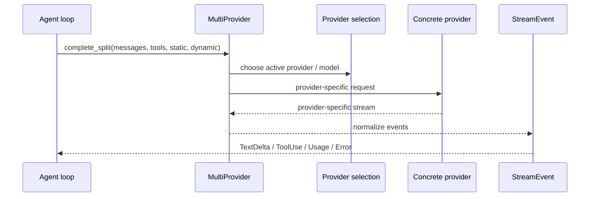

# s05 - Provider、Auth、Session

## 本课目标

理解 JCode 怎么把不同模型平台和长期会话接起来。

很多 agent demo 把 provider 层写成一行 API 调用。但真正做产品时，provider 是一大块工程。



这张图说明 provider 层的职责：agent loop 不应该理解每个平台的私有 stream 格式，`MultiProvider` 和具体 provider 负责把它们统一成 `StreamEvent`。

## 先读这些文件

```text
src/provider/
src/auth/
src/usage/
src/session/
src/storage.rs
OAUTH.md
```

建议先看：

```text
src/provider/mod.rs
src/provider/dispatch.rs
src/provider/selection.rs
src/provider/openai.rs
src/provider/claude.rs
src/provider/gemini.rs
src/provider/copilot.rs
src/auth/commands.rs
src/auth/login_flows.rs
```

不要一口气读完所有 provider。先选一个你熟悉的，比如 OpenAI 或 Claude，把 trait、stream event、auth 这三条线追通。

## 这组文件怎么读

先打开 `src/provider/mod.rs`，读 `Provider` trait 和 `EventStream`。第一遍只看 `complete()`、`complete_split()`、`name()`、`model()`。`complete_split()` 的默认实现会把 dynamic system context 插到靠后的 synthetic message 里；Anthropic 这类 provider 可以覆盖它，用自己的 cache-control 方式处理 static/dynamic prompt。

接着在同一个文件里找 `MultiProvider`。先看它为什么实现 `Provider`，再看 `complete_with_failover()`。JCode 不是在 agent loop 里到处判断 Claude/OpenAI/Gemini，而是让 `MultiProvider` 决定当前请求发给谁、失败后怎么切。

第三步读 `src/provider/dispatch.rs`。先看 `CompletionMode`，再看 `complete_on_provider()` 和 `complete_split_on_provider()`。这两个函数是 provider 分发的窄腰：上面是 JCode 的统一接口，下面才是具体平台。

第四步读 `src/provider/selection.rs`。看 `ActiveProvider`、`ProviderAvailability`、`auto_default_provider()`、`parse_provider_hint()`。这一步回答“默认用谁”和“用户写的 provider hint 怎么解析”。不要把 provider 选择当配置小功能，它会影响启动、模型切换、session resume。

然后只选一个具体 provider 深读。比如读 `src/provider/openai.rs` 时，只追请求体怎么把 `Message`、`ToolDefinition`、system prompt 转成 OpenAI 格式，stream 又怎么转回 JCode 的 `StreamEvent`。读 `src/provider/claude.rs` 也按同样问题看。不要同时对比四个 provider，第一遍会被字段差异淹没。

Auth 放在 provider 后面读。先看 `src/auth/commands.rs`，它处理系统命令探测、路径候选、WSL 这些本地环境问题；再看 `src/auth/login_flows.rs`，它处理外部登录命令和 terminal handoff。最后补 `src/cli/login/` 下的登录流程。这样读，你会知道 JCode 的 auth 不是“保存一个 API key”，而是在处理真实终端环境。

Session 最后读，因为它依赖前面的 provider 和 tool result。先看 `src/session/model.rs` 里的 `StoredMessage`、`StoredReplayEvent`、`StoredCompactionState`，再看 `src/session/journal.rs` 的 journal entry 和 persist state。接着看 `src/session/render.rs` 怎么把存储结构变回可展示内容。这样读 import/replay 时，才知道它在对齐哪些结构。

`OAUTH.md` 放在源码之后读。先在代码里看到登录和 provider 选择的分工，再用文档补 OAuth 流程。文档先读会觉得只是登录说明，源码读过后才能看出它为什么影响 provider、session 和 headless 环境。

## 核心代码节选

Provider 层的窄腰是 `Provider` trait：

```rust
// src/provider/mod.rs，节选
pub type EventStream =
    Pin<Box<dyn Stream<Item = Result<StreamEvent>> + Send>>;

pub trait Provider: Send + Sync {
    async fn complete(
        &self,
        messages: &[Message],
        tools: &[ToolDefinition],
        system: &str,
        resume_session_id: Option<&str>,
    ) -> Result<EventStream>;

    async fn complete_split(
        &self,
        messages: &[Message],
        tools: &[ToolDefinition],
        system_static: &str,
        system_dynamic: &str,
        resume_session_id: Option<&str>,
    ) -> Result<EventStream> {
        let dynamic_messages =
            messages_with_dynamic_system_context(messages, system_dynamic);
        self.complete(&dynamic_messages, tools, system_static, resume_session_id).await
    }
}
```

这段代码说明 JCode 内部只想面对一种 provider 形状：输入是 `Message`、`ToolDefinition`、system prompt，输出是 `StreamEvent`。OpenAI、Claude、Gemini 的私有格式都应该在 trait 后面被消化掉。

`complete_split()` 的默认实现也很关键。它把动态系统上下文变成靠后的 synthetic message，而不是混进稳定 system prefix。这样做是为了保住 provider prompt cache 的稳定前缀。

Provider 选择不是 agent loop 自己判断，而是 `MultiProvider` 收口：

```rust
// src/provider/selection.rs，精简版
enum ActiveProvider {
    Claude,
    OpenAi,
    Gemini,
    Copilot,
    OpenRouter,
    OpenAiCompatible,
}

impl MultiProvider {
    fn auto_default_provider(availability: ProviderAvailability) -> ActiveProvider {
        if availability.is_configured(ActiveProvider::Claude) {
            ActiveProvider::Claude
        } else if availability.is_configured(ActiveProvider::OpenAi) {
            ActiveProvider::OpenAi
        } else {
            ActiveProvider::OpenAiCompatible
        }
    }
}
```

这段是精简版，但能看清设计：provider 选择被集中在 provider 层。agent loop 不应该知道“当前默认用 Claude 还是 OpenAI”。

Session 的存储形状也值得直接看：

```rust
// src/session/model.rs，字段节选
pub struct StoredMessage {
    pub id: String,
    pub role: Role,
    pub content: Vec<ContentBlock>,
    pub display_role: Option<StoredDisplayRole>,
    pub timestamp: Option<DateTime<Utc>>,
    pub tool_duration_ms: Option<u64>,
    pub token_usage: Option<StoredTokenUsage>,
}

pub struct StoredCompactionState {
    pub summary_text: String,
    pub openai_encrypted_content: Option<String>,
    pub covers_up_to_turn: usize,
    pub original_turn_count: usize,
    pub compacted_count: usize,
}
```

这段代码说明 session 不是“聊天文本数组”。message 里有结构化 `ContentBlock`、显示角色、时间、工具耗时和 usage；compaction 也有自己的覆盖范围和摘要状态。后面做 resume、replay、import 时，这些字段都会参与恢复。

## Provider 层解决什么问题

不同 provider 的差异很多：

- 认证方式不同：API key、OAuth、device flow、本地 callback。
- stream 格式不同。
- thinking 支持不同。
- tool calling 格式不同。
- prompt cache 行为不同。
- session id 支持不同。
- 模型目录、context window、价格不同。
- 错误类型和 rate limit 不同。

JCode 的 provider 层就是把这些差异统一成内部 runtime 能消费的接口和事件。

## Auth 不是边角料

JCode 支持很多登录方式：

```text
claude
openai
gemini
copilot
azure
openai-compatible
openrouter
lmstudio
ollama
...
```

这说明它不是简单面向一个 API key 的 CLI。

OAuth、账号切换、headless login、callback URL、pending login state，这些都是 coding-agent 产品会遇到的实际问题。

如果你做过只读 `OPENAI_API_KEY` 的 demo，这部分会显得啰嗦。但 JCode 面向的是长期本地工具，用户会换账号、换 provider、在 SSH 环境登录、恢复 pending login。这些都不是 prompt 能解决的问题。

## Session 为什么重要

JCode session 不是纯聊天记录。它要支持：

- resume
- replay
- crash recovery
- import
- render
- multi-client
- memory profile
- active process tracking

相关文件：

```text
src/session/model.rs
src/session/journal.rs
src/session/render.rs
src/replay.rs
src/import.rs
```

这层决定了 JCode 能不能成为长期工作的工具，而不是一次性脚本。

## Session import 的意义

JCode README 提到可以从 Codex、Claude Code、OpenCode、pi 恢复会话。这个能力背后不是“复制文本”这么简单。

不同 harness 的会话结构可能不同：

- message role 表示不同。
- tool call id 格式不同。
- tool result 表示不同。
- attachments/image 表示不同。
- provider metadata 不同。
- thinking/reasoning 是否保留不同。

所以 import/session/render 是很值得读的部分。

## 这里要记住的两个判断

第一，session import 难点不是“把文本搬过去”。OpenCode、Codex、Claude Code、pi 的会话结构不同，JCode 至少要对齐这些东西：

```text
message role
tool call id
tool result
attachments / images
provider metadata
thinking / reasoning
```

第二，provider stream 必须统一成 JCode 内部的 `StreamEvent`。否则 agent loop、TUI、tool executor 都要知道每个 provider 的私有格式。

```text
Claude/OpenAI/Gemini/Copilot 的 stream 事件不同。
JCode 不能让 turn loop 到处写 provider-specific 分支。
统一成 StreamEvent 后，后面的 agent loop 才能稳定处理 text、thinking、tool input、tool result。
```
