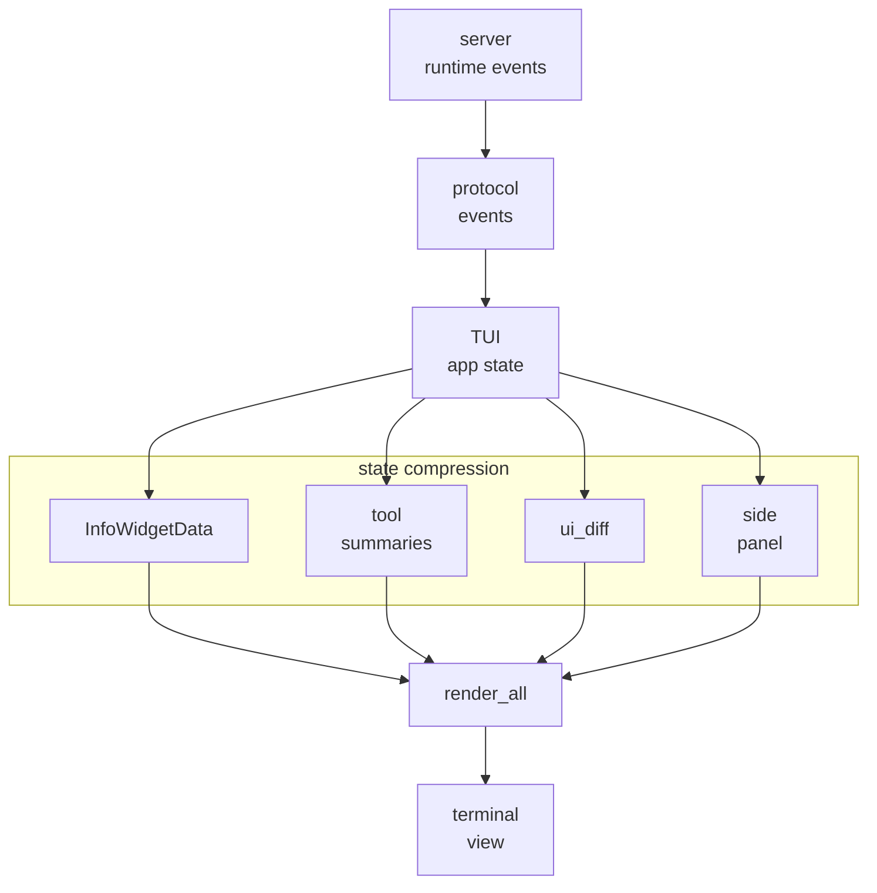
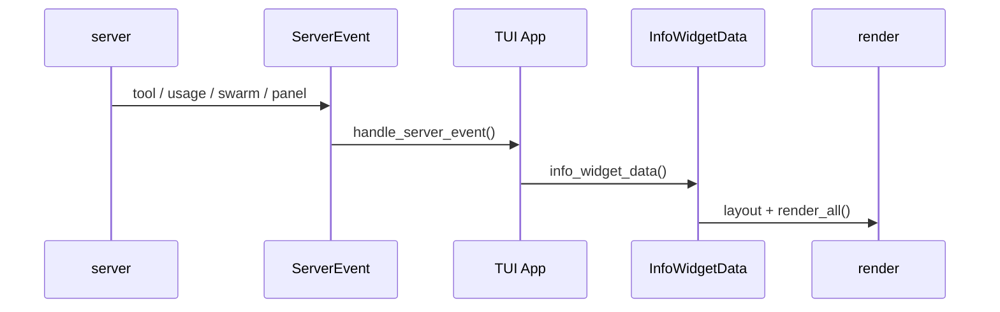

# s06 - TUI 和可观察性

## 先把问题说清楚

JCode 的 TUI 不只是把模型输出打印出来。server event 先写进 TUI state，再整理成工具状态、diff、usage、side panel 这些用户能看懂的信息。

理解 UI 为什么是 harness 的一部分。

很多 agent 工程只关心“模型能不能完成任务”。但实际使用时，用户还需要知道它在干什么、改了什么、卡在哪里、花了多少上下文和钱。

JCode 的 TUI 代码不少，因为它承担了状态展示和用户判断的工作。

判断一个 UI 模块是不是 harness 的一部分，看它是否影响用户判断 agent 状态。tool 状态、diff、usage、memory 命中都影响判断，所以它们不是皮肤。



这张图说明 TUI 不是 stdout 包装。server/runtime 事件先写入 TUI state，再分别变成 widget、tool summary、diff，最后渲染成用户能看懂的界面。



这张图比“页面上有哪些 widget”更重要。读 TUI 时先看谁把 runtime 事件变成可观察状态，再看具体怎么画。

## 这节只抓主线

TUI 的主线是事件变成界面状态。server/runtime 事件进入 app state，然后分别变成 info widget、tool summary、diff、side panel 和流式文本。用户看到的不是原始 protocol，而是整理成用户能快速判断的状态。

Info widget 解决布局和信息密度：`InfoWidgetData` 收集状态，`calculate_placements()` 决定位置，`render_all()` 统一渲染。Git、todo、memory、swarm 这些 widget 的差别不在画法，而在它们各自回答用户什么问题。

Tool summary 和 diff 是另外两层整理。模型工具调用通常是 JSON，TUI 要把它整理成一行容易扫过的动作摘要；文件编辑还可以从 tool input 提前推断 diff，而不是等完整工具结果回来。Side panel 则更进一步：它是模型能写入、追加、聚焦和删除的持久页面，不只是临时展示区。

## 核心代码节选

下面代码摘自本地 JCode 当前 revision，部分为了讲解做了精简。读概念看这里，改代码以源码为准。

TUI 的关键边界在 `handle_server_event()`。它把 server event 改写成 `App` 状态，而不是等到 render 阶段才临时判断：

```rust
// src/tui/app/remote/server_events.rs，节选
pub fn handle_server_event(app: &mut App, event: ServerEvent, remote: &mut impl RemoteEventState)
    -> bool
{
    match event {
        ServerEvent::ToolStart { id, name } => {
            app.pause_streaming_tps(false);
            remote.handle_tool_start(&id, &name);
            app.commit_pending_streaming_assistant_message();
            app.status = ProcessingStatus::RunningTool(name.clone());
            app.streaming_tool_calls.push(ToolCall {
                id,
                name,
                input: serde_json::Value::Null,
                intent: None,
            });
            eager_stream_redraw
        }
        ServerEvent::ToolExec { id, name } => {
            let parsed_input = remote.get_current_tool_input();
            let tool_call = ToolCall {
                id: id.clone(),
                name: name.clone(),
                input: parsed_input.clone(),
                intent: ToolCall::intent_from_input(&parsed_input),
            };
            app.observe_tool_call(&tool_call);
            eager_stream_redraw
        }
        ServerEvent::TokenUsage { input, output, cache_read_input, cache_creation_input } => {
            app.streaming_input_tokens = input;
            app.streaming_output_tokens = output;
            app.streaming_cache_read_tokens = cache_read_input;
            app.streaming_cache_creation_tokens = cache_creation_input;
            eager_stream_redraw
        }
        ServerEvent::SidePanelState { snapshot } => {
            app.set_side_panel_snapshot(snapshot);
            false
        }
        ServerEvent::SwarmStatus { members } => {
            app.remote_swarm_members = members;
            false
        }
        ServerEvent::McpStatus { servers } => {
            app.mcp_server_names = servers
                .iter()
                .filter_map(|s| {
                    let (name, count_str) = s.split_once(':')?;
                    Some((name.to_string(), count_str.parse::<usize>().unwrap_or(0)))
                })
                .collect();
            false
        }
        _ => false,
    }
}
```

这段代码说明一件很硬的事：TUI 不是被动消费文本流。`ToolStart` 会提交 pending assistant text、暂停 TPS、更新状态并记录正在流式出现的工具；`ToolExec` 会把累积的 JSON input 变成 `ToolCall`，交给 `observe_tool_call()`；usage、side panel、swarm、MCP 都在这里落到 app state。

换句话说，render 只是最后一步。决定用户能看到什么状态的地方，是 event handler。

`InfoWidgetData` 是第二个收口点。它把分散在 session、provider、memory、swarm、ambient、usage 里的状态整理成一个可渲染的快照：

```rust
// src/tui/app/tui_state.rs，节选
fn info_widget_data(&self) -> crate::tui::info_widget::InfoWidgetData {
    let todos = if self.swarm_enabled && !self.swarm_plan_items.is_empty() {
        self.swarm_plan_items
            .iter()
            .map(|item| crate::todo::TodoItem {
                content: item.content.clone(),
                status: item.status.clone(),
                priority: item.priority.clone(),
                id: item.id.clone(),
                blocked_by: item.blocked_by.clone(),
                assigned_to: item.assigned_to.clone(),
            })
            .collect()
    } else {
        gather_todos_for_session(session_id)
    };

    let memory_info = gather_memory_info(self.memory_enabled);
    let swarm_info = if self.swarm_enabled {
        // remote_swarm_members / local ProcessingStatus become SwarmInfo here
        Some(crate::tui::info_widget::SwarmInfo { /* fields omitted */ })
    } else {
        None
    };
    let usage_info = self.widget_usage_info(self.widget_route_info(model.as_deref()));

    crate::tui::info_widget::InfoWidgetData {
        todos,
        context_info,
        model,
        reasoning_effort,
        service_tier,
        memory_info,
        swarm_info,
        background_info,
        usage_info,
        tokens_per_second,
        provider_name: Some(self.provider.name().to_string()),
        connection_type: self.connection_type.clone(),
        ambient_info: gather_ambient_info(crate::config::config().ambient.enabled),
        cache_hit_info,
        is_compacting,
        git_info,
    }
}
```

这段不是完整源码，但结构够用了：widget 不应该各自乱查状态。JCode 先准备 `InfoWidgetData`，再让布局和 render 消费它。这样 TUI 才能在信息很多的时候保持一致。

Info widget 的入口不是某个具体 widget，而是布局和统一渲染：

```rust
// src/tui/info_widget.rs，节选
pub fn calculate_placements(
    messages_area: Rect,
    margins: &Margins,
    data: &InfoWidgetData,
) -> Vec<WidgetPlacement> {
    let placements = info_widget_layout::calculate_placements(
        messages_area,
        margins,
        data,
        state.enabled,
        &state.placements,
    );
    state.placements = placements.clone();
    placements
}

pub fn render_all(frame: &mut Frame, placements: &[WidgetPlacement], data: &InfoWidgetData) {
    for placement in placements {
        render_single_widget(frame, placement, data);
    }
}
```

这段代码说明 widget 不是随便画在右边。JCode 先根据消息区域、边距和当前数据算 placement，再统一 render。可观察性在这里先变成布局问题。

工具摘要也有单独的整理逻辑：

```rust
// src/tui/ui_tools.rs，节选
pub(crate) fn get_tool_summary(tool: &ToolCall) -> String {
    get_tool_summary_with_budget(tool, 50, None)
}

fn get_tool_summary_with_budget(tool: &ToolCall, bash_max_chars: usize, max_width: Option<usize>)
    -> String
{
    match canonical_tool_name(&tool.name) {
        "bash" => format!("$ {}", truncate_command_display(cmd, cmd_budget)),
        "read" => path_summary(tool),
        "grep" => query_summary(tool),
        _ => String::new(),
    }
}
```

这是精简版，但能看出 UI 层的责任：模型调用工具时，用户不应该看到完整 JSON。TUI 要把工具名和 input 整理成一行容易扫过的摘要。

diff 也不是只等工具输出：

```rust
// src/tui/ui_diff.rs，节选
pub(super) fn generate_diff_lines_from_tool_input(tool: &ToolCall)
    -> Vec<ParsedDiffLine>
{
    match canonical_tool_name(&tool.name) {
        "edit" => {
            let old = tool.input.get("old_string").and_then(|v| v.as_str()).unwrap_or("");
            let new = tool.input.get("new_string").and_then(|v| v.as_str()).unwrap_or("");
            generate_diff_lines_from_strings(old, new)
        }
        "multiedit" => { /* 对每个 edit 生成 diff lines */ }
        _ => Vec::new(),
    }
}
```

这段代码说明 JCode 可以从 tool input 提前生成 diff 线索。用户看到的“改了多少”不是最后才从文件系统算出来，TUI 在工具开始阶段就能推断一部分。

Side panel 是模型能操作的状态，不只是 UI 组件：

```rust
// src/tool/side_panel.rs，节选
impl Tool for SidePanelTool {
    fn name(&self) -> &str { "side_panel" }

    fn parameters_schema(&self) -> Value {
        json!({
            "properties": {
                "action": {
                    "enum": ["status", "write", "append", "load", "focus", "delete"]
                }
            },
            "required": ["action"]
        })
    }
}
```

这段代码说明 side panel 被注册成工具。模型可以写入、追加、加载、聚焦、删除页面，所以它是 harness 状态的一部分，不只是前端展示。

## JCode TUI 展示什么

JCode 的 TUI 不只是打印 assistant text。它还处理：

- tool call 摘要。
- streaming 状态。
- reasoning/thinking 展示。
- diff。
- side panel。
- markdown。
- mermaid。
- usage。
- model/account picker。
- git 状态。
- memory 状态。
- todo 状态。
- swarm/background 状态。

这些都是 harness 的可观察性。

## Side Panel 的意义

Side panel 是一个很实用的设计。它可以放：

- 当前文件。
- diff。
- 计划。
- review checklist。
- memory 命中。
- agent 生成的辅助内容。

这让用户不用在主聊天流里翻来翻去。

Side panel 不是“多一个面板”。它把稳定参考信息从聊天流里拿出来：聊天流适合时间线，side panel 适合放当前状态。

## Info Widget 的意义

Info widget 解决的是“状态显示不能抢主输出空间”的问题。比如：

- 当前模型。
- usage。
- git branch。
- memory 命中。
- todos。
- swarm 状态。

这些信息很重要，但不应该把主对话挤没。

## 和 OpenCode 的对比

OpenCode 也重视 UI，但路线不同。OpenCode 同时走 Web/Desktop/Open platform。JCode 更偏 terminal native，强调 Ratatui 渲染、终端信息密度和本地 runtime。

两者都说明一件事：coding agent 的 UI 不是 shell stdout 就够了。

## 一个 widget 的判断标准

判断 `info_widget_git` 或 `info_widget_todos` 这类 widget 是否成立，就看这条数据链路：

```text
数据从哪里来？
在哪里进入状态？
通过什么 event 更新？
在哪里 render？
用户为什么需要这个信息？
```

判断一个 widget 是否必要，就问一句：删掉它，用户会少知道什么？答不上来，这个 widget 的用途还没讲清楚。

## 看到这里，能说清这几件事

- 为什么 TUI 是 harness 的一部分，而不是皮肤。
- 为什么 `handle_server_event()` 是 TUI 的状态边界。
- `InfoWidgetData` 和 `calculate_placements()` 解决什么问题。
- tool summary 为什么不能直接展示原始 JSON。
- side panel 为什么是模型可操作的状态，而不是临时展示区域。
