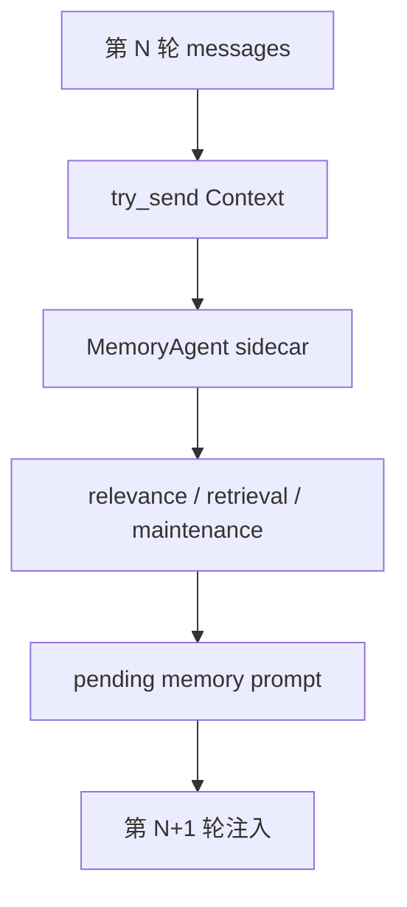
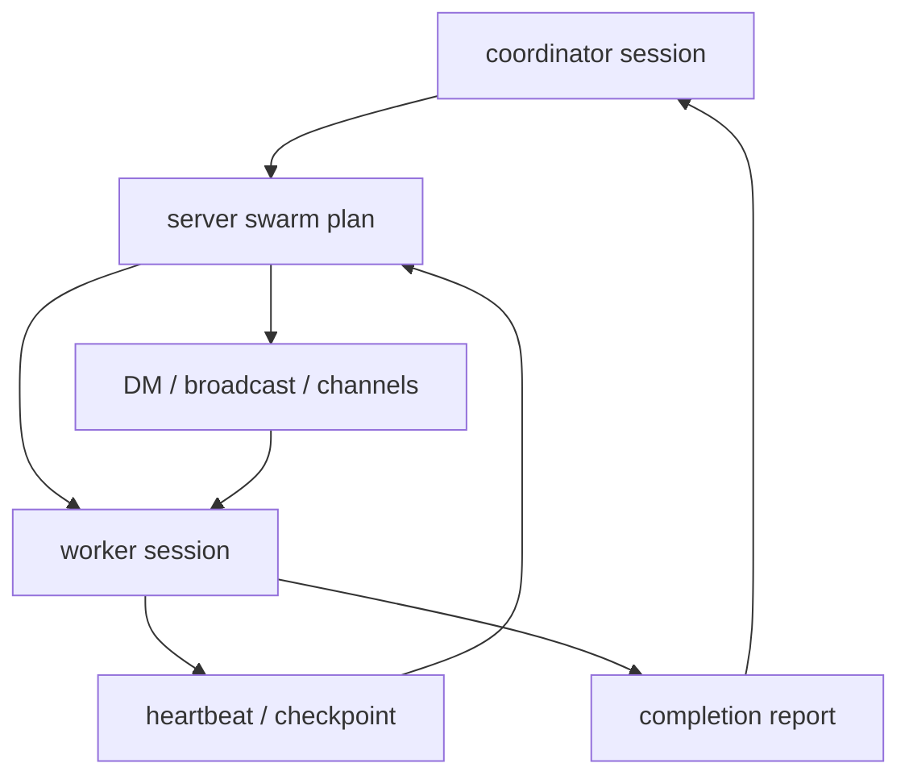
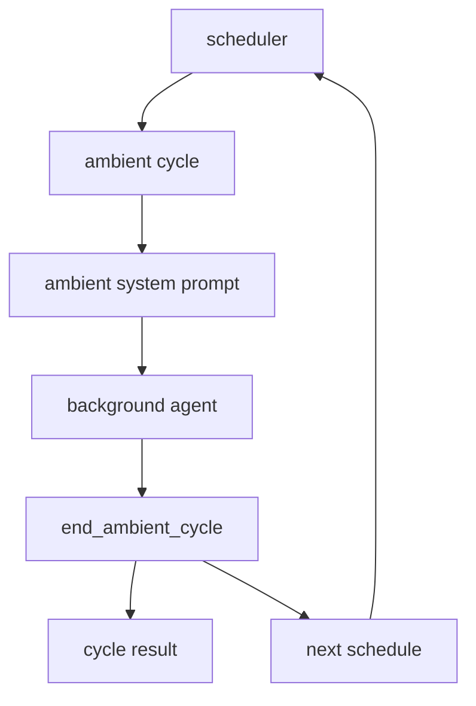

# s07 - Memory、Swarm、Ambient、Self-Dev

## 本课目标

看 JCode 最有差异化、也最容易读晕的部分。

这一课不要急着改代码。先读文档，画图，确认自己理解运行时边界。

这几个模块很容易被讲成名词堆叠。读的时候只问一个问题：它解决了单 agent loop 的哪个具体短板？

## Memory



这张图是 memory 的关键：主 agent 只投递上下文，检索和维护在 sidecar 里跑，结果下一轮再进入主上下文。

先读：

```text
docs/MEMORY_ARCHITECTURE.md
docs/MEMORY_BUDGET.md
src/memory.rs
src/memory_agent.rs
src/memory_graph.rs
src/memory_prompt.rs
src/tool/memory.rs
src/tool/session_search.rs
```

先打开 `docs/MEMORY_ARCHITECTURE.md`，只看它描述的主路径：上下文进入 memory agent，候选 memory 被检索和筛选，结果下一轮注入。不要先读 `memory_agent.rs`，那个文件很长。

然后读 `src/memory_agent.rs`。第一遍只追 `MemoryAgentHandle::update_context_sync_with_dir()`、`MemoryAgent::run()`、`process_context()`。这条线回答“主 agent turn 结束后，memory 查询怎么被排到后台”。看到 `process_context()` 后先停，不要立刻钻进 cluster refinement。

第三步读 `src/memory_prompt.rs`。看 `format_context_for_relevance()`、`format_context_for_extraction()`、`format_relevant_prompt()`。这几个函数决定 memory agent 看什么上下文，以及最后注入主模型的文本长什么样。

第四步读 `src/memory.rs`。先看 `MemoryManager` 的 `remember_project()`、`find_similar_scoped()`、`get_relevant_parallel()`、`find_similar_with_cascade_scoped()`。这些函数解释 memory 是怎么从简单存储走到并行召回和 cascade retrieval 的。

最后读 `src/tool/memory.rs` 和 `src/tool/session_search.rs`。前者是模型显式操作 memory 的入口，后者是跨 session 查历史的工具。把它们放最后，是因为工具只是入口；真正的取舍在后台 agent 和 manager。

核心代码先看这个 handle：

```rust
// src/memory_agent.rs，节选
pub struct MemoryAgentHandle {
    tx: mpsc::Sender<AgentMessage>,
}

impl MemoryAgentHandle {
    pub fn update_context_sync_with_dir(
        &self,
        session_id: &str,
        messages: Arc<[Message]>,
        working_dir: Option<String>,
    ) {
        let msg = AgentMessage::Context {
            session_id: session_id.to_string(),
            messages,
            working_dir,
            timestamp: Instant::now(),
        };
        let _ = self.tx.try_send(msg);
    }
}
```

`try_send` 是关键。memory 更新被丢到后台 channel，不阻塞主 agent turn。这就是前面说的“第 N 轮触发，第 N+1 轮使用”的代码基础。

后台 agent 收到消息后再处理：

```rust
// src/memory_agent.rs，节选
async fn run(mut self) {
    while let Some(msg) = self.rx.recv().await {
        match msg {
            AgentMessage::Reset => self.reset(),
            AgentMessage::Context { session_id, messages, working_dir, timestamp } => {
                self.session_state(&session_id).turn_count += 1;

                if let Err(e) =
                    self.process_context(&session_id, messages, timestamp).await
                {
                    logging::error(&format!("Memory agent error: {}", e));
                }
            }
        }
    }
}
```

这段代码说明 memory 是一个 sidecar agent，而不是 `run_turn()` 里同步调用的一段函数。主 agent 只投递上下文，后台 agent 自己维护 session state、turn count 和检索节奏。

JCode 的 memory 不是“用户手动保存一条笔记”。它更像自动召回：

```text
当前上下文
  -> embedding
  -> 相似 memory
  -> graph / cascade retrieval
  -> 可选 sidecar 验证
  -> 下一轮注入 memory prompt
```

关键设计是非阻塞：

```text
第 N 轮触发查询
第 N+1 轮使用结果
```

这样不会让主 agent 每轮都等 memory。

代价是 memory 有一轮延迟。这个延迟是有意设计，不是漏做同步检索。

## Swarm



这张图说明 swarm 的状态中心在 server plan，不在某个 worker 的 messages 里。worker 通过 heartbeat、checkpoint、report 回到 coordinator 和 plan。

先读：

```text
docs/SWARM_ARCHITECTURE.md
src/server/swarm.rs
src/server/swarm_channels.rs
src/server/comm_*.rs
src/tool/communicate.rs
src/tool/task.rs
```

先读 `docs/SWARM_ARCHITECTURE.md`，只看角色边界：coordinator、worker、channel、plan、file touch。读完立刻去源码，不要在文档里停太久。

源码先打开 `src/server/swarm.rs`。第一遍只看 `broadcast_swarm_status()`、`broadcast_swarm_plan_with_previous()`、`update_member_status()`、`run_swarm_task()`。这几个函数覆盖了状态广播、计划广播、成员状态更新和实际派发任务。

然后看 `src/server/swarm_channels.rs`。只读 `subscribe_session_to_channel()`、`unsubscribe_session_from_channel()`、`list_channels_for_swarm()`。这一步把 swarm 从“多个 agent”拉回到通信系统：agent 要能订阅 channel，消息才有去处。

接着读 `src/tool/communicate.rs`。不要把它当普通 chat 工具。它是模型操作 swarm runtime 的入口：发 DM、broadcast、更新计划、等待成员、spawn worker。看这个文件时不断回到 server 里的状态结构，确认每个 action 最终改了什么 server state。

最后读 `src/tool/task.rs` 的 `SubagentTool`。它是单个 subagent 的入口，和 swarm 不是一回事。对比这两个文件，你会看清 JCode 的边界：`subagent` 偏一次性委派，`swarm` 偏长期协作 runtime。

swarm 的任务派发可以先看 `run_swarm_task()`：

```rust
// src/server/swarm.rs，节选
pub(super) async fn run_swarm_task(
    agent: Arc<Mutex<Agent>>,
    description: &str,
    subagent_type: &str,
    prompt: &str,
) -> Result<String> {
    let (provider, registry, session_id, working_dir, coordinator_model) = {
        let agent = agent.lock().await;
        (
            agent.provider_fork(),
            agent.registry(),
            agent.session_id().to_string(),
            agent.working_dir().map(PathBuf::from),
            agent.provider_model(),
        )
    };

    let mut session = Session::create(
        Some(session_id),
        Some(format!("{} (@{} swarm)", description, subagent_type)),
    );
    session.model = Some(coordinator_model);
    session.save()?;

    let mut allowed: HashSet<String> = registry.tool_names().await.into_iter().collect();
    for blocked in ["subagent", "task", "todo", "todowrite", "todoread"] {
        allowed.remove(blocked);
    }

    let mut worker = Agent::new_with_session(provider, registry, session, Some(allowed));
    worker.run_once_capture(prompt).await
}
```

这段代码解释了 swarm 和普通“函数调用”的差别：它 fork provider、复用 registry、新建 worker session，并且禁掉一部分工具，避免 worker 再递归启动 subagent 或改 todo。swarm 的核心是 runtime coordination，不是多发几个 prompt。

任务进度也放在 server state 里：

```rust
// src/server/swarm.rs，节选
let progress = plan.task_progress.entry(task_id.to_string()).or_default();
progress.assigned_session_id = assigned_session_id.map(str::to_string);
progress.last_heartbeat_unix_ms = Some(now_ms);
progress.heartbeat_count = Some(progress.heartbeat_count.unwrap_or(0) + 1);

if let Some(summary) = checkpoint_summary {
    progress.last_checkpoint_unix_ms = Some(now_ms);
    progress.checkpoint_summary = Some(truncate_detail(&summary, 120));
}
```

这段代码说明 swarm 要追踪 heartbeat、checkpoint 和 assigned session。没有这些状态，多 agent 协作只会变成多个黑盒同时跑。

JCode 的 swarm 不是普通 subagent。它关心多 agent 协作运行时：

- coordinator 怎么分配任务。
- worker 怎么汇报。
- agent 之间怎么 DM / broadcast / channel。
- 哪些文件被谁读过、改过。
- plan 怎么更新。
- blocked / failed / crashed 怎么恢复。
- worktree 什么时候用，什么时候不用。

这部分最能体现 JCode 和 pi 的差异。pi 更克制，JCode 更激进。

不要把 swarm 理解成“多开几个 subagent”。真正难的是计划、通信、文件触达、状态恢复和集成边界。

## Ambient



这张图说明 ambient 必须有结束和调度机制。后台 agent 不是无限跑，它通过 `end_ambient_cycle` 汇报结果并安排下一次唤醒。

先读：

```text
docs/AMBIENT_MODE.md
src/ambient.rs
src/ambient/
src/ambient_runner.rs
src/tool/ambient.rs
```

先读 `docs/AMBIENT_MODE.md`，只看 ambient 的启动条件、预算和安全边界。ambient 如果没有边界，就不是助手，而是后台噪音。

然后读 `src/ambient.rs`，看它怎样把 `directives`、`manager`、`runner`、`scheduler`、`persistence` 串起来。这个文件通常比直接读子模块更适合当地图。

第三步读 `src/ambient/runner.rs` 和 `src/ambient_runner.rs`。重点找 runner 怎么启动一轮 ambient cycle、怎么记录结果、怎么决定下次是否继续。这里要带着“后台任务不能打断用户主线”这个判断读。

第四步读 `src/ambient/scheduler.rs`。看 schedule item 怎么排序、怎么被唤醒。ambient 的难点不只是 prompt，而是时间、优先级和资源。

最后读 `src/tool/ambient.rs`。先看 `EndAmbientCycleTool`、`ScheduleAmbientTool`、`RequestPermissionTool`、`ScheduleTool`。这些工具说明 ambient agent 不是随便行动，它需要显式结束 cycle、安排下次运行，必要时请求权限。

ambient 的模块地图在 `src/ambient.rs` 里：

```rust
// src/ambient.rs，节选
mod directives;
mod manager;
mod paths;
mod persistence;
mod prompt;
pub mod runner;
pub mod scheduler;

pub use directives::{add_directive, has_pending_directives, take_pending_directives};
pub use manager::AmbientManager;
pub use persistence::{AmbientLock, ScheduledQueue};
pub use prompt::{
    ResourceBudget,
    build_ambient_system_prompt,
    gather_recent_sessions,
    gather_memory_graph_health,
};
```

这段代码说明 ambient 不是一个工具文件。它有指令、管理器、持久化、prompt、runner、scheduler。真正要读的是后台循环和预算，不是只看工具 schema。

ambient cycle 结束也必须通过工具显式上报：

```rust
// src/tool/ambient.rs，节选
struct EndCycleInput {
    summary: String,
    memories_modified: u32,
    compactions: u32,
    proactive_work: Option<String>,
    next_schedule: Option<NextScheduleInput>,
}

impl Tool for EndAmbientCycleTool {
    fn name(&self) -> &str { "end_ambient_cycle" }

    fn parameters_schema(&self) -> Value {
        json!({
            "required": ["summary", "memories_modified", "compactions"]
        })
    }
}
```

这段代码说明 ambient agent 不是跑完就消失。它必须汇报本轮做了什么、改了多少 memory、是否做了 compaction、下次什么时候醒。

Ambient 是后台 agent。它不是用户发一句做一句，而是在资源允许时做维护：

- 整理 memory。
- 检查最近 session。
- 看 git 活动。
- 做低风险主动任务。
- 自己决定下次什么时候醒来。

这个方向还很实验，但值得读，因为它指向长期 agent 环境维护。

读 ambient 时重点看资源限制。后台 agent 如果没有预算和优先级控制，会变成另一个干扰源。

## Self-Dev


这张图说明 self-dev 的边界：先切到 self-dev session，再 build/test，最后 reload shared server 并恢复会话。危险动作不应该从普通 session 直接执行。

先读：

```text
src/cli/selfdev.rs
src/tool/selfdev/mod.rs
src/tool/selfdev/launch.rs
src/tool/selfdev/build_queue.rs
src/tool/selfdev/reload.rs
src/tool/selfdev/status.rs
src/prompt/selfdev_mode.txt
src/prompt/selfdev_hint.txt
docs/UNIFIED_SELFDEV_SERVER_PLAN.md
```

先读 `src/cli/selfdev.rs` 的 `run_self_dev()`。这条线解释显式 `jcode self-dev` 怎么创建或恢复 self-dev session，怎么设置 canary 标记，什么时候要求先 build，最后怎么启动 TUI。

然后读 `src/tool/selfdev/mod.rs`。先看 `SelfDevTool` 的 action schema，再看 `execute()` 里对 `enter/build/cancel-build/reload/status/socket-info` 这些 action 的分发。注意 `reload`、`socket-info`、`socket-help` 会检查当前 session 是否 self-dev，这就是风险边界。

第三步读 `src/tool/selfdev/launch.rs`。看 `enter_selfdev_session()` 和 `schedule_selfdev_prompt_delivery()`。这部分回答“普通会话怎么切到 self-dev 会话”，也解释为什么它可能要新开 terminal。

第四步读 `src/tool/selfdev/build_queue.rs` 和 `src/tool/selfdev/reload.rs`。前者管 build 请求、去重、锁和后台状态，后者管新 binary 怎么接管旧 server。这里不要急着改，先画出 build -> publish -> reload -> resume 的链路。

最后读 `src/prompt/selfdev_mode.txt` 和 `src/prompt/selfdev_hint.txt`。prompt 放最后读，是为了验证工具和 CLI 的边界，而不是把 self-dev 理解成“换一段系统提示词”。

Self-dev 工具的 action schema 先看这一段：

```rust
// src/tool/selfdev/mod.rs，节选
impl Tool for SelfDevTool {
    fn name(&self) -> &str {
        "selfdev"
    }

    fn parameters_schema(&self) -> Value {
        json!({
            "properties": {
                "action": {
                    "enum": [
                        "enter",
                        "build",
                        "test",
                        "cancel-build",
                        "reload",
                        "status",
                        "socket-info",
                        "socket-help"
                    ]
                }
            },
            "required": ["action"]
        })
    }
}
```

这段代码说明 self-dev 不是一个隐藏命令，而是模型能调用的工具。它暴露的是一组受控动作：进入 self-dev、build、test、reload、看状态。

再看风险边界：

```rust
// src/tool/selfdev/mod.rs，节选
match action.as_str() {
    "enter" => self.do_enter(params.prompt, &ctx).await,
    "build" => self.do_build(params.reason, params.target, params.notify, params.wake, &ctx).await,
    "test" => self.do_test(params.command, params.reason, params.notify, params.wake, &ctx).await,
    "reload" => {
        if !SelfDevTool::session_is_selfdev(&ctx.session_id) {
            Ok(ToolOutput::new(
                "`selfdev reload` is only available inside a self-dev session. Use `selfdev enter` first.",
            ))
        } else {
            self.do_reload(params.context, &ctx.session_id, ctx.execution_mode).await
        }
    }
    "status" => self.do_status().await,
    _ => Ok(ToolOutput::new(format!("Unknown action: {}", action))),
}
```

这段代码说明 self-dev 的危险动作不是所有 session 都能用。`reload` 必须在 self-dev session 里执行，这是 JCode 给“让 agent 改自己”加的边界。

Self-dev 是让 JCode 改自己。

建议非常保守：

- 新建分支。
- 保持工作区干净。
- 每一步 commit。
- 小改动开始。
- 必须跑 `cargo check`。
- 不要一上来改 provider、server reload、compaction、swarm。

## 这课应该带走的判断

这几个模块分别补单 agent loop 的短板：

```text
Memory: 单次上下文记不住长期偏好和项目事实，所以需要非阻塞召回。
Swarm: 单个 agent 做大任务会慢、会污染上下文，所以需要 server-level coordination。
Ambient: 用户不可能每次都显式要求维护 memory 和近期工作，所以需要后台循环。
Self-dev: JCode 自己就是可改造对象，但必须用分支、commit、cargo check 控制风险。
```

风险也要一起记住：memory 有一轮延迟；swarm 会引入计划和通信复杂度；ambient 没有资源限制会变成干扰源；self-dev 改 reload 或 server state 可能让正在运行的 session 丢状态。
