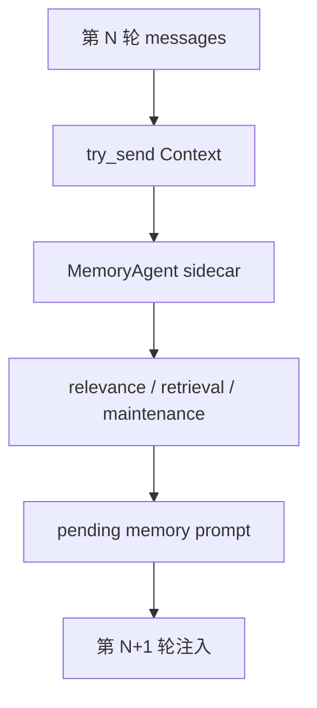
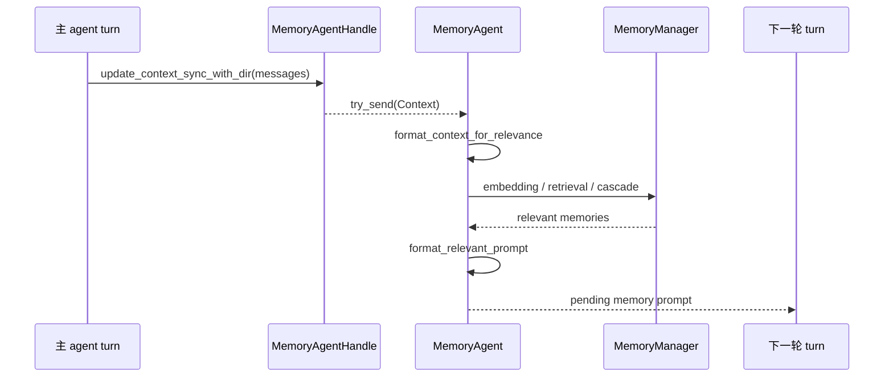

# s07 - Memory

## 本课目标

读懂 JCode 为什么把 memory 做成 sidecar，而不是在每轮 `run_turn()` 里同步检索。

Memory 很容易被误读成普通 RAG。JCode 这部分真正要看的不是“有没有 embedding”，而是它怎么在不拖慢主 agent 的前提下，把长期偏好、项目事实、旧会话线索带回当前上下文。



这张图是 memory 的关键：主 agent 只投递上下文，检索和维护在 sidecar 里跑，结果下一轮再进入主上下文。

## 本课直接讲清楚的主线

Memory 的主路径只有一句话：主 agent 在 turn 结束时把上下文丢给 sidecar，sidecar 后台检索、维护和生成 pending prompt，下一轮再把结果注入主上下文。

这条线由三块代码支撑。第一块是 `MemoryAgentHandle`，它用 `try_send` 投递上下文，所以主 turn 不会等 memory。第二块是后台 `MemoryAgent::run()`，它消费 channel、维护 session state，并把真正的检索交给 `process_context()`。第三块是 prompt 组装逻辑：relevance context 决定用什么材料找 memory，extraction context 决定要不要沉淀新 memory，relevant prompt 决定下一轮注入给主模型的文本。

`memory` tool 和 `session_search` tool 是模型显式操作 memory/历史的入口，但它们不是这课的主角。JCode 的取舍在后台 sidecar：用一轮延迟换主交互不被检索拖慢。

## 核心代码节选

下面代码摘自本地 JCode 当前 revision，部分为了讲解做了精简。读概念看这里，改代码以源码为准。

核心代码先看这个 handle：

```rust
// src/memory_agent.rs，节选
pub struct MemoryAgentHandle {
    tx: mpsc::Sender<AgentMessage>,
}

impl MemoryAgentHandle {
    pub fn update_context_sync_with_dir(
        &self,
        session_id: &str,
        messages: Arc<[Message]>,
        working_dir: Option<String>,
    ) {
        let msg = AgentMessage::Context {
            session_id: session_id.to_string(),
            messages,
            working_dir,
            timestamp: Instant::now(),
        };
        let _ = self.tx.try_send(msg);
    }
}
```

`try_send` 是关键。memory 更新被丢到后台 channel，不阻塞主 agent turn。这就是前面说的“第 N 轮触发，第 N+1 轮使用”的代码基础。

后台 agent 收到消息后再处理：

```rust
// src/memory_agent.rs，节选
async fn run(mut self) {
    while let Some(msg) = self.rx.recv().await {
        match msg {
            AgentMessage::Reset => self.reset(),
            AgentMessage::Context { session_id, messages, working_dir, timestamp } => {
                self.session_state(&session_id).turn_count += 1;

                if let Err(e) =
                    self.process_context(&session_id, messages, timestamp).await
                {
                    logging::error(&format!("Memory agent error: {}", e));
                }
            }
        }
    }
}
```

这段代码说明 memory 是一个 sidecar agent，而不是 `run_turn()` 里同步调用的一段函数。主 agent 只投递上下文，后台 agent 自己维护 session state、turn count 和检索节奏。

`process_context()` 里会把上下文转成检索材料，找到相关 memory 后只写入 pending prompt：

```rust
// src/memory_agent.rs，节选
async fn process_context(
    &mut self,
    session_id: &str,
    messages: Arc<[Message]>,
    _timestamp: Instant,
) -> Result<()> {
    let memory_manager = self.manager_for_session(session_id);
    let context = memory::format_context_for_relevance(&messages);
    if context.is_empty() {
        return Ok(());
    }

    // embedding / retrieval / validation 省略

    if let Some(prompt) =
        memory::format_relevant_prompt(&relevant, MAX_MEMORIES_PER_TURN)
    {
        memory::set_pending_memory_with_ids_and_display(
            session_id,
            prompt,
            count,
            ids,
            display_prompt,
        );
    }
}
```

这段代码把“下一轮注入”说清楚了：memory sidecar 不直接改当前 provider request，而是把结果放到 pending memory，等主 agent 下一轮取。

prompt 组装也不是随便把历史拼起来。JCode 分开了 relevance context、extraction context 和最终注入文本：

```rust
// src/memory_prompt.rs，节选
pub fn format_context_for_relevance(messages: &[Message]) -> String {
    for message in messages.iter().rev().take(MEMORY_CONTEXT_MAX_MESSAGES) {
        // 只保留用于判断相关性的上下文，超过预算就截断
    }
}

pub(crate) fn format_context_for_extraction(messages: &[Message]) -> String {
    for message in messages.iter().rev().take(EXTRACTION_CONTEXT_MAX_MESSAGES) {
        // 提取新 memory 用更大的窗口
    }
}

pub(crate) fn format_relevant_prompt(entries: &[MemoryEntry], limit: usize) -> Option<String> {
    format_entries_for_prompt(entries, limit)
        .map(|formatted| format!("# Memory\n\n{}", formatted))
}
```

这就是本课主线里说的三种 prompt：relevance 负责找，extraction 负责沉淀，relevant prompt 负责注入。

JCode 的 memory 不是“用户手动保存一条笔记”。它更像自动召回：

```text
当前上下文
  -> embedding
  -> 相似 memory
  -> graph / cascade retrieval
  -> 可选 sidecar 验证
  -> 下一轮注入 memory prompt
```

关键设计是非阻塞：

```text
第 N 轮触发查询
第 N+1 轮使用结果
```

这样不会让主 agent 每轮都等 memory。

## 状态流



这条状态流解释了为什么 memory 不是普通 RAG：主 turn 只投递上下文，sidecar 才做检索和 prompt 组装。当前轮不会等它，下一轮才使用 pending prompt。

## 机制标本

memory sidecar 可以对照 [mini/04_memory_sidecar.py](../../mini/04_memory_sidecar.py)。它只保留有界队列、非阻塞提交、后台 worker、下一轮取 pending prompt 这四个动作。

真实 JCode 多了 embedding、graph、cascade retrieval、prompt budget 和 display prompt，但非阻塞边界和这个标本一致。

## 这课应该带走的判断

Memory 补的是单次上下文的短板：模型当前上下文装不下长期偏好、项目事实和旧会话经验，所以 JCode 用 sidecar 做非阻塞召回。

代价也要记住：memory 有一轮延迟。这个延迟是有意设计，不是漏做同步检索。

## 读完你应该能解释什么

- `MemoryAgentHandle::update_context_sync_with_dir()` 为什么用 `try_send`。
- Memory sidecar 和 `run_turn()` 的边界在哪里。
- `memory_prompt.rs` 为什么同时关心 relevance context 和 extraction context。
- 为什么一轮延迟是交互延迟和召回完整性之间的取舍。
