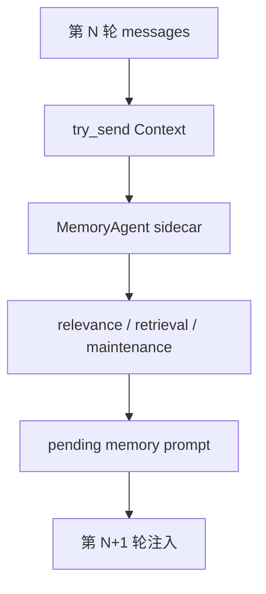

# s07 - Memory

## 本课目标

读懂 JCode 为什么把 memory 做成 sidecar，而不是在每轮 `run_turn()` 里同步检索。

Memory 很容易被误读成普通 RAG。JCode 这部分真正要看的不是“有没有 embedding”，而是它怎么在不拖慢主 agent 的前提下，把长期偏好、项目事实、旧会话线索带回当前上下文。



这张图是 memory 的关键：主 agent 只投递上下文，检索和维护在 sidecar 里跑，结果下一轮再进入主上下文。

## 先读这些文件

```text
docs/MEMORY_ARCHITECTURE.md
docs/MEMORY_BUDGET.md
src/memory.rs
src/memory_agent.rs
src/memory_graph.rs
src/memory_prompt.rs
src/tool/memory.rs
src/tool/session_search.rs
```

先打开 `docs/MEMORY_ARCHITECTURE.md`，只看它描述的主路径：上下文进入 memory agent，候选 memory 被检索和筛选，结果下一轮注入。不要先读 `memory_agent.rs`，那个文件很长。

然后读 `src/memory_agent.rs`。第一遍只追 `MemoryAgentHandle::update_context_sync_with_dir()`、`MemoryAgent::run()`、`process_context()`。这条线回答“主 agent turn 结束后，memory 查询怎么被排到后台”。看到 `process_context()` 后先停，不要立刻钻进 cluster refinement。

第三步读 `src/memory_prompt.rs`。看 `format_context_for_relevance()`、`format_context_for_extraction()`、`format_relevant_prompt()`。这几个函数决定 memory agent 看什么上下文，以及最后注入主模型的文本长什么样。

第四步读 `src/memory.rs`。先看 `MemoryManager` 的 `remember_project()`、`find_similar_scoped()`、`get_relevant_parallel()`、`find_similar_with_cascade_scoped()`。这些函数解释 memory 是怎么从简单存储走到并行召回和 cascade retrieval 的。

最后读 `src/tool/memory.rs` 和 `src/tool/session_search.rs`。前者是模型显式操作 memory 的入口，后者是跨 session 查历史的工具。把它们放最后，是因为工具只是入口；真正的取舍在后台 agent 和 manager。

## 核心代码节选

核心代码先看这个 handle：

```rust
// src/memory_agent.rs，节选
pub struct MemoryAgentHandle {
    tx: mpsc::Sender<AgentMessage>,
}

impl MemoryAgentHandle {
    pub fn update_context_sync_with_dir(
        &self,
        session_id: &str,
        messages: Arc<[Message]>,
        working_dir: Option<String>,
    ) {
        let msg = AgentMessage::Context {
            session_id: session_id.to_string(),
            messages,
            working_dir,
            timestamp: Instant::now(),
        };
        let _ = self.tx.try_send(msg);
    }
}
```

`try_send` 是关键。memory 更新被丢到后台 channel，不阻塞主 agent turn。这就是前面说的“第 N 轮触发，第 N+1 轮使用”的代码基础。

后台 agent 收到消息后再处理：

```rust
// src/memory_agent.rs，节选
async fn run(mut self) {
    while let Some(msg) = self.rx.recv().await {
        match msg {
            AgentMessage::Reset => self.reset(),
            AgentMessage::Context { session_id, messages, working_dir, timestamp } => {
                self.session_state(&session_id).turn_count += 1;

                if let Err(e) =
                    self.process_context(&session_id, messages, timestamp).await
                {
                    logging::error(&format!("Memory agent error: {}", e));
                }
            }
        }
    }
}
```

这段代码说明 memory 是一个 sidecar agent，而不是 `run_turn()` 里同步调用的一段函数。主 agent 只投递上下文，后台 agent 自己维护 session state、turn count 和检索节奏。

JCode 的 memory 不是“用户手动保存一条笔记”。它更像自动召回：

```text
当前上下文
  -> embedding
  -> 相似 memory
  -> graph / cascade retrieval
  -> 可选 sidecar 验证
  -> 下一轮注入 memory prompt
```

关键设计是非阻塞：

```text
第 N 轮触发查询
第 N+1 轮使用结果
```

这样不会让主 agent 每轮都等 memory。

## 这课应该带走的判断

Memory 补的是单次上下文的短板：模型当前上下文装不下长期偏好、项目事实和旧会话经验，所以 JCode 用 sidecar 做非阻塞召回。

代价也要记住：memory 有一轮延迟。这个延迟是有意设计，不是漏做同步检索。
