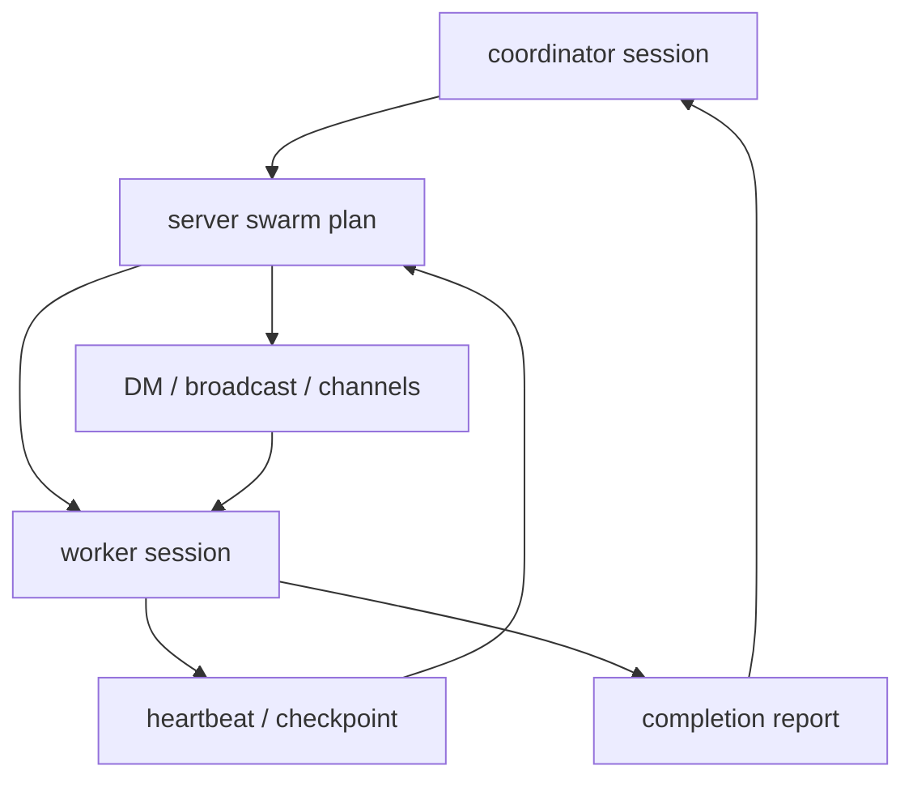

# s08 - Swarm

## 本课目标

读懂 JCode 的 swarm 为什么不是“多开几个 subagent”。

Swarm 的重点是 server-level coordination：计划、通信、状态恢复、文件触达、worker 进度和完成报告。把它理解成普通 subagent，会错过它最重要的工程边界。



这张图说明 swarm 的状态中心在 server plan，不在某个 worker 的 messages 里。worker 通过 heartbeat、checkpoint、report 回到 coordinator 和 plan。

## 先读这些文件

```text
docs/SWARM_ARCHITECTURE.md
src/server/swarm.rs
src/server/swarm_channels.rs
src/server/comm_*.rs
src/tool/communicate.rs
src/tool/task.rs
```

先读 `docs/SWARM_ARCHITECTURE.md`，只看角色边界：coordinator、worker、channel、plan、file touch。读完立刻去源码，不要在文档里停太久。

源码先打开 `src/server/swarm.rs`。第一遍只看 `broadcast_swarm_status()`、`broadcast_swarm_plan_with_previous()`、`update_member_status()`、`run_swarm_task()`。这几个函数覆盖了状态广播、计划广播、成员状态更新和实际派发任务。

然后看 `src/server/swarm_channels.rs`。只读 `subscribe_session_to_channel()`、`unsubscribe_session_from_channel()`、`list_channels_for_swarm()`。这一步把 swarm 从“多个 agent”拉回到通信系统：agent 要能订阅 channel，消息才有去处。

接着读 `src/tool/communicate.rs`。不要把它当普通 chat 工具。它是模型操作 swarm runtime 的入口：发 DM、broadcast、更新计划、等待成员、spawn worker。看这个文件时不断回到 server 里的状态结构，确认每个 action 最终改了什么 server state。

最后读 `src/tool/task.rs` 的 `SubagentTool`。它是单个 subagent 的入口，和 swarm 不是一回事。对比这两个文件，你会看清 JCode 的边界：`subagent` 偏一次性委派，`swarm` 偏长期协作 runtime。

## 核心代码节选

下面代码摘自本地 JCode 当前 revision，部分为了讲解做了精简。读概念看这里，改代码以源码为准。

swarm 的任务派发可以先看 `run_swarm_task()`：

```rust
// src/server/swarm.rs，节选
pub(super) async fn run_swarm_task(
    agent: Arc<Mutex<Agent>>,
    description: &str,
    subagent_type: &str,
    prompt: &str,
) -> Result<String> {
    let (provider, registry, session_id, working_dir, coordinator_model) = {
        let agent = agent.lock().await;
        (
            agent.provider_fork(),
            agent.registry(),
            agent.session_id().to_string(),
            agent.working_dir().map(PathBuf::from),
            agent.provider_model(),
        )
    };

    let mut session = Session::create(
        Some(session_id),
        Some(format!("{} (@{} swarm)", description, subagent_type)),
    );
    session.model = Some(coordinator_model);
    session.save()?;

    let mut allowed: HashSet<String> = registry.tool_names().await.into_iter().collect();
    for blocked in ["subagent", "task", "todo", "todowrite", "todoread"] {
        allowed.remove(blocked);
    }

    let mut worker = Agent::new_with_session(provider, registry, session, Some(allowed));
    worker.run_once_capture(prompt).await
}
```

这段代码解释了 swarm 和普通“函数调用”的差别：它 fork provider、复用 registry、新建 worker session，并且禁掉一部分工具，避免 worker 再递归启动 subagent 或改 todo。swarm 的核心是 runtime coordination，不是多发几个 prompt。

任务进度也放在 server state 里：

```rust
// src/server/swarm.rs，节选
let progress = plan.task_progress.entry(task_id.to_string()).or_default();
progress.assigned_session_id = assigned_session_id.map(str::to_string);
progress.last_heartbeat_unix_ms = Some(now_ms);
progress.heartbeat_count = Some(progress.heartbeat_count.unwrap_or(0) + 1);

if let Some(summary) = checkpoint_summary {
    progress.last_checkpoint_unix_ms = Some(now_ms);
    progress.checkpoint_summary = Some(truncate_detail(&summary, 120));
}
```

这段代码说明 swarm 要追踪 heartbeat、checkpoint 和 assigned session。没有这些状态，多 agent 协作只会变成多个黑盒同时跑。

## JCode 的 Swarm 关心什么

JCode 的 swarm 不是普通 subagent。它关心多 agent 协作运行时：

- coordinator 怎么分配任务。
- worker 怎么汇报。
- agent 之间怎么 DM / broadcast / channel。
- 哪些文件被谁读过、改过。
- plan 怎么更新。
- blocked / failed / crashed 怎么恢复。
- worktree 什么时候用，什么时候不用。

这部分最能体现 JCode 和 pi 的差异。pi 更克制，JCode 更激进。

不要把 swarm 理解成“多开几个 subagent”。真正难的是计划、通信、文件触达、状态恢复和集成边界。

## 这课应该带走的判断

Swarm 补的是单 agent 做大任务的短板：一个 agent 会慢，会污染上下文，也难以并行推进相互独立的部分。

代价也要记住：swarm 会引入计划、通信、文件触达、进度恢复和最终集成的复杂度。没有这些状态管理，多 agent 只是在同时制造更多不确定性。

## 读完你应该能解释什么

- `run_swarm_task()` 为什么要新建 worker session。
- 为什么 worker 要禁掉一部分递归和 todo 相关工具。
- heartbeat、checkpoint、assigned session 解决什么问题。
- `subagent` 和 `swarm` 的边界在哪里。
