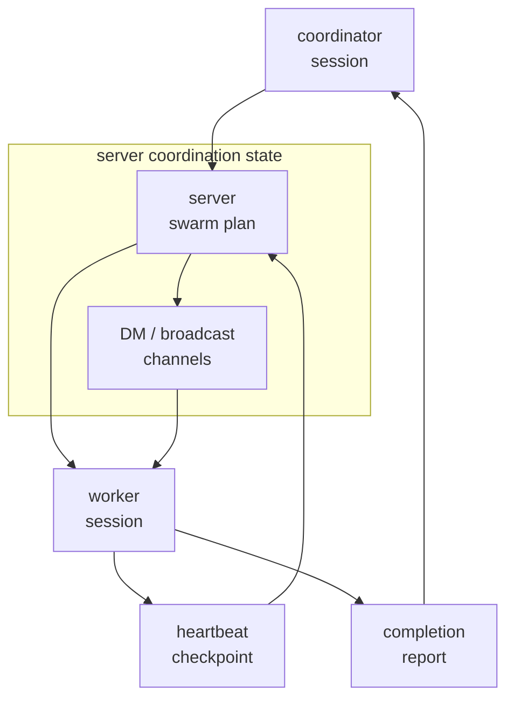
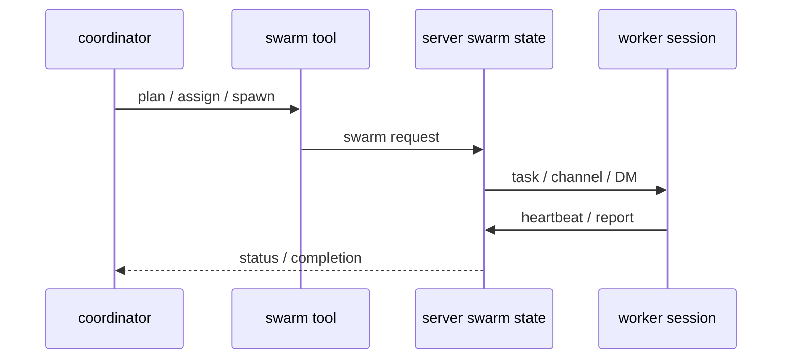

# s08 - Swarm

## 先看 swarm 和 subagent 的区别

swarm 不是简单多开几个 subagent。JCode 把计划、成员、通信和恢复状态放在 server 里，让一组 agent 可以按同一份状态协作。

Swarm 要处理的是 server 里的协作状态：计划、通信、恢复、文件修改记录、worker 进度和完成报告。把它理解成普通 subagent，会漏掉最重要的工程问题。



swarm 的状态中心在 server plan，不在某个 worker 的 messages 里。worker 通过 heartbeat、checkpoint、report 回到 coordinator 和 plan。

## 先看协作状态放在哪里

Swarm 的重点不是“启动多个模型”，而是 server 拥有一个协作计划。coordinator 更新 plan，worker 通过 heartbeat、checkpoint 和 report 回写进度，channel 负责 DM/broadcast 的去向，最后完成报告回到 coordinator。

代码里先看四件事：server 拿着哪些状态，worker session 怎样创建，通信索引放在哪里，其他 worker 怎样知道谁改过文件。

`communicate` tool 是模型操作 swarm runtime 的入口，`SubagentTool` 是一次性委派入口。把这两者分开，才能看懂 JCode 的设计：subagent 是“派一个人做一件事”，swarm 是“维护一份持续更新的协作状态”。

## 核心代码节选

代码摘自本地 JCode 当前 revision，部分为了讲解做了精简。读概念看这里，改代码以源码为准。

先看 server 拿着哪些 swarm 状态：

```rust
// src/server/state.rs，节选
pub struct SwarmState {
    pub members: Arc<RwLock<HashMap<String, SwarmMember>>>,
    pub swarms_by_id: Arc<RwLock<HashMap<String, HashSet<String>>>>,
    pub plans: Arc<RwLock<HashMap<String, VersionedPlan>>>,
    pub coordinators: Arc<RwLock<HashMap<String, String>>>,
}
```

这个结构体已经说明 swarm 不是 chat history 技巧。成员、swarm 分组、plan、coordinator 都是 server state。coordinator 换了、worker 重连了、plan 变了，不能只靠某一轮 messages 猜。

client 接上 server 时会被登记成 swarm member：

```rust
// src/server/client_session.rs，节选
members.insert(
    client_session_id.to_string(),
    SwarmMember {
        session_id: client_session_id.to_string(),
        event_tx: client_event_tx.clone(),
        event_txs: HashMap::from([(client_connection_id.to_string(), client_event_tx)]),
        working_dir: working_dir.clone(),
        swarm_id: derived_swarm_id.clone(),
        swarm_enabled,
        status: "ready".to_string(),
        role: "agent".to_string(),
        is_headless: false,
        // 其他字段省略
    },
);
```

成员身份和 client 连接在这里是分开的：一个 session 可以有连接、断连、重连，swarm member 仍然是 server 里的运行时对象。

任务派发再看 `run_swarm_task()`：

```rust
// src/server/swarm.rs，节选
pub(super) async fn run_swarm_task(
    agent: Arc<Mutex<Agent>>,
    description: &str,
    subagent_type: &str,
    prompt: &str,
) -> Result<String> {
    let (provider, registry, session_id, working_dir, coordinator_model) = {
        let agent = agent.lock().await;
        (
            agent.provider_fork(),
            agent.registry(),
            agent.session_id().to_string(),
            agent.working_dir().map(PathBuf::from),
            agent.provider_model(),
        )
    };

    let mut session = Session::create(
        Some(session_id),
        Some(format!("{} (@{} swarm)", description, subagent_type)),
    );
    session.model = Some(coordinator_model);
    session.save()?;

    let mut allowed: HashSet<String> = registry.tool_names().await.into_iter().collect();
    for blocked in ["subagent", "task", "todo", "todowrite", "todoread"] {
        allowed.remove(blocked);
    }

    let mut worker = Agent::new_with_session(provider, registry, session, Some(allowed));
    worker.run_once_capture(prompt).await
}
```

这段代码能看出 swarm 和普通“函数调用”的差别：它 fork provider、复用 registry、新建 worker session，并且禁掉一部分工具，避免 worker 再递归启动 subagent 或改 todo。swarm 的重点是运行时协作，不是多发几个 prompt。

任务进度也放在 server state 里：

```rust
// src/server/swarm.rs，节选
let progress = plan.task_progress.entry(task_id.to_string()).or_default();
progress.assigned_session_id = assigned_session_id.map(str::to_string);
progress.last_heartbeat_unix_ms = Some(now_ms);
progress.heartbeat_count = Some(progress.heartbeat_count.unwrap_or(0) + 1);

if let Some(summary) = checkpoint_summary {
    progress.last_checkpoint_unix_ms = Some(now_ms);
    progress.checkpoint_summary = Some(truncate_detail(&summary, 120));
}
```

swarm 要追踪 heartbeat、checkpoint 和 assigned session。没有这些状态，多 agent 协作就会变成几个 agent 各跑各的。

`communicate` tool 把这些 server 动作暴露给模型。注意它不是普通聊天工具，它的 action 集合直接覆盖 spawn、计划、channel、等待成员这些运行时动作：

```rust
// src/tool/communicate.rs，节选
impl Tool for CommunicateTool {
    fn name(&self) -> &str {
        "swarm"
    }

    fn parameters_schema(&self) -> Value {
        json!({
            "required": ["action"],
            "properties": {
                "action": {
                    "enum": [
                        "message", "broadcast", "dm", "channel",
                        "propose_plan", "approve_plan", "spawn",
                        "assign_task", "run_plan", "subscribe_channel",
                        "unsubscribe_channel", "await_members"
                    ]
                }
            }
        })
    }
}
```

channel 也有 server 侧索引，不是消息字符串里约定一个 `#name` 就算完成：

```rust
// src/server/swarm_channels.rs，节选
pub(super) async fn subscribe_session_to_channel(
    session_id: &str,
    swarm_id: &str,
    channel: &str,
    channel_subscriptions: &ChannelSubscriptions,
    channel_subscriptions_by_session: &ChannelSubscriptions,
) {
    with_channel_index_mut(
        channel_subscriptions,
        channel_subscriptions_by_session,
        |index| index.subscribe(session_id, swarm_id, channel),
    )
    .await;
}
```

这两段代码把通信方式说清楚了：模型调用 tool，tool 发 server request，server 维护 channel/session 索引。协作状态不靠 prompt 里的临时约定。

文件修改记录也会进入 swarm。`read`、`write`、`edit` 这些普通工具会发布 `FileTouch` 事件：

```rust
// src/tool/write.rs，节选
Bus::global().publish(BusEvent::FileTouch(FileTouch {
    session_id: ctx.session_id.clone(),
    path: path.to_path_buf(),
    op: FileOp::Write,
    summary: Some(format!("overwrote file ({} lines)", line_count)),
    detail,
}));
```

server 侧只关心 peer 的修改，不把自己和只读访问混在一起：

```rust
// src/server/state.rs，节选
pub(super) fn latest_peer_touches(
    accesses: &[FileAccess],
    current_session_id: &str,
    swarm_session_ids: &HashSet<String>,
) -> Vec<FileAccess> {
    for access in accesses.iter().filter(|access| {
        access.session_id != current_session_id
            && swarm_session_ids.contains(&access.session_id)
            && access.op.is_modification()
    }) {
        // 保留每个 peer 最近一次修改
    }
}
```

这就是为什么 swarm 不是纯聊天协议。多个 worker 同时动文件时，JCode 需要知道“谁碰了哪个文件”，否则最后集成阶段只能手动对 diff。

## 状态流



swarm 不是“多开模型”，而是把协作事实放进 server：谁被分配了任务、谁还活着、谁在哪个 channel、谁交了 report。没有这些状态，coordinator 只能靠聊天记录猜。

## 最小复现

swarm 的 server state 可以对照 [mini/06_swarm_channel.py](../../mini/06_swarm_channel.py)。它只保留 members、channels、task_progress、inbox 四个结构。

真实 JCode 多了 session 连接、headless worker、plan version、file touch、completion report、worktree 和 reload 恢复。最小复现只先说明一点：channel 和 task progress 属于 server，不属于某个 worker 的 prompt。

## Swarm 具体管哪些事

JCode 的 swarm 不是普通 subagent。它要管这些事情：

- coordinator 怎么分配任务。
- worker 怎么汇报。
- agent 之间怎么 DM / broadcast / channel。
- 哪些文件被谁读过、改过。
- plan 怎么更新。
- blocked / failed / crashed 怎么恢复。
- worktree 什么时候用，什么时候不用。

这部分最能体现 JCode 和 pi 的差异。pi 更克制，JCode 放进 server 的东西更多。

不要把 swarm 理解成“多开几个 subagent”。难点在计划、通信、文件修改记录、状态恢复和最后集成。

## 这里的代价

Swarm 解决的是单 agent 做大任务时的问题：一个 agent 会慢，容易把上下文塞乱，也很难并行推进相互独立的部分。

代价也要记住：swarm 会引入计划、通信、文件修改记录、进度恢复和最终集成的复杂度。没有这些状态管理，多 agent 只是在同时制造更多不确定性。

## 读完后检查一下

- `run_swarm_task()` 为什么要新建 worker session。
- 为什么 worker 要禁掉一部分递归和 todo 相关工具。
- heartbeat、checkpoint、assigned session 解决什么问题。
- `subagent` 和 `swarm` 的边界在哪里。
