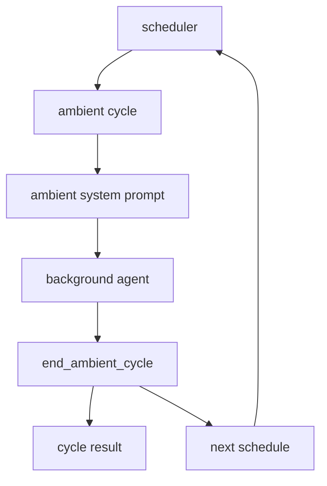

# s09 - Ambient 和 Self-Dev

## 本课目标

读懂 JCode 两个更靠后的能力：ambient 后台循环，以及 self-dev 自我修改。

这两个模块都不能只看 prompt。Ambient 的关键是调度、预算和结束机制；self-dev 的关键是 session 边界、build/reload 和恢复。

## Ambient



这张图说明 ambient 必须有结束和调度机制。后台 agent 不是无限跑，它通过 `end_ambient_cycle` 汇报结果并安排下一次唤醒。

Ambient 的主线是后台循环必须有边界。它需要启动条件、资源预算、安全边界、runner、scheduler 和持久化队列。没有这些，ambient 就不是助手，而是后台噪音。

模块关系可以这样理解：`directives` 提供待处理指令，`manager` 管运行状态，`runner` 启动一轮 ambient cycle，`scheduler` 决定下次什么时候醒，`persistence` 保存队列和锁，`tool/ambient` 让后台 agent 显式结束 cycle、安排下次运行或请求权限。

下面的代码节选会直接展示两件事：ambient 不是一个单独工具文件，而是一组后台运行模块；ambient cycle 结束必须通过 `end_ambient_cycle` 上报摘要、资源消耗和下一次调度。

ambient 的模块地图在 `src/ambient.rs` 里：

下面代码摘自本地 JCode 当前 revision，部分为了讲解做了精简。读概念看这里，改代码以源码为准。

```rust
// src/ambient.rs，节选
mod directives;
mod manager;
mod paths;
mod persistence;
mod prompt;
pub mod runner;
pub mod scheduler;

pub use directives::{add_directive, has_pending_directives, take_pending_directives};
pub use manager::AmbientManager;
pub use persistence::{AmbientLock, ScheduledQueue};
pub use prompt::{
    ResourceBudget,
    build_ambient_system_prompt,
    gather_recent_sessions,
    gather_memory_graph_health,
};
```

这段代码说明 ambient 不是一个工具文件。它有指令、管理器、持久化、prompt、runner、scheduler。真正要读的是后台循环和预算，不是只看工具 schema。

ambient cycle 结束也必须通过工具显式上报：

```rust
// src/tool/ambient.rs，节选
struct EndCycleInput {
    summary: String,
    memories_modified: u32,
    compactions: u32,
    proactive_work: Option<String>,
    next_schedule: Option<NextScheduleInput>,
}

impl Tool for EndAmbientCycleTool {
    fn name(&self) -> &str { "end_ambient_cycle" }

    fn parameters_schema(&self) -> Value {
        json!({
            "required": ["summary", "memories_modified", "compactions"]
        })
    }
}
```

这段代码说明 ambient agent 不是跑完就消失。它必须汇报本轮做了什么、改了多少 memory、是否做了 compaction、下次什么时候醒。

Ambient 是后台 agent。它不是用户发一句做一句，而是在资源允许时做维护：

- 整理 memory。
- 检查最近 session。
- 看 git 活动。
- 做低风险主动任务。
- 自己决定下次什么时候醒来。

这个方向还很实验，但值得读，因为它指向长期 agent 环境维护。

读 ambient 时重点看资源限制。后台 agent 如果没有预算和优先级控制，会变成另一个干扰源。

## Self-Dev


这张图说明 self-dev 的边界：先切到 self-dev session，再 build/test，最后 reload shared server 并恢复会话。危险动作不应该从普通 session 直接执行。

Self-dev 的主线是“让 JCode 改自己”必须经过受控 session。显式 `jcode self-dev` 会创建或恢复 self-dev session，设置 canary 标记，必要时要求 build，然后启动 TUI。普通 session 不能直接执行危险 reload。

`SelfDevTool` 暴露的是一组 action：`enter/build/test/cancel-build/reload/status/socket-info`。其中 `reload`、`socket-info`、`socket-help` 会检查当前 session 是否 self-dev，这就是风险边界。launch 负责从普通会话切到 self-dev 会话，build queue 负责请求去重、锁和后台状态，reload 负责新 binary 接管旧 server 并恢复会话。

Prompt 不是 self-dev 的核心。它只是把规则告诉模型；真正的边界在 CLI、tool action、build/test、session gate 和 reload 恢复。

Self-dev 工具的 action schema 先看这一段：

下面代码摘自本地 JCode 当前 revision，部分为了讲解做了精简。读概念看这里，改代码以源码为准。

```rust
// src/tool/selfdev/mod.rs，节选
impl Tool for SelfDevTool {
    fn name(&self) -> &str {
        "selfdev"
    }

    fn parameters_schema(&self) -> Value {
        json!({
            "properties": {
                "action": {
                    "enum": [
                        "enter",
                        "build",
                        "test",
                        "cancel-build",
                        "reload",
                        "status",
                        "socket-info",
                        "socket-help"
                    ]
                }
            },
            "required": ["action"]
        })
    }
}
```

这段代码说明 self-dev 不是一个隐藏命令，而是模型能调用的工具。它暴露的是一组受控动作：进入 self-dev、build、test、reload、看状态。

再看风险边界：

```rust
// src/tool/selfdev/mod.rs，节选
match action.as_str() {
    "enter" => self.do_enter(params.prompt, &ctx).await,
    "build" => self.do_build(params.reason, params.target, params.notify, params.wake, &ctx).await,
    "test" => self.do_test(params.command, params.reason, params.notify, params.wake, &ctx).await,
    "reload" => {
        if !SelfDevTool::session_is_selfdev(&ctx.session_id) {
            Ok(ToolOutput::new(
                "`selfdev reload` is only available inside a self-dev session. Use `selfdev enter` first.",
            ))
        } else {
            self.do_reload(params.context, &ctx.session_id, ctx.execution_mode).await
        }
    }
    "status" => self.do_status().await,
    _ => Ok(ToolOutput::new(format!("Unknown action: {}", action))),
}
```

这段代码说明 self-dev 的危险动作不是所有 session 都能用。`reload` 必须在 self-dev session 里执行，这是 JCode 给“让 agent 改自己”加的边界。

Self-dev 是让 JCode 改自己。

建议非常保守：

- 新建分支。
- 保持工作区干净。
- 每一步 commit。
- 小改动开始。
- 必须跑 `cargo check`。
- 不要一上来改 provider、server reload、compaction、swarm。

## 这课应该带走的判断

Ambient 补的是用户不会每次显式要求维护环境的短板。它把近期 session、memory、git 活动这类维护工作放到后台循环里。

Self-dev 补的是 JCode 自己也需要被快速改造的需求。边界是分支、commit、build/test、self-dev session 和 reload 恢复。

风险也要一起记住：ambient 没有资源限制会变成干扰源；self-dev 改 reload 或 server state 可能让正在运行的 session 丢状态。

## 读完你应该能解释什么

- ambient 为什么需要 scheduler、budget 和 `end_ambient_cycle`。
- ambient agent 为什么不能无限后台运行。
- self-dev 为什么要先切到 self-dev session。
- `selfdev reload` 为什么需要 session gate 和恢复逻辑。
