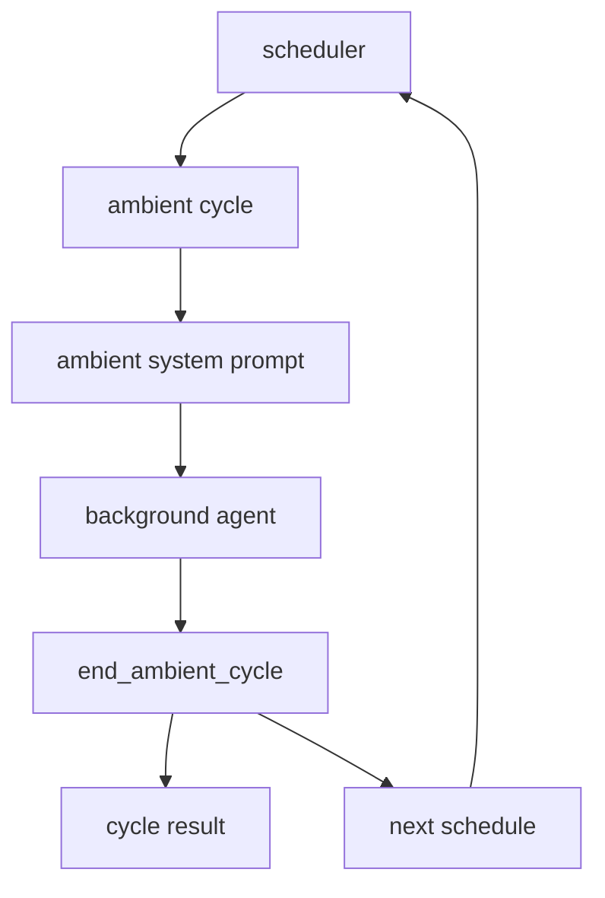
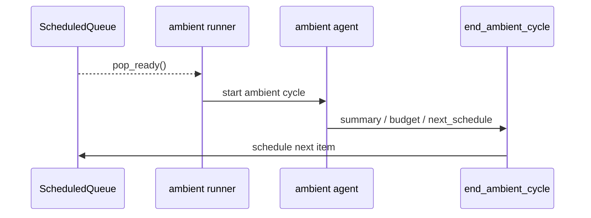
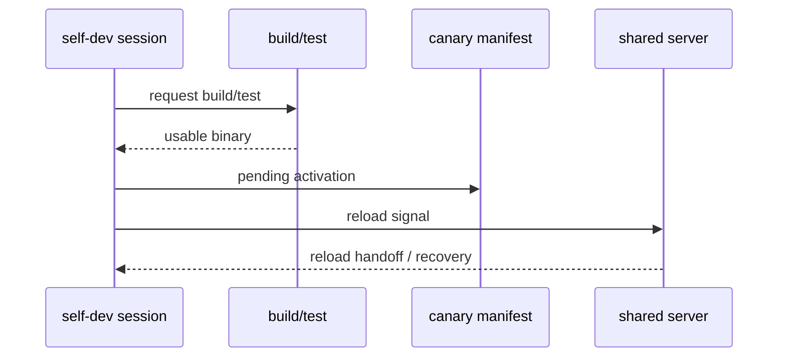

# s09 - Ambient 和 Self-Dev

## 本课目标

**本课一句话：ambient 和 self-dev 都是在无人盯着时继续改状态，所以它们必须先有预算、门禁和恢复路径。**

读懂 JCode 两个更靠后的能力：ambient 后台循环，以及 self-dev 自我修改。

这两个模块都不能只看 prompt。Ambient 的关键是调度、预算和结束机制；self-dev 的关键是 session 边界、build/reload 和恢复。

## Ambient



这张图说明 ambient 必须有结束和调度机制。后台 agent 不是无限跑，它通过 `end_ambient_cycle` 汇报结果并安排下一次唤醒。

Ambient 的主线是后台循环必须有边界。它需要启动条件、资源预算、安全边界、runner、scheduler 和持久化队列。没有这些，ambient 就不是助手，而是后台噪音。

模块关系可以这样理解：`directives` 提供待处理指令，`manager` 管运行状态，`runner` 启动一轮 ambient cycle，`scheduler` 决定下次什么时候醒，`persistence` 保存队列和锁，`tool/ambient` 让后台 agent 显式结束 cycle、安排下次运行或请求权限。

代码看三件事：ambient 不是一个单独工具文件；ready item 由持久化队列拿出来；后台 agent 必须通过 `end_ambient_cycle` 交代本轮结果。

### Ambient 核心代码节选

ambient 的模块地图在 `src/ambient.rs` 里：

代码摘自本地 JCode 当前 revision，部分为了讲解做了精简。读概念看这里，改代码以源码为准。

```rust
// src/ambient.rs，节选
mod directives;
mod manager;
mod paths;
mod persistence;
mod prompt;
pub mod runner;
pub mod scheduler;

pub use directives::{add_directive, has_pending_directives, take_pending_directives};
pub use manager::AmbientManager;
pub use persistence::{AmbientLock, ScheduledQueue};
pub use prompt::{
    ResourceBudget,
    build_ambient_system_prompt,
    gather_recent_sessions,
    gather_memory_graph_health,
};
```

这段代码说明 ambient 不是一个工具文件。它有指令、管理器、持久化、prompt、runner、scheduler。真正要读的是后台循环和预算，不是只看工具 schema。

ambient cycle 结束也必须通过工具显式上报：

```rust
// src/tool/ambient.rs，节选
struct EndCycleInput {
    summary: String,
    memories_modified: u32,
    compactions: u32,
    proactive_work: Option<String>,
    next_schedule: Option<NextScheduleInput>,
}

impl Tool for EndAmbientCycleTool {
    fn name(&self) -> &str { "end_ambient_cycle" }

    fn parameters_schema(&self) -> Value {
        json!({
            "required": ["summary", "memories_modified", "compactions"]
        })
    }
}
```

这段代码说明 ambient agent 不是跑完就消失。它必须汇报本轮做了什么、改了多少 memory、是否做了 compaction、下次什么时候醒。

schedule queue 说明“下次唤醒”不是口头承诺，而是持久化队列里的 item：

```rust
// src/ambient/persistence.rs，节选
pub struct ScheduledQueue {
    items: Vec<ScheduledItem>,
    path: PathBuf,
}

impl ScheduledQueue {
    pub fn push(&mut self, item: ScheduledItem) {
        self.items.push(item);
        let _ = self.save();
    }

    pub fn pop_ready(&mut self) -> Vec<ScheduledItem> {
        let now = Utc::now();
        let (ready, remaining): (Vec<_>, Vec<_>) =
            self.items.drain(..).partition(|i| i.scheduled_for <= now);

        self.items = remaining;
        let mut ready = ready;
        ready.sort_by(|a, b| {
            b.priority
                .cmp(&a.priority)
                .then_with(|| a.scheduled_for.cmp(&b.scheduled_for))
        });
        ready
    }
}
```

这段代码把 ambient 的调度讲实了：到期 item 才会被取出，优先级高的先跑，同优先级按时间排序。后台 agent 不是无限循环，而是被队列和调度约束。

runner 把队列、锁、agent cycle 接起来：

```rust
// src/ambient/runner.rs，节选
pub async fn run_loop(self, provider: Arc<dyn Provider>) {
    let mut scheduler = AdaptiveScheduler::new(scheduler_config);

    loop {
        let (should_run, ready_direct_items) =
            match AmbientManager::new() {
                Ok(mut mgr) => {
                    let ready_direct_items = mgr.take_ready_direct_items();
                    let should_run =
                        ambient_allowed && (mgr.should_run() || ambient::has_pending_directives());
                    (should_run, ready_direct_items)
                }
                Err(_) => (false, Vec::new()),
            };

        self.deliver_ready_direct_items(&provider, ready_direct_items).await;

        if !should_run {
            self.inner.wake_notify.notified().await;
            continue;
        }

        let Some(lock) = AmbientLock::try_acquire()? else {
            continue;
        };
        let _result = self.run_cycle(&provider).await;
        drop(lock);
    }
}
```

这段代码的重点不是循环本身，而是两个边界：direct item 可以投递到具体 session，ambient item 才进入后台 agent；`AmbientLock` 防止多个 ambient runner 同时抢同一批后台维护任务。

真正跑一轮时，JCode 只给 ambient session 注册 ambient 专用工具：

```rust
// src/ambient/runner.rs，节选
let cycle_provider = provider.fork();
let registry = tool::Registry::new(cycle_provider.clone()).await;
registry.register_ambient_tools().await;

let mut agent = Agent::new(cycle_provider.clone(), registry);
agent.set_system_prompt(&system_prompt);

ambient_tools::take_cycle_result();
let run_result = agent.run_once_capture(&initial_message).await;

if let Some(result) = ambient_tools::take_cycle_result() {
    return Ok(AmbientCycleResult { ..result });
}
```

这段代码把权限边界说清楚了：ambient agent 不是拿普通 session 的完整工具箱乱跑。它有自己的 prompt、自己的 session、自己的工具集合，结果必须被 runner 收走。

如果 agent 没调用 `end_ambient_cycle`，runner 不直接相信它已经完成：

```rust
// src/ambient/runner.rs，节选
let continuation = "You stopped unexpectedly without calling end_ambient_cycle. \
    If you are done with your work, call end_ambient_cycle with a summary...";

let _ = agent.run_once_capture(continuation).await;

if ambient_tools::take_cycle_result().is_none() {
    return Ok(AmbientCycleResult {
        summary: "Cycle ended without calling end_ambient_cycle".to_string(),
        status: CycleStatus::Incomplete,
        // 其他字段省略
    });
}
```

这不是“提示词再提醒一次”这么简单。它是在给后台循环兜底：没有结束工具调用，就不能把这轮当成完整维护任务。

Ambient 是后台 agent。它不是用户发一句做一句，而是在资源允许时做维护：

- 整理 memory。
- 检查最近 session。
- 看 git 活动。
- 做低风险主动任务。
- 自己决定下次什么时候醒来。

这个方向还很实验，学习价值在于它把长期 agent 的环境维护问题摆到了源码里。

读 ambient 时重点看资源限制。后台 agent 如果没有预算和优先级控制，会变成另一个干扰源。

### Ambient 机制标本

ambient 调度可以对照 [mini/07_ambient_scheduler.py](../../mini/07_ambient_scheduler.py)。它保留 queue、pop_ready、run cycle、end cycle、reschedule 这条线。

真实 JCode 多了 active session pause、permission request、visible mode、notification、transcript、direct session delivery。标本只回答一个问题：为什么 ambient 不是 while true 后台线程。

## Self-Dev


这张图说明 self-dev 的边界：先切到 self-dev session，再 build/test，最后 reload shared server 并恢复会话。危险动作不应该从普通 session 直接执行。

Self-dev 的主线是“让 JCode 改自己”必须经过受控 session。显式 `jcode self-dev` 会创建或恢复 self-dev session，设置 canary 标记，必要时要求 build，然后启动 TUI。普通 session 不能直接执行危险 reload。

`SelfDevTool` 暴露的是一组 action：`enter/build/test/cancel-build/reload/status/socket-info`。其中 `reload`、`socket-info`、`socket-help` 会检查当前 session 是否 self-dev，这就是风险边界。launch 负责从普通会话切到 self-dev 会话，build queue 负责请求去重、锁和后台状态，reload 负责新 binary 接管旧 server 并恢复会话。

Prompt 不是 self-dev 的核心。它只是把规则告诉模型；真正的边界在 CLI、tool action、build/test、session gate 和 reload 恢复。

### Self-Dev 核心代码节选

进入 self-dev 不是给当前 session 加一句 prompt。JCode 会创建一个 canary session，并把一部分父 session 上下文带过去：

代码摘自本地 JCode 当前 revision，部分为了讲解做了精简。读概念看这里，改代码以源码为准。

```rust
// src/tool/selfdev/launch.rs，节选
pub fn enter_selfdev_session(
    parent_session_id: Option<&str>,
    working_dir: Option<&Path>,
) -> Result<SelfDevLaunchResult> {
    let repo_dir = SelfDevTool::resolve_repo_dir(working_dir)
        .ok_or_else(|| anyhow::anyhow!("Could not find jcode repo"))?;

    let mut session = if let Some(parent_session_id) = parent_session_id {
        let parent = session::Session::load(parent_session_id)?;
        let mut child = session::Session::create(
            Some(parent_session_id.to_string()),
            Some("Self-development session".to_string()),
        );
        child.replace_messages(parent.messages.clone());
        child.compaction = parent.compaction.clone();
        child.provider_key = parent.provider_key.clone();
        child
    } else {
        session::Session::create(None, Some("Self-development session".to_string()))
    };

    session.set_canary("self-dev");
    session.working_dir = Some(repo_dir.display().to_string());
    session.save()?;
}
```

这段代码证明 self-dev 的边界在 session，而不是 prompt。canary session 继承必要上下文，但它有自己的 session id、working dir 和 self-dev 标记。

Self-dev 工具的 action schema 再看这一段：

```rust
// src/tool/selfdev/mod.rs，节选
impl Tool for SelfDevTool {
    fn name(&self) -> &str {
        "selfdev"
    }

    fn parameters_schema(&self) -> Value {
        json!({
            "properties": {
                "action": {
                    "enum": [
                        "enter",
                        "build",
                        "test",
                        "cancel-build",
                        "reload",
                        "status",
                        "socket-info",
                        "socket-help"
                    ]
                }
            },
            "required": ["action"]
        })
    }
}
```

这段代码说明 self-dev 不是一个隐藏命令，而是模型能调用的工具。它暴露的是一组受控动作：进入 self-dev、build、test、reload、看状态。

再看风险边界：

```rust
// src/tool/selfdev/mod.rs，节选
match action.as_str() {
    "enter" => self.do_enter(params.prompt, &ctx).await,
    "build" => self.do_build(params.reason, params.target, params.notify, params.wake, &ctx).await,
    "test" => self.do_test(params.command, params.reason, params.notify, params.wake, &ctx).await,
    "reload" => {
        if !SelfDevTool::session_is_selfdev(&ctx.session_id) {
            Ok(ToolOutput::new(
                "`selfdev reload` is only available inside a self-dev session. Use `selfdev enter` first.",
            ))
        } else {
            self.do_reload(params.context, &ctx.session_id, ctx.execution_mode).await
        }
    }
    "status" => self.do_status().await,
    _ => Ok(ToolOutput::new(format!("Unknown action: {}", action))),
}
```

这段代码说明 self-dev 的危险动作不是所有 session 都能用。`reload` 必须在 self-dev session 里执行，这是 JCode 给“让 agent 改自己”加的边界。

真正 reload 前还会保存恢复上下文、更新 canary manifest、再向 server 发 reload signal：

```rust
// src/tool/selfdev/reload.rs，节选
pub(super) async fn do_reload(
    &self,
    context: Option<String>,
    session_id: &str,
    execution_mode: ToolExecutionMode,
) -> Result<ToolOutput> {
    let source = build::current_source_state(&repo_dir)?;
    let hash = source.version_label.clone();

    let mut manifest = build::BuildManifest::load()?;
    manifest.canary = Some(hash.clone());
    manifest.canary_status = Some(build::CanaryStatus::Testing);
    manifest.set_pending_activation(build::PendingActivation {
        session_id: session_id.to_string(),
        new_version: hash.clone(),
        source_fingerprint: Some(source.fingerprint.clone()),
        requested_at: chrono::Utc::now(),
        // 其他版本字段省略
    })?;
    manifest.save()?;

    let reload_ctx = ReloadContext {
        task_context: context,
        version_after: hash.clone(),
        session_id: session_id.to_string(),
        timestamp: chrono::Utc::now().to_rfc3339(),
        // 其他字段省略
    };
    reload_ctx.save()?;

    let request_id =
        server::send_reload_signal(hash.clone(), Some(session_id.to_string()), true);
    let timeout = std::time::Duration::from_secs(SelfDevTool::reload_timeout_secs());
    server::wait_for_reload_ack(&request_id, timeout).await?;
}
```

这段代码说明 self-dev reload 不是“重启一下”。它要先记录要激活的版本、保存恢复上下文，再让 server 进入 reload handoff。否则 agent 改自己时很容易丢掉当前任务。

server 侧还有 reload recovery 记录。reload 期间被打断的 session 不是靠用户手动想起来：

```rust
// src/server/reload_recovery.rs，节选
pub(super) struct ReloadRecoveryRecord {
    pub reload_id: String,
    pub session_id: String,
    pub role: ReloadRecoveryRole,
    pub status: ReloadRecoveryStatus,
    pub directive: ReloadRecoveryDirective,
    pub reason: String,
    pub created_at: String,
    pub delivered_at: Option<String>,
}

pub(super) fn persist_intent(
    reload_id: &str,
    session_id: &str,
    role: ReloadRecoveryRole,
    directive: ReloadRecoveryDirective,
    reason: impl Into<String>,
) -> Result<()> {
    let record = ReloadRecoveryRecord {
        reload_id: reload_id.to_string(),
        session_id: session_id.to_string(),
        role,
        status: ReloadRecoveryStatus::Pending,
        directive,
        reason: reason.into(),
        created_at: chrono::Utc::now().to_rfc3339(),
        delivered_at: None,
    };
    storage::write_json(&path_for_session(session_id)?, &record)?;
}
```

这段代码补上 self-dev 最容易漏掉的部分：reload 不是一个 session 的事。shared server 里可能还有普通 session、headless worker、swarm member。恢复指令必须持久化，否则 reload 成功也可能把现场弄丢。

## 状态流

Ambient 的状态流：



Self-dev 的状态流：



这两条线都在讲同一件事：后台能力必须能恢复。ambient 用 queue 恢复下一次唤醒，self-dev 用 manifest 和 reload context 恢复正在做的修改。

## Self-Dev 机制标本

self-dev reload gate 可以对照 [mini/08_selfdev_reload_gate.py](../../mini/08_selfdev_reload_gate.py)。

这个标本只保留状态边界：必须进入 canary session，build 之后才能 reload，并且 reload 前要留下 pending activation 和 recovery context。

Self-dev 是让 JCode 改自己。

建议非常保守：

- 新建分支。
- 保持工作区干净。
- 每一步 commit。
- 小改动开始。
- 必须跑 `cargo check`。
- 不要一上来改 provider、server reload、compaction、swarm。

## 这课应该带走的判断

Ambient 补的是用户不会每次显式要求维护环境的短板。它把近期 session、memory、git 活动这类维护工作放到后台循环里。

Self-dev 补的是 JCode 自己也需要被快速改造的需求。边界是分支、commit、build/test、self-dev session 和 reload 恢复。

风险也要一起记住：ambient 没有资源限制会变成干扰源；self-dev 改 reload 或 server state 可能让正在运行的 session 丢状态。

## 读完你应该能解释什么

- ambient 为什么需要 scheduler、budget 和 `end_ambient_cycle`。
- ambient agent 为什么不能无限后台运行。
- self-dev 为什么要先切到 self-dev session。
- `selfdev reload` 为什么需要 session gate 和恢复逻辑。
