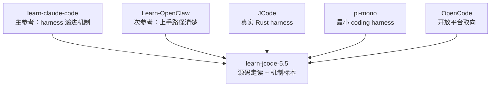

# s10 - 对比课：JCode、learn-claude-code、Learn-OpenClaw、pi、OpenCode

## 本课目标

把前面几课放回参考项目里看清楚：我们为什么主参考 `learn-claude-code`，次要参考 `Learn-OpenClaw`，以及 JCode 和 pi、OpenCode、Claude Code 的差异在哪里。

这课不讨论非公开或泄露源码。Claude Code 只讨论公开能力、公开文档和 `learn-claude-code` 抽象出来的 harness 思路。



这张图说明本教程的取舍：结构和立场更靠近 `learn-claude-code`，入门解释借一点 `Learn-OpenClaw`，主体仍然围绕 JCode 源码。

## 三个教程项目的差异

| 项目 | 它在教什么 | 主要方法 | 我们怎么参考 |
| --- | --- | --- | --- |
| `learn-claude-code` | harness 工程机制 | 每课一个 runnable mini-agent，机制逐层叠加 | 主参考。学习它的递进结构、强观点、代码标本 |
| `Learn-OpenClaw` | agent 基础概念和实作路径 | 先讲 Node / Workflow / Agent / Tool，再给 examples | 次参考。学习它的直接、清楚、少绕路 |
| `learn-jcode-5.5` | 产品级 coding-agent harness 源码 | Mermaid + 源码节选 + 逐段解释 + JCode 对比 | 不写 toy agent 主线，直接拆 JCode 的真实 runtime |

`learn-claude-code` 的强项是“机制从小长大”。比如 agent loop、tool use、todo、subagent、skill、context compact、task system、background task、agent teams，这些内容有明确递进。

`Learn-OpenClaw` 的强项是“读者知道下一步干什么”。它不会先把系统讲得很大，而是先让读者知道 Node、Workflow、Agent、Tool、MCP、Skill 的关系。

`learn-jcode-5.5` 现在应该走第三条路：保留 `learn-claude-code` 的 harness 立场，但不复刻它的玩具实现；借 `Learn-OpenClaw` 的上手清晰度，但不承诺一天读完 JCode。

## JCode 和几个 coding-agent 项目的差异

| 维度 | pi-mono | OpenCode | Claude Code | JCode |
| --- | --- | --- | --- | --- |
| 学习价值 | 看最小 coding harness | 看开放平台和多端产品 | 看成熟 harness 产品形态 | 看本地多 provider 长期 runtime |
| 工具哲学 | 少工具，重 `read/write/edit/bash` | 平台化工具和扩展 | 公开能力体现出工具、权限、subagent、skills 等机制 | 基础工具 + memory/MCP/swarm/self-dev 都进 registry |
| Runtime | 更小，更适合先读 | client/server 和平台整合更明显 | 产品侧抽象完整，但源码不公开 | 常驻 server 管 session、provider、MCP、swarm、event |
| Session | 更轻 | 更强调平台体验 | 公开能力支持长期工作流 | journal、render、import、replay、multi-client |
| Memory | 不是主角 | 视具体实现而定 | 公开产品能力不等于源码细节 | sidecar 非阻塞召回，一轮延迟 |
| Multi-agent | 更克制 | 偏开放平台协作 | 公开能力包括 subagent / teams 概念 | server-level swarm state、channel、heartbeat、plan |
| UI | 够用即可 | 多端体验更重要 | 产品 UI 完整 | terminal-native，TUI 是 harness 可观察性 |
| Self-dev | 不是核心 | 不是主线 | 不按源码讨论 | JCode 把自我 build/reload 做成工具和 session capability |

默认建议很直接：

- 想先理解最小 coding agent，看 pi。
- 想从概念走到一个能运行的 OpenClaw，看 `Learn-OpenClaw`。
- 想学 harness 机制怎么递进，看 `learn-claude-code`。
- 想读一个复杂本地 runtime，读 JCode。

## 为什么本教程主参考 `learn-claude-code`

因为它抓住了最重要的判断：

```text
模型是 agent。
harness 给模型工具、上下文、权限、运行时和可观察性。
```

JCode 的源码复杂，但大部分复杂度都能放回这个框架：

| `learn-claude-code` 机制 | JCode 对应源码 |
| --- | --- |
| agent loop | `src/agent/turn_loops.rs` |
| tool use | `src/tool/mod.rs` 和具体 tool |
| todo / task | `src/tool/todo.rs`、`src/tool/task.rs` |
| context compact | `src/agent/compaction.rs`、provider compaction |
| background tasks | ambient、bg tool、server runtime |
| agent teams | `src/server/swarm.rs`、`src/tool/communicate.rs` |
| worktree / isolation | swarm/self-dev 相关运行时边界 |
| skills | `skill_manage`、skills registry |

也就是说，`learn-claude-code` 给我们“机制顺序”，JCode 给我们“产品级实现代价”。

## `Learn-OpenClaw` 只做次参考

`Learn-OpenClaw` 的语气更像入门路线图，适合完全没接触 agent 的读者。它把话说得很直：

```text
workflow = node + node
agent = chatbot + tools
Tool / MCP / Skill 本质上都围绕工具调用
```

这对 `learn-jcode-5.5` 有帮助，因为 JCode 太容易把新读者淹没在 server、provider、session、memory、swarm 里。我们应该借它的直白，但不能借它的一天节奏。

JCode 不是一天上手项目。它适合按几天拆开读：

```text
先理解 harness 视角。
再读启动和 server。
再读 agent loop 和 tool registry。
再读 provider/session/TUI。
最后读 memory、swarm、ambient、self-dev。
```

## 读完你应该能解释什么

- 为什么本教程主参考 `learn-claude-code`，而不是主参考 `Learn-OpenClaw`。
- 为什么 JCode 的复杂度主要来自 product-grade harness，而不是 agent loop 本身。
- 为什么 pi 适合学最小路径，JCode 适合学长期 runtime。
- 为什么 OpenCode 和 JCode 都有 client/server 思路，但产品取向不同。
- 为什么 Claude Code 只能按公开行为和 harness 思想比较，不能引入非公开源码。
