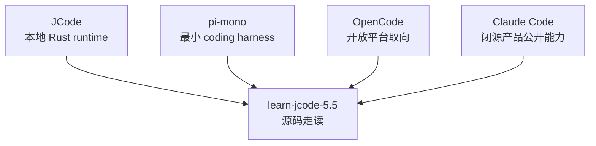

# s10 - 边界课：JCode、pi、OpenCode、Claude Code

## 本课目标

把前面几课放回 coding-agent runtime 的坐标系里：JCode 适合学什么，和 pi、OpenCode、Claude Code 公开能力相比，边界在哪里。

这课只讨论公开行为、公开文档和源码可见的开源项目。Claude Code 不讨论非公开或泄露源码。



这张图说明本课的边界：教程主体只读 JCode；pi、OpenCode、Claude Code 只用来校准取舍，不是本项目的依赖对象。

## JCode 的位置

| 维度 | pi-mono | OpenCode | Claude Code | JCode |
| --- | --- | --- | --- | --- |
| 学习价值 | 看最小 coding harness | 看开放平台和多端产品 | 看成熟产品的公开能力形态 | 看本地多 provider 长期 runtime |
| 工具哲学 | 少工具，重 `read/write/edit/bash` | 平台化工具和扩展 | 公开能力体现出工具、权限、subagent、skills 等机制 | 基础工具 + memory/MCP/swarm/self-dev 都进 registry |
| Runtime | 更小，更适合先读 | client/server 和平台整合更明显 | 产品侧抽象完整，源码不公开 | 常驻 server 管 session、provider、MCP、swarm、event |
| Session | 更轻 | 更强调平台体验 | 公开能力支持长期工作流 | journal、render、import、replay、multi-client |
| Memory | 不是主角 | 视具体实现而定 | 公开产品能力不等于源码细节 | sidecar 非阻塞召回，一轮延迟 |
| Multi-agent | 更克制 | 偏开放平台协作 | 公开能力包括 subagent / teams 概念 | server-level swarm state、channel、heartbeat、plan |
| UI | 够用即可 | 多端体验更重要 | 产品 UI 完整 | terminal-native，TUI 是 harness 可观察性 |
| Self-dev | 不是核心 | 不是主线 | 不按源码讨论 | JCode 把自我 build/reload 做成工具和 session capability |

默认建议很直接：

- 想先理解最小路径，看 pi。
- 想看开放平台和多端产品取向，看 OpenCode。
- 想理解闭源成熟产品的公开能力形态，看 Claude Code 文档和公开行为。
- 想读一个复杂本地 runtime，看 JCode。

## JCode 的代价

JCode 的复杂度主要来自长期 runtime，不是 agent loop 本身。最小 loop 很短：

```text
messages -> model -> tool call -> tool result -> messages
```

JCode 在这条线外面加了这些东西：

```text
resident server
multi-client session
provider selection / auth
tool registry / context guard
TUI observability
memory sidecar
swarm coordination
ambient scheduler
self-dev reload
```

这些能力不是免费来的。每加一层，就多一组状态归属问题：

- 状态放在 client 还是 server？
- 当前 turn 同步做，还是下一轮使用 pending result？
- 工具结果直接回上下文，还是先截断、转 content block？
- worker 状态放在聊天记录里，还是放在 server plan？
- reload 时如何恢复 session 和正在做的任务？

这就是 JCode 最值得学的地方：它不是只告诉你 agent 能做什么，而是展示长期本地 agent 需要为状态和恢复付出什么工程成本。

## 和 pi 的差异

pi 更适合学最小有效路径。它强调少工具、少抽象、少运行时，读起来更快，改起来也更直接。

JCode 更适合学产品化后的边界。它把 provider、auth、session、TUI、memory、swarm、self-dev 都接到同一个 runtime 里。读 JCode 时不要期待“小而美”，要看它如何防止长期运行变成状态混乱。

## 和 OpenCode 的差异

OpenCode 更像开放平台取向：多端、配置、扩展、平台体验更重。JCode 更像本地高性能 runtime：terminal-native、server residency、Rust 实现、内置 memory/swarm/self-dev。

两者都说明一点：严肃 coding agent 不是 stdout 包装。UI、server、权限、provider、session 都会进入核心架构。

## 和 Claude Code 公开能力的差异

Claude Code 是闭源产品，本教程不按源码讨论它。能比较的只有公开能力形态：工具、权限、subagent、skills、长期任务、团队协作等。

JCode 的价值在于源码可读。你可以看到这些能力落在什么结构上：`Registry`、`ServerRuntime`、`Session`、`MemoryAgent`、`swarm_state`、`SelfDevTool`。这也是本教程只围绕 JCode 源码展开的原因。

## 读完你应该能解释什么

- 为什么 JCode 的复杂度主要来自 product-grade runtime，而不是 agent loop 本身。
- 为什么 pi 适合学最小路径，JCode 适合学长期 runtime。
- 为什么 OpenCode 和 JCode 都有 client/server 思路，但产品取向不同。
- 为什么 Claude Code 只能按公开行为比较，不能引入非公开源码。
- 为什么本教程主体只读 JCode，其他项目只用于校准边界。
