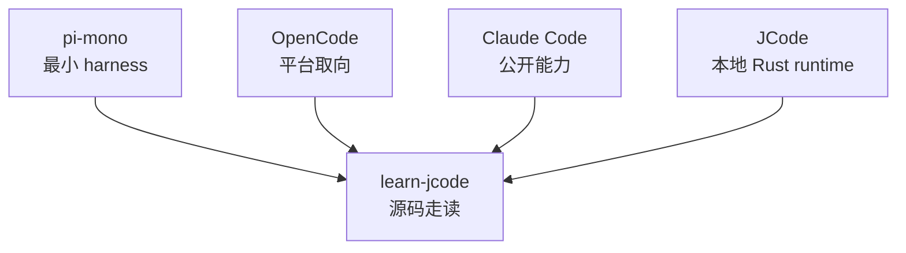

# s10 - 对照课：JCode、pi、OpenCode、Claude Code

## 先把范围说清楚

JCode 不适合拿来学最小 loop。它更适合用来看一个本地长期 runtime 怎样处理状态、恢复和协作。

这一页把前面几节放在一起看：JCode 适合研究什么，它和 pi、OpenCode、Claude Code 的公开能力分别差在哪里。

这里只讨论公开行为、公开文档和源码可见的开源项目。Claude Code 不讨论非公开或泄露源码。



这张图只说明范围：教程主体读 JCode；pi、OpenCode、Claude Code 只是对照，不是本项目的依赖。

## JCode 的位置

| 维度 | pi-mono | OpenCode | Claude Code | JCode |
| --- | --- | --- | --- | --- |
| 适合拿来看什么 | 最小 coding harness | 开放平台和多端产品 | 成熟产品的公开功能边界 | 本地多 provider 长期 runtime |
| 工具取向 | 少工具，重 `read/write/edit/bash` | 平台化工具和扩展 | 公开能力体现出工具、权限、subagent、skills 等机制 | 基础工具 + memory/MCP/swarm/self-dev 都进 registry |
| Runtime | 更小，更适合先读 | client/server 和平台整合更明显 | 产品侧抽象完整，源码不公开 | 常驻 server 管 session、provider、MCP、swarm、event |
| Session | 更轻 | 更强调平台体验 | 公开能力支持长期工作流 | journal、render、import、replay、multi-client |
| Memory | 不是主角 | 视具体实现而定 | 公开产品能力不等于源码细节 | sidecar 非阻塞召回，一轮延迟 |
| Multi-agent | 更克制 | 偏开放平台协作 | 公开能力包括 subagent / teams 概念 | server 里的 swarm state、channel、heartbeat、plan |
| UI | 够用即可 | 多端体验更重要 | 产品 UI 完整 | terminal-native，TUI 是 harness 可观察性 |
| Self-dev | 不是核心 | 不是主线 | 不按源码讨论 | JCode 把自我 build/reload 做成工具和 session capability |

默认建议很直接：

- 想先理解最小路径，看 pi。
- 想看开放平台和多端产品取向，看 OpenCode。
- 想理解闭源成熟产品的公开功能边界，看 Claude Code 文档和公开行为。
- 想读一个复杂本地 runtime，看 JCode。

## 源码位置对照

不要只说“JCode 更复杂”。要能在源码结构里指出它复杂在哪里。

| 问题 | pi-mono 的锚点 | OpenCode 的锚点 | JCode 的锚点 |
| --- | --- | --- | --- |
| 最小 loop 在哪里 | `packages/agent/src/agent-loop.ts` | session/message 流程分散在 `packages/opencode/src/session` | `src/agent/turn_loops.rs`、`src/agent/turn_execution.rs` |
| 基础工具怎么进 runtime | `packages/mom/src/tools/index.ts` 直接返回 read/bash/edit/write/attach | 工具、权限、session API 分散在 server/app 包 | `src/tool/mod.rs` 的 `Registry` 统一 schema 和执行 |
| provider 怎么被隔离 | `packages/ai/src/providers/*` | `packages/opencode/src/provider` 和 AI SDK provider 体系 | `src/provider/*` + `MultiProvider` + `StreamEvent` |
| session 负责什么 | agent context 更轻 | `packages/opencode/src/session/index.ts` 管 session、message、diff、permission、share | `src/session/*` 管 journal、render、import、replay、multi-client |
| UI 负责什么 | TUI 是使用界面，但不是复杂 runtime 中心 | `packages/app`、`packages/ui`、desktop/Slack/docs 多端 | Ratatui TUI 直接承接 server events、tool status、diff、side panel |
| 多 agent 状态放哪里 | 更克制，重点仍是最小有效工具 | 偏平台协作和 session/fork 能力 | `SwarmState`、`VersionedPlan`、channel、heartbeat、file touch |
| 自我修改是不是核心 | 不是主线 | 不是主线 | `selfdev` 是工具、session capability、build/reload 恢复链路 |

这张表想说明：JCode 不是“比 pi 多几个工具”。它把更多事情放进同一个本地 runtime，所以你读到的复杂度来自状态放在哪里，而不是代码写得绕。

## 五段代码看差异

pi 的工具入口很薄：

```ts
// pi-mono: packages/mom/src/tools/index.ts，节选
export function createMomTools(executor: Executor): AgentTool<any>[] {
  return [
    createReadTool(executor),
    createBashTool(executor),
    createEditTool(executor),
    createWriteTool(executor),
    attachTool,
  ];
}
```

这段代码的好处是克制。读 pi 时，重点是看少量工具如何撑起 coding agent，而不是看一个完整产品 runtime。

OpenCode 的 session 更像平台对象：

```ts
// OpenCode: packages/opencode/src/session/index.ts，节选
readonly create: (input: {
  parentID?: SessionID
  title?: string
  permission?: Permission.Ruleset
}) => Effect.Effect<Info>

readonly diff: (sessionID: SessionID) => Effect.Effect<Snapshot.FileDiff[]>
readonly messages: (input: { sessionID: SessionID; limit?: number }) => Effect.Effect<MessageV2.WithParts[]>
readonly setPermission: (input: { sessionID: SessionID; permission: Permission.Ruleset }) => Effect.Effect<void>
```

这段代码体现 OpenCode 的方向：session 是平台级 API，天然要服务 app、UI、权限、共享、diff、消息分页。

JCode 的差异是把这些能力收在本地长期 server 里：

```rust
// JCode: src/server/state.rs，节选
pub struct SwarmState {
    pub members: Arc<RwLock<HashMap<String, SwarmMember>>>,
    pub swarms_by_id: Arc<RwLock<HashMap<String, HashSet<String>>>>,
    pub plans: Arc<RwLock<HashMap<String, VersionedPlan>>>,
    pub coordinators: Arc<RwLock<HashMap<String, String>>>,
}
```

JCode 的复杂度来自 server 里的协作状态。swarm 不是一组 prompt，而是 server 里的成员、计划、coordinator 和恢复状态。

JCode 的 provider 边界也不是“支持多个模型”这么简单。agent loop 不直接懂每家 API，而是读统一的 stream 事件：

```rust
// JCode: src/provider/mod.rs + src/message.rs，节选
pub trait Provider: Send + Sync {
    async fn complete_split(
        &self,
        messages: &[Message],
        tools: &[ToolDefinition],
        system_static: &str,
        system_dynamic: &str,
        resume_session_id: Option<&str>,
    ) -> Result<EventStream>;
}

pub enum StreamEvent {
    TextDelta(String),
    ToolUseStart { id: String, name: String },
    ToolInputDelta(String),
    ToolUseEnd,
    ToolResult { tool_use_id: String, content: String, is_error: bool },
    TokenUsage {
        input_tokens: Option<u64>,
        output_tokens: Option<u64>,
        cache_read_input_tokens: Option<u64>,
        cache_creation_input_tokens: Option<u64>,
    },
    SessionId(String),
    NativeToolCall { request_id: String, tool_name: String, input: serde_json::Value },
}
```

从这段代码可以看出，JCode 不是简单 wrapper。不同 provider 可以用 SSE、WebSocket、CLI 或兼容接口，但进入 agent loop 后都要变成同一组 `StreamEvent`。所以 provider 层的重点不是“能调几家模型”，而是把不同传输方式、缓存策略、session id、native tool call 都转成 JCode 内部能处理的事件。

工具系统的边界也在 `Registry::execute()`，不是 HashMap 里找一下就完：

```rust
// JCode: src/tool/mod.rs，节选
pub async fn execute(&self, name: &str, input: Value, ctx: ToolContext) -> Result<ToolOutput> {
    let tools = self.tools.read().await;
    let resolved_name = Self::resolve_tool_name(name);
    let tool = tools
        .get(resolved_name)
        .ok_or_else(|| anyhow::anyhow!("Unknown tool: {}", name))?
        .clone();
    drop(tools);

    let started_at = std::time::Instant::now();
    let result = tool.execute(input.clone(), ctx).await;
    let latency_ms = started_at.elapsed().as_millis().min(u128::from(u64::MAX)) as u64;
    crate::telemetry::record_tool_execution(resolved_name, &input, result.is_ok(), latency_ms);

    let mut output = result?;
    output = self.guard_context_overflow(name, output).await;
    Ok(output)
}
```

工具注册表在这里不只是一个 HashMap。名称别名、异步执行、telemetry、context guard 都在这里处理。把这些逻辑拆散，agent loop 会立刻被 provider 差异、工具输出长度、UI 状态和错误恢复拉进复杂分支里。

## 更实际的判断方法

读这类项目不要按功能数打分。按四个问题打分：

| 问题 | 如果答案很弱 | JCode 的答案 |
| --- | --- | --- |
| 状态谁拥有 | 聊天记录里塞一切 | server/session/registry/sidecar 分别持有状态 |
| 时间点在哪里 | 当前 turn 同步做完 | memory 下一轮注入，TUI 流式更新，swarm 持续同步 |
| 失败怎么恢复 | 报错后让用户重来 | session replay、tool result repair、reload recovery、rate-limit retry |
| UI 怎么知道 | stdout 打印几行 | server event 进入 TUI state，再变成 widget、diff、usage、side panel |

这比“JCode 功能多”更有用。看一个模块时，先问它解决的是状态放在哪里、什么时候执行、失败怎么恢复，还是用户怎么知道当前状态。如果四个都不是，它可能只是表层功能。

## JCode 的代价

JCode 的复杂度主要来自长期 runtime，不是 agent loop 本身。最小 loop 很短：

```text
messages -> model -> tool call -> tool result -> messages
```

JCode 在这条线外面加了这些东西：

```text
resident server
multi-client session
provider selection / auth
tool registry / context guard
TUI observability
memory sidecar
swarm coordination
ambient scheduler
self-dev reload
```

这些能力不是免费来的。每加一层，就多一组“状态放在哪里”的问题：

- 状态放在 client 还是 server？
- 当前 turn 同步做，还是下一轮使用 pending result？
- 工具结果直接回上下文，还是先截断、转 content block？
- worker 状态放在聊天记录里，还是放在 server plan？
- reload 时如何恢复 session 和正在做的任务？

这就是 JCode 值得读的地方：它不只是告诉你 agent 能做什么，还能看到长期本地 agent 为了状态和恢复要写哪些工程代码。

## 和 pi 的差异

pi 更适合学最小有效路径。它强调少工具、少抽象、少运行时，读起来更快，改起来也更直接。

JCode 更适合学产品化之后的边界。它把 provider、auth、session、TUI、memory、swarm、self-dev 都接到同一个 runtime 里。读 JCode 时不要期待“小而美”，要看它如何防止长期运行变成状态混乱。

更直接地说：如果你还没能手写一个 `messages -> tools -> tool_result` loop，先别读 JCode。先读 pi，把最小 loop 写顺。JCode 是第二阶段，它回答的是“最小 loop 变成长期本地产品后，状态怎么不乱”。

## 和 OpenCode 的差异

OpenCode 更偏开放平台：多端、配置、扩展、平台体验更重。JCode 更偏本地 terminal runtime：terminal-native、server residency、Rust 实现、内置 memory/swarm/self-dev。

两者都说明一点：可长期使用的 coding agent 不是 stdout 包装。UI、server、权限、provider、session 都会进入核心架构。

更直接地说：想学平台化、多端、配置和产品面，OpenCode 更直接。想看 terminal-native Rust runtime 怎样把 server、TUI、memory、swarm、reload 接成一个本地系统，JCode 更直接。

## 和 Claude Code 公开能力的差异

Claude Code 是闭源产品，本教程不按源码讨论它。能比较的只有公开功能边界：工具、权限、subagent、skills、长期任务、团队协作等。

JCode 的好处是源码可读。你可以看到这些能力落在什么结构上：`Registry`、`ServerRuntime`、`Session`、`MemoryAgent`、`swarm_state`、`SelfDevTool`。这也是本教程只围绕 JCode 源码展开的原因。

## 读完后检查一下

- 为什么 JCode 的复杂度主要来自长期 runtime，而不是 agent loop 本身。
- 为什么 pi 适合学最小路径，JCode 适合学长期 runtime。
- 为什么 OpenCode 和 JCode 都有 client/server 思路，但产品取向不同。
- 为什么 Claude Code 只能按公开行为比较，不能引入非公开源码。
- 为什么本教程主体只读 JCode，其他项目只用于做对照。
- 为什么“复杂”要落到源码里的状态位置，而不是停在功能清单。
